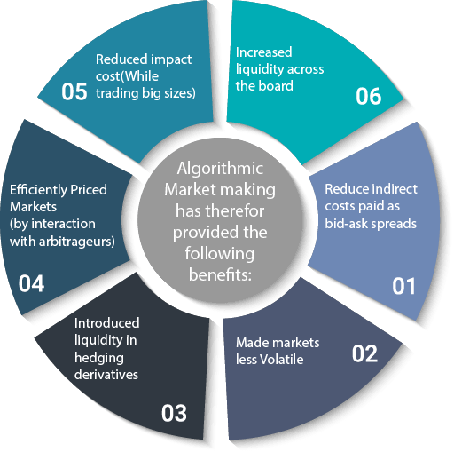

## Table of Contents

## What is market making?

Market making is a process where a person or a firm, called a market maker, helps to buy and sell things in a market. They do this by always being ready to buy or sell a certain item at a specific price. This helps to keep the market running smoothly because there is always someone willing to trade. Market makers make money from the difference between the price they buy at and the price they sell at, which is called the bid-ask spread.

In financial markets, like stock markets, market makers are very important. They help make sure that people can buy and sell stocks easily and quickly. Without market makers, it might be hard to find someone to trade with, and the market could become slow and less efficient. Market makers also help to keep the prices of stocks stable by providing a steady supply of buyers and sellers.

## What is algorithmic trading?

Algorithmic trading is when computers use math formulas to decide when to buy or sell things in the market. These formulas, called algorithms, look at lots of information like prices, how much people are buying or selling, and other market data. The computer can make trades very quickly, often in just a few seconds or even less. This is much faster than a human could do it.

People use [algorithmic trading](/wiki/algorithmic-trading) because it can be more accurate and can handle big amounts of information better than humans. It also helps to take emotions out of trading, which can lead to better decisions. But, it can be risky because the algorithms might not always understand everything happening in the market, and mistakes can happen very fast.

## How does market making contribute to liquidity in financial markets?

Market making helps make financial markets more liquid by always being ready to buy or sell. When market makers are there, it's easier for people to trade because they know they can always find someone to trade with. This means more people will want to buy and sell, which makes the market more active and liquid. It's like having a busy store where there are always customers and products available.

By providing this constant buying and selling, market makers help keep the market moving smoothly. They make sure there is always a price for things, so people can trade without waiting too long. This helps keep the market stable and makes it easier for everyone to get in and out of trades quickly. In the end, [market making](/wiki/market-making) makes the market a better place for everyone to trade.

## What are the basic principles of an algorithmic trading strategy?

The basic principles of an algorithmic trading strategy involve using math formulas to make trading decisions. These formulas, or algorithms, look at lots of data like prices, trading volumes, and other market information. The goal is to find patterns or signals that tell the computer when to buy or sell. This helps the computer make trades quickly and without emotions, which can lead to better decisions than if a human were doing it.

Another important principle is to set clear rules for when to enter and [exit](/wiki/exit-strategy) trades. The algorithm needs to know exactly what conditions will trigger a buy or sell order. This could be based on reaching certain price levels, seeing specific patterns in the data, or other signals. By having these rules, the algorithm can work on its own, making trades without needing someone to watch it all the time.

Lastly, managing risk is a key part of any algorithmic trading strategy. The algorithm should have ways to limit losses, like setting stop-loss orders or adjusting the size of trades based on how risky the market is. This helps protect the money being used for trading. By following these principles, an algorithmic trading strategy can work well and help traders make money in the market.

## What are the key differences between market making and other trading strategies?

Market making is different from other trading strategies because it focuses on providing [liquidity](/wiki/liquidity-risk-premium) to the market. Market makers are always ready to buy or sell a certain item at a specific price, which helps keep the market running smoothly. They make money from the difference between the price they buy at and the price they sell at, called the bid-ask spread. This is different from other strategies where traders might try to predict price movements and make money from those changes. For example, in [day trading](/wiki/day-trading-spy), a trader buys and sells within the same day, trying to profit from short-term price changes.

Another key difference is that market making is about maintaining stability in the market, while other strategies might focus more on making profits from market [volatility](/wiki/volatility-trading-strategies). Market makers help ensure there's always someone to trade with, which makes the market more efficient and liquid. On the other hand, strategies like [trend following](/wiki/trend-following) or [scalping](/wiki/gamma-scalping) aim to take advantage of price movements, often trying to get in and out of trades quickly to make small profits. These strategies can add to market volatility as traders jump in and out of positions, whereas market makers work to keep the market balanced.

## How do market makers use algorithms in their operations?

Market makers use algorithms to help them do their job better. These algorithms look at lots of information like prices and how much people are buying or selling. They help market makers decide the best prices to buy and sell at. This makes sure that market makers can always offer a good price to people who want to trade. Using algorithms helps market makers work faster and make fewer mistakes than if they did everything by hand.

Algorithms also help market makers manage their risks. They can set rules for when to buy or sell more, or when to stop trading if things get too risky. This helps market makers keep the market stable and make sure they don't lose too much money. By using algorithms, market makers can handle lots of trades at the same time and keep the market running smoothly.

## What are the common challenges faced by market makers?

Market makers face a lot of challenges in their work. One big challenge is dealing with market volatility. Prices can change very quickly, and it can be hard for market makers to keep up. They need to always offer a good price to buy and sell, but if the market moves too fast, they might lose money. Another challenge is competition. There are many market makers out there, and they all want to make money. This means they have to work hard to offer the best prices and be faster than others.

Another challenge is managing risk. Market makers need to make sure they don't lose too much money. They use algorithms and other tools to help them, but things can still go wrong. If they make a mistake, it can cost them a lot. They also have to deal with changes in rules and regulations. Governments and other groups can change the rules about how market makers can work, and they need to keep up with these changes to stay in business.

## How can algorithmic trading strategies be optimized for better performance?

To make algorithmic trading strategies work better, traders need to keep an eye on how well their algorithms are doing. They should always be testing and changing their strategies to make them better. This means looking at past data to see what worked and what didn't. They might find that changing some rules or adding new ones can help the algorithm make better trades. Also, using more data can help the algorithm understand the market better. The more information it has, the better it can predict what might happen next.

Another way to improve algorithmic trading is to manage risk carefully. Traders should set rules to limit how much they can lose on each trade. This can help them avoid big losses if the market moves in a way they didn't expect. They can also use different ways to spread out their risk, like trading in different markets or using different strategies at the same time. By doing this, they can make their trading safer and more likely to make money in the long run.

## What regulatory considerations must be taken into account in market making and algo trading?

Market makers and people who use algorithmic trading need to follow rules set by governments and other groups. These rules are there to make sure the market is fair and safe for everyone. For market makers, they have to keep enough money in case they lose some, and they can't do things that might trick other people in the market. They also need to report what they're doing so that everyone can see it's fair. For algo traders, they have to make sure their computers don't cause problems in the market. They need to test their algorithms before using them and make sure they don't trade too fast or too much, which could make the market go crazy.

These rules can change, so market makers and algo traders have to keep up with them. If they don't follow the rules, they can get in big trouble, like having to pay a lot of money or not being allowed to trade anymore. It's important for them to work with people who know about the rules and can help them stay on the right side of the law. By following these rules, they help make the market a better place for everyone.

## How do advanced technologies like AI and machine learning influence market making and algo trading?

Advanced technologies like AI and [machine learning](/wiki/machine-learning) are changing how market makers and algorithmic traders do their jobs. They help by looking at huge amounts of data really fast and finding patterns that people might miss. For market makers, AI can help them set better prices to buy and sell things. It can also help them figure out the best times to trade and how to manage their risks better. This means market makers can offer more stable prices and keep the market running smoothly, even when things get crazy.

For algorithmic trading, AI and machine learning make the algorithms smarter. They can learn from what happens in the market and change their trading rules to do better. This means the algorithms can make more money and lose less. Traders can also use AI to try out different trading ideas before using real money, which helps them make safer choices. Overall, these technologies help both market makers and algo traders work better and make the market a better place for everyone.

## What are some case studies of successful market making and algo trading implementations?

One successful case of market making is the story of Citadel Securities. They use smart technology to help them buy and sell stocks, bonds, and other things in the market. Citadel Securities uses algorithms and data to set good prices and make sure there's always someone to trade with. This has helped them become one of the biggest market makers in the world. They make a lot of money by offering good prices and keeping the market running smoothly. Their success shows how important technology and good strategies are in market making.

Another example is the use of algorithmic trading by Renaissance Technologies. They are famous for their Medallion Fund, which uses very advanced math and computer programs to trade in the market. The fund looks at lots of data and uses it to make quick trading decisions. This has made the Medallion Fund one of the most successful funds ever, with huge returns for investors. Renaissance Technologies shows how powerful algorithmic trading can be when done right, using smart algorithms and lots of data to beat the market.

## What future trends are expected to impact market making and algorithmic trading?

In the future, market making and algorithmic trading will be shaped by new technologies like [artificial intelligence](/wiki/ai-artificial-intelligence) and machine learning. These tools will get better at understanding the market and making smart decisions. They will help market makers set better prices and manage risks more effectively. For algorithmic traders, AI will make their trading strategies smarter and faster. This means they can make more money and lose less. As these technologies keep improving, they will make the market more efficient and stable.

Another trend that will affect market making and algo trading is the growth of new types of markets, like those for cryptocurrencies. These markets are different from traditional ones, and market makers and algo traders will need to learn how to work in them. They will need to use new strategies and tools to handle the fast changes and high risks in these markets. Also, as more people start trading, the rules and regulations might change. Market makers and algo traders will need to keep up with these changes to stay in business and keep the market fair for everyone.

## References & Further Reading

[1]: [Market Makers](https://www.investopedia.com/terms/m/marketmaker.asp)

[2]: [The Role of Market Makers](https://corporatefinanceinstitute.com/resources/knowledge/trading-investing/market-maker/)

[3]: [Arbitrage and Market Making](https://www.investopedia.com/terms/a/arbitrage.asp)

[4]: [Role of DMMs on the NYSE](https://www.nyse.com/markets/nyse/trading-info)

[5]: [From Specialists to DMMs](https://www.investopedia.com/terms/s/specialist.asp)