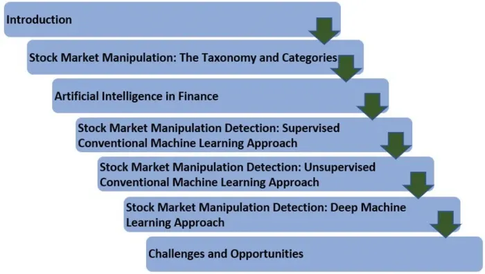

## Table of Contents

## What is market manipulation?

Market manipulation is when people try to trick the market to make money unfairly. They do things to make stock prices go up or down on purpose, so they can buy or sell at better prices. This is not allowed because it's dishonest and can hurt other people who are trying to invest fairly.

For example, someone might spread false information about a company to make its stock price drop. Then, they buy the stock at the lower price and later sell it when the price goes back up after the truth comes out. This kind of trick can make the market less fair and less safe for everyone.

## Why is it important to detect market manipulation?

Detecting market manipulation is important because it helps keep the market fair and safe for everyone. When people try to trick the market, it can hurt other investors who are playing by the rules. If manipulation goes unnoticed, dishonest people can make a lot of money unfairly, while others lose money because of the tricks being played. By catching these manipulators, we can stop them from taking advantage of others and make sure everyone has a fair chance to invest.

Also, detecting market manipulation helps keep trust in the market. If people think the market is full of tricks and dishonest behavior, they might not want to invest their money. This can make the market less active and less healthy. When we find and stop market manipulation, it shows that the market is being watched and protected, which encourages more people to invest and helps the economy grow.

## What are the common types of market manipulation?

Market manipulation can happen in many ways, but some common types include spreading false information and doing trades that trick the market. For example, someone might spread rumors about a company to make its stock price go down. They could say the company is in trouble when it's not, so they can buy the stock at a lower price and sell it later for a profit. This is called "pump and dump" when they do the opposite - they make the price go up with false good news, then sell their shares at the high price before the truth comes out.

Another type of manipulation is called "spoofing" and "layering." This is when someone puts in fake buy or sell orders to make it look like there's more interest in a stock than there really is. They might put in a big order to buy a stock, making the price go up, but then they cancel the order before it goes through. This tricks other people into thinking the stock is more popular than it is, and they might buy it at the higher price. The manipulator can then sell their own shares at that higher price.

There's also "cornering the market," where someone tries to control a big part of a stock or commodity. They buy up as much as they can so they can control the price. If they own most of it, they can make the price go up or down by deciding when to buy or sell. This can be very harmful because it makes it hard for others to trade fairly.

## How can market manipulation affect individual investors?

Market manipulation can hurt individual investors in big ways. When someone tricks the market, it can make stock prices go up or down in ways that don't make sense. If an investor buys a stock because the price is going up due to false information, they might lose money when the truth comes out and the price drops. This can be really frustrating and can make people lose trust in the market. It's like playing a game where some people are cheating, and it's not fair for those who are trying to play honestly.

Also, market manipulation can make it hard for individual investors to make good choices. If the market is full of tricks, it's tough to know which information to trust. This can lead to bad decisions, like buying or selling at the wrong times. Over time, this can make people less likely to invest, which is bad for their own financial growth and for the economy as a whole. When the market is fair and safe, everyone has a better chance to make smart choices and grow their money.

## What are the basic signs of market manipulation?

One basic sign of market manipulation is when there are sudden big changes in a stock's price without any clear reason. For example, if a stock's price jumps up or down a lot in a short time, but there's no news about the company to explain it, that could be a sign of manipulation. Someone might be spreading false information or making fake trades to trick the market.

Another sign is when there's a lot of trading activity that doesn't seem normal. If you see a lot of buying or selling that looks like it's happening all at once, it might be someone trying to control the price. This can happen with "spoofing" or "layering," where someone puts in big orders they don't plan to complete, just to make the price move in a certain way.

Lastly, if you hear rumors or news that seem too good or too bad to be true, be careful. Manipulators often spread false information to make people buy or sell a stock. If the news doesn't match up with what you know about the company, it could be a sign that someone is trying to trick the market.

## What tools and technologies are used to detect market manipulation?

To find market manipulation, people use special computer programs and tools that watch the market closely. These programs look for strange patterns in how stocks are bought and sold. They can spot things like sudden big changes in prices or lots of trading that doesn't seem normal. By looking at all the data, these tools can help figure out if someone is trying to trick the market. They also use math and [statistics](/wiki/bayesian-statistics) to find patterns that might be hard for people to see just by looking at the numbers.

Another way to detect market manipulation is by using [artificial intelligence](/wiki/ai-artificial-intelligence) (AI) and [machine learning](/wiki/machine-learning). These technologies can learn from past data to predict what might happen next in the market. They can be trained to recognize signs of manipulation, like fake orders or false news. AI can go through huge amounts of data very quickly, which helps catch manipulators faster than people could on their own. By using these smart tools, it's easier to keep the market fair and safe for everyone.

## How do regulatory bodies monitor and detect market manipulation?

Regulatory bodies use special tools and technology to keep an eye on the market and catch any tricks people might be playing. They use computer programs that watch how stocks are bought and sold, looking for any strange patterns or sudden changes in prices that don't make sense. These programs can go through a lot of data very quickly and help spot things like fake orders or false news that someone might be using to trick the market. By watching all this data, regulatory bodies can figure out if someone is trying to manipulate the market.

They also use artificial intelligence and machine learning to help them detect market manipulation. These smart technologies can learn from past data and get better at spotting signs of tricks over time. They can look at huge amounts of information and find patterns that might be hard for people to see just by looking at the numbers. By using these tools, regulatory bodies can catch manipulators faster and keep the market fair and safe for everyone who wants to invest.

## What are the challenges in detecting market manipulation?

Detecting market manipulation is hard because manipulators are very clever and use many different tricks. They might spread false information, make fake trades, or control a lot of a stock to change its price. These tricks can be hard to spot because they often look like normal market activity. Regulators need to watch a lot of data and look for patterns that don't make sense, but it's tough because the market is always changing and there's so much information to go through.

Another challenge is that manipulators often use new technology to hide what they're doing. They might use computers to make fake trades that look real, or use social media to spread rumors quickly. This makes it even harder for regulators to keep up, because they need to use advanced tools like artificial intelligence to catch these tricks. But even with these tools, it can be a race against time to spot the manipulation before it hurts other investors.

## Can machine learning and AI help in detecting market manipulation? How?

Machine learning and AI can really help in finding market manipulation. These smart technologies can look at a lot of data very quickly and spot patterns that might be hard for people to see. For example, they can watch how stocks are bought and sold and find strange things like sudden price changes or lots of trading that doesn't make sense. By learning from past data, AI can get better at spotting these tricks over time. It's like having a super smart detective that never gets tired and can go through a huge amount of information to find the bad guys.

Using AI and machine learning also helps because manipulators often use new technology to hide what they're doing. They might use computers to make fake trades or spread rumors on social media. AI can keep up with these new tricks because it can learn and adapt. It can help regulators catch manipulators faster and stop them from hurting other investors. By using these smart tools, we can make the market fairer and safer for everyone.

## What are the legal consequences of market manipulation?

Market manipulation is against the law, and people who do it can face big punishments. If someone is caught manipulating the market, they might have to pay a lot of money as a fine. The fines can be huge, sometimes even millions of dollars, depending on how bad the manipulation was and how much money the person made from it. Besides fines, the person might also have to give back any money they made from the manipulation, which is called disgorgement.

On top of fines and disgorgement, people caught manipulating the market can also face jail time. The time they spend in jail can vary, but it can be several years, especially if the manipulation was very harmful or if it's not the first time the person has done it. These punishments are meant to stop people from trying to trick the market and to make sure the market stays fair and safe for everyone.

## How can investors protect themselves from market manipulation?

Investors can protect themselves from market manipulation by staying informed and being careful about the information they trust. They should always check the news and rumors about a company from different sources to make sure it's true. If something sounds too good or too bad to be true, it might be a sign of manipulation. It's also a good idea to learn about common tricks like "pump and dump" or "spoofing" so you can spot them if they happen.

Another way to stay safe is by using trusted financial advisors and sticking to well-known, reputable companies when investing. These companies are less likely to be targets of manipulation because they are watched more closely by regulators. Also, investors should be patient and not make quick decisions based on sudden price changes. By taking their time and doing their homework, investors can avoid falling for market tricks and make smarter choices with their money.

## What are the latest advancements in market manipulation detection techniques?

The latest advancements in detecting market manipulation use smart computer programs that can learn and get better over time. These programs use something called machine learning, which means they can look at a lot of data from the past and find patterns that show when someone might be trying to trick the market. They can spot things like sudden big changes in stock prices or lots of trading that doesn't seem normal. By learning from what has happened before, these programs can get better at finding new tricks that manipulators might use.

Another big advancement is using artificial intelligence (AI) to watch the market in real-time. AI can go through huge amounts of data very quickly and find signs of manipulation as they happen. This is really helpful because manipulators often use new technology to hide what they're doing, like making fake trades or spreading rumors on social media. With AI, regulators can catch these tricks faster and stop them before they hurt other investors. These new tools are making the market safer and fairer for everyone.

## References & Further Reading

[1]: Aldridge, I. (2013). ["High-Frequency Trading: A Practical Guide to Algorithmic Strategies and Trading Systems."](https://www.wiley.com/en-us/High+Frequency+Trading%3A+A+Practical+Guide+to+Algorithmic+Strategies+and+Trading+Systems%2C+2nd+Edition-p-9781118343500) John Wiley & Sons.

[2]: Cartea, Á., Jaimungal, S., & Penalva, J. (2015). ["Algorithmic and High-Frequency Trading."](https://assets.cambridge.org/97811070/91146/frontmatter/9781107091146_frontmatter.pdf) Cambridge University Press.

[3]: De Prado, M. L. (2018). ["Advances in Financial Machine Learning."](https://papers.ssrn.com/sol3/papers.cfm?abstract_id=3257419) Wiley.

[4]: Easley, D., López de Prado, M. J., & O'Hara, M. (2012). ["Flow Toxicity and Liquidity in a High-frequency World."](https://www.jstor.org/stable/41485533) The Review of Financial Studies, 25(5), 1457-1493.

[5]: Scholz, P., & Sarkar, S. (2017). ["Detecting market manipulation in EU emissions trading with boosting and trees - A concept and practice guide."](https://pmc.ncbi.nlm.nih.gov/articles/PMC6691396/) Research in International Business and Finance, Volume 42, 960-976.