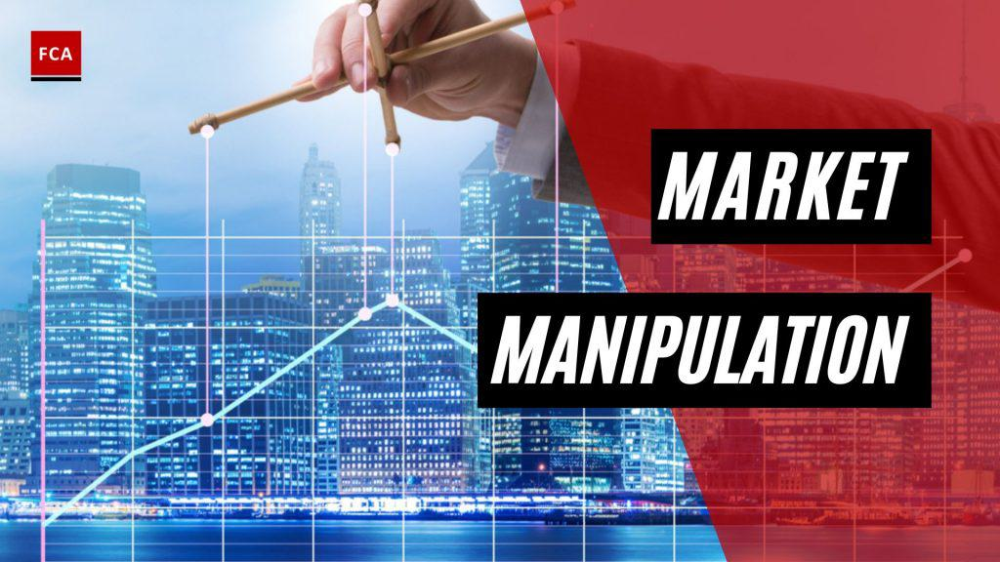

Algorithmic trading has revolutionized the financial markets by providing unparalleled efficiency and precision in executing trades. This technological advancement enables traders to capitalize on microsecond opportunities that were previously unattainable in manual trading. However, the same tools that offer such precision also introduce opportunities for market manipulation, posing significant risks to market fairness and transparency.

Market manipulation refers to a range of illegal activities that aim to create artificial price movements, distort supply and demand, and deceive shareholders. Such activities can profoundly undermine investor confidence, disrupt the fair operation of markets, and lead to an inefficient allocation of resources. Examples of market manipulation include techniques like spoofing, where fake orders are placed with the intent of canceling them to manipulate prices, and wash trading, where a trader buys and sells the same financial instruments to create misleading trading volume.

The need to deter such fraudulent activities is pivotal to maintaining the trust of investors and ensuring the stability of financial systems. If left unchecked, market manipulation can lead to severe financial losses and erode the foundation of trust that capital markets rely on. This, in turn, can discourage investment and participation in the markets, leading to reduced liquidity and market efficiency.

Detecting market manipulation, especially within the fast-paced and complex environment of algorithmic trading, is essential for regulatory bodies worldwide. With the sophistication of trading algorithms continually evolving, regulatory authorities must employ increasingly advanced detection techniques to identify and mitigate manipulative practices swiftly. Proactive detection and prevention are crucial in preserving the integrity of the financial markets and ensuring they function transparently and equitably for all participants.

## Table of Contents

## Understanding Market Manipulation

Market manipulation refers to actions deliberately undertaken to influence the behavior and prices of securities in a way that deceives investors and distorts the natural supply and demand dynamics of financial markets. These activities are not only detrimental to the integrity of the markets but are also illegal and heavily penalized by regulatory authorities.

Common techniques of market manipulation include spoofing, layering, wash trades, and pump-and-dump schemes:

- **Spoofing**: This involves placing large orders that a trader does not intend to execute, intending to create an illusion of demand or supply. Such fake orders can influence market prices and investor perceptions, but before execution, these orders are canceled, thus giving the manipulator an advantage.

- **Layering**: It is a more sophisticated type of spoofing. A manipulator places multiple, different-sized orders at varying price levels so that they strategically mislead other participants about the true state of market demand or supply. This technique can significantly affect the perceived market depth and price trends.

- **Wash Trades**: In this scenario, a trader simultaneously buys and sells the same financial instruments to create an illusion of increased market activity. The objective is to mislead other market participants about the true level of interest or liquidity in a particular security.

- **Pump-and-Dump Schemes**: This involves spreading false or misleading information to inflate the price of a stock, thereby encouraging other investors to buy the security. Once the price has been artificially increased, the manipulators sell their holdings at a profit, often leading to significant losses for those who were misled.

Understanding and identifying these manipulative behaviors are essential for developing effective detection strategies. Techniques like advanced data analytics and pattern recognition algorithms can help identify these activities and protect investors. Additionally, fostering awareness and education among market participants about these practices can play a pivotal role in mitigating their impact and ensuring a fair trading environment.

## Impact of Market Manipulation

Market manipulation is a serious issue that results in significant financial ramifications and can destabilize financial markets. It disrupts the natural price discovery process, which is integral to the efficient functioning of markets. The price discovery process is responsible for determining the intrinsic value of securities based on supply and demand dynamics. When manipulation occurs, it leads to price distortions that misrepresent the true value of a security. As a consequence, resources may be misallocated, as investors rely on misleading price signals when making investment decisions.

Moreover, market manipulation undermines investor trust. Confidence in the fairness and transparency of market operations is critical for encouraging investor participation. When manipulation is perceived or detected, investors may become wary of engaging in market activities, thereby negatively impacting market [liquidity](/wiki/liquidity-risk-premium). Liquidity is vital for reducing transaction costs and facilitating efficient trade execution. As investor participation decreases, liquidity dries up, making markets more volatile and less efficient.

Regulatory bodies impose strict penalties on entities found guilty of market manipulation to safeguard market integrity. These penalties are intended to deter potential manipulators by increasing the cost of engaging in such practices. Nonetheless, detection remains a formidable challenge due to the sophisticated techniques often employed, such as [algorithmic trading](/wiki/algorithmic-trading) strategies that can mask manipulative actions within high trading volumes and speeds.

Preventing manipulation is essential for maintaining the integrity of financial markets. It necessitates a robust regulatory framework coupled with advanced detection mechanisms. These systems must continuously evolve to counteract the increasingly complex and innovative strategies used by manipulators. Ultimately, ensuring transparency and fairness in the markets is critical for maintaining investor confidence and fostering stable financial systems.

## Detection Techniques in Algorithmic Trading

Modern manipulation detection employs advanced algorithms and [machine learning](/wiki/machine-learning) for real-time monitoring of trading activities, crucial in identifying and mitigating market manipulation. Pattern recognition algorithms serve as a cornerstone in this effort, enabling the identification of irregularities and potential manipulative activities. These algorithms scrutinize vast amounts of trading data to uncover patterns indicative of fraudulent behavior. For instance, anomalous trading volumes or unusual order flow sequences can signal manipulative tactics such as spoofing or layering.

Statistical methods complement pattern recognition by analyzing trading patterns to spot anomalies that may indicate manipulation. Techniques such as time-series analysis, regression models, and clustering algorithms help quantify deviations from expected market behavior. By establishing baseline metrics for normal trading activities, statistical models can flag unusual deviations that warrant further investigation. Such methods are crucial in environments characterized by high-frequency trading, where manipulative actions can be executed in milliseconds.

Regulators and market participants increasingly rely on AI-driven systems to enhance detection capabilities. Machine learning models, such as neural networks and decision trees, are employed to detect complex patterns that traditional methods might miss. These AI systems are trained on historical data, learning the subtleties of normal and abnormal trading behaviors. Their ability to adapt and learn continuously makes them particularly effective in identifying new and evolving manipulation strategies.

Continuous improvement of detection technologies is paramount to staying ahead of evolving manipulative strategies. This requires regular updates to models and algorithms to incorporate the latest market data and adapt to changing manipulation tactics. Moreover, the integration of natural language processing (NLP) allows for the analysis of unstructured data, such as news releases and social media posts, which can provide additional context to trading patterns.

In summary, the application of advanced algorithms, machine learning, and continuous technological advancement forms the backbone of effective market manipulation detection in algorithmic trading environments. These methodologies help maintain market integrity by equipping regulators and market participants with tools to detect and deter fraudulent activities.

## Role of Regulatory Bodies

Regulatory bodies are crucial in monitoring and curbing market manipulation, which is essential for maintaining integrity and trust in financial markets. By enforcing rules that ensure transparency and fairness, these bodies bolster investor confidence, crucial for healthy market participation. Effective regulation minimizes the potential for manipulative activities that could distort market prices and deceive investors.

In ensuring market integrity, regulatory agencies collaborate with trading platforms and technological firms to enhance detection efforts. This collaboration involves sharing information and technology to develop sophisticated surveillance systems capable of real-time monitoring and detection of suspicious trading activities. Through collaborative efforts, regulators and market participants can deploy advanced tools and methodologies to identify and mitigate potential manipulation.

The global nature of financial markets necessitates the alignment of regulations to address market manipulation efficiently across international borders. Harmonized regulations provide a cohesive framework that helps prevent regulatory [arbitrage](/wiki/arbitrage), where manipulators exploit discrepancies between jurisdictional rules. Regulatory bodies work towards achieving this alignment through international cooperation and treaties, thereby strengthening the overall effectiveness of market oversight.

Proactive engagement and strategic allocation of resources by regulatory bodies are vital in addressing the threats of market manipulation. By investing in cutting-edge technologies and personnel training, regulators can stay ahead of increasingly sophisticated manipulative tactics. Furthermore, regulators' active involvement in market surveillance and enforcement acts as a deterrent to potential manipulators, reinforcing the integrity of financial markets.

## Technological Advances in Detection

Advancements in technology are playing a transformative role in detecting market manipulation within algorithmic trading environments. Big data analytics and [artificial intelligence](/wiki/ai-artificial-intelligence) (AI) have emerged as pivotal tools in enhancing the detection capabilities for market manipulation. These technologies allow for the processing and analysis of vast amounts of trading data in real-time, identifying irregular patterns and anomalies that could indicate manipulative activities.

Distributed Ledger Technology (DLT), commonly known as blockchain, offers significant advantages in maintaining transparent and tamper-proof trading records. The decentralized nature of blockchain ensures that all transactions are recorded on an immutable ledger, providing an auditable trail that can be crucial in forensic investigations of market manipulation. This enhanced audibility and traceability help deter manipulative actions by making it more challenging to alter trading histories.

Moreover, the integration of blockchain into trading systems facilitates better visibility into the sequence and nature of trade transactions. Each transaction is time-stamped and linked to the previous one, creating a comprehensive and sequential record that can be easily examined for discrepancies.

Quantum computing is another technological frontier with the potential to revolutionize the detection of market manipulation. Quantum computers, with their ability to perform complex calculations at unprecedented speeds, may provide new avenues for identifying intricate manipulative patterns that are beyond the reach of classical computing. This capability is particularly beneficial in high-frequency trading environments where split-second decisions and actions can significantly affect market dynamics.

However, despite these technological advancements, there is a continuous need for innovation and research to develop robust market surveillance systems. The evolution of technology must keep pace with increasingly sophisticated manipulative strategies. This includes not only advancements in algorithm design and implementation but also the integration of diverse technological tools to create a holistic detection framework capable of adapting to new challenges.

In summary, the ongoing development and application of advanced technologies such as big data analytics, AI, DLT, and quantum computing are critical in enhancing the capacity to detect and mitigate market manipulation in algorithmic trading. Such technologies are fundamental in ensuring the integrity and stability of financial markets.

## Challenges in Detection and Mitigation

High-frequency trading ([HFT](/wiki/high-frequency-trading-strategies)) environments present significant challenges in detecting market manipulation due to the sheer speed and [volume](/wiki/volume-trading-strategy) of transactions. Traders leveraging HFT can execute thousands of trades per second, making it difficult to discern patterns that indicate manipulative activities. The rapid transaction rate increases the complexity of distinguishing between legitimate trading strategies and those intending to deceive the market.

The risk of false positives poses another significant challenge. Detection systems may incorrectly identify benign trading activities as manipulative, leading to unwarranted investigations and potential disruptions in the market. These false alarms can erode trust in surveillance systems, prompting excessive caution among traders and possibly affecting the overall liquidity of the market.

Cross-border trading further complicates detection and mitigation efforts due to the need for harmonized regulations. The global nature of financial markets necessitates cooperative monitoring across jurisdictions. However, varying regulatory standards and enforcement capabilities can create inconsistencies, making coordination a complex task. This lack of alignment hampers effective oversight and allows manipulative activities to exploit regulatory gaps.

The adoption of new technologies designed to assist in detection and mitigation can face resistance owing to cost and resource constraints. Implementing sophisticated detection systems often requires substantial investments in technology and personnel training, presenting financial burdens especially for smaller market participants. Additionally, integrating these technologies into existing infrastructure may encounter logistical challenges, further delaying adoption.

Balancing surveillance with trading freedom is essential to maintaining an efficient market environment. Overly stringent surveillance measures can stifle legitimate trading strategies, inadvertently reducing market competitiveness and innovation. Regulators and market participants must strive to ensure that oversight mechanisms do not impede the natural functioning of financial markets, thereby preserving both fairness and efficiency in trading activities.

## Conclusion

Detecting and mitigating market manipulation in algorithmic trading is essential to maintaining the integrity of financial markets. Efforts to address these challenges require a collaborative approach involving technology providers, regulatory bodies, and market participants. The contribution of technology providers is critical in developing advanced detection tools capable of keeping pace with increasingly sophisticated manipulative activities. Meanwhile, regulators play a vital role in establishing and enforcing rules that promote transparency and fairness.

Continuous advancements in detection technologies, particularly those powered by artificial intelligence and machine learning, are pivotal. These technologies enhance the capabilities to identify and address evolving threats that can undermine market integrity. With rapid technological expansion, systems become more efficient at recognizing manipulation patterns, thereby providing a robust mechanism for real-time monitoring and intervention.

Global standardization of regulations is another crucial aspect of mitigating market manipulation. International financial markets are interconnected, and disparate regulatory environments can create opportunities for manipulative behaviors to go undetected. Standardized regulations enable efficient cooperation among global regulatory authorities, ensuring that manipulation practices can be uniformly addressed and mitigated, regardless of jurisdiction.

Ultimately, preserving market fairness and transparency benefits all stakeholders in the financial ecosystem, from investors to market operators. Fair markets attract greater participation, enhance liquidity, and facilitate efficient price discovery. By prioritizing the detection and mitigation of market manipulation, all involved parties can contribute to a stable and trustworthy financial environment that fosters growth and innovation.

## References & Further Reading

[1]: Aldridge, I. (2013). ["High-Frequency Trading: A Practical Guide to Algorithmic Strategies and Trading Systems."](https://www.wiley.com/en-us/High+Frequency+Trading%3A+A+Practical+Guide+to+Algorithmic+Strategies+and+Trading+Systems%2C+2nd+Edition-p-9781118343500) John Wiley & Sons.

[2]: Cartea, Á., Jaimungal, S., & Penalva, J. (2015). ["Algorithmic and High-Frequency Trading."](https://assets.cambridge.org/97811070/91146/frontmatter/9781107091146_frontmatter.pdf) Cambridge University Press.

[3]: De Prado, M. L. (2018). ["Advances in Financial Machine Learning."](https://papers.ssrn.com/sol3/papers.cfm?abstract_id=3257419) Wiley.

[4]: Easley, D., López de Prado, M. J., & O'Hara, M. (2012). ["Flow Toxicity and Liquidity in a High-frequency World."](https://www.jstor.org/stable/41485533) The Review of Financial Studies, 25(5), 1457-1493.

[5]: Scholz, P., & Sarkar, S. (2017). ["Detecting market manipulation in EU emissions trading with boosting and trees - A concept and practice guide."](https://pmc.ncbi.nlm.nih.gov/articles/PMC6691396/) Research in International Business and Finance, Volume 42, 960-976.