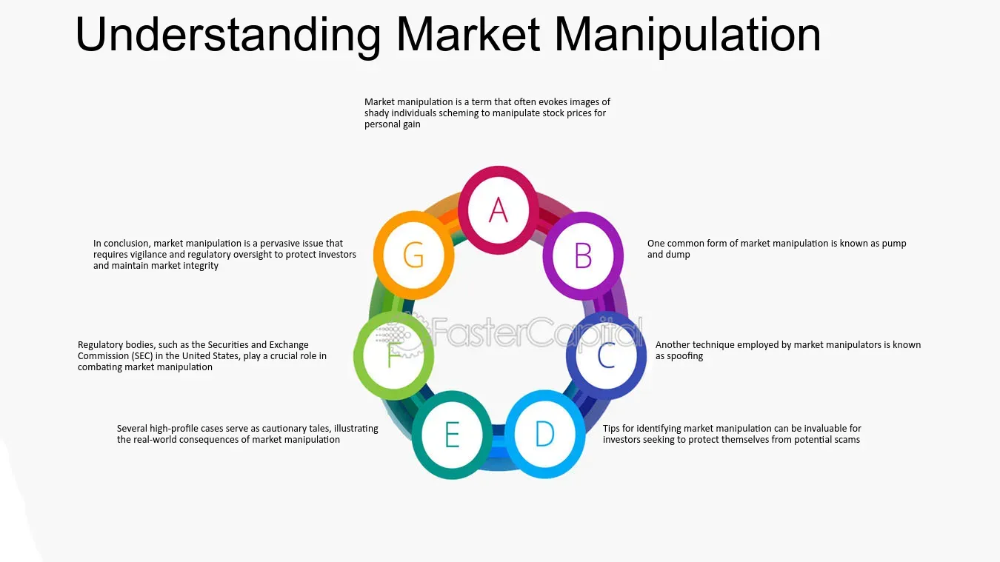

## Table of Contents

## What is market manipulation?

Market manipulation is when people try to control the price of things that are bought and sold, like stocks or commodities, in a way that is not fair. They do this by using tricks or false information to make the price go up or down. This can hurt other people who are trying to buy or sell those things honestly, because they might make bad decisions based on the wrong information.

For example, someone might spread rumors that a company is doing really badly, even if it's not true, to make the stock price fall. Then, they can buy the stock cheaply and sell it later for a profit when the truth comes out. Or, they might pretend to buy a lot of something to make it seem more popular and valuable, then sell it at a higher price before others realize it's not worth that much. This kind of behavior is against the rules and can lead to big problems for the market and the people involved.

## What are the common types of market manipulation?

Market manipulation can take many forms, but some common types include pump and dump schemes and spoofing. In a pump and dump, people spread false or exaggerated information about a stock to make its price go up. They then sell their shares at the higher price, leaving others with worthless stock when the price falls back down. This is like tricking people into buying something that isn't really worth it.

Another type is spoofing, where someone places fake orders to buy or sell something, making it look like there's a lot of interest. They do this to move the price in their favor, and then they cancel the fake orders before they go through. It's like pretending to want to buy a lot of something to make others think it's more valuable than it really is.

There's also front running, where someone with inside information about big trades uses that knowledge to buy or sell before the big trade happens, making a profit from the price change. This is unfair because it uses secret information that others don't have. All these types of manipulation can harm the market and the people who trade honestly.

## How does pump and dump work?

Pump and dump is a type of market manipulation where someone tries to trick others into buying a stock so they can sell it at a higher price. They start by spreading false or exaggerated information about the stock, making it seem like a great investment. This could be through social media, emails, or even fake news articles. As more people hear the good news, they start buying the stock, pushing its price up.

Once the price is high enough, the person who started the scheme sells all their shares at the inflated price. This makes a lot of money for them, but it leaves everyone else with a stock that's now worth much less. When the truth comes out and people realize they were tricked, they start selling their shares, causing the price to drop quickly. This can lead to big losses for those who bought in at the peak, while the manipulator walks away with the profits.

## What is a wash trade and how is it used to manipulate markets?

A wash trade is when someone buys and sells the same thing at the same time, making it look like there's a lot of trading happening when there isn't. They do this to trick other people into thinking that the thing they're trading is more popular or valuable than it really is. For example, if someone wants to make a stock seem busy, they might buy and sell it back and forth with themselves or with someone they know, making it look like there's a lot of interest in the stock.

This kind of trading can be used to manipulate markets by creating a false sense of activity. When other people see all this trading, they might think the stock is a good investment and start buying it too. This can push the price up, which is what the person doing the wash trades wanted all along. Once the price is high enough, they can sell their shares for a profit, leaving everyone else with a stock that might not be worth as much as they thought.

## Can you explain spoofing and layering in market manipulation?

Spoofing is a type of market manipulation where someone places fake orders to buy or sell something. They do this to trick other people into thinking there's a lot of interest in that thing, which can make its price go up or down. For example, someone might place a big order to buy a stock, making it look like a lot of people want to buy it. This can make the price go up. But before the order goes through, the person cancels it because they never really wanted to buy the stock. They just wanted to make the price go up so they could sell their own shares at a higher price.

Layering is similar to spoofing but involves placing multiple fake orders at different price levels. The person doing the layering puts in a lot of buy or sell orders at different prices to make it look like there's a lot of activity in the market. This can confuse other traders and push the price in the direction the manipulator wants. Once the price moves, the manipulator cancels all the fake orders and makes a profit from the real trades they made while the price was being pushed. Both spoofing and layering are illegal because they trick other people and harm the fairness of the market.

## What role do social media and online forums play in market manipulation?

Social media and online forums are powerful tools that can be used to manipulate markets. People can spread false or exaggerated information about a stock quickly to a lot of people. For example, someone might start a rumor on Twitter or a forum like Reddit that a company is about to make a big announcement or that its stock is about to go up. This can make a lot of people want to buy the stock, pushing its price higher. This is often part of a pump and dump scheme where the person spreading the rumor then sells their shares at the higher price, making a profit before the stock price falls back down.

These platforms also make it easy for manipulators to reach a large audience without much effort. They can create fake accounts or use bots to spread their messages, making it look like there's a lot of interest in a stock. This can trick more people into buying, thinking that others know something they don't. It's important for people to be careful and check the information they see on social media and forums, because not everything is true, and falling for these tricks can lead to big losses.

## How do manipulators use insider information to their advantage?

Manipulators use insider information to make money by knowing things that other people don't. For example, if someone knows that a company is about to announce bad news, they can sell their shares before the price goes down. This is called front running. They make a profit because they sold their shares at a higher price than they would have gotten after the bad news came out. This is not fair because they used secret information that other people didn't have.

Another way manipulators use insider information is by buying stocks before good news is announced. If someone knows that a company is about to share great news, they can buy a lot of shares before the announcement. When the news comes out, the stock price goes up, and they can sell their shares for a profit. This is also unfair because they made money using information that wasn't available to everyone. Using insider information like this is against the law and can lead to big problems for the people who do it.

## What are the legal consequences of engaging in market manipulation?

Engaging in market manipulation is against the law and can lead to serious legal consequences. If someone is caught manipulating the market, they might have to pay big fines. The fines can be a lot of money, sometimes even millions of dollars. They might also have to give back any money they made from the manipulation. This is called disgorgement, and it means they have to return their illegal profits.

Besides fines and disgorgement, people who manipulate the market can face criminal charges. This means they could go to jail for what they did. The time in jail can be several years, depending on how bad the manipulation was and how much it hurt other people. Market manipulation is taken very seriously because it harms the fairness of the market and can cause a lot of people to lose money.

## How can regulatory bodies detect market manipulation?

Regulatory bodies use special tools and methods to find market manipulation. They watch the market all the time, looking for strange patterns or behaviors. For example, if they see a lot of trading in a stock that doesn't seem to make sense, they might start to investigate. They also use computers to look at big amounts of data quickly. These computers can spot things that might be hard for people to see, like wash trades or spoofing.

When they find something that looks like manipulation, regulatory bodies can ask for more information. They might talk to the people involved or look at their trading records. If they find enough evidence, they can take action against the people who did the manipulation. This helps keep the market fair and safe for everyone.

## What advanced techniques do experts use to identify market manipulation?

Experts use advanced computer programs to look for signs of market manipulation. These programs can handle huge amounts of data and find patterns that might be hard for people to see. For example, they can spot if someone is doing a lot of buying and selling of the same thing at the same time, which could be a wash trade. They can also find fake orders that are placed and then canceled quickly, which might be spoofing. By using these tools, experts can quickly see if something strange is happening in the market.

Once the computer programs find something that looks like manipulation, experts take a closer look. They might check trading records and talk to the people involved to see if they can find more evidence. If they find enough proof, they can take action to stop the manipulation and punish the people who did it. This helps keep the market fair and protects people who are trading honestly.

## How can investors protect themselves from market manipulation?

Investors can protect themselves from market manipulation by being careful about where they get their information. They should not trust everything they see on social media or online forums. It's important to check if the news or rumors about a stock are true before making any decisions. They can do this by looking at official company announcements or reading reports from trusted news sources. If something sounds too good to be true, it probably is.

Another way to protect against market manipulation is to use stop-loss orders. A stop-loss order is like a safety net that automatically sells a stock if its price drops to a certain level. This can help limit losses if the stock price falls because of manipulation. Investors should also be careful about buying stocks that seem to be moving a lot without clear reasons. If a stock's price is going up and down a lot, it might be a sign that someone is trying to manipulate it. By being cautious and doing their own research, investors can better protect themselves from getting tricked.

## What future trends might influence market manipulation strategies?

In the future, technology will play a bigger role in how people try to manipulate markets. With more advanced computers and programs, it might become easier for manipulators to hide what they're doing. They could use things like artificial intelligence to create fake news or spread rumors that look real. This could make it harder for people to tell what's true and what's not. Also, as more people use social media and online forums, manipulators might find new ways to reach a lot of people quickly and trick them into buying or selling stocks.

On the other hand, regulators will also use better technology to catch manipulators. They will use more advanced computer programs to watch the market and find strange patterns. This could help them stop manipulation faster and keep the market fair. But it will be a race between the manipulators and the regulators, with each side trying to use the newest technology to their advantage. Investors will need to stay smart and careful to protect themselves from these new tricks.

## What is the impact of market manipulation on financial markets?

Market manipulation in financial markets represents a significant threat to stability and fairness. The implementation of manipulative strategies, particularly through [algorithmic trading](/wiki/algorithmic-trading), can induce increased [volatility](/wiki/volatility-trading-strategies), thereby affecting price stability adversely. In financial markets, price stability is crucial for ensuring that prices reflect all available information without abrupt and unjustified changes. When manipulative tactics such as spoofing, layering, quote stuffing, and momentum ignition are employed, they can create artificial movement in stock prices. This increased volatility can make it challenging for traders to predict price movements accurately, thus distorting the fundamental market equilibrium model traditionally defined as:

$$
P_t = E[P_{t+1}]
$$

where $P_t$ is the current price and $E[P_{t+1}]$ is the expected future price based on all current information. When manipulation occurs, expectations diverge from reality, leading to erratic price behavior.

Moreover, market manipulation erodes investor confidence, a vital component of a thriving financial system. When investors perceive markets as rigged or unfair due to manipulative strategies, trust diminishes. This discouragement from investing can result in decreased market participation, subsequently reducing market [liquidity](/wiki/liquidity-risk-premium). Liquidity refers to the ease with which an asset can be bought or sold in the market without affecting its price. A lack of liquidity can create a more volatile market environment, where prices experience larger swings due to the inability to absorb trades efficiently.

Financial losses also accrue to traders who are uninformed or unaware of manipulative activities. These traders might make investment decisions based on manipulated market signals, resulting in unfavorable outcomes. The cost of these misguided trades, driven by distorted information, compounds the overall inefficiency of the market. This circumstance is particularly detrimental to retail investors, who may lack the resources to deploy sophisticated detection mechanisms to identify such exploitation.

Furthermore, manipulation distorts market signals, which are essential for the proper allocation of resources within the financial system. Prices are supposed to signal the correct allocation of resources across the economy, guiding investment towards the most productive opportunities. However, when manipulation distorts these signals, capital can be misallocated, hampering economic growth and efficiency. In an efficient market, resources are directed to the most promising ventures, thereby driving innovation and development. Manipulative practices disrupt this process by creating false impressions of supply and demand.

In summary, market manipulation has pervasive negative effects, from reducing price stability and eroding investor trust to causing financial losses and misallocating resources. Therefore, it is imperative for regulatory agencies and market participants to work collectively to identify and mitigate such practices, ensuring that financial markets function efficiently and equitably.

## References & Further Reading

[1]: Aldridge, I. (2013). ["High-Frequency Trading: A Practical Guide to Algorithmic Strategies and Trading Systems"](https://www.ahmetbeyefendi.com/wp-content/uploads/2020/07/High-Frequency-Trading-Irene-Aldridge.pdf). Wiley.

[2]: Cartea, Á., Jaimungal, S., & Penalva, J. (2015). ["Algorithmic and High-Frequency Trading"](https://assets.cambridge.org/97811070/91146/frontmatter/9781107091146_frontmatter.pdf). Cambridge University Press.

[3]: Gomber, P., Arndt, B., Lutat, M., & Uhle, T. (2011). ["High-Frequency Trading"](https://papers.ssrn.com/sol3/papers.cfm?abstract_id=1858626) Business & Information Systems Engineering, 3(2).

[4]: Patterson, S. (2013). ["Dark Pools: High-Speed Traders, A.I. Bandits, and the Threat to the Global Financial System"](https://books.google.com/books/about/Dark_Pools.html?id=LIoNSKUEn24C). Crown Business.

[5]: Foxman, S. & Kearns, M. (2013). ["A Behavioral Welfare Analysis of High-Frequency Trading"](https://www.cis.upenn.edu/~mkearns/papers/KearnsNevmyvakaHFTRiskBooks.pdf). Law and Economics Research Paper.