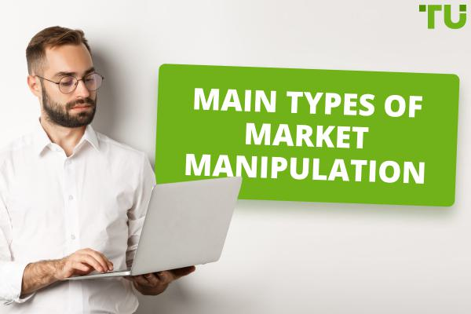

Algorithmic trading has dramatically reshaped the financial markets by allowing traders to execute orders at speeds and volumes that were previously impossible. This technological advancement utilizes algorithms—computer programs designed to follow a defined set of instructions for solving problems or performing tasks—to make trading decisions, often in fractions of a second. This high-frequency trading capability has introduced unprecedented efficiency and liquidity, enabling quicker price adjustments and narrower bid-ask spreads.

However, alongside these benefits, the rise of algorithmic trading has brought about challenges concerning market manipulation. Certain participants exploit these algorithms to engage in deceptive practices that can distort market conditions and prices. Such manipulation erodes market integrity, potentially misleading investors and undermining trust in the financial system.

This article focuses on various market manipulation strategies within algorithmic trading, examining their implications for financial markets and the regulatory frameworks designed to mitigate these issues. By gaining insights into these strategies, traders and regulators can enhance their ability to protect markets from exploitation and promote equitable trading environments. Understanding these dynamics is crucial for maintaining the balance between technological innovation and market fairness.

## Table of Contents

## Types of Market Manipulation Strategies in Algo Trading

Algorithmic trading, with its capacity for high-speed execution and vast volumes of orders, has opened avenues for several market manipulation strategies. These strategies, often sophisticated, are designed to distort market perceptions and ultimately gain an unfair advantage. Some of the most common strategies include spoofing, layering, quote stuffing, and momentum ignition.

### Spoofing

Spoofing is a strategy where traders place large buy or sell orders with no intent of execution to create a false sense of demand or supply. This tactic manipulates market sentiment, as other traders perceive an increase or decrease in interest at particular price levels. Once the desired market reaction occurs—such as a temporary shift in price—the spoofing orders are swiftly canceled. The trader may then capitalize on the resultant market movement, potentially leading to significant profit margins.

### Layering

Layering is closely akin to spoofing but involves a more complex arrangement of fake orders at multiple price levels. A trader executes this by placing a series of bogus orders both above and below the current market price. By doing this, they create artificial pressure or support, manipulating the market's perception of supply and demand dynamics. Like spoofing, these orders are withdrawn before execution, and the deceiver profits from the strategically induced market movements.

### Quote Stuffing

Quote stuffing is a rapid and high-[volume](/wiki/volume-trading-strategy) tactic where traders inundate the market with a slew of orders, causing congestion and slowing down competitors' trading systems. By artificially inflating the quote volume, these manipulators aim to exploit delays in order processing, gaining a temporal advantage to trade on more precise market information than rivals who are operating on outdated data.

### Momentum Ignition

Momentum ignition involves initiating a series of transactions intended to spark and intensify a price trend, encouraging other participants to join. Achieved through persistent buying or selling, this strategy aims to create rapid price movements that attract additional traders who amplify the [momentum](/wiki/momentum). The originator of this strategy then exploits the resulting price shift by reversing their position, selling when others are buying at higher prices or buying when others are selling at lower prices.

Understanding these tactics is essential for market participants and regulators alike to identify and mitigate manipulative behaviors effectively. Awareness and detection of these ploys can help maintain market integrity and protect against market abuses.

## Impact of Market Manipulation on Financial Markets

Market manipulation in financial markets represents a significant threat to stability and fairness. The implementation of manipulative strategies, particularly through [algorithmic trading](/wiki/algorithmic-trading), can induce increased [volatility](/wiki/volatility-trading-strategies), thereby affecting price stability adversely. In financial markets, price stability is crucial for ensuring that prices reflect all available information without abrupt and unjustified changes. When manipulative tactics such as spoofing, layering, quote stuffing, and momentum ignition are employed, they can create artificial movement in stock prices. This increased volatility can make it challenging for traders to predict price movements accurately, thus distorting the fundamental market equilibrium model traditionally defined as:

$$
P_t = E[P_{t+1}]
$$

where $P_t$ is the current price and $E[P_{t+1}]$ is the expected future price based on all current information. When manipulation occurs, expectations diverge from reality, leading to erratic price behavior.

Moreover, market manipulation erodes investor confidence, a vital component of a thriving financial system. When investors perceive markets as rigged or unfair due to manipulative strategies, trust diminishes. This discouragement from investing can result in decreased market participation, subsequently reducing market [liquidity](/wiki/liquidity-risk-premium). Liquidity refers to the ease with which an asset can be bought or sold in the market without affecting its price. A lack of liquidity can create a more volatile market environment, where prices experience larger swings due to the inability to absorb trades efficiently.

Financial losses also accrue to traders who are uninformed or unaware of manipulative activities. These traders might make investment decisions based on manipulated market signals, resulting in unfavorable outcomes. The cost of these misguided trades, driven by distorted information, compounds the overall inefficiency of the market. This circumstance is particularly detrimental to retail investors, who may lack the resources to deploy sophisticated detection mechanisms to identify such exploitation.

Furthermore, manipulation distorts market signals, which are essential for the proper allocation of resources within the financial system. Prices are supposed to signal the correct allocation of resources across the economy, guiding investment towards the most productive opportunities. However, when manipulation distorts these signals, capital can be misallocated, hampering economic growth and efficiency. In an efficient market, resources are directed to the most promising ventures, thereby driving innovation and development. Manipulative practices disrupt this process by creating false impressions of supply and demand.

In summary, market manipulation has pervasive negative effects, from reducing price stability and eroding investor trust to causing financial losses and misallocating resources. Therefore, it is imperative for regulatory agencies and market participants to work collectively to identify and mitigate such practices, ensuring that financial markets function efficiently and equitably.

## Regulatory Responses to Combat Market Manipulation

Regulatory bodies worldwide are increasingly focusing on enhancing their capabilities to detect and penalize manipulative trading practices in algorithmic trading. These efforts are crucial in maintaining market integrity and protecting investors. One of the primary methods being utilized involves the adoption of innovative technologies, including [artificial intelligence](/wiki/ai-artificial-intelligence) (AI) and [machine learning](/wiki/machine-learning) (ML). These technologies enable real-time monitoring and analysis of trading activities, allowing for the rapid identification of suspicious patterns indicative of market manipulation. 

AI and ML algorithms can process vast amounts of data at unprecedented speeds, identifying anomalies and potential manipulative behavior that human analysts might miss. These algorithms can be trained to recognize the characteristics of common manipulation strategies such as spoofing and layering, providing regulators with powerful tools to enforce market rules effectively.

In addition to technological advancements, regulatory frameworks such as the European Union's Market Abuse Regulation (MAR) play a significant role in deterring market manipulation. MAR sets out clear guidelines and penalties for manipulative practices, aiming to enhance transparency and fairness in financial markets. It mandates the implementation of surveillance systems by trading venues and investment firms, ensuring that manipulative activities are promptly detected and addressed.

Effective combat against market manipulation also requires collaboration among exchanges, regulatory agencies, and market participants. By working together, these entities can share information and resources, which enhances the detection and prevention of manipulation. Cross-border cooperation is particularly vital, given the global nature of financial markets and the often-transnational operations of manipulative traders.

Moreover, ongoing education and awareness programs are essential for market participants to recognize and report suspicious activities. Traders and firms must remain vigilant and informed about regulatory developments and market dynamics to contribute actively to a fair trading environment.

In conclusion, while challenges persist in addressing market manipulation within algorithmic trading, the convergence of advanced technologies, stringent regulatory measures, and cooperative efforts provides a robust arsenal for regulators and market participants. This multifaceted approach is essential in safeguarding the integrity of financial markets in an era of rapid technological advancement.

## Conclusion

Algorithmic trading has revolutionized the financial industry by enabling rapid and efficient trade execution. However, it also presents significant challenges related to market manipulation. These challenges underscore the need for a deep understanding of manipulation strategies, not only among regulators but also among traders and other market participants, to safeguard market trust and maintain efficiency.

Understanding manipulation strategies such as spoofing, layering, quote stuffing, and momentum ignition is essential for identifying and mitigating potential risks. Spoofing involves placing large, fake orders to create a misleading impression of market demand or supply, while layering adds complexity with multiple order placements at various prices. Quote stuffing seeks to overwhelm the trading systems of competitors by inundating the market with orders, thereby securing a competitive edge. Momentum ignition aims to artificially stimulate trading activity, driving prices in a desired direction to entice other traders into the action. Recognizing these tactics is vital for the detection of manipulation and protection of market integrity.

Advancements in technology and regulatory frameworks are critical components in the fight against market manipulation. The financial industry must leverage innovations such as artificial intelligence and machine learning to enhance the monitoring and detection of suspicious trading behavior. These tools enable the analysis of vast amounts of data in real-time, increasing the chances of identifying manipulative practices promptly. Furthermore, regulatory measures—such as the European Union's Market Abuse Regulation—are pivotal in establishing clear guidelines and consequences for market abuses, thereby fostering a more transparent trading environment.

A collaborative approach among exchanges, regulatory bodies, and market participants is vital to enforce these measures effectively and to adapt to the continuous evolution of manipulation techniques. This cooperation enhances enforcement capabilities and ensures the efficacy of preventive strategies.

While algorithmic trading is a powerful tool, the associated risks of market manipulation demand ongoing vigilance and adaptation. The financial industry must remain agile in responding to new manipulation tactics, ensuring that markets remain fair, efficient, and trustworthy. Through continuous innovation and robust regulation, manipulative practices can be curtailed, guaranteeing a fair trading landscape for all participants.

## References & Further Reading

[1]: Aldridge, I. (2013). ["High-Frequency Trading: A Practical Guide to Algorithmic Strategies and Trading Systems"](https://www.ahmetbeyefendi.com/wp-content/uploads/2020/07/High-Frequency-Trading-Irene-Aldridge.pdf). Wiley.

[2]: Cartea, Á., Jaimungal, S., & Penalva, J. (2015). ["Algorithmic and High-Frequency Trading"](https://assets.cambridge.org/97811070/91146/frontmatter/9781107091146_frontmatter.pdf). Cambridge University Press.

[3]: Gomber, P., Arndt, B., Lutat, M., & Uhle, T. (2011). ["High-Frequency Trading"](https://papers.ssrn.com/sol3/papers.cfm?abstract_id=1858626) Business & Information Systems Engineering, 3(2).

[4]: Patterson, S. (2013). ["Dark Pools: High-Speed Traders, A.I. Bandits, and the Threat to the Global Financial System"](https://books.google.com/books/about/Dark_Pools.html?id=LIoNSKUEn24C). Crown Business.

[5]: Foxman, S. & Kearns, M. (2013). ["A Behavioral Welfare Analysis of High-Frequency Trading"](https://www.cis.upenn.edu/~mkearns/papers/KearnsNevmyvakaHFTRiskBooks.pdf). Law and Economics Research Paper.