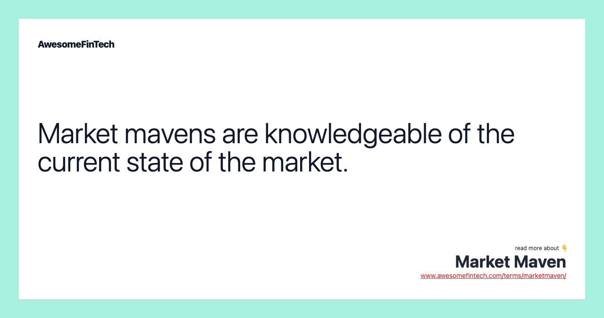

The roles of market influence and market mavens have become crucial in shaping consumer behavior, particularly in algorithmic trading. Understanding these concepts is essential in today's rapidly changing economic landscape. This article examines the interconnectedness of market influence, market mavens, and their impact on financial markets. We explore how these entities affect consumer behavior and the adoption of algorithmic trading strategies.

Market influence refers to the power individuals or groups hold in swaying investor opinions and behaviors. Analysts, market makers, and influential investors can significantly shift public sentiment and market trends. With the advent of the digital age, social media and online platforms have amplified the reach and impact of these market influencers. Notable examples include tweets from business leaders that can instantaneously alter stock prices. Recognizing these dynamics is crucial for individual investors and financial institutions wanting to align their strategies with market conditions.



Market mavens, known for their comprehensive market knowledge and connections, act as experts within their domains. They are trusted information sources due to their historical success and predictive abilities. Figures like Warren Buffett and George Soros exemplify how informed investing can influence market movements. Market mavens' influence extends beyond finance into consumer markets, where they promote products and decipher trends.

Algorithmic trading, utilizing computer programs to execute trades based on preset criteria at high speeds and volumes, is another area influenced by market dynamics. This article will address how market influence and mavens affect the formulation and execution of algorithmic trading strategies. The impact of trends initiated by these figures on algorithmic outcomes will be examined alongside how algorithms process data to optimize trading decisions. The possible risks and benefits of algorithmic trading in response to market influences also warrant consideration.

The implications of these influences on investment decisions and market dynamics are profound. The insights of market mavens and influencers present both opportunities and challenges for investors and businesses. As algorithmic trading evolves, integrating sophisticated analytics and real-time data molded by market mavens, the future of market influence and consumer behavior appears increasingly intertwined with technology. Understanding these dynamics is critical for developing strategies that effectively leverage influencer impacts and technological advancements. This article intends to provide a comprehensive review of these elements and their significance for the future.

## Table of Contents

## Understanding Market Influence

Market influence pertains to the capacity of individuals or groups to shape the opinions and behaviors of investors and consumers. This influence often emanates from key figures such as analysts, market makers, and influential investors, whose statements or actions possess the ability to sway public opinion and consequently market trends. The emergence of the digital age has exponentially increased the reach and impact of these market influencers, primarily through social media and other online platforms. 

Notably, an influential tweet from a business leader can prompt dramatic changes in stock prices. For instance, a tweet by Elon Musk has been known to send volatile ripples through the stock and [cryptocurrency](/wiki/cryptocurrency) markets, demonstrating the profound effects a single social media post can have. This phenomenon underscores the importance of understanding market influence for both individual investors and financial institutions. 

By aligning their strategies with the dynamics of market influence, investors and institutions can better navigate the financial markets. The knowledge of how market influence operates helps identify potential opportunities and risks associated with investment decisions. It is critical to recognize that the individuals or groups exerting such influence can alter market perceptions and create [momentum](/wiki/momentum) that either drives or suppresses market activity. 

Moreover, the role of market influence extends beyond mere opinion shaping. It involves an intricate interplay of information dissemination and perceptual shifts, often orchestrated by those holding substantial credibility or authority in financial circles. This ability to influence is amplified by the speed of information transfer in today's technologically connected world, where digital platforms can escalate both the distribution and reception of market-related information.

Understanding market influence, therefore, is not just about recognizing the key players but also about comprehending the mechanisms by which information and sentiment are propagated and amplified. For investors and financial institutions, this knowledge is vital in crafting strategies that are resilient to the ebb and flow of market sentiments driven by influential forces. Adapting to these dynamics ensures not only survival but also the potential for growth in increasingly volatile market environments.

## The Role of Market Mavens

Market mavens play a distinct role in the financial markets due to their extensive knowledge and network connections. These individuals are considered 'experts' because they have demonstrated historical success and possess predictive capabilities that influence investor decisions and market movements.

Market mavens establish their expertise by thoroughly gathering and analyzing market information. They have an in-depth understanding of financial instruments, market dynamics, and economic signals. Their approach involves surveying vast amounts of data, monitoring financial news, economic indicators, corporate reports, and engaging with a network of market participants. By synthesizing this information, market mavens form well-informed opinions and forecasts about market trends and potential investment opportunities.

The influence of market mavens extends to how they disseminate their insights. Their analyses are often shared through various media channels, investment reports, and public forums, impacting a broad audience of investors and financial institutions. This can lead to shifts in market sentiment and affect stock prices, as their recommendations are trusted by followers who believe in their track record and market insights.

Famous market mavens such as Warren Buffett and George Soros exemplify the power of informed investing. Warren Buffett, known for his value investing strategy, emphasizes purchasing undervalued stocks of solid companies and holding them for the long term. His investment philosophy and decisions are closely followed by investors worldwide, often resulting in market movements aligned with his investments. Meanwhile, George Soros gained recognition with his ability to predict macroeconomic trends, most notably his successful bet against the British pound in 1992, which demonstrated the significant market impact a maven can have.

Market mavens' significance surpasses the financial sector, extending to consumer markets. In these areas, they help shape consumer perceptions and behaviors. They are often early adopters of new products and influence trends through word-of-mouth and digital communications. Businesses frequently monitor market mavens to gauge potential product success and adjust marketing strategies to align with emerging trends.

In conclusion, market mavens hold a pivotal position between extensive market knowledge and the ability to influence decisions and trends. Their expertise and connections enable them to gather and analyze critical information, which they effectively disseminate to sway market perceptions and behaviors. As such, understanding the role of market mavens is essential for investors wanting to navigate complex market landscapes and for businesses aiming to predict and respond to consumer trends.

## Consumer Behavior and Market Mavens

Consumer market mavens significantly impact buying decisions and set trends, often blending the roles of influencers and early adopters. These individuals are not only knowledgeable about various products and services but also actively engage in sharing this knowledge, typically through word-of-mouth and social media platforms. This dual role as both information gatherers and disseminators positions them as pivotal in shaping consumer preferences and market dynamics.

One of the primary ways market mavens influence consumer behavior is through the adoption of new products and services across industries. Their early adoption signals to other consumers the viability and desirability of these innovations, often accelerating market penetration and acceptance. For example, in the technology sector, early approval from market mavens can lead to rapid uptake of new gadgets or applications, influencing broader market trends.

Understanding the buying patterns and recommendations of these mavens is crucial for businesses aiming to capitalize on market trends and consumer demands. Companies can gain insights into what drives purchasing decisions, enabling them to tailor their marketing strategies and product developments accordingly. Tracking and analyzing social media interactions and purchasing data could provide valuable indicators of emerging trends spearheaded by these influential consumers.

The influence of market mavens extends beyond their knowledge of products to their social and psychological traits. They are typically characterized by a curiosity about market offerings, a high level of social engagement, and a desire to assist others in making informed purchasing decisions. These traits amplify their influence, as their recommendations often [carry](/wiki/carry-trading) more weight among their peers, leading to a ripple effect in consumer behavior.

In summary, consumer market mavens play a pivotal role in guiding purchasing decisions and establishing trends. Recognizing the patterns and motivations behind their influence can provide businesses with strategic advantages, helping to align their offerings with market demands. Understanding these dynamics is essential for companies aiming to leverage the impact of market mavens in driving consumer behavior and market trends.

## Algorithmic Trading and Its Interactions

Algorithmic trading, often referred to as 'algo trading,' is a method of executing trades using automated and pre-programmed trading instructions. These instructions account for variables such as timing, price, and [volume](/wiki/volume-trading-strategy), enabling transactions to happen at speeds and efficiencies beyond human capacity. The influence of market trends and mavens has a profound effect on the development and execution of these algorithmic strategies. 

Market influencers, through their analysis, comments, and forecasts, can trigger significant fluctuations in trading activities. Their pronouncements often alter market sentiments, which can subsequently affect [algorithmic trading](/wiki/algorithmic-trading) decisions. When influential figures, such as executives or well-known investors, release statements or make market predictions, these can drastically sway market dynamics. Many trading algorithms are designed to identify and react to such signals, thereby amplifying their effect.

Market mavens play a pivotal role in shaping the inputs into these algorithms. Their deep understanding of market conditions and historical data informs the parameters that these algorithms utilize. For instance, an algorithm might adjust its risk parameters based on a market maven's insights into expected [volatility](/wiki/volatility-trading-strategies), enabling it to take more prudent trading actions in fluctuating markets.

The algorithms work by incorporating diverse datasets that include price movements, economic indicators, and sometimes social media trends facilitated by market influencers. This data integration can be illustrated in Python by using libraries such as pandas for data manipulation and scikit-learn for modeling:

```python
import pandas as pd
from sklearn.linear_model import LinearRegression

# Sample data
data = {'Price': [100, 102, 104, 103, 105],
        'Volume': [200, 220, 250, 230, 240],
        'Sentiment': [0.1, 0.3, -0.1, 0.4, 0.2]}

df = pd.DataFrame(data)

# Independent variables
X = df[['Volume', 'Sentiment']]

# Dependent variable
y = df['Price']

# Model
model = LinearRegression().fit(X, y)

# Predicted price
df['Predicted_Price'] = model.predict(X)
```

This example demonstrates how algorithms can process a combination of market volume and sentiment data to predict price trends. The predictions made by models like these are often impacted by patterns identified by market mavens.

Despite the advantages, algorithmic trading is not without risks. The rapid pace and sheer volume of transactions can lead to increased volatility and systemic risks if many algorithms simultaneously react to the same market signals. Known as "flash crashes," these events can cause drastic market downturns in mere seconds. 

However, the benefits, including increased market [liquidity](/wiki/liquidity-risk-premium) and more efficient spreads, often outweigh the potential downsides. By understanding and leveraging the insights from market mavens, algorithmic traders can refine their strategies to maximize returns while mitigating risks. As technology advances, the interplay between human market influencers and algorithmic trading systems will continue to grow, with significant implications for financial markets.

## Implications and Future Perspectives

The evolving landscape of market influence and the role of market mavens present both novel opportunities and significant challenges in the context of algorithmic trading and financial market strategies. As algorithmic trading matures, its integration with cutting-edge analytics and real-time data is increasingly influenced by insights from market mavens. This presents a dual opportunity: leveraging deeper predictive capabilities while contending with the rapid shifts that influencers can incite.

Future trends in market influence and consumer behavior forecast an amplification of technology's role. The penetration of advanced technologies such as [artificial intelligence](/wiki/ai-artificial-intelligence) (AI) and [machine learning](/wiki/machine-learning) (ML) in algorithmic trading is poised to redefine the dynamics of market operations. These technologies facilitate the analysis of vast data sets, capturing trends catalyzed by market mavens and influencers. For instance, sentiment analysis algorithms can parse social media activity to gauge public sentiment on specific stocks, promptly adjusting trading strategies based on this input.

In this rapidly changing environment, understanding the nexus between influencers, market data, and consumer behavior becomes vital for developing effective market strategies. Businesses and investors must harness these insights to craft strategies that capitalize on influencer impacts and the sophisticated capabilities of algorithmic advancements. This includes recognizing the conditions under which influencer effects might be amplified or diminished and tailoring algorithmic parameters to these scenarios.

To navigate these complex relationships, several recommendations can be proposed:

1. **Invest in Advanced Analytics:** Investors and businesses should prioritize the adoption of AI and ML tools to enhance their data interpretation capabilities. This can include developing proprietary algorithms that incorporate influencer trends and anticipatory signals into trading strategies.

2. **Monitor Social and Digital Trends:** Regularly tracking social media platforms and influencer activities can provide valuable insights into potential market movements. Businesses should consider employing dedicated teams or services to monitor these channels.

3. **Adaptive Strategy Development:** Strategies should be flexible, capable of rapid adjustments in response to influencer-driven market shifts. Scenario analysis and stress testing can help anticipate various market responses to influencer activities.

4. **Education and Training:** Continuous learning initiatives focused on the intersection of market influence and technology adoption will empower stakeholders to make informed decisions. Workshops and e-learning platforms can disseminate knowledge on leveraging technology to respond to market trends.

In conclusion, the interplay of market mavens, influencers, and algorithmic trading outlines a frontier of financial innovation teeming with potential. By embracing technology and staying attuned to the subtle shifts in market sentiment, investors and businesses can better position themselves to thrive in a future where the lines between influence, consumer behavior, and trading continue to converge.

## References & Further Reading

[1]: Bergstra, J., Bardenet, R., Bengio, Y., & Kégl, B. (2011). ["Algorithms for Hyper-Parameter Optimization."](https://dl.acm.org/doi/10.5555/2986459.2986743) Advances in Neural Information Processing Systems 24.

[2]: ["Advances in Financial Machine Learning"](https://www.amazon.com/Advances-Financial-Machine-Learning-Marcos/dp/1119482089) by Marcos Lopez de Prado

[3]: ["Evidence-Based Technical Analysis: Applying the Scientific Method and Statistical Inference to Trading Signals"](https://www.amazon.com/Evidence-Based-Technical-Analysis-Scientific-Statistical/dp/0470008741) by David Aronson

[4]: ["Machine Learning for Algorithmic Trading"](https://github.com/stefan-jansen/machine-learning-for-trading) by Stefan Jansen

[5]: ["Quantitative Trading: How to Build Your Own Algorithmic Trading Business"](https://github.com/LucindaYa/quant-resources/blob/master/Quantitative%20Trading%20How%20to%20Build%20Your%20Own%20Algorithmic%20Trading%20Business.pdf) by Ernest P. Chan