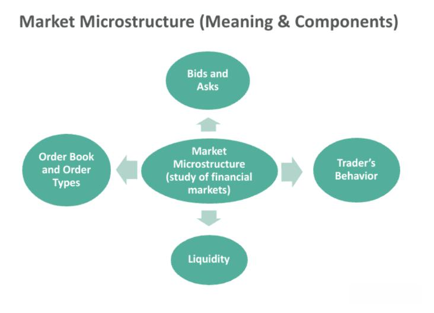

Market microstructure is a critical area of finance that investigates the processes and outcomes of exchanging assets under specific trading rules. Primarily, it examines how trading mechanisms influence the price dynamics, liquidity, and efficiency of financial markets. Understanding market microstructure is vital for financial practitioners and theorists alike, as it provides valuable insights into the interaction between traders, market intermediaries, and the structures that govern trading. It is particularly significant for algorithmic trading, where precise market models are utilized to make rapid trading decisions based on real-time data.

In algorithmic trading, a thorough comprehension of market microstructure is essential. With algorithms executing trades at split-second intervals, understanding the nuances of order flow, price discovery, and the costs associated with trading can make the difference between profit and loss. Specifically, market microstructure helps algorithmic traders optimize their strategies by providing a framework to understand how different elements such as transaction costs, volatility, and liquidity play a role in the execution and performance of trades. 



This article will focus on key areas within market microstructure that have significant implications for algorithmic trading: transaction costs, price formation, volatility, liquidity, and information dissemination. Each component offers a unique perspective on how markets operate and how trading strategies can be tailored for optimal results.

- **Transaction Costs**: These are the costs incurred in trading, including fees, bid-ask spreads, and the potential impact of trades on market prices. For algorithmic traders, understanding and minimizing transaction costs is crucial for improving profitability.

- **Price Formation**: The process by which market prices are set. Different market structures (such as auctions or negotiations) influence how prices are discovered and can have substantial effects on trading strategies.

- **Volatility**: Refers to the degree of variation in trading prices. High volatility can introduce risks but also opportunities for traders who can exploit price swings.

- **Liquidity**: The ease with which an asset can be bought or sold in the market without affecting its price. Liquidity is a critical factor in ensuring efficient market operation and directly impacts the execution of trading strategies, particularly in high-frequency trading.

- **Information Dissemination**: The way information is shared and processed in markets, affecting price movements and trader behavior. Information asymmetry, where some investors have access to more information than others, can lead to market inefficiencies.

Understanding these elements is fundamental to leveraging market microstructure knowledge in developing sophisticated [algorithmic trading](/wiki/algorithmic-trading) strategies. We will explore these areas in detail, highlighting how they interact with modern trading technologies and their implications for the future of finance.

## Table of Contents

## Understanding Market Microstructure

Market microstructure is a specialized area within finance that scrutinizes how trading occurs in financial markets. Maureen O'Hara, a pioneering figure in this field, has provided a comprehensive theoretical framework that is pivotal in understanding trading dynamics and market efficiency. Her work sheds light on the intricate processes that govern the transaction of financial assets and the subsequent influence on price behavior and market [liquidity](/wiki/liquidity-risk-premium).

Market microstructure theory seeks to explain the mechanisms through which various market participants interact to facilitate trading and how these interactions impact pricing and liquidity. At its core, it examines the processes and protocols of financial exchanges, from order submission to trade execution, thus influencing market operations and efficiency. O'Hara's contributions have been instrumental in delineating how information is aggregated in the market and how it influences price discovery, a critical aspect of efficient market functioning.

One of the primary contributions of market microstructure theory is its focus on the role of information and how it is impounded into asset prices. This relates directly to the price formation process, where market participants use available information to make decisions, which in turn affects prices. Information asymmetry, where different participants have varying levels of information, can lead to inefficiencies in the market. Market microstructure models help in understanding these information disparities and their impact on trading strategies and market outcomes.

Furthermore, market microstructure examines trading mechanisms, particularly the rules and conventions that govern trade execution. It investigates into how different market structures, such as dealer markets, auction markets, and electronic communication networks (ECNs), affect the trade execution process. These structures influence [factor](/wiki/factor-investing)s like bid-ask spreads, depth, and [volatility](/wiki/volatility-trading-strategies), which are crucial for making informed trading decisions.

Another key role of market microstructure is analyzing liquidity, defined as the ease with which an asset can be bought or sold without causing a significant impact on its price. Liquidity is a vital indicator of market efficiency. High liquidity typically signals a more efficient market, as it implies lower transaction costs and faster execution of trade orders. Through microstructure studies, financial professionals gain insights into how liquidity is maintained and its effects on market stability.

In addition to traditional price and liquidity considerations, market microstructure theory also encompasses the subtleties of trading costs and their implications for market behavior. It provides a granular understanding of how explicit costs, like commissions, and implicit costs, such as market impact and opportunity costs, affect the overall cost of trading.

Understanding market microstructure is crucial for designing effective trading strategies, particularly in algorithmic trading. Knowledge of how trades are executed and the various factors that influence this process allows traders and financial institutions to optimize their strategies, reducing costs and improving execution quality. Through this framework, market microstructure not only aids in enhancing market efficiency but also serves as a foundation for understanding the complex dynamics that characterize modern financial markets.

## Price Formation and Discovery Mechanisms

Market structures play a vital role in price formation and discovery, which are essential components of market microstructure. These mechanisms determine how prices are set and adjusted in the financial markets, significantly impacting trading strategies, especially those involving algorithms.

### Analyzing Market Structures

**Auction Model**: In auction markets, prices are determined through a bidding process where buyers and sellers submit competitive bids and offers. The most common auction types are continuous double auctions and batch auctions. In continuous double auctions, trades occur whenever a buy and a sell order match. This model is prominent in stock exchanges like the NYSE and electronic platforms, facilitating continuous price discovery. Auction models are advantageous for algorithmic trading due to the transparency and liquidity they offer. They allow algorithms to engage in high-frequency trading by rapidly responding to bid-ask spreads and market depth.

**Negotiation Model**: In negotiation markets, prices are established through direct bargaining between buyers and sellers. This is often seen in over-the-counter (OTC) markets and less liquid markets. The negotiation model offers flexibility in trade execution, as prices are determined case by case based on participants' private valuations and information. However, this model may lead to higher transaction costs due to the time and effort required to reach an agreement. For algorithmic traders, the negotiation model poses challenges in terms of automating the pricing process but offers opportunities for sophisticated algorithms that can analyze counterparty behaviors and price patterns.

**Posted Pricing Model**: In posted pricing, sellers set fixed prices for their products, as seen in retail markets or some financial instruments like bonds and forex. This model reduces uncertainty for buyers, who can transact at predefined prices. For algorithmic trading, posted pricing simplifies decision-making processes, as algorithms can predict price movements based on visible and static data. However, the lack of dynamic price adjustments may limit opportunities for price discovery and arbitrage.

### Implications for Algorithmic Trading Strategies

Each market structure holds unique implications for algorithmic trading strategies. The auction model allows for strategies focused on exploiting market depth and liquidity, such as market-making, where algorithms provide liquidity by simultaneously posting buy and sell orders to profit from the bid-ask spread. Additionally, [momentum](/wiki/momentum)-based strategies, which capitalize on short-term price trends, thrive in the auction environment due to faster price adjustments.

In the negotiation model, algorithmic trading might emphasize machine learning and [artificial intelligence](/wiki/ai-artificial-intelligence) to assess counterparty behavior and optimize bargaining strategies. These algorithms need to be sophisticated enough to interpret historical data and predict counterparty actions, potentially providing a competitive edge in low-frequency trades.

The posted pricing model aligns well with strategies that hinge on statistical [arbitrage](/wiki/arbitrage) and pairs trading. Algorithms can analyze static pricing data to identify discrepancies or patterns that indicate profitable trading opportunities without the necessity of continuous price monitoring.

In conclusion, understanding how different market structures influence price formation and discovery is crucial for optimizing algorithmic trading strategies. Each model presents its own challenges and opportunities, and effective algorithmic trading requires tailoring strategies to align with the prevailing market structure's characteristics. This understanding enhances the ability of algorithms to navigate complex markets, improve execution quality, and ultimately increase profitability.

## Transaction Costs and Implications for Algorithmic Trading

Transaction costs play a critical role in determining the profitability of algorithmic trading strategies. Understanding these costs and how to manage them effectively is important for traders seeking to optimize their performance. Transaction costs can be categorized into three primary types: order processing costs, adverse selection costs, and inventory holding costs.

**Order Processing Costs** refer to the expenses incurred in executing a trade. These include broker commissions, exchange fees, and other operational expenses related to order execution. Minimizing these costs involves selecting brokers with competitive pricing structures and leveraging direct market access to reduce intermediary fees.

**Adverse Selection Costs** arise when a trader unknowingly trades with a counterparty possessing superior information. This scenario often leads to buying at higher prices or selling at lower prices, resulting in a "winner's curse." In algorithmic trading, this cost can be mitigated by improving models for prediction and execution timing, reducing the likelihood of trading against informed traders.

**Inventory Holding Costs** are associated with the risk of holding a security over a period, due to potential adverse price movements. These costs are significant for high-frequency traders who might hold an inventory even briefly. They can be minimized through effective risk management strategies and diversification to reduce the potential impact of adverse price trends.

The impact of transaction costs on the profitability of algorithmic strategies is profound. High transaction costs can erode profits, rendering strategies that appear statistically sound unprofitable in practice. Therefore, traders focus heavily on cost optimization as a competitive advantage.

**Optimization techniques** for minimizing transaction costs include:

- **Effective Order Placement:** Utilizing smart order routing algorithms to identify the most favorable venues and timings for execution can substantially reduce costs. For instance, splitting large orders into smaller ones to avoid affecting market prices significantly is a common practice.

- **Predictive Analytics:** Leveraging predictive models to forecast short-term price movements can help traders decide optimal entry and exit points, reducing adverse selection costs.

- **Algorithm Customization:** Customizing execution algorithms to align with trading objectives and market conditions. VWAP (Volume Weighted Average Price) and TWAP (Time Weighted Average Price) algorithms are examples that help in spreading orders to achieve better price execution without disrupting the market.

- **Risk Management:** Implementing robust risk management protocols to shrink inventory holding risks involves setting strict entry and exit rules, employing derivatives for hedging, and continually reassessing strategy performance under varying market conditions.

Python code snippets can be employed to backtest these strategies or optimize trading algorithms. Here's a basic outline for simulating transaction cost impact:

```python
import numpy as np

def simulate_profitability(strategy_returns, transaction_costs):
    net_returns = []
    for daily_return in strategy_returns:
        net_return = daily_return - transaction_costs
        net_returns.append(net_return)
    return np.cumsum(net_returns)  # Cumulative net returns over time

# Example: daily strategy returns and fixed transaction cost 
strategy_returns = np.random.normal(0.001, 0.01, 252)  # Simulated daily returns
transaction_costs = 0.0005  # Example fixed transaction cost per trade

net_profitability = simulate_profitability(strategy_returns, transaction_costs)
```

This simulation illustrates how transaction costs can affect overall profitability, emphasizing the need for meticulous cost management in algorithmic trading.

## Market Volatility and its Influence on Trading

Market volatility is a crucial consideration for traders, particularly those utilizing algorithmic strategies. Volatility refers to the degree of variation in the price of financial instruments over time, often measured by metrics such as standard deviation or variance. It can result from various factors, broadly categorized into fundamental and transitory volatility.

**Sources of Market Volatility**

1. **Fundamental Volatility:** This type of volatility arises from changes in underlying economic conditions such as corporate earnings, interest rates, inflation, or macroeconomic policies. For example, a central bank's decision to alter interest rates can lead to significant price movements in currency markets.

2. **Transitory Volatility:** Also known as noise, transitory volatility is caused by factors that do not impact the intrinsic value of the asset. This includes sudden market orders, trading errors, or short-term imbalances in supply and demand. While they may induce significant price fluctuations, their effects are usually short-lived.

**Volatility's Impact on Algorithmic Trading**

Algorithmic trading relies extensively on quantitative models to predict price movements and execute trades. Volatility can influence algorithmic trading in several ways:

- **Risk Management:** Volatility greatly affects the risk levels associated with trading strategies. Higher volatility can lead to increased potential profits but also higher risks of significant losses. Algorithmic traders use various risk management techniques, such as adjusting position sizes or applying stop-loss orders, to mitigate potential downsides.

- **Price Slippage:** During periods of high volatility, price slippage becomes more common, where the actual transaction price deviates from the expected price. This can impact the profitability of algorithmic strategies which rely on precise entry and exit points.

**Strategies for Managing Volatility in Algorithmic Frameworks**

To effectively handle volatility, algorithmic traders can implement several strategies:

- **Volatility Scaling:** Adjusting the trading strategy in response to changes in volatility levels. For instance, reducing position sizes during times of high volatility can minimize risk exposure.

   ```python
   def adjust_position_size(volatility, base_position_size, risk_tolerance):
       return base_position_size * (risk_tolerance / volatility)
   ```

- **Dynamic Hedging:** Implementing hedging strategies that adapt to changing volatility conditions. This could involve using options or futures to protect against adverse price movements.

- **Volatility Forecasting Models:** Utilizing models that predict future volatility trends can help in adjusting trading strategies proactively. GARCH (Generalized Autoregressive Conditional Heteroskedasticity) models are commonly used for this purpose.
$$
   \sigma_{t+1}^2 = \alpha_0 + \alpha_1 \epsilon_t^2 + \beta_1 \sigma_t^2

$$

   where $\sigma_t^2$ is the forecasted variance, $\epsilon_t$ is the asset's return error, $\alpha_0, \alpha_1, \beta_1$ are model parameters.

- **Stop-Loss and Take-Profit Orders:** These orders can help to ensure that trades are exited at pre-determined levels, reducing the impact of rapid price changes on a trading strategy.

Understanding and managing market volatility is essential for optimizing algorithmic trading performance. By distinguishing between fundamental and transitory volatility and employing effective strategies, traders can better navigate the risks and opportunities presented by fluctuating market conditions.

## Liquidity and Market Efficiency

Liquidity is a fundamental concept in financial markets, reflecting the ability to buy or sell assets without causing significant price changes. It is crucial for efficient market operations as high liquidity typically means tighter bid-ask spreads, reduced transaction costs, and the facilitation of smoother trade executions. Efficient markets rely on liquidity to ensure that prices reflect available information quickly and accurately, a key tenet of the Efficient Market Hypothesis (EMH).

The relationship between market liquidity and algorithmic trading execution is profound. Algorithms thrive in liquid markets where the narrow bid-ask spreads and depth allow for executions with minimal market impact. In these environments, algorithms can place and execute orders quickly and at desired prices. High liquidity reduces the slippage experienced by traders, allowing for more predictable outcomes of trading strategies and improved performance metrics.

Moreover, liquidity significantly influences strategy selection in high-frequency trading ([HFT](/wiki/high-frequency-trading-strategies)). HFT firms develop strategies that capitalize on small price increments which require high turnover rates and low transaction costs - features characteristic of liquid markets. For example, [statistical arbitrage](/wiki/statistical-arbitrage) or market-making strategies rely heavily on liquidity levels across different markets or securities to exploit minor price discrepancies or provide continuous buy and sell quotes with minimal risk. 

In formulating these strategies, traders often quantify liquidity using various metrics such as market depth, turnover rates, and bid-ask spreads. Python code can provide insights into these metrics:

```python
def calculate_bid_ask_spread(bid_price, ask_price):
    return ask_price - bid_price

def market_depth(order_book):
    bid_depth = sum([order['size'] for order in order_book['bids']])
    ask_depth = sum([order['size'] for order in order_book['asks']])
    return {'bid_depth': bid_depth, 'ask_depth': ask_depth}
```

Accurate liquidity measurements assist in deciding when and where strategies might be most effective. Additionally, the dynamic nature of liquidity requires continuous monitoring, as shifts can indicate potential inefficiencies or arbitrage opportunities.

In summary, liquidity plays a crucial role in maintaining market efficiency and directly impacts the execution and efficacy of algorithmic trading strategies. Its influence on HFT strategy development underscores its importance, necessitating sophisticated models and continuous assessment to optimize trading outcomes.

## Information and Its Role in Market Dynamics

Market microstructure fundamentally revolves around the flow of information—how it's disseminated, interpreted, and acted upon by traders. Information is crucial to market dynamics as it influences asset prices, trading [volume](/wiki/volume-trading-strategy)s, and volatility. The ability to access and interpret information swiftly and effectively can differentiate successful trading strategies from unsuccessful ones.

Information asymmetry, a condition where one party in a transaction has more or better information than the other, is a significant concern in market microstructure. This imbalance can lead to market inefficiencies, as those with better information can exploit the less informed, skewing fair price discovery and creating an uneven playing field. In algorithmic trading, where strategies are often built on processing large volumes of data at high speeds, information asymmetry can adversely affect performance. Algorithms might react to misinformation or miss critical market signals, leading to suboptimal trading decisions.

Information asymmetry can also magnify market inefficiencies through phenomena such as order anticipations, where informed traders predict and act on other participants' order flows. This behavior can exacerbate market volatility, causing erratic price movements that do not reflect the underlying fundamental values.

Another adverse outcome of information asymmetries is the risk of market abuse, such as insider trading or front-running. These activities not only distort market fairness but erode trust among market participants. For instance, an entity possessing non-public information may exploit it for guaranteed profits, undermining the integrity of the trading environment.

Regulatory frameworks play a critical role in mitigating the risks posed by information imbalances. Institutions like the SEC in the United States or ESMA in Europe establish guidelines and enact rules that enforce transparency and fairness in markets. They monitor trading activities to identify and penalize unfair practices, ensuring more equitable information dissemination. These regulatory measures are essential in protecting investors and maintaining an orderly market. 

For algorithmic traders, understanding and adapting to these regulations is paramount. Algorithms must be designed to comply with legal standards while being resilient to the distortions caused by asymmetric information. This often involves implementing rigorous compliance checks and leveraging technologies like [machine learning](/wiki/machine-learning) to detect unusual trading patterns that may suggest an information advantage.

In summary, information plays a pivotal role in shaping market microstructure and trading behaviors. Addressing information asymmetry is essential to maintaining market efficiency and fairness. Algorithmic platforms must recognize the potential pitfalls of misinformation and align closely with regulatory expectations to sustain their competitive edge and ensure robust market functioning.

## The Interaction of Market Microstructure and Algorithmic Trading

Harnessing the intricacies of market microstructure is crucial for the effective deployment of algorithmic trading strategies. Market microstructure, encompassing elements like price formation, transaction costs, volatility, liquidity, and information dissemination, provides a framework within which algorithms operate to buy, sell, and manage financial assets. Understanding these elements allows algorithms to navigate financial markets with precision, optimally timing trades and managing associated risks.

Algorithmic trading strategies often rely on market microstructure to enhance their execution capabilities. For instance, knowledge of price formation processes helps in predicting short-term price movements, enabling algorithms to decide on entry and [exit](/wiki/exit-strategy) points effectively. Algorithms must adapt to different market structures, such as electronic limit order [books](/wiki/algo-trading-books), which exhibit varying price dynamics and require distinct strategies.

Transaction costs, composed of order processing fees, adverse selection, and inventory holding costs, directly impact the profitability of algorithmic trading strategies. By leveraging insights from market microstructure, traders can design algorithms that reduce these costs. For instance, algorithms can optimize their order routing strategies to minimize market impact and slippage, aligning with predefined execution benchmarks such as VWAP (Volume Weighted Average Price).

Volatility presents both challenges and opportunities for algorithmic trading. Understanding its sources and nature allows for better risk management within trading models. Algorithms can adjust their strategies dynamically in response to changing volatility, adopting more aggressive or conservative stances contingent on anticipated market movements, thereby minimizing risk or capitalizing on price inefficiencies.

Liquidity, as a key aspect of market efficiency, influences trading strategy selection, especially in high-frequency trading (HFT). Algorithms exploit liquidity to execute large volumes of trades with minimal market disturbance. Strategies like [market making](/wiki/market-making) or statistical arbitrage heavily depend on high liquidity to function efficiently, enabling rapid entry and exit in positions without significant price concessions.

Information dissemination and asymmetry play pivotal roles in market microstructure, affecting market dynamics and trading behaviors. Algorithms equipped with superior information processing capabilities can exploit inefficiencies arising from such asymmetries. However, the potential for market abuse necessitates robust regulatory frameworks to ensure fair trading environments. 

Looking forward, advances in technology and data analytics propose further innovations in market microstructure and algorithmic trading. The integration of artificial intelligence and machine learning techniques could revolutionize the way algorithms interpret market signals, enhancing predictive accuracy and execution efficiency. Additionally, the rise of decentralized finance (DeFi) introduces novel microstructural elements, creating opportunities for new algorithmic trading strategies that operate on blockchain technology and smart contracts.

In summary, a profound understanding of market microstructure elements fosters more sophisticated and effective algorithmic trading strategies. As technology and market environments evolve, staying abreast of these changes becomes essential for traders to maintain competitive edges and adaptability in the financial markets.

## Conclusion

Understanding market microstructure is pivotal for algorithmic trading. As we've seen, an in-depth comprehension of how market features such as transaction costs, price formation, and liquidity function can greatly enhance the design and execution of trading algorithms. Market microstructure provides the theoretical and practical insights necessary to navigate the complexities of financial markets with precision. For instance, it explains how prices are formed and discovered through various mechanisms such as auctions and negotiations, directly influencing the development of algorithmic strategies.

Transaction costs are another critical area. Distinguishing between order processing, adverse selection, and inventory holding costs reveals how these expenses can erode the profitability of trading strategies. Identifying methods to optimize and minimize these costs is essential, and it requires a detailed understanding of market dynamics.

Volatility plays an equally important role, affecting risk management within algorithmic frameworks. Discerning between fundamental and transitory volatility allows traders to better manage risks and improve strategy resilience. Similarly, understanding liquidity is crucial, as it determines market efficiency and directly impacts trading execution and strategy formulation in high-frequency environments.

Information dissemination and asymmetry introduce layers of complexity. They present both opportunities and challenges, influencing trading behaviors and strategies. Moreover, awareness of regulatory frameworks helps prevent potential market abuses, ensuring fair and efficient trading practices.

For future research, several areas stand out. The ongoing evolution of trading technologies presents opportunities to deepen our understanding of how market microstructure impacts algorithmic trading. Further exploration could focus on integrating machine learning to predict transaction costs and volatility more accurately. Additionally, examining the effects of emerging financial products and decentralized exchanges could provide insights into new market dynamics and their implications for algorithmic strategies. Advancing these areas will not only enhance algorithmic trading but also contribute to the overall efficiency and stability of financial markets.

## References & Further Reading

[1]: O'Hara, M. (1995). ["Market Microstructure Theory"](https://www.wiley.com/en-us/Market+Microstructure+Theory-p-9780631207610). Blackwell Publishers.

[2]: Menkveld, A. J. (2013). ["High Frequency Trading and the New Market Makers."](https://papers.ssrn.com/sol3/papers.cfm?abstract_id=1722924) The Review of Financial Studies, 26(3), 643-679.

[3]: Harris, L. (2002). ["Trading and Exchanges: Market Microstructure for Practitioners"](https://academic.oup.com/book/52292). Oxford University Press.

[4]: Easley, D., & O'Hara, M. (1987). ["Price, Trade Size, and Information in Securities Markets."](https://www.sciencedirect.com/science/article/pii/0304405X87900298) Journal of Financial Economics, 19(1), 69-90.

[5]: Hasbrouck, J. (2007). ["Empirical Market Microstructure: The Institutions, Economics, and Econometrics of Securities Trading"](https://academic.oup.com/book/52241). Oxford University Press.

[6]: Glosten, L. R., & Milgrom, P. R. (1985). ["Bid, Ask and Transaction Prices in a Specialist Market with Heterogeneously Informed Traders."](https://www.sciencedirect.com/science/article/pii/0304405X85900443) Journal of Financial Economics, 14(1), 71-100.