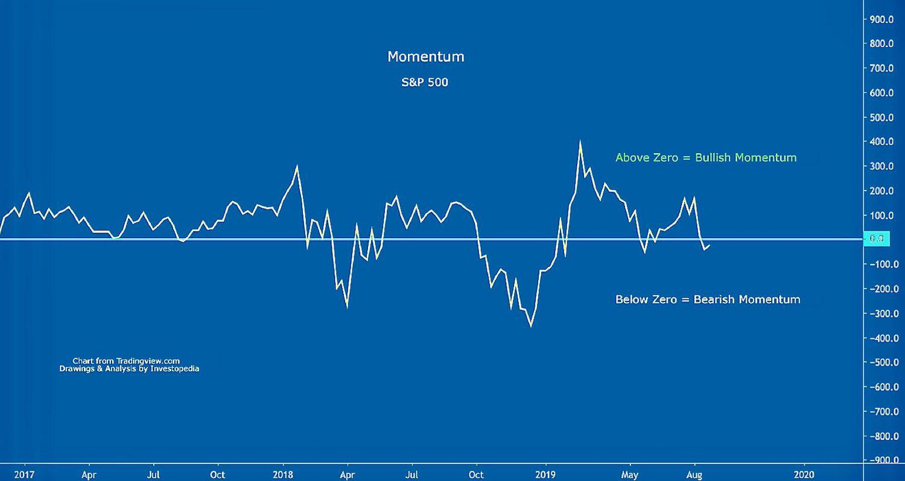

In the fast-paced world of financial markets, traders and investors constantly seek effective strategies to capitalize on opportunities and mitigate risks. One of the key concepts that traders rely on is market momentum, which refers to the strength or speed of a price movement. Understanding market momentum is essential as it provides critical insights into the market's direction and potential future trends, allowing investors to make more informed and timely decisions.

Market momentum is often tracked by analyzing various financial indicators such as moving averages, the Relative Strength Index (RSI), and the Moving Average Convergence Divergence (MACD). These indicators help traders gauge whether a stock or asset is overbought or oversold, offering signals for potential entry or exit points. Additionally, market momentum reflects broader economic factors and investor sentiment, thus playing a significant role in shaping trading strategies.



This article explores the intricacies of market momentum, various investment strategies rooted in momentum trading, and the increasingly popular practice of algorithmic trading. Momentum trading strategies, such as trend-following and mean-reversion, leverage these insights by positioning investments to benefit from ongoing price movements or reversals. The automation of trading through algorithms provides further opportunities to implement these strategies at scale, improving execution speed and efficiency.

Through this discussion, we will provide insights into how investors can harness momentum to make informed decisions in the financial markets. By understanding the mechanisms behind market momentum and how to apply algorithmic trading effectively, traders can gain a competitive edge in navigating the complexities of modern financial markets.

## Table of Contents

## Understanding Market Momentum

Market momentum is a fundamental concept that extends beyond the behavior of individual stocks, encapsulating the larger picture of overall market trends. It plays a critical role in identifying potential price movements, both upward and downward, thereby guiding traders and investors in formulating robust trading strategies.

Momentum is often quantified through the analysis of various indicators, including trading volume, technical signals, and historical price patterns. One of the core principles is that momentum can predict future market directions, which becomes a pivotal element in decision-making processes. When examining trading volume, for example, an increase in volume often signifies a strong momentum, either bullish or bearish, depending on the direction of the price move. High trading volume typically suggests a strong conviction behind the price movement, while lower volumes may indicate a lack of consensus among investors.

Technical indicators are another crucial aspect of evaluating market [momentum](/wiki/momentum). Indicators such as the Relative Strength Index (RSI), Moving Averages (MA), and Moving Average Convergence Divergence (MACD) provide valuable insights into the momentum of a security. The RSI helps determine whether a stock is overbought or oversold, typically using a scale of 0 to 100, with values above 70 suggesting overbought conditions and values below 30 indicating oversold conditions. 

The moving average calculations smooth out price data to identify trends over specific periods. For example, a simple moving average (SMA) of a stock can be calculated as follows:
$$
\text{SMA} = \frac{\sum_{i=1}^{n} P_i}{n}
$$
where $P_i$ represents the stock price at time $i$, and $n$ is the number of time periods.

Similarly, the MACD, which is the difference between the 26-period and 12-period exponential moving averages, also provides signals for momentum direction through crossovers and divergences from the signal line, which is often a 9-period moving average of the MACD itself.

Historical price patterns, such as trends, support and resistance levels, and chart formations, further contribute to momentum analysis. By recognizing patterns like head and shoulders or double tops, traders aim to project future price movements.

Investors utilize these momentum assessments to make informed decisions about buying and selling activities. The objective is to ride on sustained trends to capitalize on potential profits, buying in an uptrend with the anticipation that momentum will push prices higher, or selling in a downtrend before the momentum decreases, causing prices to drop further. This practice aligns with the 'trend is your friend' philosophy, encouraging investors to follow the path of least resistance.

## Investment Strategies Leveraging Market Momentum

Momentum trading is rooted in the notion that assets demonstrating strong market performance are likely to continue on the same trajectory. This approach leverages the psychological underpinnings of investor behavior, such as the tendency to follow trends and the belief in the predictability of momentum. At its core, momentum trading seeks to capitalize on the [volatility](/wiki/volatility-trading-strategies) and trending movements of asset prices, allowing traders and investors to potentially earn significant returns.

One commonly employed strategy in momentum trading is "buy high, sell higher." This principle hinges on acquiring assets exhibiting upward trends in the expectation that the positive momentum will persist, thus driving prices even higher. Identifying such trends often involves analyzing various technical indicators like the Moving Average Convergence Divergence (MACD), Relative Strength Index (RSI), or simple moving averages (SMA). These indicators provide insights into the market sentiment and help identify entry and [exit](/wiki/exit-strategy) points for investments.

Conversely, recognizing when an asset's momentum is decelerating can offer timely selling opportunities before a downturn occurs. For instance, if a stock exhibits a prolonged upward trend but begins to show signs of slowing momentum, it may be prudent for an investor to sell the position to secure profits before a potential reversal. This sell strategy is often paired with breakpoints in support or resistance levels, ensuring investors maximize gains while minimizing risk exposure.

Two fundamental strategies that leverage market momentum are trend-following and mean-reversion. 

Trend-following involves identifying and capitalizing on the sustained directionality of price movements. The strategy typically implements moving averages or trend lines to confirm price trends; when a security is trading consistently above its moving average, it may indicate a bullish trend worth following. The objective is to maintain the position in a rising market until signs of trend reversal become evident.

Mean-reversion, on the other hand, posits that prices and returns eventually move back toward their historical mean or average. This strategy is predicated on the belief that overbought or oversold conditions will correct themselves over time. Traders employing mean-reversion look for securities that deviate significantly from their average value, buying when the price is below the mean and selling when it exceeds it. A practical implementation involves Bollinger Bands, which measure price volatility and often signal reversion opportunities when prices touch the outer bands.

In the contemporary trading environment, these momentum-based strategies can be further enhanced using computational tools and algorithmic models, allowing traders to implement complex algorithms that continuously analyze market data to identify profitable trading opportunities. This methodological approach not only increases trading precision but also enables strategies to adapt to evolving market conditions effectively.

 to Algorithmic Trading

Algorithmic trading leverages sophisticated computer algorithms to execute trades automatically based on predetermined criteria. This technology-driven approach is designed to minimize human intervention, which can often lead to emotionally-driven and inconsistent decision-making. By doing so, [algorithmic trading](/wiki/algorithmic-trading) significantly enhances the speed and efficiency of executing trades in financial markets.

One of the core advantages of algorithmic trading is its ability to analyze vast amounts of market data quickly and accurately. Modern trading algorithms integrate complex data analytics, enabling them to evaluate market conditions in real-time. This rapid processing capability allows for timely trade execution, capturing market opportunities that might be missed by manual traders. Furthermore, by analyzing historical and current market data, these algorithms can detect patterns and trends that signify potential entry and exit points for trades.

Real-time monitoring is another crucial aspect of algorithmic trading systems. Continuous surveillance of market conditions ensures that algorithms can respond instantly to price movements or evolving market trends. This real-time responsiveness is essential in volatile markets where prices can change rapidly. The algorithms use triggers such as price thresholds, [volume](/wiki/volume-trading-strategy) levels, or other technical indicators to prompt trade execution, ensuring that strategies are systematically and consistently followed.

Risk management is integral to the design of algorithmic trading systems. Algorithms are typically embedded with risk management protocols to control exposure and maintain discipline. This includes setting stop-loss orders, position sizing, and adhering to predefined risk-reward ratios. By managing risk algorithmically, traders can limit potential losses and optimize the risk-return profile of their portfolios.

Moreover, one of the primary objectives of algorithmic trading is to exploit market inefficiencies. These inefficiencies arise when financial markets do not perfectly reflect all available information, leading to discrepancies between an asset's intrinsic value and its market price. Algorithms are programmed to identify and capitalize on these inefficiencies, often through strategies like [arbitrage](/wiki/arbitrage) or [trend following](/wiki/trend-following).

In addition to exploiting market inefficiencies, algorithmic trading ensures disciplined execution of trading strategies. By adhering strictly to the pre-set rules and parameters, algorithms eliminate the inconsistencies often associated with manual trading. This discipline helps traders avoid potential biases and emotional reactions to market fluctuations.

In conclusion, algorithmic trading represents a convergence of technology and finance, offering a systematic and efficient approach to trading in modern financial markets. By integrating data analysis, real-time monitoring, and robust risk management frameworks, algorithmic trading systems facilitate an objective and high-speed trading experience, aligning with the core goal of maximizing returns while minimizing risk.

## Algo Trading Strategies Based on Market Momentum

Incorporating momentum indicators into algorithmic trading can significantly enhance the precision and efficiency of trading strategies. Momentum-based algorithmic trading strategies utilize market data, such as price changes and trading volumes, to predict future price directions and execute trades accordingly. Three popular strategies in this domain include trend-following algorithms, momentum [scalping](/wiki/gamma-scalping), and [statistical arbitrage](/wiki/statistical-arbitrage).

Trend-following algorithms operate on the premise that assets that have been trending in a given direction will continue to do so. These algorithms identify and exploit persistent trends by using technical indicators such as moving averages, relative strength index (RSI), or the moving average convergence divergence (MACD). For instance, a simple moving average crossover strategy might involve executing a buy order when a short-term moving average crosses above a long-term moving average, signifying an upward trend.

Momentum scalping, another strategy, involves taking advantage of short-term price movements typically lasting seconds to minutes. Scalping algorithms leverage momentary price changes by executing high-frequency trades, gaining small profits that accumulate over numerous transactions. A scalping algorithm might use the momentum oscillator, a technical indicator measuring the velocity of price movements, to identify potential entry and exit points quickly.

Statistical arbitrage relies on mathematical models to identify price discrepancies between securities that should theoretically not exist. This strategy involves forming pairs of securities and monitoring their price movements to exploit deviations from statistically-normal pricing relationships. For example, assuming two historically correlated stocks diverge in price, a statistical arbitrage algorithm might short the overpriced stock while going long on the underpriced one, expecting prices to converge again.

Central to the success of these strategies is systematic [backtesting](/wiki/backtesting) with historical data. Backtesting enables traders to test the viability of algorithms under different market conditions, thus optimizing their performance. The process involves simulating trades over historical data to evaluate strategy outcomes, risk, and potential profitability. Python, with libraries such as Pandas, NumPy, and Backtrader, serves as a powerful tool for performing these analyses. Here is a simple code snippet to demonstrate backtesting a moving average crossover strategy using Python:

```python
import backtrader as bt

class SmaCross(bt.SignalStrategy):
    def __init__(self):
        ma1, ma2 = bt.ind.SMA(period=10), bt.ind.SMA(period=30)
        self.signal_add(bt.SIGNAL_LONG, ma1 - ma2)

cerebro = bt.Cerebro()
cerebro.addstrategy(SmaCross)
data = bt.feeds.YahooFinanceCSVData(dataname='data.csv')
cerebro.adddata(data)
cerebro.run()
cerebro.plot()
```

Data acquisition and the quality of data inputs critically influence the robustness of momentum-based algorithmic strategies. High-fidelity data—encompassing accurate historical prices, volumes, and even supplementary data like economic indicators—ensures that algorithms have the precise information needed to make informed decisions. High-frequency trading algorithms, in particular, require low-latency data to respond swiftly to market movements, underscoring the importance of investing in high-quality data sources and infrastructure.

Overall, the integration of momentum indicators and algorithmic trading provides traders with formidable tools to navigate financial markets. By systematically backtesting and employing high-quality data, traders can enhance the reliability and efficiency of their momentum-based strategies, adapting them to the complexities of ever-evolving market conditions.

## Challenges and Considerations in Momentum and Algorithmic Trading

Despite the potential for high returns, momentum and algorithmic trading come with inherent risks and challenges. These can affect profitability and strategy effectiveness in several ways.

First, overfitting strategies to historical data is a significant concern. While algorithm backtesting is crucial for determining the viability of a strategy, the danger lies in creating models that are excessively tailored to past data. Overfitting leads to a model that performs well on historical data but poorly on new, unseen data. This risk emphasizes the importance of using diverse data sets for training and incorporating robust validation techniques to ensure that models are generalizable.

Second, transaction costs and slippage can erode profits. Algorithmic trading often involves a high volume of trades, which incurs transaction fees that can accumulate quickly. Slippage, the difference between the expected price of a trade and the actual price, can also impact profitability, especially in fast-moving markets. Strategies must account for these costs to ensure that they do not offset potential gains. 

To calculate the impact of transaction costs and slippage, consider the following Python snippet that computes the adjusted profit of a trading strategy:

```python
def adjusted_profit(gross_profit, transaction_costs, slippage, num_trades):
    return gross_profit - (transaction_costs * num_trades) - (slippage * num_trades)

gross_profit = 10000  # hypothetical gross profit from trades
transaction_costs = 10  # cost per trade
slippage = 5  # slippage per trade
num_trades = 500

net_profit = adjusted_profit(gross_profit, transaction_costs, slippage, num_trades)
print(f"Net Profit: ${net_profit}")
```

Market volatility and unexpected events are additional risks that can destabilize momentum trends. High levels of volatility increase the uncertainty of price movements, making momentum strategies more challenging to execute effectively. Sudden market events, such as geopolitical upheavals or macroeconomic announcements, can cause rapid shifts in trends, requiring traders to adopt adaptive strategies that can respond to changing conditions dynamically.

Lastly, traders must consider regulatory and ethical issues related to high-frequency and automated trading practices. Regulatory bodies worldwide have rules that govern algorithmic trading to ensure market fairness and stability. These rules can include restrictions on order types, mandates for algorithm registration and testing, and limitations on high-frequency trading practices. Ethical considerations also arise concerning the impact of algorithmic trading on market [liquidity](/wiki/liquidity-risk-premium) and the potential for abuse, such as exploiting market inefficiencies without regard to broader market consequences.

In summary, while momentum and algorithmic trading offer attractive opportunities, they are accompanied by challenges such as overfitting, transaction costs, slippage, market volatility, and the need for compliance with regulatory frameworks. Traders must continuously refine their strategies and incorporate safeguards to mitigate these risks effectively.

## Conclusion

Harnessing market momentum through strategic investment and algorithmic trading offers traders substantial opportunities for achieving profitability in financial markets. The integration of momentum insights into trading frameworks allows investors to capitalize on strong price movements and adjust their strategies for optimum results.

Understanding how momentum influences market sentiment is key to leveraging these opportunities. Momentum can indicate the continuation or reversal of trends, informing traders about potential entry and exit points. Recognizing these patterns helps form a basis for decision-making, enabling traders to act with conviction when specific conditions are met.

Continuous evaluation and optimization of trading strategies are critical in adapting to the ever-changing market environment. As markets evolve, traders must assess the effectiveness of their models and algorithms, incorporating feedback from past performance to refine their approaches. This iterative process involves backtesting with historical data, adjusting parameters, and assessing the impact of transaction costs and liquidity on strategy profitability.

Technological advances are pivotal in enhancing the intersection of market momentum and algorithmic trading. High-speed data processing, [machine learning](/wiki/machine-learning) algorithms, and [artificial intelligence](/wiki/ai-artificial-intelligence) can provide traders with robust tools for analyzing complex datasets, executing trades swiftly, and minimizing human error. These innovations further empower traders to react dynamically to market signals, ensuring that they remain competitive.

As the financial landscape becomes increasingly digital, the relationship between market momentum and algorithmic trading will continue to evolve. This evolution will not only shape the strategies employed by traders but also influence broader market dynamics. By staying informed and adaptive, traders can harness the full potential of momentum signals for profitable trading decisions.

## References & Further Reading

[1]: J. Bergstra, R. Bardenet, Y. Bengio, & B. Kégl. (2011). ["Algorithms for Hyper-Parameter Optimization."](https://proceedings.neurips.cc/paper/2011/file/86e8f7ab32cfd12577bc2619bc635690-Paper.pdf) Advances in Neural Information Processing Systems 24.

[2]: ["Advances in Financial Machine Learning"](https://www.amazon.com/Advances-Financial-Machine-Learning-Marcos/dp/1119482089) by Marcos Lopez de Prado.

[3]: ["Evidence-Based Technical Analysis: Applying the Scientific Method and Statistical Inference to Trading Signals"](https://www.amazon.com/Evidence-Based-Technical-Analysis-Scientific-Statistical/dp/0470008741) by David Aronson.

[4]: ["Machine Learning for Algorithmic Trading"](https://github.com/PacktPublishing/Machine-Learning-for-Algorithmic-Trading-Second-Edition) by Stefan Jansen.

[5]: ["Quantitative Trading: How to Build Your Own Algorithmic Trading Business"](https://books.google.com/books/about/Quantitative_Trading.html?id=j70yEAAAQBAJ) by Ernest P. Chan.