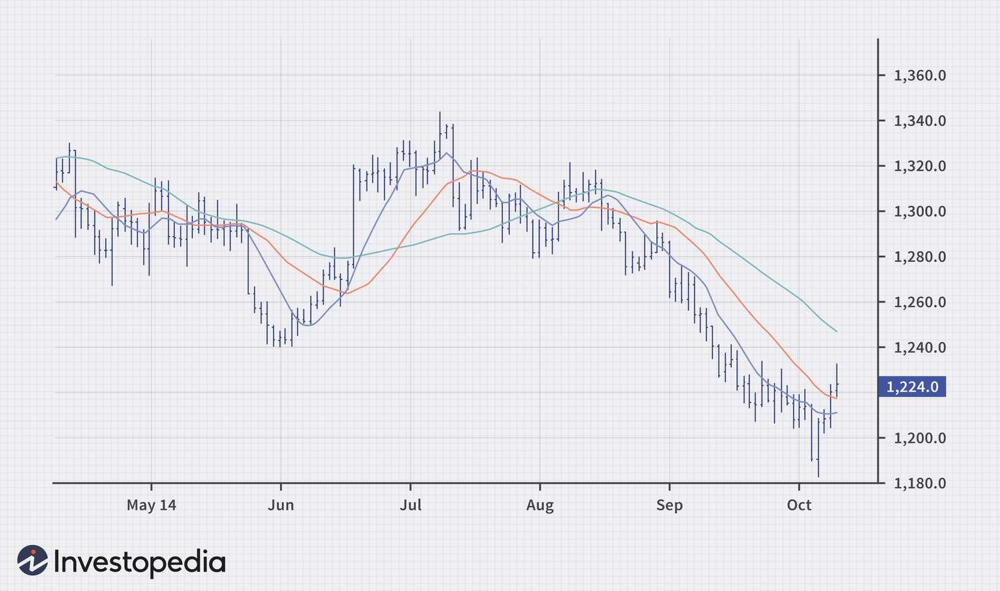

## Table of Contents

## What are commodities and why are they important in the market?

Commodities are basic goods that people use every day, like oil, gold, wheat, and coffee. They are traded on special markets where buyers and sellers come together to set prices. These markets are important because they help make sure that there is enough supply of these goods to meet the demand. For example, if there's a shortage of wheat, the price goes up, which encourages farmers to grow more wheat. This helps keep the supply and demand balanced.

Commodities are important in the market because they are the building blocks of the economy. Many industries rely on commodities to make their products. For instance, car manufacturers need steel, which comes from iron ore, and food companies need grains like wheat and corn. When the prices of commodities change, it can affect the cost of many other things. This is why people pay close attention to commodity markets. They can tell us a lot about the health of the economy and help businesses plan for the future.

## How do commodities influence the global economy?

Commodities play a big role in the global economy because they are used to make many things we use every day. When the prices of commodities like oil, gold, or wheat go up or down, it can affect the cost of goods all over the world. For example, if the price of oil goes up, it can make transportation more expensive, which can then make the price of food and other products go up too. This can lead to inflation, where the overall cost of living increases.

Countries that produce a lot of commodities can see their economies grow when prices are high. For instance, if a country has a lot of oil and the price of oil goes up, that country can make more money from selling oil. This can help their economy grow and create jobs. On the other hand, countries that need to buy a lot of commodities can struggle when prices are high. This can slow down their economy and make life harder for people who live there.

Overall, the prices and availability of commodities can cause big changes in the global economy. They can affect how much money countries make, how much people have to pay for things, and even how stable the world's economy is. That's why people who study the economy pay close attention to what's happening in commodity markets.

## What are the most common types of market-moving commodities?

The most common types of market-moving commodities are oil, natural gas, gold, and agricultural products like wheat and corn. Oil is very important because it's used for transportation and making many products. When the price of oil changes, it can affect the cost of everything from gas at the pump to the price of plastic. Natural gas is also important because many people use it to heat their homes and businesses use it to make electricity.

Gold is another big commodity because it's seen as a safe investment. When people are worried about the economy, they often buy gold, which can make its price go up. Agricultural products like wheat and corn are also important because they are used to make food. If there's a problem with the weather or if demand changes, it can affect the price of these commodities and the cost of food.

These commodities can move markets because they are used so much and because their prices can change a lot. When their prices go up or down, it can affect the economy in big ways. That's why people who study the economy watch these commodities closely.

## How do commodity prices affect inflation and interest rates?

Commodity prices can have a big impact on inflation. Inflation is when the prices of things we buy go up over time. When the prices of commodities like oil, gas, and food go up, it can make the cost of many other things go up too. For example, if oil prices rise, it can make transportation more expensive, which can then make the price of food and other goods go up. This can lead to higher inflation, which means people have to pay more for things they need.

Commodity prices can also affect interest rates. Interest rates are what banks charge people to borrow money. When commodity prices go up and cause inflation, central banks might raise interest rates to try to slow down the economy and bring inflation back down. Higher interest rates can make it more expensive for people and businesses to borrow money, which can slow down spending and help control inflation. So, when commodity prices change, it can lead to changes in interest rates, which can affect the whole economy.

## What role do futures and options play in commodity trading?

Futures and options are important tools in commodity trading. Futures are contracts that let people buy or sell a commodity at a certain price on a certain date in the future. This helps farmers, miners, and other producers know how much they will get for their goods, even if prices change later. It also helps buyers know how much they will have to pay. This can make trading more predictable and less risky for everyone involved.

Options are a bit different. They give people the right, but not the obligation, to buy or sell a commodity at a certain price before a certain date. This can be useful if someone wants to protect themselves from big price changes but still wants the chance to take advantage of good prices. For example, a farmer might buy an option to sell their wheat at a good price, but if the price goes up even more, they can choose not to use the option and sell at the higher price instead. Futures and options help make commodity markets work better by giving people more ways to manage risk and plan for the future.

## How can geopolitical events impact commodity prices?

Geopolitical events can have a big impact on commodity prices. These events can be things like wars, trade disputes, or changes in government policies. For example, if there is a war in a country that produces a lot of oil, it can make it hard to get oil out of that country. This can cause the price of oil to go up because there is less of it available. Another example is when countries put tariffs or taxes on goods from other countries. This can make those goods more expensive and affect the prices of commodities.

These events can also change how people think about the future. If there is a lot of uncertainty because of political problems, people might start to worry about the economy. They might buy more of certain commodities, like gold, because they see it as a safe investment. This can drive up the price of gold. On the other hand, if people are worried about a trade war, they might buy less of certain commodities, which can make their prices go down. So, geopolitical events can cause big changes in commodity prices by affecting both the supply and the demand.

## What are the key indicators to watch for predicting commodity price movements?

To predict how commodity prices might change, it's important to keep an eye on a few key indicators. One big indicator is supply and demand. If there's more of a commodity available than people want to buy, the price will usually go down. But if there's not enough of a commodity to meet the demand, the price will go up. Weather can also affect supply, especially for agricultural commodities like wheat and corn. If there's a drought or too much rain, it can hurt crops and make prices go up.

Another important indicator is the strength of the economy. When the economy is doing well, people and businesses tend to buy more, which can push commodity prices up. But if the economy is struggling, people might buy less, which can make prices go down. Also, watching currency values is helpful because many commodities are priced in U.S. dollars. If the dollar gets weaker, it can make commodities cheaper for people using other currencies, which might increase demand and push prices up.

Finally, geopolitical events and government policies can also give clues about where commodity prices might be headed. Wars, trade disputes, or new laws can change how much of a commodity is available or how much people want to buy. Keeping an eye on these events can help you understand what might happen to commodity prices in the future.

## How do supply and demand dynamics affect commodity markets?

Supply and demand are the main things that affect commodity markets. When there is a lot of a commodity available, but not many people want to buy it, the price goes down. This happens because sellers need to lower their prices to get people to buy their goods. On the other hand, when there is not enough of a commodity to meet the demand, the price goes up. This is because buyers are willing to pay more to get what they need, and sellers can charge more because people really want the commodity.

These dynamics can change because of many things. For example, if there is a good harvest, there will be more wheat available, which can make the price go down. But if there is a drought, the supply of wheat might go down, which can make the price go up. Also, if the economy is doing well, people might want to buy more commodities, which can push prices up. But if the economy is struggling, people might buy less, which can make prices go down. So, supply and demand are always changing and can affect commodity prices in big ways.

## What are the differences between hard and soft commodities?

Hard commodities are natural resources that are mined or extracted from the earth. They include things like oil, gold, and copper. These commodities are important because they are used to make many things we use every day. For example, oil is used to make gasoline for cars, and copper is used in electrical wiring. The prices of hard commodities can change a lot because they depend on things like how much is available and how hard it is to get them out of the ground.

Soft commodities are different because they are grown, not mined. They include things like wheat, corn, and coffee. These commodities are important because they are used to make food and other things we use every day. The prices of soft commodities can change because of things like the weather, which can affect how much is grown, and how much people want to buy. So, while hard and soft commodities are both important, they come from different places and can be affected by different things.

## How do technological advancements influence commodity production and pricing?

Technological advancements can change how commodities are made and how much they cost. New technology can help farmers grow more food or miners get more minerals out of the ground. For example, better farming tools can help grow more wheat on the same amount of land. This can make more wheat available, which can make the price go down. Also, new ways of finding and getting oil out of the ground can make more oil available, which can affect its price.

Technology can also make it cheaper to make commodities. If new machines or methods make it easier to produce things, it can cost less to make them. This can make the price of commodities go down because it costs less for companies to get them to people. But sometimes, new technology can make people want more of a commodity, which can make the price go up. For example, if a new phone needs a special kind of metal, the demand for that metal can go up, which can make its price go up too. So, technology can affect commodity prices in different ways.

## What strategies can investors use to hedge against commodity price volatility?

Investors can use different strategies to protect themselves from big changes in commodity prices. One common way is to use futures contracts. These are agreements to buy or sell a commodity at a certain price on a certain date in the future. By using futures, investors can lock in a price now, so they know what they will pay or get later, even if the price changes. This can help them avoid losing money if prices go down or make money if prices go up.

Another strategy is to use options. Options give investors the right, but not the obligation, to buy or sell a commodity at a certain price before a certain date. This can be useful because it lets investors protect themselves from big price drops but still take advantage of price increases. For example, if an investor thinks the price of oil might go down, they can buy an option to sell oil at today's price. If the price does go down, they can use the option to sell at the higher price. But if the price goes up, they can choose not to use the option and sell at the higher price instead.

Diversification is also a good way to manage risk. By investing in a mix of different commodities and other types of investments, like stocks and bonds, investors can spread out their risk. If the price of one commodity goes down, the other investments might help balance out the loss. This can make their overall investment less affected by changes in any one commodity's price.

## How do environmental policies and sustainability trends affect commodity markets?

Environmental policies and sustainability trends can change how much of a commodity is available and how much it costs. When governments make new rules to protect the environment, like limiting how much oil companies can drill or how much pollution factories can make, it can make it harder to produce certain commodities. This can make the supply go down, which can make prices go up. For example, if a country decides to cut down on coal use to fight climate change, the demand for coal might go down, but the price might go up if other countries still want to buy it. Also, if people start caring more about the environment, they might want to buy more green products, like electric cars that need special minerals, which can push up the demand and price for those commodities.

Sustainability trends can also change what people want to buy. As more people try to live in a way that is good for the planet, they might choose products made from sustainable materials. This can make the demand for certain commodities go up. For example, if more people start using biofuels instead of gasoline, the demand for corn and other crops used to make biofuels might go up, which can make their prices go up too. On the other hand, if people start buying less of commodities that are bad for the environment, like oil, the demand for those commodities might go down, which can make their prices go down. So, environmental policies and sustainability trends can affect commodity markets in big ways by changing both the supply and the demand.

## References & Further Reading

[1]: Bergstra, J., Bardenet, R., Bengio, Y., & Kégl, B. (2011). ["Algorithms for Hyper-Parameter Optimization."](https://dl.acm.org/doi/10.5555/2986459.2986743) Advances in Neural Information Processing Systems 24.

[2]: ["Advances in Financial Machine Learning"](https://www.amazon.com/Advances-Financial-Machine-Learning-Marcos/dp/1119482089) by Marcos Lopez de Prado

[3]: ["Evidence-Based Technical Analysis: Applying the Scientific Method and Statistical Inference to Trading Signals"](https://www.amazon.com/Evidence-Based-Technical-Analysis-Scientific-Statistical/dp/0470008741) by David Aronson

[4]: ["Machine Learning for Algorithmic Trading"](https://github.com/stefan-jansen/machine-learning-for-trading) by Stefan Jansen

[5]: ["Quantitative Trading: How to Build Your Own Algorithmic Trading Business"](https://www.amazon.com/Quantitative-Trading-Build-Algorithmic-Business/dp/1119800064) by Ernest P. Chan