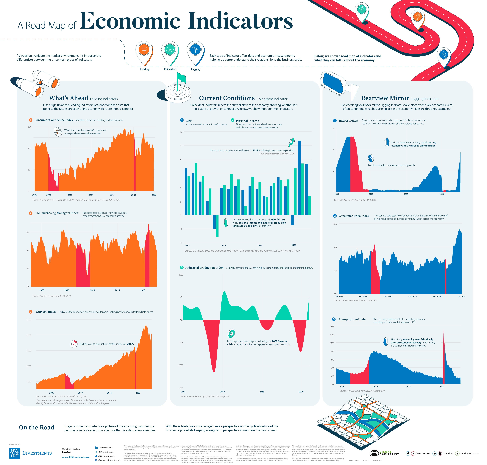

## Table of Contents

## What are economic indicators and why are they important?

Economic indicators are statistics that show how well a country's economy is doing. They can tell us things like how many people have jobs, how much stuff people are buying, and how fast prices are going up. Some common economic indicators are unemployment rates, inflation rates, and gross domestic product (GDP). These numbers help us understand if the economy is growing or shrinking, and if people are doing better or worse financially.

These indicators are important because they help people make decisions. For example, if the unemployment rate is low, it might be a good time for someone to start a business because more people have money to spend. Governments also use these indicators to decide on policies, like whether to raise or lower taxes, or to spend more money on things like roads and schools. By keeping an eye on economic indicators, everyone from regular people to big businesses and governments can plan better for the future.

## How do economic indicators influence financial markets?

Economic indicators can have a big impact on financial markets. When new data about the economy comes out, it can make stock prices go up or down. For example, if the unemployment rate goes down, it usually means more people have jobs and are spending money. This can make investors feel good about the economy, so they might buy more stocks, pushing stock prices higher. On the other hand, if inflation is going up too fast, it might worry investors because it can make things more expensive and slow down the economy. This could make them sell their stocks, causing prices to drop.

Central banks also pay close attention to economic indicators. If they see signs that the economy is growing too fast and might cause high inflation, they might raise interest rates to slow things down. Higher interest rates can make borrowing more expensive, which can cool down the economy and affect stock prices. If the economy is doing badly, central banks might lower interest rates to encourage borrowing and spending, which can help boost the economy and lift stock prices. So, economic indicators not only affect what investors do but also influence the decisions made by central banks, which in turn impact financial markets.

## What is the difference between leading, lagging, and coincident indicators?

Leading indicators are like early warnings. They give us clues about what might happen to the economy in the future. For example, if more people are applying for building permits, it might mean that construction will pick up soon, which can be a sign that the economy is going to grow. Stock market performance is another leading indicator because it often goes up before the economy starts to improve.

Lagging indicators, on the other hand, tell us what has already happened to the economy. They confirm trends after they've started. Unemployment rates are a good example of a lagging indicator. When the economy starts to get better, it takes a while for companies to start hiring more people, so the unemployment rate might stay high even after the economy has started to recover. Other lagging indicators include things like the cost of labor, which only goes up after the economy has been doing well for a while.

Coincident indicators happen at the same time as the economy changes. They give us a current picture of how the economy is doing right now. Personal income and industrial production are examples of coincident indicators. If personal income is going up, it means people are [earning](/wiki/earning-announcement) more money right now, which is a sign that the economy is doing well at that moment. These indicators are useful for understanding the current state of the economy but don't tell us much about the future or the past.

## Can you explain the significance of the Gross Domestic Product (GDP) as an economic indicator?

Gross Domestic Product, or GDP, is a big number that tells us how much all the goods and services produced in a country are worth in a certain time, like a year or a quarter. It's like adding up everything made and sold, from cars to haircuts, to see how big the economy is. GDP is important because it shows if the economy is growing or shrinking. If the GDP is going up, it usually means more people have jobs and are spending money, which is good for the economy. If it's going down, it might mean fewer people have jobs and are spending less, which can be a sign of trouble.

GDP also helps people compare how different countries are doing. For example, if one country's GDP is growing faster than another's, it might mean that country's economy is doing better. Governments and businesses use GDP to make decisions, like whether to build more roads or factories. It's not perfect though, because it doesn't tell us everything about how people are doing. For example, GDP might go up if a country sells more weapons, but that doesn't mean people's lives are getting better. Still, GDP is one of the most watched numbers to understand the health of an economy.

## How does the Consumer Price Index (CPI) affect market movements?

The Consumer Price Index, or CPI, is a number that tells us how much prices for things like food, gas, and rent are going up or down. When the CPI goes up, it means prices are rising, which is called inflation. If inflation is high, it can make investors worried. They might think that the money they have in the bank or in investments won't be worth as much in the future. This worry can make them sell their stocks or other investments, which can cause stock prices to go down.

On the other hand, if the CPI shows that prices are not going up very fast, or maybe even going down, it can make investors feel better. They might think their money will keep its value, so they might buy more stocks or other investments. This can push stock prices up. The CPI can also affect what central banks do. If they see that prices are rising too fast, they might raise interest rates to slow down spending and cool off the economy. Higher interest rates can make borrowing more expensive, which can also affect stock prices. So, the CPI is a big deal for financial markets because it gives a lot of clues about what might happen next.

## What role does the Unemployment Rate play in market analysis?

The Unemployment Rate is a big number that tells us how many people in a country don't have jobs but want to work. It's important for market analysis because it shows how healthy the economy is. If the Unemployment Rate goes down, it usually means more people have jobs and are earning money. This can make investors feel good about the economy because people with jobs are more likely to spend money on things like cars and houses. When investors feel good, they might buy more stocks, which can make stock prices go up.

On the other hand, if the Unemployment Rate goes up, it can worry investors. More people without jobs means less money being spent, which can slow down the economy. When investors are worried, they might sell their stocks, which can make stock prices go down. The Unemployment Rate also helps central banks decide what to do with interest rates. If unemployment is high, they might lower interest rates to make borrowing cheaper and encourage spending, which can help the economy and affect stock prices. So, the Unemployment Rate is a key number that investors watch closely to understand where the market might be heading.

## How do changes in the Producer Price Index (PPI) impact markets?

The Producer Price Index, or PPI, is a number that shows how much prices are changing for things that businesses sell to each other, like raw materials and goods before they reach stores. When the PPI goes up, it means these prices are rising, which can be a sign that inflation is coming. If businesses have to pay more for what they need, they might raise the prices of their products too. This can worry investors because higher prices can mean less spending by people, which can slow down the economy. When investors are worried, they might sell their stocks, which can make stock prices go down.

On the other hand, if the PPI stays steady or goes down, it can make investors feel better. They might think that inflation won't be a problem, so they might buy more stocks. This can push stock prices up. The PPI can also affect what central banks do. If they see that the PPI is going up a lot, they might raise interest rates to slow down spending and keep inflation in check. Higher interest rates can make borrowing more expensive, which can affect how businesses and people spend money, and in turn, impact stock prices. So, the PPI is an important number that investors watch to guess what might happen in the markets next.

## What is the importance of the Purchasing Managers' Index (PMI) in predicting economic trends?

The Purchasing Managers' Index, or PMI, is a number that tells us how businesses are doing. It's based on surveys of people who buy things for companies, like factories and stores. If the PMI is over 50, it means more businesses are growing than shrinking, which is a good sign for the economy. If it's under 50, it means more businesses are shrinking than growing, which can be a warning that the economy might slow down. The PMI is important because it can give us early clues about where the economy is headed before other numbers, like GDP, come out.

Investors and businesses watch the PMI closely because it helps them make decisions. If the PMI is going up, it might mean that companies will need to buy more stuff and hire more people soon. This can make investors feel good about the economy, so they might buy more stocks, which can push stock prices up. On the other hand, if the PMI is going down, it might mean that companies will buy less and maybe even lay off workers. This can worry investors, so they might sell their stocks, which can make stock prices go down. So, the PMI is a key number that helps everyone from regular people to big businesses and governments plan for the future.

## How do central bank interest rate decisions influence market-moving economic indicators?

Central bank [interest rate](/wiki/interest-rate-trading-strategies) decisions can have a big impact on economic indicators like GDP, unemployment, and inflation. When a central bank raises interest rates, it makes borrowing money more expensive. This can slow down spending and investment because people and businesses might not want to take out loans if they have to pay more interest. As a result, economic growth might slow down, which can show up in a lower GDP. Also, if businesses are not hiring as much because they're not growing, the unemployment rate might go up. On the other hand, higher interest rates can help keep inflation in check by making it more costly for businesses to borrow and spend, which can reduce the pressure on prices to go up.

When a central bank lowers interest rates, it's trying to do the opposite. Cheaper borrowing can encourage people and businesses to take out loans and spend more money. This can boost economic growth, which might show up as a higher GDP. With more spending, businesses might need to hire more workers, which can bring down the unemployment rate. Lower interest rates can also lead to higher inflation because more spending can push prices up. So, central bank interest rate decisions are a big deal for economic indicators because they can change how much people and businesses want to spend, which affects the whole economy.

## What advanced statistical methods are used to analyze the impact of economic indicators on markets?

To understand how economic indicators affect markets, experts use fancy math called advanced statistical methods. One common method is called regression analysis. This helps them see how much one thing, like the unemployment rate, might change stock prices. They can use simple regression to look at one indicator at a time or multiple regression to look at many indicators together. This way, they can see which indicators are most important and how they all work together to move the market.

Another method they use is time series analysis. This helps them see how economic indicators change over time and how these changes affect markets. They might use something called ARIMA models to predict future values of indicators like GDP or inflation, which can help them guess where the market might go next. They also use something called vector autoregression (VAR) to see how different indicators affect each other and the market at the same time. These methods help experts make better guesses about what might happen in the market based on the latest economic data.

## How can investors use economic indicators to develop trading strategies?

Investors can use economic indicators to make smart choices about when to buy or sell stocks. They look at numbers like the unemployment rate, GDP, and inflation to guess what might happen next in the market. For example, if the unemployment rate goes down, it might mean more people have jobs and are spending money, which can be good for the economy. Investors might see this as a sign to buy more stocks because they think the market will go up. On the other hand, if inflation is going up fast, it might worry investors because it can make things more expensive and slow down the economy. They might decide to sell some stocks because they think prices will go down.

Another way investors use economic indicators is by watching leading indicators like the PMI. If the PMI is going up, it might mean that businesses will need to buy more stuff and hire more people soon. This can make investors feel good about the future, so they might buy more stocks to get ready for the market to go up. Also, investors pay attention to what central banks do with interest rates. If interest rates go down, it can make borrowing cheaper and encourage spending, which might make investors think the market will do well. By keeping an eye on these indicators, investors can make better guesses about where the market might go and plan their trading strategies accordingly.

## What are some lesser-known economic indicators that can still significantly move markets?

Some lesser-known economic indicators that can still move markets a lot are the Baltic Dry Index and the Conference Board's Leading Economic Index (LEI). The Baltic Dry Index measures how much it costs to ship raw materials like coal and iron ore across the world's oceans. When this number goes up, it can mean that businesses are buying more stuff, which can be a good sign for the economy. If investors see the Baltic Dry Index going up, they might feel good about the future and buy more stocks, pushing prices higher. On the other hand, if it goes down, it might mean that businesses are buying less, which can worry investors and make them sell their stocks.

Another lesser-known indicator is the Conference Board's Leading Economic Index (LEI). This number is made up of ten different economic indicators, like how many new building permits are being issued and how long the average workweek is. If the LEI goes up, it can mean that the economy will get better soon. Investors might see this as a sign to buy more stocks because they think the market will go up. If the LEI goes down, it can be a warning that the economy might slow down, which can make investors worried and sell their stocks. So, even though these indicators are not as famous as GDP or unemployment, they can still have a big impact on the market.

## References & Further Reading

[1]: Bergstra, J., Bardenet, R., Bengio, Y., & Kégl, B. (2011). ["Algorithms for Hyper-Parameter Optimization."](https://papers.nips.cc/paper/4443-algorithms-for-hyper-parameter-optimization) Advances in Neural Information Processing Systems 24.

[2]: ["Advances in Financial Machine Learning"](https://www.amazon.com/Advances-Financial-Machine-Learning-Marcos/dp/1119482089) by Marcos Lopez de Prado

[3]: ["Evidence-Based Technical Analysis: Applying the Scientific Method and Statistical Inference to Trading Signals"](https://www.amazon.com/Evidence-Based-Technical-Analysis-Scientific-Statistical/dp/0470008741) by David Aronson

[4]: ["Machine Learning for Algorithmic Trading"](https://github.com/stefan-jansen/machine-learning-for-trading) by Stefan Jansen

[5]: ["Quantitative Trading: How to Build Your Own Algorithmic Trading Business"](https://www.amazon.com/Quantitative-Trading-Build-Algorithmic-Business/dp/1119800064) by Ernest P. Chan