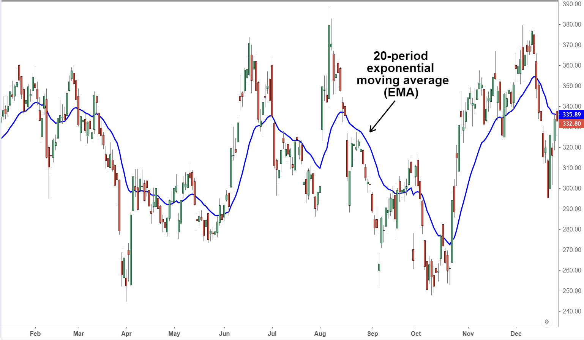

Understanding the complexities of financial markets is crucial for investors, traders, and economists seeking to make informed decisions and maximize returns. These markets, which include platforms for exchanging financial instruments like stocks, bonds, and commodities, are influenced by a myriad of factors that affect their dynamics and overall performance. Among these factors, economic indicators play a pivotal role. They serve as key metrics that offer insights into the health and direction of an economy, providing critical data that can be used to analyze and predict market movements. Such indicators include metrics like GDP, unemployment rates, and inflation data, which directly impact investor confidence and market trends.

With the rapid advancements in technology, algorithmic trading has emerged as a transformative force within these financial markets. Defined by the use of complex algorithms and high-speed computing, algorithmic trading has revolutionized the way transactions are executed. It allows for trades to be conducted with unprecedented speed and precision, minimizing human error and emotional bias. This technological innovation enables traders to analyze vast datasets, including economic indicators, to generate precise trading signals and implement strategies that are responsive to minute-by-minute changes in the market.



This article explores the interconnected roles of economic indicators, market movements, and algorithmic trading in shaping and defining the financial landscape. Understanding how these elements work together provides valuable insights into their impact on financial markets and enhances one's ability to navigate this complex environment strategically. As we dissect these interactions, it becomes evident that economic indicators fuel the algorithms driving market movements, offering a glimpse into how modern technology can be leveraged to gain competitive advantages in trading.

## Table of Contents

## Understanding Financial Markets

Financial markets function as pivotal platforms where buyers and sellers trade financial instruments such as stocks, bonds, derivatives, currencies, and commodities. These markets are integral components of the global economy and are categorized into various types, including stock markets, bond markets, forex markets, and commodities markets. Each type serves a distinct purpose, catering to different aspects of financial transactions and investment strategies.

Stock markets, such as the New York Stock Exchange (NYSE) and NASDAQ, are venues for the buying and selling of company shares. Bond markets allow for the trading of debt securities, crucial for public and private entities to raise capital. Forex markets encompass the trade of currencies, facilitating international trade and investment by allowing currency conversion. Lastly, commodities markets deal with raw and primary products like metals, energy, and agricultural goods.

The role of financial markets in the economy is manifold. They facilitate [capital raising](/wiki/hedge-fund-capital-raising) by providing companies and governments access to funding, thus promoting economic growth and development. These markets also offer liquidity, enabling investors to buy and sell securities with ease, which is essential for weighing investment risks and returns efficiently. Additionally, financial markets play a critical role in risk management by providing financial instruments that help in hedging risks.

Various factors influence the operations and dynamics of financial markets. Economic data, such as GDP growth rates, unemployment figures, and inflation reports, often dictate market sentiments and investor behavior. Geopolitical events, such as elections, policy changes, and international tensions, can result in market [volatility](/wiki/volatility-trading-strategies) and shifts in investment strategies. Company performance, reflected through earnings reports and business outlooks, directly impacts stock prices and investor confidence. Investor sentiment, shaped by psychological factors and market trends, further influences buying and selling decisions.

The interplay of these factors makes financial markets complex, requiring participants to be well-informed and strategically agile. The constant flow of information and the necessity for quick decision-making have led to the adoption of advanced technologies, such as [algorithmic trading](/wiki/algorithmic-trading), which further enhances market efficiency. Understanding these key aspects of financial markets is essential for investors, traders, and economists aiming to navigate and succeed in this intricate landscape.

## Economic Indicators and Their Impact on Market Movements

Economic indicators are essential tools for investors and economists to assess the state of the economy and predict future market performance. They provide comprehensive data that influences investment decisions and market sentiment. Key economic indicators include Gross Domestic Product (GDP), unemployment rates, inflation data, interest rates, and consumer confidence indices, each playing a distinct role in revealing various aspects of an economy's health and trajectory.

### Examples of Economic Indicators

**Gross Domestic Product (GDP):** GDP measures the total value of all goods and services produced over a specified period and is a primary indicator of economic health. A growing GDP indicates economic expansion, potentially leading to bullish markets, while a declining GDP suggests contraction and possible bearish trends.

**Unemployment Rates:** This metric measures the percentage of the labor force that is jobless and actively seeking employment. Rising unemployment can signal economic distress, leading to decreased consumer spending and caution among investors.

**Inflation Data:** Inflation represents the rate at which the general level of prices for goods and services rises, eroding purchasing power. Central banks closely monitor inflation to adjust monetary policies accordingly, thereby influencing interest rates and financial markets.

**Interest Rates:** These rates, particularly those set by central banks, are used to control monetary supply within an economy. Lower interest rates typically stimulate investment and spending, while higher rates may curtail borrowing and spending activities.

**Consumer Confidence Indices:** These indices measure the confidence level of consumers regarding the stability of their incomes and the overall economy. High consumer confidence usually translates to increased spending, driving market movements positively.

### How Traders and Investors Use Economic Indicators

Traders and investors utilize economic indicators to make informed decisions by analyzing trends and predicting shifts in market dynamics. For instance, an unexpected rise in unemployment rates might prompt investors to bearish stances as consumer spending is likely to fall. Conversely, a strong consumer confidence report could lead to bullish market behavior, spurring investments in growth-oriented assets.

### Relationship Between Economic Indicators and Market Movements

Economic indicators affect market movements in both the short-term and long-term. In the short term, immediate market reactions can occur following the release of key data due to adjustments in investor expectations and market sentiment. For example, a sudden announcement of lower-than-expected unemployment rates may lead to rapid stock market rallies.

In the long term, sustained trends observed in economic data guide investment strategies and portfolio allocations. Consistent GDP growth may lead to increased confidence in market stability and expansion opportunities, affecting long-term investment decisions.

### Case Studies

Numerous instances illustrate how economic data releases can lead to significant market shifts. For instance, the financial markets reacted sharply during the 2008 financial crisis when economic indicators, particularly those related to housing and credit, deteriorated rapidly. Another example is the market's response to pandemic-related data in 2020, where unemployment and consumer confidence indices played critical roles in shaping market perceptions and reactions.

Economic indicators thus serve as pivotal elements for interpreting economic conditions and influencing strategic market decisions. Their impact on financial markets underlines their vital role in the economic framework, guiding traders and investors through complex market environments.

## The Rise of Algorithmic Trading

Algorithmic trading, often referred to as "algo trading", is the process of using computer programs to execute financial trades with precision and speed. This practice originated in the late 20th century but has gained significant prominence in the 21st century due to advancements in technology and the proliferation of high-frequency trading. The history of algorithmic trading can be traced back to the introduction of digital trading systems in the 1970s and 1980s, which set the foundation for today's sophisticated trading algorithms.

The primary role of algorithms in financial markets is to execute trades at a pace and [volume](/wiki/volume-trading-strategy) that exceeds human capabilities. These algorithms process vast amounts of market data in real time, making rapid decisions to buy or sell financial instruments based on predefined criteria. This high-speed execution is crucial, especially in volatile markets where the timing of trades can significantly impact profitability.

Algorithmic trading harnesses massive datasets, including economic indicators, to generate trading signals. For example, an algorithm might be programmed to initiate a buy order if economic indicators point to an improving economy, such as a rise in Gross Domestic Product (GDP) or a drop in unemployment rates. The system analyzes historical and real-time data to identify patterns and correlations that inform these decisions.

One of the key benefits of algo trading is increased efficiency. Algorithms can process and act on information far quicker than human traders, leading to enhanced market [liquidity](/wiki/liquidity-risk-premium) and optimal pricing. Additionally, algorithms help to eliminate emotional bias from trading decisions. Unlike human traders, algorithms are not swayed by fear or greed, often leading to more rational trading outcomes. Moreover, cost-effectiveness is a significant advantage, as algorithmic trading reduces transaction costs by minimizing manual interventions.

Despite its advantages, algorithmic trading presents several challenges. The reliance on technology means that system failures can lead to substantial financial losses. Market risks are heightened by the potential for algorithms to magnify market volatility during periods of stress. Additionally, there are regulatory concerns, as authorities strive to ensure that high-frequency trading does not destabilize financial markets. Regulatory bodies often scrutinize the transparency and fairness of algorithmic systems to protect market participants.

In conclusion, algorithmic trading has revolutionized financial markets through its ability to execute rapid and precise trades while analyzing complex data sets. Its benefits are tempered by technological, market, and regulatory challenges that market participants must carefully navigate.

## Linking Economic Indicators, Market Movements, and Algo Trading

Financial markets, economic indicators, and algorithmic trading are inherently interconnected, forming a dynamic system where information flow and technological advancement drive investment decisions and market outcomes. These components collectively shape trading strategies, allowing market participants to forecast movements and capitalize on opportunities.

Economic indicators, such as gross domestic product (GDP), inflation rates, and consumer confidence indices, are vital [statistics](/wiki/bayesian-statistics) revealing an economy's health. In algorithmic trading, these indicators serve as critical inputs, influencing decisions and strategies. Algorithms, essentially mathematical models designed to execute trades based on pre-set criteria, rely heavily on economic data to make informed predictions. For instance, changes in interest rates often shift market sentiments and price movements, prompting algorithms to adjust their trading positions accordingly.

Python provides tools for integrating real-time economic data into trading strategies. Consider this simple example using the `pandas` library to simulate processing GDP data:

```python
import pandas as pd

# Simulated GDP data in a pandas DataFrame
data = {'Date': ['2023-01-01', '2023-04-01', '2023-07-01', '2023-10-01'],
        'GDP': [21000, 21500, 21300, 21800]}  # hypothetical quarterly GDP figures
df = pd.DataFrame(data)

# Defining a basic strategy: buy if GDP growth is positive compared to previous quarter
df['GDP_Growth'] = df['GDP'].pct_change()
df['Signal'] = df['GDP_Growth'].apply(lambda x: 'Buy' if x > 0 else 'Sell')
print(df)
```

In this example, the algorithm evaluates GDP growth, generating a buy signal if growth is positive. Similarly, advanced algorithms can incorporate diverse data sources—employment figures, inflation rates, or trade balances—to develop multifaceted trading strategies.

Algorithmic trading strategies, such as statistical [arbitrage](/wiki/arbitrage), often rely on economic indicators. Statistical arbitrage exploits temporary mispricings between related securities, with algorithms scanning market data to identify and act upon these opportunities. Economic releases, such as employment reports, can trigger price shifts, which algorithms leverage to execute trades efficiently.

Real-time economic data integration bestows a significant competitive edge, enhancing the speed and precision of trading decisions. Algorithms processing economic data instantaneously can outperform slower, human-driven strategies by reacting to market changes promptly. For example, sentiment analysis algorithms can parse news headlines for economic indicator mentions, adjusting strategies based on perceived market sentiment shifts.

Thus, the synergy between economic indicators, market movements, and algorithmic trading is vital: economic data fuels algorithms, driving refined, data-informed strategies that can react nimbly to market changes, offering a pronounced advantage in today's fast-paced financial environment.

## Future Trends and Innovations

Emerging trends in financial markets are poised to significantly influence trading practices in the near future. One pivotal area of transformation is algorithmic trading, driven by technological innovations such as [artificial intelligence](/wiki/ai-artificial-intelligence) (AI), [machine learning](/wiki/machine-learning) (ML), and big data analytics. These technologies enhance the ability of trading algorithms to process vast amounts of information, recognize patterns, and make data-driven decisions with remarkable speed and accuracy.

Artificial intelligence and machine learning are enabling algorithms to evolve from rigid rule-based systems to adaptive models that can learn and improve over time. Machine learning techniques, such as supervised and unsupervised learning, facilitate the recognition of complex patterns within financial data. For instance, [reinforcement learning](/wiki/reinforcement-learning), a subset of ML, allows algorithms to learn optimal trading strategies through trial and error, continuously refining their approach based on market feedback.

Python, as a versatile programming language, offers several libraries and frameworks for implementing AI and ML in trading systems. Libraries such as TensorFlow and PyTorch provide tools for building and training neural networks, which can be leveraged to predict market movements and optimize trading strategies based on economic indicators and other data inputs.

```python
import numpy as np
from sklearn.model_selection import train_test_split
from sklearn.ensemble import RandomForestRegressor
from sklearn.metrics import mean_squared_error

# Example: Predict future market movements based on historical data
# Load dataset (example data), assume 'X' as features and 'y' as target prices
X, y = np.random.rand(1000, 5), np.random.rand(1000)

# Split data into training and testing sets
X_train, X_test, y_train, y_test = train_test_split(X, y, test_size=0.2, random_state=42)

# Initialize and train the model
model = RandomForestRegressor(n_estimators=100, random_state=42)
model.fit(X_train, y_train)

# Predict and evaluate
predictions = model.predict(X_test)
mse = mean_squared_error(y_test, predictions)
print(f'Mean Squared Error: {mse}')
```

Big data analytics plays a crucial role in processing and analyzing the enormous volumes of data generated from financial markets, social media, news, and economic reports. These analytics enable the extraction of actionable insights, allowing traders to anticipate market trends and adapt to rapidly changing environments.

The future role of economic indicators is also evolving in this data-driven landscape. Traditional indicators like GDP or unemployment rates are being supplemented by [alternative data](/wiki/best-alternative-data) sources, including satellite imagery, web scraping, and sentiment analysis from social media platforms. These innovative data sources provide real-time insights into economic activities, offering a more nuanced picture of economic health that traders can exploit.

As technology continues to advance, the intertwining of economic indicators, market movements, and algorithmic trading is expected to deepen. Innovations in AI and big data will likely lead to more sophisticated trading algorithms capable of reacting to market changes almost instantaneously. Furthermore, the integration of real-time economic data will provide a competitive edge, enabling algorithms to optimize trading decisions dynamically.

In conclusion, the future of financial markets will be increasingly characterized by technological integration, with economic indicators serving as a vital component in sophisticated trading strategies. The continuous evolution of AI, ML, and data analytics promises to redefine how economic indicators influence market movements and reshape the fabric of algorithmic trading.

## Conclusion

Understanding financial markets, economic indicators, and algorithmic trading is crucial for anyone involved in investing or trading. These elements are foundational to comprehending how markets operate, the factors driving them, and the tools used to navigate them. Financial markets enable the transfer of risk, the allocation of resources, and the facilitation of transactions that drive economic growth. Economic indicators provide insights into the health of an economy, guiding investors' and policymakers' decisions.

Algorithmic trading, with its reliance on sophisticated algorithms and real-time data analysis, represents a transformative approach to trading. It brings efficiency and precision, enabling traders to make quick decisions based on the latest economic data and market conditions. However, it also introduces complexities and risks that necessitate diligent oversight and regulation.

Given the rapid pace of technological advancements and market transformations, continuous learning and adaptation are vital. The financial landscape is ever-changing, with new trends, innovations, and economic conditions regularly emerging. Those who keep up with these changes and adapt their strategies accordingly are better positioned to capitalize on opportunities while managing risks.

A strategic approach is essential when leveraging economic indicators and algorithmic trading to navigate market movements. It requires a thorough understanding of how these components interact and the ability to anticipate changes in market dynamics. By integrating a comprehensive strategy, stakeholders can effectively respond to market signals and maintain a competitive edge.

In conclusion, an in-depth grasp of financial markets, economic indicators, and algorithmic trading is imperative for successfully navigating the intricacies of today's financial world. Emphasizing continuous education and strategic planning will empower individuals and organizations to thrive amid the challenges and opportunities presented by the evolving economic landscape.

## References & Further Reading

[1]: Bergstra, J., Bardenet, R., Bengio, Y., & Kégl, B. (2011). ["Algorithms for Hyper-Parameter Optimization."](https://papers.nips.cc/paper/4443-algorithms-for-hyper-parameter-optimization) Advances in Neural Information Processing Systems 24.

[2]: ["Advances in Financial Machine Learning"](https://www.amazon.com/Advances-Financial-Machine-Learning-Marcos/dp/1119482089) by Marcos Lopez de Prado

[3]: ["Evidence-Based Technical Analysis: Applying the Scientific Method and Statistical Inference to Trading Signals"](https://www.amazon.com/Evidence-Based-Technical-Analysis-Scientific-Statistical/dp/0470008741) by David Aronson

[4]: ["Machine Learning for Algorithmic Trading"](https://github.com/stefan-jansen/machine-learning-for-trading) by Stefan Jansen

[5]: ["Quantitative Trading: How to Build Your Own Algorithmic Trading Business"](https://www.amazon.com/Quantitative-Trading-Build-Algorithmic-Business/dp/1119800064) by Ernest P. Chan