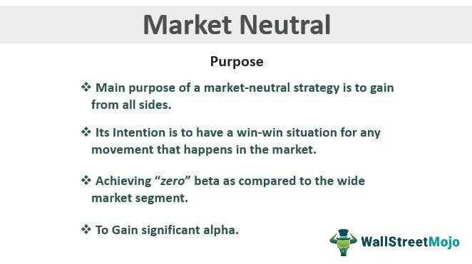

## Table of Contents

## What is a market neutral fund?

A market neutral fund is a type of investment fund that aims to make money no matter if the stock market goes up or down. It does this by balancing its investments so that the gains from some investments cancel out the losses from others. This is often done by buying some stocks and at the same time, selling short other stocks. Selling short means borrowing stocks, selling them, and then buying them back later, hopefully at a lower price, to return them to the lender.

The main goal of a market neutral fund is to reduce the risk that comes from overall market movements. By keeping the fund's exposure to the market at zero, the fund tries to focus on the performance of individual stocks rather than the market as a whole. This can be appealing to investors who want to avoid the ups and downs of the stock market but still want to try to earn a return on their investment. However, like all investments, market neutral funds come with their own risks and costs, so it's important for investors to understand these before investing.

## How does a market neutral fund aim to achieve its objectives?

A market neutral fund tries to make money no matter if the stock market goes up or down. It does this by carefully choosing which stocks to buy and which to sell short. Buying a stock means you think it will go up in value, so you want to own it. Selling short means you borrow a stock, sell it, and hope to buy it back later at a lower price. By doing both at the same time, the fund tries to balance out any losses from the stocks that go down with gains from the stocks that go up.

The main way a market neutral fund keeps itself balanced is by making sure its overall exposure to the market is zero. This means that if the whole stock market goes up or down, the fund should not be affected much. Instead, the fund focuses on how well individual stocks do compared to each other. This can help the fund earn a return without taking on the risk of the whole market moving. But, it's important to know that even though the fund tries to be neutral, there are still risks and costs involved.

## What are the key components of a market neutral fund?

A market neutral fund has a few main parts that help it work. The first part is the mix of stocks it buys and sells short. Buying stocks means the fund thinks those stocks will go up in value. Selling short means the fund borrows stocks, sells them, and hopes to buy them back later at a lower price. By doing both at the same time, the fund tries to balance out any losses from the stocks that go down with gains from the stocks that go up. This mix is very important because it helps the fund stay neutral to the overall market movements.

The second part is keeping the fund's exposure to the market at zero. This means the fund tries to make sure that if the whole stock market goes up or down, it won't affect the fund much. Instead, the fund focuses on how well individual stocks do compared to each other. This can help the fund earn a return without taking on the risk of the whole market moving. But, it's important to know that even though the fund tries to be neutral, there are still risks and costs involved, like the cost of borrowing stocks to sell short and the risk that the stocks the fund picks don't perform as expected.

## How do market neutral funds differ from traditional investment funds?

Market neutral funds and traditional investment funds work in different ways. Traditional investment funds, like mutual funds or index funds, usually aim to grow in value by investing in a bunch of stocks or other assets. They hope that the overall market will go up, which would make their investments go up too. This means they are affected a lot by what happens in the whole market. If the market goes up, they usually do well, but if the market goes down, they might lose money.

On the other hand, market neutral funds try to make money no matter what the market does. They do this by balancing their investments so that gains from some investments cancel out losses from others. This means they buy some stocks and at the same time, sell short other stocks. By doing this, they aim to keep their overall exposure to the market at zero. So, if the market goes up or down, it should not affect them much. They focus more on how well individual stocks do compared to each other, rather than the market as a whole.

## What are the common strategies used by market neutral funds?

Market neutral funds use a few main strategies to try to make money no matter what the market does. One common strategy is called pairs trading. This means the fund finds two stocks that usually move together in price. The fund then buys the stock it thinks will go up more and sells short the stock it thinks will go down more. By doing this, the fund hopes to make money from the difference in how the two stocks perform, even if the overall market stays the same.

Another strategy is statistical [arbitrage](/wiki/arbitrage). This is a bit more complicated, but it involves using computers to find small differences in stock prices that can be used to make money. The fund might buy and sell lots of different stocks very quickly, always trying to take advantage of these small differences. This strategy relies on having good technology and being able to act fast.

Lastly, some market neutral funds use a strategy called [factor](/wiki/factor-investing)-based investing. This means they look at different things, or "factors," that can affect how stocks do, like how big a company is or how much it grows. The fund then tries to balance its investments so that it is not affected too much by any one factor. This way, it can focus on making money from the stocks themselves, not from the overall market.

## Can you explain the concept of 'beta' in the context of market neutral funds?

In the world of investing, 'beta' is a measure that shows how much a stock or a fund moves with the overall market. If a stock has a beta of 1, it moves exactly with the market. If it has a beta higher than 1, it moves more than the market, and if it's less than 1, it moves less. For market neutral funds, the goal is to have a beta of zero. This means the fund tries to not move at all with the market, so it can focus on making money from the differences in how individual stocks perform.

Market neutral funds aim to achieve a beta of zero by balancing their investments. They do this by buying some stocks and selling short others at the same time. When they do this right, the gains from the stocks they buy should cancel out the losses from the stocks they sell short. This way, if the market goes up or down, the fund should stay steady because its beta is close to zero. But, it's not easy to keep a perfect zero beta, and there can still be risks and costs involved.

## What are the risks associated with investing in market neutral funds?

Investing in market neutral funds comes with its own set of risks. One big risk is that the fund might not be as neutral to the market as it tries to be. Even though the fund aims to have a beta of zero, it can be hard to keep it exactly at zero all the time. If the market moves a lot, the fund might still lose money if it's not perfectly balanced. Also, the fund has to pay to borrow stocks to sell short, and these costs can eat into the fund's profits.

Another risk is that the stocks the fund picks might not do what the fund expects. If the stocks the fund buys don't go up as much as expected, or the stocks it sells short don't go down, the fund can lose money. This risk is called stock-specific risk, and it's a big part of what market neutral funds have to deal with. Even though the fund tries to focus on the performance of individual stocks, it's hard to always pick the right ones.

Lastly, market neutral funds often use a lot of math and computers to make their decisions. This means they can be affected by things like computer errors or problems with the data they use. If something goes wrong with the technology, it can hurt the fund's performance. So, while market neutral funds try to avoid the ups and downs of the market, they still have to deal with these other kinds of risks.

## How do market neutral funds manage market risk?

Market neutral funds try to manage market risk by balancing their investments so that they don't move with the overall market. They do this by buying some stocks and selling short others at the same time. When they buy a stock, they think it will go up in value. When they sell short a stock, they borrow it, sell it, and hope to buy it back later at a lower price. By doing both at the same time, the fund tries to make sure that any losses from the stocks that go down are canceled out by gains from the stocks that go up. This way, if the whole stock market goes up or down, the fund should not be affected much.

Even though market neutral funds try to keep their overall exposure to the market at zero, it's not always easy. Sometimes, the market can move a lot, and if the fund isn't perfectly balanced, it might still lose money. Also, the fund has to pay to borrow stocks to sell short, and these costs can eat into the fund's profits. So, while market neutral funds work hard to manage market risk, there are still other risks they have to deal with, like the risk that the stocks they pick don't perform as expected or that there are problems with the technology they use to make their decisions.

## What performance metrics are crucial for evaluating market neutral funds?

When you want to see how well a market neutral fund is doing, you should look at a few important numbers. One key number is the fund's return. This tells you how much money the fund has made or lost over time. Since market neutral funds aim to make money no matter what the market does, you want to see if the fund is actually doing that. Another important number is the fund's beta. A market neutral fund tries to have a beta of zero, which means it should not move with the market. If the beta is close to zero, that's a good sign the fund is managing market risk well.

Another number to check is the fund's alpha. Alpha measures how much the fund's performance is due to the manager's skill rather than just following the market. A positive alpha means the fund is doing better than you would expect just from the market's movements. You also want to look at the fund's [volatility](/wiki/volatility-trading-strategies), which shows how much the fund's value goes up and down. Since market neutral funds try to be steady, you want to see if the fund's value stays pretty stable. Lastly, keep an eye on the fund's expenses and fees, because these can eat into the fund's returns.

## How do market neutral funds handle market volatility?

Market neutral funds try to handle market volatility by balancing their investments so they don't move with the overall market. They do this by buying some stocks and selling short others at the same time. When they buy a stock, they think it will go up in value. When they sell short a stock, they borrow it, sell it, and hope to buy it back later at a lower price. By doing both at the same time, the fund tries to make sure that any losses from the stocks that go down are canceled out by gains from the stocks that go up. This way, even if the market is going up and down a lot, the fund should stay pretty steady.

Even though market neutral funds work hard to stay steady during market volatility, it's not always easy. Sometimes, the market can move a lot, and if the fund isn't perfectly balanced, it might still lose money. Also, the fund has to pay to borrow stocks to sell short, and these costs can eat into the fund's profits. So, while market neutral funds try to handle market volatility well, there are still other risks they have to deal with, like the risk that the stocks they pick don't perform as expected or that there are problems with the technology they use to make their decisions.

## What is the role of leverage in market neutral fund strategies?

Leverage is like borrowing money to invest more than you have. Market neutral funds sometimes use leverage to try to make more money. They might borrow money to buy more stocks or to sell more stocks short. By doing this, they can increase their bets on the stocks they think will go up and the stocks they think will go down. This can make their potential profits bigger, but it also makes their potential losses bigger.

Using leverage can be risky. If the stocks the fund picks don't do well, the losses can be much larger because of the borrowed money. Also, borrowing money costs money, so the fund has to pay interest on the loans. This can eat into the fund's profits. So, while leverage can help market neutral funds try to make more money, it also adds more risk and costs.

## How can an investor incorporate market neutral funds into a diversified portfolio?

An investor can add market neutral funds to their diversified portfolio to help balance out the risk from other investments. Market neutral funds try to make money no matter if the stock market goes up or down. This means they can help keep your portfolio steady when other parts of it might be going up and down a lot. By including market neutral funds, you can reduce the overall risk of your portfolio because these funds don't move with the market. This can be especially helpful if you want to protect your investments from big market swings.

When you're thinking about adding market neutral funds to your portfolio, it's important to think about how much of your money you want to put into them. You might want to start with a small part of your portfolio, like 10% to 20%, to see how they work with your other investments. It's also a good idea to keep an eye on the fees and costs of market neutral funds, because these can affect your returns. By carefully choosing how much to invest in market neutral funds and keeping track of their performance, you can use them to help make your whole portfolio more stable and balanced.

## References & Further Reading

[1]: ["Statistical Arbitrage: Algorithmic Trading Insights and Techniques"](https://books.google.com/books/about/Statistical_Arbitrage.html?id=xSjXTnKqIKoC) by Andrew Pole

[2]: Lo, A. W. (2008). ["Hedge Funds: An Analytic Perspective"](https://www.jstor.org/stable/j.ctt7rq28) Princeton University Press.

[3]: Fletcher, J. (1997). ["An Examination of the Cross-Sectional Relationship of Beta and Return: UK Evidence."](https://www.sciencedirect.com/science/article/pii/S0148619597000064) The Journal of Economics, 42(3), 301-315.

[4]: Hasbrouck, J. (2003). ["Intraday Price Formation in U.S. Equity Markets"](https://onlinelibrary.wiley.com/doi/10.1046/j.1540-6261.2003.00609.x) The Journal of Finance, 58(6), 2375-2400.

[5]: ["The Man Who Solved the Market: How Jim Simons Launched the Quant Revolution"](https://www.amazon.com/Man-Who-Solved-Market-Revolution/dp/073521798X) by Gregory Zuckerman.