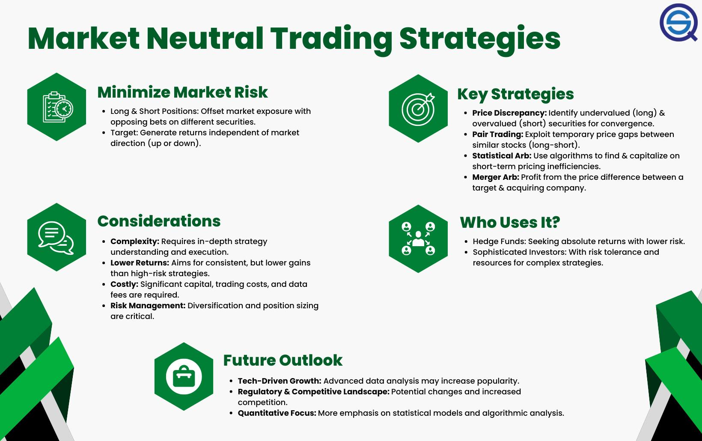

In the ever-evolving world of investing, strategies that minimize risk while maximizing returns are highly sought after. Traditional investment approaches often expose portfolios to market volatility, making it essential for investors to identify innovative strategies that maintain a balance between risk and reward. One such approach is the market neutral strategy, which stands out for its ability to mitigate exposure to market movements.

Market neutral strategies aim to generate returns by exploiting pricing inefficiencies rather than relying on market direction. By holding both long and short positions in equities, these strategies seek to balance the portfolio's delta to zero, effectively neutralizing systematic market risks. This approach ensures that the portfolio is less affected by market volatility and instead focuses on stock-specific movements.



Algorithmic trading plays a pivotal role in the implementation of market neutral strategies. With advanced algorithms, investors can analyze vast datasets in real-time and execute trades with precision and speed that manual methods cannot achieve. These algorithms are designed to autonomously detect and act on pricing discrepancies, which are often fleeting and require instantaneous reaction.

Risk management is another crucial component of successfully deploying market neutral strategies. The objective is to maintain stability and consistency across varying market conditions. By employing techniques such as diversification, proper position sizing, and the use of stop-loss orders, investors can manage potential risks effectively.

This article aims to provide valuable insights into making informed investment decisions with minimal exposure to market risks. By examining the underlying mechanics of market neutral strategies, the role of algorithmic trading, and effective risk management practices, investors can explore how to utilize these innovative methods to optimize their portfolio performance.

## Table of Contents

## Understanding Market Neutral Strategies

Market neutral strategies are designed to minimize the effects of market volatility by employing a balanced approach of long and short positions. This technique focuses on exploiting pricing inefficiencies rather than adhering to or predicting market trends. By maintaining a balanced exposure to market risks, investors can achieve returns independent of the overall market movement.

A fundamental aspect of market neutral strategies is the use of [arbitrage](/wiki/arbitrage), particularly fundamental and [statistical arbitrage](/wiki/statistical-arbitrage). Fundamental arbitrage involves taking long and short positions based on the intrinsic value of securities. Investors analyze financial statements, market conditions, and economic indicators to identify mispriced securities. For instance, if a stock is perceived to be undervalued based on its fundamentals, an investor might take a long position on that stock, while shorting a comparable security deemed overvalued.

In contrast, statistical arbitrage leverages quantitative techniques to identify pricing inefficiencies across securities. This approach typically involves sophisticated mathematical models and computational algorithms to analyze historical pricing data and predict future price movements. The key is to exploit temporary discrepancies in the prices of related assets. For example, if stocks A and B have historically moved together, but a temporary divergence occurs, traders might short-sell the outperforming stock while going long on the underperforming one.

The overarching goal of these strategies is to maintain a portfolio that is beta-neutral, meaning its return is uncorrelated with market-wide movements. This often involves adjusting the weights of the long and short positions such that the net market exposure is theoretically neutral. For example, if a portfolio has a beta of +0.5 and an equal dollar amount of shorts that have a beta of -0.5, the overall beta, or market exposure, would be zero.

Furthermore, by focusing on pairs trading or multi-asset portfolios, market neutral strategies can further optimize returns through portfolio diversification and systematic risk reduction. These strategies are bolstered by quantitative techniques like mean reversion and co-integration tests to ensure the positions stay appropriately hedged.

In conclusion, understanding market neutral strategies involves recognizing their core objective: to provide investors with returns that are largely independent of market direction. By concentrating on fundamental and statistical arbitrage, these strategies present a sophisticated approach to mitigating market [volatility](/wiki/volatility-trading-strategies) and capitalizing on price inefficiencies.

## Algorithmic Trading in Market Neutral Strategies

Algorithmic trading has revolutionized the execution of market neutral strategies by enabling investors to operate with unparalleled precision and speed. These strategies capitalize on market inefficiencies and aim to achieve consistent returns regardless of market direction, largely due to the capabilities of algorithmic systems.

Algorithms designed for market neutral strategies focus on identifying and leveraging pricing inefficiencies. They constantly scan the market for stocks or financial instruments that are mispriced relative to each other, which is a core concept underlying arbitrage opportunities. For instance, in a [pair trading](/wiki/pair-trading) strategy, an algorithm might identify two historically correlated stocks that have temporarily diverged in price, allowing it to short the outperforming stock while going long on the underperforming one until the historical pricing relationship is restored.

The power of algorithms in executing these strategies stems from their ability to conduct real-time data analysis and implement trading decisions autonomously. Utilizing high-frequency trading systems, algorithms can process vast amounts of market data in seconds, outpacing human traders. This speed is a critical advantage, as opportunities for arbitrage are often fleeting. Python-based libraries such as Pandas and NumPy are commonly used for data processing and analysis, while [machine learning](/wiki/machine-learning) frameworks such as TensorFlow and Scikit-learn empower traders to build predictive models that refine trading decisions.

Machine learning (ML) and [artificial intelligence](/wiki/ai-artificial-intelligence) (AI) significantly enhance the adaptability and efficiency of [algorithmic trading](/wiki/algorithmic-trading) models. Machine learning models can be trained on historical data to detect patterns and make predictions about future price movements, thus improving the accuracy of trades executed under market neutral strategies. Algorithms can adapt to changing market conditions by continuously learning from new data, a feature that is particularly beneficial in volatile or unpredictable markets. Reinforcement learning, a branch of ML, enables algorithms to learn a trading policy that maximizes some notion of cumulative reward, which aligns with the objectives of market-neutral strategies by actively minimizing risk while seeking return.

Moreover, AI techniques like natural language processing are employed to analyze unstructured data sources such as news articles or social media, further enhancing the predictive power of trading algorithms. By integrating sentiment analysis, algorithms can anticipate market movements influenced by investor sentiment, adding another layer of precision to trading strategies.

These advancements in algorithmic trading not only improve the execution of market neutral strategies but also pave the way for more sophisticated forms of trading that adaptively manage risk and optimize returns. As the field progresses, the integration of cutting-edge technologies is expected to continue transforming how these strategies are developed and deployed.

## Risk Management in Market Neutral Trading

Risk management is essential in market neutral trading to maintain effectiveness across various market conditions. It ensures that trading strategies can consistently navigate market turbulence while minimizing potential losses. Several techniques play a pivotal role in managing risks effectively, including diversification, position sizing, and stop-loss orders.

Diversification is a fundamental principle in risk management, aiming to spread investments across a wide array of assets to reduce exposure to any single asset or market event. By holding a diversified portfolio, traders can offset losses in one area with gains in another, thus stabilizing overall returns. In the context of market neutral strategies, diversification may involve balancing long and short positions across different stocks, industries, or asset classes to mitigate specific market risks.

Position sizing is another crucial technique in managing risk. It determines the amount of capital allocated to each trade, which is based on the trader's risk tolerance and the specific characteristics of the asset being traded. Proper position sizing involves calculating the optimal trade size that aligns with the overall risk management strategy while considering the volatility and potential drawdown of each asset. This can be achieved using formulas such as:

$$
\text{Position Size} = \frac{\text{Total Capital} \times \text{Risk Per Trade}}{\text{Stop Loss Distance} \times \text{Tick Value}}
$$

where `Total Capital` is the total amount available for trading, `Risk Per Trade` is the maximum acceptable loss for a single trade, `Stop Loss Distance` is the difference between entry price and stop-loss price, and `Tick Value` is the value of a one-tick move in the asset.

Stop-loss orders are used to limit potential losses by automatically triggering a sale when the price of an asset falls to a predetermined level. This mechanism helps protect against significant downturns by ensuring that losses are capped before they become substantial. Stop-loss orders are particularly useful in volatile markets where prices can change rapidly, preventing emotional decision-making and anchoring compliance with the predetermined risk thresholds.

The application of these risk management techniques in market neutral strategies contributes to a more disciplined trading approach. It enables traders to focus on optimizing returns from pricing inefficiencies rather than getting caught up in market fluctuations. By systematically managing risk, traders can improve the consistency and reliability of their trading outcomes, aligning them with long-term investment objectives. 

In summary, effective risk management in market neutral trading employs diversification, position sizing, and stop-loss orders to safeguard portfolios against adverse market movements. These techniques help traders maintain a balanced approach, supporting sustained performance in a dynamic and often unpredictable financial environment.

## Benefits and Challenges

Market neutral strategies are designed to deliver consistent returns by mitigating exposure to market-wide fluctuations. One of the primary benefits of such strategies is their ability to minimize market risk, which is achieved by taking both long and short positions. This balanced approach allows investors to profit from pricing inefficiencies rather than relying on overall market trends. By offsetting potential losses from long positions with gains from short positions (or vice versa), market neutral strategies can deliver stable returns even during periods of high volatility.

Beyond risk reduction, market neutral strategies can also provide diversification benefits. Since these strategies are less dependent on market direction, they can complement traditional directional investments in a portfolio. This can potentially enhance portfolio returns while simultaneously reducing overall risk.

However, the efficacy of market neutral strategies is not without its challenges. One significant hurdle is the high cost of implementation. Establishing such strategies often requires sophisticated technology, access to real-time data, and advanced analytical tools—all of which can be expensive and resource-intensive. Additionally, there are substantial operational and transaction costs associated with frequent trading and maintaining balanced positions.

Model risk presents another challenge. When market neutral strategies rely heavily on quantitative models and algorithmic executions, inaccuracies in these models can lead to significant losses. Financial markets often exhibit non-stationary and unpredictable behavior, making it difficult to capture all variables and factors in a model. Consequently, if a model’s assumptions or parameters are flawed, this can lead to incorrect trading signals and unanticipated risks.

Moreover, market neutral strategies might encounter [liquidity](/wiki/liquidity-risk-premium) risk, particularly when deploying large sums in a relatively small market segment. In times of market stress, it could become challenging to [exit](/wiki/exit-strategy) or enter positions without affecting prices adversely, leading to slippage and less optimal execution.

Despite these challenges, the potential for generating consistent returns while mitigating market risk makes market neutral strategies attractive to many investors. Yet, success in these strategies requires a careful balance of robust risk management practices, sophisticated quantitative skills, and substantial technological infrastructure. Investors should be mindful of both the benefits and pitfalls when considering integrating market neutral strategies into their investment portfolios.

## Implementation Challenges

Implementing market neutral strategies poses significant challenges, primarily due to the intricate requirements of data management and technology infrastructure. The essence of a market neutral approach is to maintain a balanced exposure to the market, often achieved through a combination of long and short positions. This requires complex calculations and real-time analysis, necessitating robust systems capable of handling vast amounts of data efficiently and accurately.

**Data Management**

Data management is foundational in implementing market neutral strategies. These strategies rely on high-frequency data feeds, historical data for [backtesting](/wiki/backtesting), and exhaustive real-time data for executing trades. The quality and timeliness of this data are paramount. Anomalies or delays in data can lead to incorrect decisions, impacting the performance of the strategy. Advanced data management systems are thus employed to collect, store, and process data efficiently.

Effective data management involves creating databases that are capable of rapidly ingesting market data, performing quick look-ups, and ensuring data integrity. Time series databases, such as kdb+ or InfluxDB, are often used for this purpose, given their ability to handle high-[volume](/wiki/volume-trading-strategy), time-stamped data efficiently.

**Technology Infrastructure**

The technology infrastructure supporting market neutral strategies must be both robust and flexible. It includes the hardware and software required to run complex algorithms and machine learning models that drive these strategies. High-performance computing resources are often needed to simulate and optimize strategies across numerous scenarios quickly.

Algorithmic trading platforms provide the computational power and speed necessary for executing trades in milliseconds, a critical requirement for capturing fleeting market opportunities. Additionally, cloud computing technology is increasingly being adopted to scale resources dynamically and reduce latency in processing.

**Human Expertise**

Despite the heavy reliance on technology and automation, human expertise remains crucial in implementing these strategies. Skilled quants and data scientists are needed to develop and refine algorithms. They ensure that models are adaptive and can incorporate new data effectively, adjusting to unforeseen market conditions that may impact the strategy’s performance.

**Case Studies: Citadel and Renaissance Technologies**

Citadel and Renaissance Technologies exemplify successful implementation of market neutral strategies through a combination of robust systems and top-tier expertise. Citadel's use of cutting-edge technology and comprehensive risk management frameworks allows it to implement complex trading strategies while mitigating potential pitfalls. Renaissance Technologies, known for its Medallion Fund, integrates deep mathematical expertise with technology infrastructure to harness data effectively. Their approach involves developing proprietary models that continuously evolve based on new data inputs, ensuring sustained performance.

In summary, the successful deployment of market neutral strategies demands a well-orchestrated combination of sophisticated data management practices, state-of-the-art technology infrastructure, and expert human input. These components collectively enable hedge funds like Citadel and Renaissance Technologies to navigate the complexities involved and achieve consistent returns.

## Future of Market Neutral Trading

As financial markets grow more sophisticated, the outlook for market neutral trading appears highly promising, driven by technological advancements and a greater emphasis on risk mitigation. This direction aligns with the demand for strategies that minimize market exposure while maximizing returns by capitalizing on inefficiencies. Several trends and innovations are expected to shape the future landscape of market neutral strategies.

**Technological Advancements**

The continued evolution of technology, notably in artificial intelligence (AI) and machine learning (ML), enhances the precision and efficiency of market neutral strategies. These technologies enable better prediction models and real-time data analysis, which are crucial for identifying and exploiting short-term price inefficiencies. Furthermore, advancements in computing power and data storage allow for the processing of vast amounts of financial data at unprecedented speeds, facilitating the development of more robust and adaptive algorithmic trading systems.

AI and ML models can analyze complex datasets to uncover patterns that traditional statistical methods might miss. For example, they can improve the accuracy of predictive modeling, leading to more effective implementation of strategies like statistical arbitrage. Python libraries such as TensorFlow and PyTorch offer powerful tools for developing these advanced models, allowing traders to code algorithms that learn and adapt over time.

```python
import numpy as np
from sklearn.ensemble import RandomForestRegressor

# Sample code for feature extraction and prediction using RF
def extract_features(data):
    # Assuming data is a Pandas DataFrame with time-series data
    features = data.diff().fillna(0).values
    return features

# Simulating feature data and target
features = extract_features(data)
target = data['target_variable'].values

# Initialize and train the model
model = RandomForestRegressor(n_estimators=100)
model.fit(features, target)

# Predict future values
predictions = model.predict(features)
```

**Increased Automation**

Automation plays a critical role in executing market neutral strategies. Advances in trading platforms and infrastructure facilitate the automatic execution of complex trades without human intervention. This not only reduces transaction costs but also minimizes the time lag between signal generation and trade execution, crucial in a strategy where speed often determines success.

**Focus on Risk Mitigation**

Growing awareness of risk management leads investors to seek strategies that not only promise returns but also safeguard against volatility. Market neutral strategies, with their core principle of balancing long and short positions, are inherently designed to hedge against market swings. Techniques such as diversification and dynamic portfolio rebalancing help maintain stability even in turbulent markets. With further advancements, the customization of these strategies to meet specific risk profiles is anticipated to increase.

**Regulatory and Ethical Considerations**

As market neutral strategies evolve, there is likely to be increased scrutiny from regulators to ensure these practices comply with ethical standards and financial regulations. Innovations that improve transparency and compliance, such as blockchain technology for secure and immutable transaction records, might become integral to market neutral trading systems.

**Sustainability and ESG Integration**

The integration of Environmental, Social, and Governance ([ESG](/wiki/esg-investing)) factors into investment strategies is gaining [momentum](/wiki/momentum), including in market neutral approaches. As investors increasingly prioritize sustainability, the development of market neutral strategies that incorporate ESG criteria is expected to grow, representing a shift towards conscientious investing.

In conclusion, the future of market neutral trading is poised for growth given the rapid pace of technological advancement and shifting market dynamics. As these strategies become more sophisticated and accessible, their adoption is likely to increase among institutional and retail investors alike. These trends and innovations point toward a dynamic evolution of market neutral trading, maximizing the potential for consistent returns with controlled risk exposure.

## Conclusion

Market neutral strategies represent a significant opportunity for investors aiming to balance risk and return effectively. These strategies provide a framework where the return is derived independently of market trends, focusing instead on minimizing exposure to market volatility. By offsetting long and short positions, the strategies aim to capitalize on pricing inefficiencies, making them an attractive choice for risk-averse investors searching for consistent returns.

Algorithmic trading represents a cornerstone for executing market neutral strategies successfully. The precision and speed offered by algorithmic systems enable investors to respond to market inefficiencies promptly, thereby increasing the chances of achieving the desired outcomes. Leveraging data-driven insights and sophisticated models, algorithms can autonomously conduct real-time analysis and make informed trading decisions. This capability is further enhanced by advancements in machine learning and artificial intelligence, which contribute to refining algorithmic models and improving their predictive accuracy.

To fully capitalize on the potential of market neutral strategies, investors must equip themselves with the necessary tools, resources, and expertise. Staying informed about the latest technological developments and evolving market conditions is crucial for adapting strategies effectively to maintain their effectiveness. Continuous learning and adaptation are vital in ensuring that these strategies remain relevant and lucrative over time.

In conclusion, market neutral strategies provide a compelling investment option by achieving a fine balance between risk and return. With the proper implementation of algorithmic trading tools and a commitment to adapting to the ever-changing financial landscape, investors can maximize the potential of these strategies and improve their investment outcomes.

## References & Further Reading

[1]: Bergstra, J., Bardenet, R., Bengio, Y., & Kégl, B. (2011). ["Algorithms for Hyper-Parameter Optimization."](https://dl.acm.org/doi/10.5555/2986459.2986743) Advances in Neural Information Processing Systems 24.

[2]: ["Advances in Financial Machine Learning"](https://www.amazon.com/Advances-Financial-Machine-Learning-Marcos/dp/1119482089) by Marcos Lopez de Prado

[3]: ["Evidence-Based Technical Analysis: Applying the Scientific Method and Statistical Inference to Trading Signals"](https://www.amazon.com/Evidence-Based-Technical-Analysis-Scientific-Statistical/dp/0470008741) by David Aronson

[4]: ["Machine Learning for Algorithmic Trading"](https://github.com/stefan-jansen/machine-learning-for-trading) by Stefan Jansen

[5]: ["Quantitative Trading: How to Build Your Own Algorithmic Trading Business"](https://github.com/LucindaYa/quant-resources/blob/master/Quantitative%20Trading%20How%20to%20Build%20Your%20Own%20Algorithmic%20Trading%20Business.pdf) by Ernest P. Chan