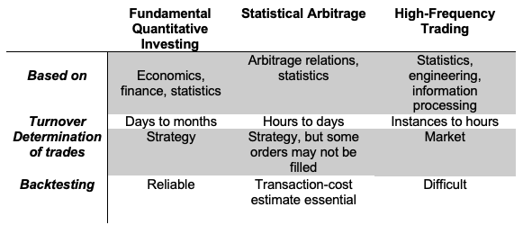

Market neutral strategies represent a sophisticated approach to investing, aiming to neutralize certain market risks by balancing investment positions. At its core, a market neutral strategy involves taking simultaneous long and short positions in different securities, with the objective of achieving a net market exposure of zero. This means that the strategy's overall performance is not directly tied to the market's movements, whether bullish or bearish.

In recent years, market neutral strategies have gained increasing popularity among investors seeking to mitigate market volatility and enhance risk-adjusted returns. The appeal of these strategies lies in their potential to generate consistent returns irrespective of the broader market's direction. This characteristic has become particularly valuable in the current market environment, characterized by heightened uncertainty and fluctuating conditions.

The growing interest in market neutral strategies can be attributed to several factors. Firstly, they offer an alternative to traditional investment approaches, which are often heavily reliant on market trends. Secondly, the advancement of financial technologies and analytics has made it easier for investors and fund managers to implement complex strategies that require balancing long and short positions effectively. Finally, in an era marked by rapid shifts in economic landscapes and investor sentiment, market neutral strategies provide a semblance of stability, aiming to deliver steady returns regardless of market conditions.

# Understanding Market Neutral Strategies

Market neutral strategies are designed to minimize exposure to general market movements, focusing instead on generating returns from the relative performance of different assets. The conceptual framework of these strategies is grounded in the idea of balancing investment positions to negate the influence of market fluctuations on the overall portfolio.

The fundamental principle of market neutral strategies involves taking both long and short positions in a way that the overall market exposure is brought to a near-zero state. This means, for every long position in a security or asset, there's a corresponding short position in a related asset. The goal here is to capitalize on the relative performance of these assets rather than betting on the direction of the market as a whole.

The purpose of achieving market neutrality is to isolate specific opportunities for returns while reducing the impact of broader market trends and systemic risks. By doing so, these strategies aim to generate positive returns regardless of whether the market is experiencing a bull or a bear phase. This approach is particularly appealing in volatile or uncertain market conditions, where traditional investment strategies might be at higher risk.

In essence, market neutral strategies strive for a balance that mitigates market risk. They seek to exploit pricing inefficiencies, valuation discrepancies, or performance differentials between related securities. This could involve pairs trading, where two correlated securities are simultaneously bought and sold, or arbitrage strategies that exploit price differences between related assets or markets.

The performance of market neutral strategies is typically assessed based on their alpha, or the returns generated above a benchmark that represents the market's performance. Since these strategies aim to be unaffected by market movements, their success is measured by their ability to consistently generate positive returns independent of overall market conditions.

# Types of Market Neutral Strategies

## Fundamental Arbitrage

Fundamental arbitrage is a cornerstone strategy within market neutral trading, hinging on discrepancies identified through fundamental analysis. This strategy involves taking positions in securities whose prices are believed to deviate significantly from their intrinsic value as determined by fundamental analysis.

In fundamental arbitrage, traders focus on the deep assessment of a company’s financial health, management quality, market position, and other economic factors. When a security is undervalued based on these factors, traders take a long position, expecting its price to rise to its perceived true value. Conversely, if a security is overvalued, traders take a short position, anticipating a price correction.

The key to success in fundamental arbitrage lies in the accuracy and depth of the fundamental analysis. This analysis typically encompasses a thorough examination of financial statements, market competition, industry health, economic indicators, and management effectiveness. Sophisticated investors may also incorporate ESG (Environmental, Social, and Governance) factors into their fundamental analysis, especially as these factors increasingly influence company valuation and investor perception.

A classic example of fundamental arbitrage is investing in a company with strong fundamentals (like solid earnings, low debt, and robust growth prospects) that is currently undervalued by the market, possibly due to temporary factors such as market sentiment or short-term setbacks. Simultaneously, a short position is taken in a company with weaker fundamentals that is overvalued by the market, perhaps due to hype or speculative interest.

The primary challenge in fundamental arbitrage is that markets can remain irrational longer than the trader can remain solvent. Therefore, a strong emphasis is placed on risk management and diversification to mitigate the impact of potential misjudgments or extended periods before the market corrects the mispricing. This approach also necessitates a medium to long-term investment horizon, as it may take significant time for the market to adjust and reflect the true fundamental values of the securities.

## Statistical Arbitrage

Statistical arbitrage, often referred to as StatArb, represents a sophisticated market neutral strategy that employs statistical and computational methods to identify and exploit pricing inefficiencies between securities. Rooted in probability and statistical models, this approach analyzes historical price relationships and patterns to forecast future price movements.

At its core, statistical arbitrage involves constructing a portfolio of long and short positions that are expected to be collectively market neutral. This is achieved by identifying pairs or groups of stocks whose prices have historically moved together and are likely to continue doing so. When the current price relationship between these securities deviates from the historical norm, traders capitalize on the expectation that prices will eventually revert to their long-term average, thus generating profit.

The process typically involves complex algorithms and quantitative models, such as mean reversion, cointegration, and machine learning techniques, to analyze vast datasets and identify trading opportunities. These models consider a range of factors, including historical price data, trading volumes, and, increasingly, alternative data sources like social media sentiment.

One common method within statistical arbitrage is pairs trading, where two historically correlated stocks are monitored. When the spread between their prices widens beyond a certain threshold, the trader would short the outperforming stock and go long on the underperforming one, betting on the spread narrowing again.

Statistical arbitrage strategies can vary in their holding periods, ranging from ultra-short-term (intraday) to medium-term. These strategies require sophisticated technology infrastructure for real-time data processing and execution, as well as rigorous backtesting to validate the models before deployment.

However, statistical arbitrage is not without risks. Key challenges include model risk (the risk that the statistical model used might be flawed) and execution risk (the risk that trades may not be executed at the anticipated prices). Additionally, these strategies are sensitive to changes in market conditions that could disrupt historical price relationships. As such, continuous monitoring and adjustment of models are essential components of successful statistical arbitrage trading.

## Delta Neutral Options Strategies

Delta neutral options strategies are a sophisticated approach within the realm of market neutral trading, primarily focusing on options trading. These strategies aim to offset positive and negative deltas—meaning the sensitivity of an option's price to a $1 change in the underlying asset—so that the overall delta of the assets in question is as close to zero as possible. This neutralizes or minimizes the directional risk associated with price movements of the underlying asset.

In a delta neutral strategy, traders combine options and possibly the underlying stock to ensure that the total delta of the positions is neutralized. For instance, if a trader holds a position that is positive delta (indicating long exposure), they might sell options on the same underlying asset that are negative delta (indicating short exposure) to balance out the total exposure.

One common method to achieve delta neutrality is through options spreads. This could involve creating a position with multiple options (such as a combination of calls and puts) that offset each other. Another method is to dynamically adjust positions in response to market movements, a process known as delta hedging. In delta hedging, traders frequently adjust their holdings of the underlying asset or options to maintain delta neutrality as market conditions change.

Delta neutral strategies are often used by traders seeking to profit from other aspects of options pricing, such as changes in volatility or the passage of time, rather than directional price movements. For example, a trader might use a delta neutral strategy to capitalize on a predicted increase in volatility while remaining indifferent to whether the underlying asset's price rises or falls.

It's important to note that maintaining a delta neutral position requires constant monitoring and rebalancing, especially in volatile markets where the delta of an options position can change rapidly. Additionally, these strategies typically involve complex calculations and a deep understanding of options pricing models.

Overall, delta neutral options strategies offer a way to isolate specific risk factors and profit from them, while seeking to minimize exposure to directional market movements. They are a key tool in the arsenal of advanced traders who specialize in options and volatility trading.

## Pairs Trading

Pairs trading is a quintessential market neutral strategy that involves simultaneously taking opposing positions in two highly correlated securities. The essence of this approach is to capitalize on the relative performance of the pair rather than the direction of the market as a whole.

In pairs trading, two securities that historically move together are identified. These could be stocks in the same industry, stocks of companies with similar financial metrics, or any other pairs where a strong correlation in price movement has been established. The strategy kicks in when there's a divergence in this correlation.

For instance, if one stock in the pair underperforms while the other outperforms, a trader would go long on the underperforming stock (buying it with the expectation that it will rise) and short the outperforming stock (selling it with the expectation that its price will fall). The premise is that the prices will eventually converge again, returning to their historical relationship. When this convergence occurs, the trader profits from the narrowing of the spread between the two securities.

Pairs trading is grounded in statistical and quantitative analysis. Traders use historical data to identify pairs and determine the right timing for entering and exiting trades. The success of the strategy hinges on accurate identification of pairs and precise timing. It requires continuous monitoring and rebalancing of the positions to maintain the market neutrality of the portfolio.

This strategy is attractive because it is designed to be unaffected by the overall direction of the market. Whether the market is going up, down, or sideways, pairs trading seeks to exploit the relative movement of two securities against each other. However, it is not without risks. A key risk is the breakdown of the historical price relationship due to fundamental changes in one or both companies or their industries. Additionally, transaction costs can be higher due to the need for frequent rebalancing.

Pairs trading fits well within the broader umbrella of market neutral strategies as it aims to profit from the convergence of mispriced assets while maintaining a neutral exposure to broader market movements.

# Advantages and Disadvantages

## Benefits

The use of market neutral strategies offers several compelling advantages, particularly in their ability to mitigate market risk. These strategies are designed to be less dependent on the general direction of the stock market, which can be particularly beneficial in times of increased volatility or uncertainty. Here are some key benefits:

**Reduced Market Risk:** One of the primary advantages of market neutral strategies is their inherent design to minimize exposure to broad market movements. By balancing long and short positions, these strategies aim to neutralize the impact of market swings, allowing investors to potentially earn steady returns regardless of whether the market is trending upwards or downwards.

**Diversification Benefits:** Market neutral strategies provide an additional layer of diversification to an investment portfolio. Because these strategies typically exhibit low correlation with conventional stock and bond investments, they can help reduce overall portfolio volatility and improve risk-adjusted returns.

**Exploiting Inefficiencies:** These strategies thrive on exploiting market inefficiencies, which can be independent of market trends. Whether it’s through pairs trading, statistical arbitrage, or fundamental analysis discrepancies, market neutral strategies aim to capitalize on mispriced securities, offering profit opportunities even in flat or declining markets.

**Focus on Relative Value:** Market neutral strategies are often focused on the relative value rather than absolute value, which can lead to gains through careful pair selection and timing. This relative-value approach allows traders to profit from the performance differential between two related securities, irrespective of the broader market's performance.

**Potential for Consistent Returns:** By reducing dependency on market directions, market neutral strategies can potentially offer more consistent returns compared to traditional long-only strategies. This consistency can be especially appealing to risk-averse investors or those looking for stability in turbulent market environments.

**Flexibility and Adaptability:** Market neutral strategies can be adapted to various market conditions and sectors, providing flexibility to the investor. This adaptability allows for strategic shifts in response to changing market dynamics, maintaining the neutrality and balance of the portfolio.

In summary, market neutral strategies offer a unique approach to investing, characterized by reduced market risk, diversification benefits, and the potential for consistent returns. These strategies can be an attractive option for investors seeking to mitigate risks associated with market volatility and to exploit inefficiencies in pricing between correlated or related securities.

## Limitations

While market neutral strategies offer distinct advantages, particularly in risk reduction, they also come with certain limitations and downsides that investors must consider. Understanding these challenges is crucial for anyone looking to implement these strategies effectively.

**Complexity and Execution Challenges:** Market neutral strategies, especially those involving sophisticated approaches like statistical arbitrage, can be complex to understand and execute. They often require advanced quantitative models and continuous adjustments to maintain market neutrality. This complexity can be a barrier for individual investors or smaller institutions without the necessary resources or expertise.

**Dependency on Model Accuracy:** Many market neutral strategies rely heavily on mathematical models to identify and exploit market inefficiencies. The effectiveness of these strategies is directly tied to the accuracy of these models. Any flaws in the model or the underlying assumptions can lead to significant risks and potential losses.

**Costs and Fees:** The execution of market neutral strategies often involves frequent buying and selling of securities, which can lead to higher transaction costs and fees. These costs can eat into the profits, especially in strategies like pairs trading, where positions need regular rebalancing to maintain neutrality.

**Limited Upside Potential:** Since market neutral strategies focus on relative gains rather than betting on market movements, their profit potential can be limited compared to traditional long-only strategies in a strong bull market. Investors might miss out on significant market gains during periods of robust market performance.

**Risk of Divergence:** In strategies like pairs trading, there’s always a risk that the historical relationship between the paired securities might change due to fundamental shifts in the market or the companies involved. Such divergence can lead to losses if the expected reversion to the mean does not occur.

**Exposure to Specific Risks:** While market neutral strategies aim to hedge against market risk, they can still be exposed to specific risks such as liquidity risk, operational risk, and model risk. For instance, during times of market stress, the liquidity of certain positions could decrease, making it difficult to execute trades at favorable prices.

**Challenges in Backtesting:** Backtesting market neutral strategies can be challenging due to the dynamic nature of markets and the complexity of these strategies. Past performance may not always be a reliable indicator of future results, and backtested strategies can fail to account for real-world factors such as market impact and transaction costs.

In summary, while market neutral strategies provide a means to generate returns irrespective of market direction, they come with their own set of challenges. The complexity, reliance on accurate models, costs, limited upside potential, risk of divergence, specific risk exposures, and backtesting challenges are key limitations that investors should consider when exploring these strategies.

# Market Neutral vs. Beta Neutral

Understanding the distinction between market neutral and beta neutral strategies is crucial for investors navigating the complex landscape of hedging techniques and portfolio management. While these strategies share the common goal of reducing market risk, they differ in their approach and execution.

**Market Neutral Strategies**

Market neutral strategies aim to completely offset market risk by balancing long and short positions in a portfolio. The objective is to achieve a net market exposure close to zero. This is typically done by identifying pairs of correlated securities, where one is undervalued and the other overvalued. The strategy profits from the convergence of the mispricing, irrespective of the market's overall direction. Market neutrality is achieved by the equal weighting of long and short positions.

**Beta Neutral Strategies**

Beta neutral strategies, on the other hand, focus on neutralizing the portfolio's sensitivity to market movements, measured by the beta coefficient. Beta represents the tendency of a security's returns to respond to swings in the market. A beta neutral strategy aims to balance the portfolio in such a way that its overall beta is zero. This involves adjusting the weight and beta of the securities in the portfolio so that the bullish positions offset the bearish ones in terms of market sensitivity.

Both strategies share the common goal of hedging against market risk and aim to deliver positive returns regardless of market conditions. They both involve sophisticated techniques and require careful selection and balancing of securities in the portfolio.

The fundamental difference lies in their focus and measurement. Market neutral strategies balance the actual dollar value of long and short positions, whereas beta neutral strategies balance the market risk (beta) of these positions. Market neutral seeks absolute neutrality in market exposure, while beta neutral aims for neutrality in market sensitivity.

In practice, the choice between market neutral and beta neutral strategies depends on the investor's objectives and market outlook. Market neutral strategies are often favored in stable markets with clear valuation discrepancies, while beta neutral strategies might be preferred in more volatile markets where beta can be a more significant risk factor.

# Market Neutral Funds

Market neutral funds are a type of investment fund that seeks to provide returns independent of the overall market movements. These funds operate by employing market neutral strategies, aiming to balance exposure to market risks and generate consistent returns regardless of market conditions.

## Overview of Market Neutral Funds

Market neutral funds typically implement strategies such as pairs trading, statistical arbitrage, or fundamental analysis discrepancies. These strategies involve taking long and short positions in equities, derivatives, or other securities to create a balanced portfolio that is neutral to market movements.

A key feature of these funds is their strong emphasis on risk management. By maintaining a market neutral position, they aim to reduce the impact of market volatility on the fund’s performance.

These funds often invest across a wide range of securities and sectors. This diversification is part of their risk management strategy and helps in achieving neutrality in the portfolio.

Market neutral funds are appealing to investors who seek steady returns irrespective of market trends. They are particularly attractive during periods of high market uncertainty or bear markets.

## Performance Analysis of Market Neutral Funds

Market neutral funds are evaluated based on their ability to achieve consistent returns with low volatility. The performance of these funds can vary depending on the effectiveness of the strategies implemented and the management team's expertise. Some well-known market neutral funds have shown the ability to provide steady, positive returns even during market downturns. However, it's important to note that:

- While market neutral funds aim for consistency, their returns are often lower compared to traditional equity funds during bull markets. Their strength lies in their ability to protect capital during downturns.
- These funds often have higher fee structures due to the complexity of the strategies employed and the active management required.
- Performance is typically benchmarked against a risk-free rate, like the return on Treasury bills, rather than stock market indices, given their market-neutral approach.
- Historical data shows that market neutral funds have varied in their success, with some consistently outperforming the market and others struggling to achieve their target returns.

In summary, market neutral funds represent an innovative approach to investing, seeking to provide investors with stable returns irrespective of market conditions. Their performance is a testament to the efficacy of market neutral strategies in achieving balance and mitigating risk. However, like all investment strategies, they have their unique set of challenges and should be evaluated carefully in the context of an investor’s overall portfolio and risk tolerance.

# Conclusion

Market neutral strategies represent a sophisticated approach to investing, offering a way to navigate the complexities of financial markets while aiming to minimize exposure to broad market movements. These strategies, encompassing fundamental arbitrage, statistical arbitrage, delta neutral options, and pairs trading, provide investors with diverse tools to achieve market neutrality.

The core advantage of market neutral strategies lies in their capacity to reduce market risk. By balancing long and short positions, these strategies strive to generate returns independent of market direction, making them particularly attractive in volatile or uncertain market environments. However, they also come with limitations, including complexity in execution, reliance on model accuracy, and potential regulatory challenges.

💡 **Read more:**

- Trading strategies papers with code on [Equities](https://wiki.paperswithbacktest.com/trading-strategies/equities), [Cryptocurrencies](https://wiki.paperswithbacktest.com/trading-strategies/cryptocurrencies), [Commodities](https://wiki.paperswithbacktest.com/trading-strategies/commodities), [Currencies](https://wiki.paperswithbacktest.com/trading-strategies/currencies), [Bonds](https://wiki.paperswithbacktest.com/trading-strategies/bonds), [Options](https://wiki.paperswithbacktest.com/trading-strategies/options)
- [A curated list](https://github.com/paperswithbacktest/awesome-systematic-trading) of awesome libraries, packages, strategies, books, blogs, and tutorials for systematic trading
- [A bunch of datasets](https://huggingface.co/paperswithbacktest) for quantitative trading
- [A website to help you](https://paperswithbacktest.com/) become a quant trader and achieve financial independence

# References & Further Reading

- ["Market Neutral Investing: Long/Short Hedge Fund Strategies"](https://www.amazon.com/Market-Neutral-Investing-Short-Hedge-Strategies/dp/1576600378) by Joseph G. Nicholas.
- ["Quantitative Financial Analytics: The Path to Investment Profits"](https://www.amazon.com/Quantitative-Financial-Analytics-Investment-Profits/dp/9813224258) by Kenneth L. Grant.
- ["Pairs Trading: Quantitative Methods and Analysis"](https://www.amazon.com/Pairs-Trading-Quantitative-Vidyamurthy-2004-08-30/dp/B01JXRQC0C) by Ganapathy Vidyamurthy.
- ["The Handbook of Equity Market Anomalies: Translating Market Inefficiencies into Effective Investment Strategies"](https://www.amazon.com/Handbook-Equity-Market-Anomalies-Inefficiencies/dp/B01GMHOGBI) by Len Zacks.
- ["Options as a Strategic Investment"](https://www.amazon.com/Options-Strategic-Investment-Lawrence-McMillan/dp/0735201978) by Lawrence G. McMillan.