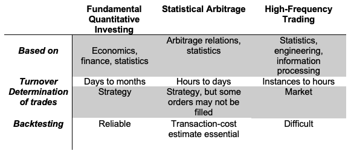

## Table of Contents

## What are Market-Neutral Trading Strategy?

Market-neutral strategies are investment approaches designed to achieve returns that are independent of market movements by balancing long and short positions. Such strategies strive to minimize exposure to systematic market risks by targeting the generation of alpha, which refers to excess returns over a benchmark. Instead of relying on overall market trends, market-neutral strategies capitalize on inefficiencies in asset pricing, exploiting temporary opportunities when an asset is mispriced relative to its true value or relative to other assets.

The execution of market-neutral strategies typically demands a sophisticated blend of fundamental and statistical analyses. Fundamental analysis involves evaluating a company's financial statements, management, competitive advantages, and market conditions to determine the intrinsic value of its stock. On the other hand, statistical analysis employs quantitative methods to identify patterns or anomalies in stock prices that may indicate mispricings. The combination of these analytical methods helps investors identify potential opportunities for arbitrage, where they can simultaneously buy and sell related assets to lock in a profit from pricing discrepancies.

In an algorithmic trading context, market-neutral strategies are efficiently implemented through the use of automated trading systems and quantitative analysis. Algorithmic trading systems leverage high-speed computer programs to execute trades based on pre-defined criteria and quantitative models. These systems allow for rapid decision-making and execution, which is critical in capturing short-lived arbitrage opportunities.

Quantitative analysis within these systems involves data mining and statistical techniques to identify potential trades. Algorithms are trained to recognize patterns or signals that suggest a mispricing or [arbitrage](/wiki/arbitrage) opportunity. Strategies are often backtested using historical data to evaluate their potential performance and refine their parameters before being deployed in live trading. This approach reduces the influence of human emotions in trading decisions and can enhance the consistency and efficiency of executing market-neutral strategies. 

Ultimately, the successful application of market-neutral strategies in an [algorithmic trading](/wiki/algorithmic-trading) framework requires considerable expertise in quantitative finance, robust risk management practices, and substantial computational resources to process vast amounts of data quickly and efficiently.

## Why Do Traders Use Market-Neutral Strategies?

Traders use market-neutral strategies to profit from price movements while minimizing exposure to broad market risks. The core appeal is their ability to generate returns regardless of whether the market goes up, down, or sideways. Unlike directional trading, where success hinges on correctly predicting market trends, market-neutral approaches aim to sidestep that uncertainty.

One big reason is **risk reduction**. By balancing long and short positions—say, buying one stock and shorting another in the same sector—traders can offset market-wide swings. If the whole market tanks due to a recession scare, the losses on the long position might be cushioned by gains on the short, leaving the trader’s profit tied to the relative performance of the two assets rather than the market’s direction.

Another driver is **consistency**. Markets can be unpredictable, with bullish runs followed by sudden crashes. Market-neutral strategies, like [pair trading](/wiki/pair-trading) or statistical arbitrage, focus on exploiting inefficiencies or mispricings between assets, which can occur even in flat or choppy conditions. This makes them attractive for traders who want steady returns without betting on macroeconomic trends.

They’re also a favorite for **capital preservation**. Hedge funds and institutional players often use these strategies to deliver “absolute returns”—gains independent of benchmarks like the S&P 500. For example, during volatile periods like 2008, a market-neutral fund might still eke out a profit by capitalizing on diverging stock performances, while a long-only portfolio gets hammered.

Finally, it’s about **diversification**. Traders mix market-neutral strategies into their playbook to hedge other bets. A day trader riding tech stock [momentum](/wiki/momentum) might run a market-neutral pairs trade on the side, smoothing out their overall risk-reward profile.

The catch? These strategies require skill—[picking](/wiki/asset-class-picking) the right pairs, managing costs like borrowing fees for shorts, and staying disciplined. But for traders who master them, the payoff is a smoother ride through the market’s chaos.

## How Do Market-Neutral Strategies Differ from Directional Trading?

Market-neutral strategies and directional trading differ fundamentally in their goals, risk exposure, and approach to the market. It’s like comparing a tightrope walker aiming for balance to a sprinter charging toward a finish line—both are in the game, but their moves and mindsets diverge.

Market-neutral strategies aim to **eliminate market direction risk**. They’re built to profit from relative price differences between assets, not from the market’s overall trend. A trader might go long on an undervalued stock and short an overvalued one in the same sector—say, buying Ford and shorting Tesla. If the market crashes, Ford might drop, but Tesla could fall harder, so the trader still wins on the spread. The focus is on the pair’s performance, not the S&P 500’s trajectory. Success hinges on the assets moving toward their historical relationship, not on guessing “up” or “down.”

Directional trading, on the other hand, is all about **betting on market movement**. It’s taking a stance—long if you think prices will rise, short if they’ll fall. A trader might buy Apple stock expecting a bullish earnings report or short oil futures anticipating a supply glut. The payoff depends on getting the direction right; if the market moves against you, you’re out of luck. It’s exposed to systemic risks like interest rate hikes or geopolitical shocks—think of 2020’s pandemic drop wiping out long-only portfolios.

The **risk profile** highlights the split. Market-neutral trades lean on hedging to cap market exposure, though they’re not risk-free—pairs can diverge unexpectedly, and transaction costs can bite. Directional trading embraces volatility; bigger swings can mean bigger gains (or losses). A market-neutral trader might sleep easier during a downturn, while a directional trader sweats every headline.

**Profit mechanics** also differ. Market-neutral gains come from convergence—assets reverting to a mean or expected spread. Directional profits ride momentum or trends—think catching a 20% stock rally. Timeframes vary too: market-neutral might mean quick scalps or longer statistical plays, while directional could be a day trade or a multi-month hold.

In short, market-neutral is about playing the gaps between assets, insulated from the market’s tide. Directional trading is diving into that tide, sink or swim. Traders pick based on their risk appetite and market view—steady grind versus bold bets.

## What Are the Basic Types of Market-Neutral Strategies?

### Fundamental Arbitrage

Fundamental arbitrage is a cornerstone strategy within market neutral trading, hinging on discrepancies identified through [fundamental analysis](/wiki/fundamental-analysis). This strategy involves taking positions in securities whose prices are believed to deviate significantly from their intrinsic value as determined by fundamental analysis.

In fundamental arbitrage, traders focus on the deep assessment of a company’s financial health, management quality, market position, and other economic [factor](/wiki/factor-investing)s. When a security is undervalued based on these factors, traders take a long position, expecting its price to rise to its perceived true value. Conversely, if a security is overvalued, traders take a short position, anticipating a price correction.

The key to success in fundamental arbitrage lies in the accuracy and depth of the fundamental analysis. This analysis typically encompasses a thorough examination of financial statements, market competition, industry health, economic indicators, and management effectiveness. Sophisticated investors may also incorporate [ESG](/wiki/esg-investing) (Environmental, Social, and Governance) factors into their fundamental analysis, especially as these factors increasingly influence company valuation and investor perception.

A classic example of fundamental arbitrage is investing in a company with strong fundamentals (like solid [earning](/wiki/earning-announcement)s, low debt, and robust growth prospects) that is currently undervalued by the market, possibly due to temporary factors such as market sentiment or short-term setbacks. Simultaneously, a short position is taken in a company with weaker fundamentals that is overvalued by the market, perhaps due to hype or speculative interest.

The primary challenge in fundamental arbitrage is that markets can remain irrational longer than the trader can remain solvent. Therefore, a strong emphasis is placed on risk management and diversification to mitigate the impact of potential misjudgments or extended periods before the market corrects the mispricing. This approach also necessitates a medium to long-term investment horizon, as it may take significant time for the market to adjust and reflect the true fundamental values of the securities.

### Statistical Arbitrage

Statistical arbitrage, often referred to as StatArb, represents a sophisticated [market neutral strategy](/wiki/market-neutral-strategy) that employs statistical and computational methods to identify and exploit pricing inefficiencies between securities. Rooted in probability and statistical models, this approach analyzes historical price relationships and patterns to forecast future price movements.

At its core, [statistical arbitrage](/wiki/statistical-arbitrage) involves constructing a portfolio of long and short positions that are expected to be collectively market neutral. This is achieved by identifying pairs or groups of stocks whose prices have historically moved together and are likely to continue doing so. When the current price relationship between these securities deviates from the historical norm, traders capitalize on the expectation that prices will eventually revert to their long-term average, thus generating profit.

The process typically involves complex algorithms and quantitative models, such as mean reversion, cointegration, and [machine learning](/wiki/machine-learning) techniques, to analyze vast datasets and identify trading opportunities. These models consider a range of factors, including historical price data, trading [volume](/wiki/volume-trading-strategy)s, and, increasingly, [alternative data](/wiki/best-alternative-data) sources like social media sentiment.

One common method within statistical arbitrage is pairs trading, where two historically correlated stocks are monitored. When the spread between their prices widens beyond a certain threshold, the trader would short the outperforming stock and go long on the underperforming one, betting on the spread narrowing again.

Statistical arbitrage strategies can vary in their holding periods, ranging from ultra-short-term (intraday) to medium-term. These strategies require sophisticated technology infrastructure for real-time data processing and execution, as well as rigorous [backtesting](/wiki/backtesting) to validate the models before deployment.

However, statistical arbitrage is not without risks. Key challenges include model risk (the risk that the statistical model used might be flawed) and execution risk (the risk that trades may not be executed at the anticipated prices). Additionally, these strategies are sensitive to changes in market conditions that could disrupt historical price relationships. As such, continuous monitoring and adjustment of models are essential components of successful statistical arbitrage trading.

### Delta Neutral Options Strategies

Delta neutral options strategies are a sophisticated approach within market neutral trading, primarily focusing on options trading. These strategies aim to offset positive and negative deltas—meaning the sensitivity of an option's price to a $1 change in the underlying asset—so that the overall delta of the assets in question is as close to zero as possible. This neutralizes or minimizes the directional risk associated with price movements of the underlying asset.

In a delta neutral strategy, traders combine options and possibly the underlying stock to ensure that the total delta of the positions is neutralized. For instance, if a trader holds a position that is positive delta (indicating long exposure), they might sell options on the same underlying asset that are negative delta (indicating short exposure) to balance out the total exposure.

One common method to achieve delta neutrality is through options spreads. This could involve creating a position with multiple options (such as a combination of calls and puts) that offset each other. Another method is to dynamically adjust positions in response to market movements, a process known as delta hedging. In delta hedging, traders frequently adjust their holdings of the underlying asset or options to maintain delta neutrality as market conditions change.

Delta neutral strategies are often used by traders seeking to profit from other aspects of options pricing, such as changes in [volatility](/wiki/volatility-trading-strategies) or the passage of time, rather than directional price movements. For example, a trader might use a delta neutral strategy to capitalize on a predicted increase in volatility while remaining indifferent to whether the underlying asset's price rises or falls.

It's important to note that maintaining a delta neutral position requires constant monitoring and rebalancing, especially in volatile markets where the delta of an options position can change rapidly. Additionally, these strategies typically involve complex calculations and a deep understanding of options pricing models.

Overall, delta neutral options strategies offer a way to isolate specific risk factors and profit from them, while seeking to minimize exposure to directional market movements. They are a key tool in the arsenal of advanced traders who specialize in options and volatility trading.

### Pairs Trading

Pairs trading is a quintessential market neutral strategy that involves simultaneously taking opposing positions in two highly correlated securities. The essence of this approach is to capitalize on the relative performance of the pair rather than the direction of the market as a whole.

In pairs trading, two securities that historically move together are identified. These could be stocks in the same industry, stocks of companies with similar financial metrics, or any other pairs where a strong correlation in price movement has been established. The strategy kicks in when there's a divergence in this correlation.

For instance, if one stock in the pair underperforms while the other outperforms, a trader would go long on the underperforming stock (buying it with the expectation that it will rise) and short the outperforming stock (selling it with the expectation that its price will fall). The premise is that the prices will eventually converge again, returning to their historical relationship. When this convergence occurs, the trader profits from the narrowing of the spread between the two securities.

Pairs trading is grounded in statistical and quantitative analysis. Traders use historical data to identify pairs and determine the right timing for entering and [exit](/wiki/exit-strategy)ing trades. The success of the strategy hinges on accurate identification of pairs and precise timing. It requires continuous monitoring and rebalancing of the positions to maintain the market neutrality of the portfolio.

This strategy is attractive because it is designed to be unaffected by the overall direction of the market. Whether the market is going up, down, or sideways, pairs trading seeks to exploit the relative movement of two securities against each other. However, it is not without risks. A key risk is the breakdown of the historical price relationship due to fundamental changes in one or both companies or their industries. Additionally, transaction costs can be higher due to the need for frequent rebalancing.

Pairs trading fits well within the broader umbrella of market neutral strategies as it aims to profit from the convergence of mispriced assets while maintaining a neutral exposure to broader market movements.

### Convertible Arbitrage

In convertible arbitrage, investors take positions in convertible bonds while simultaneously shorting the underlying stocks. This strategy profits from pricing discrepancies between a company's convertible bonds and its stock. As convertible bonds can be exchanged for a predetermined number of equity shares, their value is influenced by both [interest rate](/wiki/interest-rate-trading-strategies) changes and stock price fluctuations. The arbitrageur aims to exploit situations where the bond is mispriced relative to the stock. This requires continuous rebalancing using algorithmic systems to optimize the hedge ratio, often modeled as:

$$
Hedge\ Ratio = \frac{\Delta \text{(change in bond price)}}{\Delta \text{(change in stock price)}}
$$

## How Does Pair Trading Work as a Market-Neutral Approach?

Pair trading is a classic market-neutral strategy that zeroes in on the relative performance of two assets, aiming to profit from their price relationship rather than the market’s overall direction. It’s like betting on a tug-of-war between two teams—you don’t care if the field shifts, just which side pulls harder.

Here’s how it works: traders pick two assets that historically move together—think Coca-Cola and Pepsi, or two ETFs tracking similar sectors. These are often **correlated** (their prices tend to zig and zag in sync) and ideally **co-integrated**, meaning their price spread (the difference between them) hovers around a stable average over time. The idea is that when this spread stretches too far—say, one stock surges while the other lags—it’s likely to snap back to normal.

The execution is straightforward but precise. If Stock A is trading at $100 and Stock B at $105, with a usual spread of $2, a spike to a $10 spread (A at $100, B at $108) signals an opportunity. The trader goes **long on the underperformer** (buys Stock A) and **short on the overperformer** (sells Stock B), betting the gap narrows. If A rises to $103 and B drops to $105, the spread shrinks to $2, and the trader profits: $3 on the long, $3 on the short, minus fees.

The market-neutral magic comes from **hedging market risk**. If the whole market jumps 5%, Stock A might hit $105 and B $113—spread’s still $8, and the trader’s position adjusts but doesn’t collapse. Same if it crashes. The gain isn’t tied to the market’s direction, just the pair’s convergence.

**Key steps** make it tick. Traders use stats like correlation coefficients (often 0.8 or higher) and co-integration tests (e.g., Augmented Dickey-Fuller) to pick pairs. They track the spread with moving averages or z-scores—entering when it hits, say, 2 standard deviations from the mean. Exit’s when it reverts, or a stop-loss if it widens further (like 3 deviations).

It’s not foolproof—pairs can decouple due to news (Pepsi’s scandal tanks it while Coke holds) or costs (shorting fees eat profits). But when done right, pair trading delivers steady, low-correlation returns, making it a go-to for market-neutral fans.

## What Role Does Hedging Play in Market-Neutral Trading?

Hedging is the backbone of market-neutral trading—it’s what keeps the strategy insulated from the market’s wild swings. Think of it as an insurance policy: it doesn’t eliminate all risk, but it neutralizes the big, systemic stuff that could sink a portfolio, letting traders focus on the specific bets they’re making.

In market-neutral trading, hedging means taking **offsetting positions** to cancel out directional market exposure. The goal is to make profits depend on the relative performance of assets, not whether the market rises or falls. For example, in pair trading, you go long on one stock and short another in the same sector—say, buying $10,000 of Microsoft and shorting $10,000 of Apple. If tech stocks tank due to a rate hike, Microsoft might drop 5% (losing $500), but Apple could fall 5% too (gaining $500 on the short). Net result? You’re flat on market moves, and your profit comes from Microsoft outperforming Apple, not the sector’s direction.

This works because hedging targets **beta**, the measure of an asset’s sensitivity to market movements. Market-neutral traders aim for a portfolio beta near zero—meaning it doesn’t budge much when the S&P 500 does. They might use tools like delta-neutral hedging in options (balancing calls and puts) or adjust position sizes so the dollar value of longs equals shorts. In statistical arbitrage, they might spread bets across dozens of pairs, ensuring no single market trend dominates.

Hedging also **shifts the risk profile**. Instead of worrying about crashes or rallies, traders face risks like correlation breakdowns (when hedged assets stop moving together) or execution costs (shorting fees, spreads). It’s a trade-off: you dodge the market’s storms but navigate tighter, more technical waters.

The payoff is **stability**. A well-hedged market-neutral strategy can churn out returns in bull markets, bear markets, or sideways slogs—think 2008, when hedged funds often outperformed long-only ones. It’s not about avoiding risk altogether; it’s about controlling which risks you take, zeroing in on mispricings or spreads while letting the market do its thing. Without hedging, “market-neutral” is just a buzzword—hedging makes it real.

## How Can Beginners Start Implementing a Market-Neutral Strategy?

Beginners can dip their toes into market-neutral trading by starting small, keeping it simple, and focusing on a structured approach that builds confidence without overwhelming them. It’s about getting the basics down—balancing risk, testing ideas, and avoiding rookie traps. Here’s how to kick things off:

First, **pick a straightforward strategy** like pair trading—it’s the easiest market-neutral play to grasp. Choose two stocks you know, ideally from the same sector with a tight historical relationship, like Coca-Cola and Pepsi. Check their prices over the past year (Yahoo Finance or TradingView works) to see if their spread—the price gap—tends to revert to an average. You’re looking for something that wiggles but doesn’t drift apart forever.

Next, **set up a paper trading account**. Platforms like Thinkorswim, [Interactive Brokers](/wiki/interactive-brokers-api), or even free simulators let you practice without real money. Start with a small virtual pot—say, $10,000—and split it evenly: go long $5,000 on the cheaper stock and short $5,000 on the pricier one when the spread looks stretched (e.g., wider than its 20-day average by 10-15%). Watch how it plays out over a week or two.

**Learn basic tools** to time your moves. Use a simple moving average (20-day or 50-day) to track the spread’s “mean,” and plot it in Excel or a free charting tool. Enter when the spread’s far from this line—say, 2% above or below—and exit when it nears the average. Don’t overcomplicate it; skip fancy stats like co-integration for now.

**Size positions to stay neutral**. Keep your long and short dollar amounts equal to hedge market risk. If Stock A is $50 and Stock B is $55, buy 100 shares of A ($5,000) and short 90 shares of B ($4,950)—close enough. This balances exposure so a market jump or drop cancels out, leaving you focused on the spread.

**Start with small real trades** once you’re ready. Use a brokerage that allows shorting (like Robinhood Gold or Tastytrade) and risk no more than 1-2% of your account per trade—$100-$200 if you’ve got $10,000. Stick to liquid stocks to avoid big borrowing costs or slippage.

**Track and tweak**. Log every trade—entry, exit, profit/loss, and why you made the move. After 10 trades, check what’s working. If spreads aren’t reverting, maybe your pair’s weak—try another. If fees eat your gains, scale up slightly or pick stocks with tighter spreads.

Key tips: avoid earnings dates (they can blow pairs apart), don’t force trades in choppy markets, and be patient—market-neutral isn’t a get-rich-quick scheme. Beginners win by mastering the process, not chasing home runs.

## What Tools or Indicators Are Essential for Market-Neutral Trading?

Market-neutral trading thrives on precision and balance, so the right tools and indicators are critical to spot opportunities, time trades, and keep risk in check. They’re less about predicting market direction and more about measuring relationships, deviations, and risk. Here’s what’s essential:

**Price Spread Charts** are the starting point. For pair trading or similar strategies, you plot the price difference (or ratio) between two assets—like Ford minus GM—over time. Free platforms like TradingView or Excel can do this. It shows when the spread’s stretching or reverting, giving you a visual cue for entries and exits.

**Moving Averages (MAs)** define the “mean” in mean-reversion plays. A 20-day or 50-day Simple Moving Average (SMA) smooths the spread’s noise, acting as a baseline. When the spread veers far from the MA—say, 5% above or below—it’s a potential signal. Exponential Moving Averages (EMAs) work too if you want more sensitivity to recent moves.

**Standard Deviation (SD) or Bollinger Bands** measure how far the spread’s deviated. Calculate the SD of the spread over 20-50 days; a move beyond 2 SDs (about 95% of the range) flags an extreme. Bollinger Bands (typically 2 SDs around a 20-day MA) do this automatically on most charting tools—enter when the spread hits the upper/lower band, exit near the middle.

**Correlation Coefficient** checks if your pair moves together. A value above 0.7-0.8 (on a -1 to 1 scale) suggests a strong link—use Yahoo Finance or Python’s pandas library to compute it over 6-12 months. It’s not foolproof, but it filters out shaky pairs.

**Relative Strength Index (RSI)** fine-tunes timing. Applied to individual assets or the spread, an RSI below 30 (oversold) or above 70 (overbought) hints at reversion. It’s not the star of the show but adds confirmation—available on every trading platform.

**Average True Range (ATR)** gauges volatility. High volatility can widen spreads too much, low can stall reversion. Check ATR on both assets (14-day is standard); trade when it’s stable, not spiking. Most brokers’ tools include this.

**Beta Calculation** ensures neutrality. Pull beta for each asset from a site like Bloomberg or calculate it via regression against an index (e.g., S&P 500) in Excel. Adjust position sizes so the portfolio’s net beta nears zero—long a low-beta stock, short a high-beta one proportionally.

**Co-integration Tests** (like Augmented Dickey-Fuller) are a step up. They confirm if a pair’s spread is stationary—likely to revert—over time. Beginners can skip this, but pros use stats software like R or Python libraries (statsmodels) for precision.

**Position Sizing Calculators** keep exposure even. A simple spreadsheet or broker tool ensures your long and short dollar values match—$5,000 long, $5,000 short—or adjusts for beta differences.

**Backtesting Software** validates ideas. Thinkorswim, TradeStation, or Python (with pandas and backtrader) lets you test how your pair and indicators performed historically. It’s not real-time but builds confidence.

You don’t need all of these at once. Start with spread charts, an MA, and SD on a free platform—add RSI or ATR as you grow. The pros layer in co-integration and backtesting for an edge. The trick is using them to spot mispricings, not chase trends—keep it tight and data-driven.

## How Do You Measure Success in Market-Neutral Strategies?

Measuring success in market-neutral strategies revolves around gauging profitability, consistency, and risk control—without tying outcomes to the broader market’s ups and downs. Since the goal is to profit from relative moves between assets, not directional trends, the metrics focus on how well the strategy exploits those edges. Here’s how it’s done:

**Absolute Return** is the first yardstick. It’s the raw percentage gain (or loss) on your capital over a period—say, 5% in a month. Unlike directional strategies benchmarked to the S&P 500, market-neutral success isn’t judged against an index. If you make $5,000 on a $100,000 account while the market’s flat or crashing, that’s a win. The focus is on positive returns, period.

**Profit Factor** digs into efficiency. Divide total gains from winning trades by total losses from losers. A factor above 1 means you’re in the black—1.5 or 2 signals a robust edge. For example, if your longs and shorts net $10,000 in profits and $5,000 in losses, that’s a 2:1 profit factor. It shows if the strategy’s worth the effort beyond just breaking even.

**Win Rate** tracks consistency. It’s the percentage of trades that profit. Market-neutral doesn’t demand a sky-high win rate—50-60% can suffice if winners outpace losers. A pair trader might win 55% of trades, losing $200 on average but gaining $300, still netting out ahead.

**Risk-Adjusted Return**, like the **Sharpe Ratio**, weighs gains against volatility. Divide the strategy’s annualized return (minus a risk-free rate, like T-bills at 4%) by its standard deviation of returns. A Sharpe above 1 is solid; above 2 is stellar. If you earn 8% yearly with a 4% standard deviation, Sharpe is (8-4)/4 = 1. Low volatility’s key—market-neutral shouldn’t swing wildly.

**Maximum Drawdown** tests resilience. It’s the biggest peak-to-trough drop in your account during a rough patch. A 10% max drawdown on a $100,000 account means you never lost more than $10,000 before recovering. Pros aim to keep this below 10-15%, ensuring the strategy doesn’t crater under stress—like a pair diverging too long.

**Alpha** measures the “extra” return beyond what market exposure explains. Since market-neutral targets zero beta, alpha should ideally equal the total return. If you make 6% while the market’s flat, that’s 6% alpha—proof you’re beating systematic risk, not riding it.

**Trade Frequency and Holding Period** round it out. Check how many trades you’re making and how long they last—daily scalps or weekly holds? A pair trader might average 20 trades a month, holding 3 days each. Too few trades might miss opportunities; too many could rack up costs.

Success isn’t one number—it’s the blend. A strategy with 6% return, 1.8 profit factor, 55% win rate, 8% max drawdown, and 1.2 Sharpe looks strong—profitable, steady, and low-risk. Compare that to a choppy run with 10% return but 25% drawdowns and a 0.8 Sharpe, and the first wins for reliability. The art is balancing these to match your goals—steady income or bigger (but riskier) pops.

## What Are the Risks and Challenges of Market-Neutral Trading?

Market-neutral trading sounds like a smooth ride—profit without picking a market direction—but it’s got its own set of risks and challenges that can trip up even sharp traders. It’s less about dodging all risk and more about swapping market volatility for a different breed of headaches. Here’s what you’re up against:

**Correlation Breakdown** is a big one. The strategy often hinges on assets—like a pair of stocks—moving together predictably. If that link snaps, say Ford and GM diverge due to a recall hitting one but not the other, your long and short positions stop offsetting. The spread widens, and you’re bleeding on both sides instead of converging.

**Execution Risk** stings too. Going long is easy, but shorting? You need to borrow shares, and that’s not always cheap or available. Borrowing costs can spike—think 5-10% annualized on a hot stock—or dry up entirely during a squeeze. Plus, slippage (the gap between expected and actual trade prices) can erode thin margins, especially in fast markets.

**Overfitting** haunts the data-driven. If you backtest a pair or stat-arb model too aggressively—tweaking until it fits past data perfectly—it might flop in real time. Markets shift; what worked in 2022 could fizzle in 2025. A strategy with a 2:1 profit factor in simulation might barely break even live.

**Leverage Risk** amplifies trouble. To juice returns (since spreads are often small), traders borrow or use margin. A $10,000 long and $10,000 short might be 2x leverage on a $10,000 account. If the trade sours—say, a 5% adverse move—you’re down $1,000, or 10% of capital, fast. Overdo it, and a bad streak can wipe you out.

**Liquidity Crunches** can blindside you. Trading less-liquid assets might widen bid-ask spreads, jacking up costs, or trap you in a position when you can’t exit. Imagine shorting a small-cap that surges—no buyers for your long, no shares to cover the short, and you’re stuck.

**Regime Changes** mess with assumptions. Market-neutral often leans on mean reversion, but structural shifts—like rising rates or sector disruptions—can push spreads to new norms. A pair that reverted at a $2 gap for years might settle at $5 after a merger rumor, leaving you waiting for a rebound that never comes.

**Costs Add Up**. Commissions, bid-ask spreads, and shorting fees chip away at profits. A pair trade netting $100 gross might lose $20 to costs—20% of the gain. High-frequency setups feel this hardest; one bad month of fees can turn a winner into a loser.

**Timing Errors** hurt too. Enter a trade too early, and the spread widens before reverting—testing your nerve and capital. Exit too soon, and you miss the payoff. It’s a Goldilocks game with no perfect signal.

The challenge is managing these, not avoiding them. Pros use tight stops (e.g., 2% loss caps), diversify across pairs, and keep leverage modest (1-2x). They also stress-test for worst-case scenarios—like a 2008-style shock. It’s a grind: less rollercoaster than directional trading, but still a test of discipline and adaptability.

## How Can Advanced Techniques Like Statistical Arbitrage Enhance Market-Neutral Strategies?

Advanced techniques like statistical arbitrage can significantly enhance market-neutral strategies by leveraging data-driven insights to exploit pricing inefficiencies while keeping risk in check. Statistical arbitrage, or "stat arb," involves using quantitative models—think statistical analysis, machine learning, or time-series forecasting—to identify temporary mispricings between related assets. In a market-neutral context, where the goal is to profit regardless of whether the market goes up or down, this approach shines because it focuses on relative value rather than directional bets.

For example, stat arb can pinpoint pairs of stocks that historically move together—like two tech companies in the same sector—but have diverged due to short-term noise. You’d go long on the undervalued stock and short the overvalued one, betting on their prices converging again. The market-neutral angle comes from balancing these positions so that broad market movements cancel out, leaving you exposed only to the specific mispricing you’re targeting. Historical data might show, say, a correlation coefficient of 0.9 between the pair, and a model could flag when the spread exceeds two standard deviations—your entry signal.

What makes this powerful is the speed and scale. Algorithms can scan thousands of asset pairs in real time, something no human could do, and execute trades instantly when opportunities pop up. Add in advanced tools like cointegration tests or Kalman filters, and you can refine your predictions about how long it’ll take for prices to snap back. Transaction costs and slippage are risks, sure, but high-frequency stat arb can churn small, consistent gains that compound over time.

The edge comes from precision. A well-tuned model might achieve a Sharpe ratio north of 2.0 on these trades, meaning solid returns relative to volatility. Market-neutral funds using stat arb often aim for uncorrelated alpha—returns independent of market swings—which is gold for portfolio diversification. During volatile periods like 2022’s bear market, when directional strategies got hammered, these approaches could still grind out profits by focusing on micro-inefficiencies.

It’s not foolproof, though. Overcrowding—too many players chasing the same signals—can erode profits, and black-swan events can blow up even the tightest correlations. Still, when paired with robust risk management, like dynamic position sizing or stop-losses, stat arb can make market-neutral strategies more resilient and profitable. It’s less about hitting home runs and more about stacking singles while dodging curveballs.

## What Impact Do Market Conditions Have on Market-Neutral Trading Performance?

Market conditions play a big role in how well market-neutral trading performs, even though these strategies are designed to sidestep broad market swings. The whole point of market-neutral is to zero out exposure to market direction—think beta close to zero—so you’re banking on relative price movements between assets. But the environment still messes with the gears: volatility, [liquidity](/wiki/liquidity-risk-premium), and correlation shifts can either juice returns or grind them down.

In calm, trending markets—like a steady bull run—market-neutral strategies can struggle to find juice. Mispricings tend to be smaller because prices move orderly, and everyone’s sipping the same Kool-Aid. Statistical arbitrage or pairs trading, for instance, thrives on divergence, but if stocks are marching in lockstep (say, correlations creep up to 0.95 across a sector), the spreads you’re betting on shrink. Returns might flatline, and you’re left fighting transaction costs for scraps. Historical data backs this: market-neutral funds often underperform in low-volatility periods, with annualized returns sometimes dipping below 5%.

Flip it to chaotic, high-volatility markets—like during a crash or a 2020-style pandemic shock—and things get interesting. Volatility spikes (VIX jumping from 15 to 50, for example) widen pricing gaps between related assets. A market-neutral trader might see a pair of stocks diverge by three standard deviations instead of one, creating fatter opportunities. More noise means more inefficiencies to exploit, and skilled players can rack up double-digit returns annualized. But here’s the catch: liquidity can dry up. If bid-ask spreads balloon or order [books](/wiki/algo-trading-books) thin out, executing trades gets pricier and riskier, eating into profits.

Correlation breakdowns are another wildcard. Market-neutral often leans on historical relationships—like two REITs with a stable 0.8 correlation. In a crisis, though, those ties can snap (correlation drops to 0.2 overnight), and your hedge stops working. You’re suddenly exposed to directional risk you didn’t sign up for. The 2008 financial crisis showed this hard: some market-neutral hedge funds got smoked when systemic shocks trashed their models.

Liquidity conditions tie it all together. In flush markets, you can slide in and out of positions cheaply, keeping costs low and execution tight. In stressed markets, like March 2020, illiquidity can trap you—can’t unwind a short or cover a long without taking a hit. Smart traders adjust position sizes or lean on cash buffers to weather this, but it still dents performance.

The takeaway? Market-neutral isn’t immune to conditions—it’s just affected differently than directional plays. High volatility and moderate liquidity are the sweet spot; too quiet or too wild, and the math gets tricky. Funds with adaptive models—say, dialing back leverage when correlations wobble—tend to navigate this better, but there’s no free lunch. Performance hinges on how well you read the room.

## References & Further Reading

[1]: [Statistical Arbitrage: Unveiling its Role in Market Neutral Funds](https://fastercapital.com/content/Statistical-Arbitrage--Unveiling-its-Role-in-Market-Neutral-Funds.html)

[2]: [Market Neutral: Definition, How Strategy Works, Risk and Benefits](https://www.investopedia.com/terms/m/marketneutral.asp)

[3]: [Market neutral](https://en.wikipedia.org/wiki/Market_neutral)

[4]: [Statistical Arbitrage: Strategies, Risks, and How It Works](https://blog.quantinsti.com/statistical-arbitrage/)

[5]: [Understanding Market Neutral Hedge Fund Strategy](https://www.barclayhedge.com/educational/hedge-fund-market-neutral)

[6]: [Market Neutral Investing](https://www.blackrock.com/us/individual/insights/market-neutral-investing)

[7]: [Market Neutral Fund: What it is, How it Works, Examples](https://www.investopedia.com/terms/m/marketneutralfund.asp)

[8]: [Getting Positive Results With Market-Neutral Funds](https://www.investopedia.com/articles/mutualfunds/09/market-neutral-funds.asp)

[9]: [Global equity market-neutral hedge funds shine](https://www.reuters.com/markets/global-markets-hedgefunds-2024-04-23/)

[10]: [AlternativeSoft News - Market-neutral hedge funds during crisis](https://www.alternativesoft.com/market-neutral-hedge-funds-during-crisis.html)

[11]: [Market Neutral - Overview, Types, Advantages, and Example](https://corporatefinanceinstitute.com/resources/equities/market-neutral/)