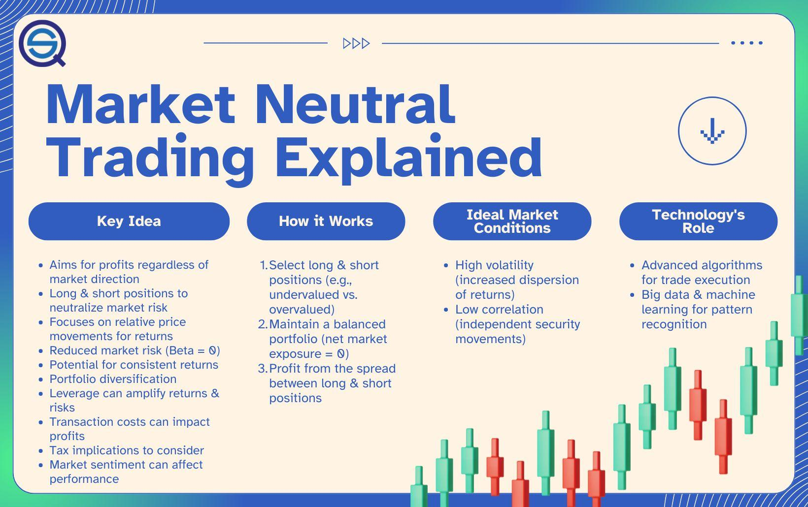

In the world of investing, market-neutral strategies offer a distinctive approach by aiming to profit regardless of whether asset prices are rising or falling. These strategies are particularly attractive to investors seeking to minimize market risk. At the core of a market-neutral strategy is the concept of balancing long and short positions—holding long positions in stocks anticipated to outperform the market and short positions in stocks expected to underperform. This balance allows investors to achieve returns that are uncorrelated to the overall market direction, effectively 'neutralizing' exposure to market fluctuations.

Market-neutral strategies cater mainly to hedge funds and sophisticated investors thanks to their complexity and the nuanced understanding required for implementation. However, advancements in technology and the proliferation of algorithmic trading have made these strategies more accessible for individual investors as well. Algorithmic trading systems leverage quantitative analysis and can execute trades rapidly and with precision, making them ideal for managing the intricacies of market-neutral strategies. 



This article will explore various examples of market-neutral strategies within the context of algorithmic trading, highlighting their practical applications and the benefits they can provide to investors.

## Table of Contents

## What is a Market-Neutral Strategy?

Market-neutral strategies are investment approaches designed to achieve returns that are independent of market movements by balancing long and short positions. Such strategies strive to minimize exposure to systematic market risks by targeting the generation of alpha, which refers to excess returns over a benchmark. Instead of relying on overall market trends, market-neutral strategies capitalize on inefficiencies in asset pricing, exploiting temporary opportunities when an asset is mispriced relative to its true value or relative to other assets.

The execution of market-neutral strategies typically demands a sophisticated blend of fundamental and statistical analyses. Fundamental analysis involves evaluating a company's financial statements, management, competitive advantages, and market conditions to determine the intrinsic value of its stock. On the other hand, statistical analysis employs quantitative methods to identify patterns or anomalies in stock prices that may indicate mispricings. The combination of these analytical methods helps investors identify potential opportunities for arbitrage, where they can simultaneously buy and sell related assets to lock in a profit from pricing discrepancies.

In an algorithmic trading context, market-neutral strategies are efficiently implemented through the use of automated trading systems and quantitative analysis. Algorithmic trading systems leverage high-speed computer programs to execute trades based on pre-defined criteria and quantitative models. These systems allow for rapid decision-making and execution, which is critical in capturing short-lived arbitrage opportunities.

Quantitative analysis within these systems involves data mining and statistical techniques to identify potential trades. Algorithms are trained to recognize patterns or signals that suggest a mispricing or [arbitrage](/wiki/arbitrage) opportunity. Strategies are often backtested using historical data to evaluate their potential performance and refine their parameters before being deployed in live trading. This approach reduces the influence of human emotions in trading decisions and can enhance the consistency and efficiency of executing market-neutral strategies. 

Ultimately, the successful application of market-neutral strategies in an [algorithmic trading](/wiki/algorithmic-trading) framework requires considerable expertise in quantitative finance, robust risk management practices, and substantial computational resources to process vast amounts of data quickly and efficiently.

## Examples of Market-Neutral Strategies in Algorithmic Trading

Market-neutral strategies in algorithmic trading are designed to limit exposure to market [volatility](/wiki/volatility-trading-strategies) while seeking to exploit pricing inefficiencies. Below are detailed examples:

### Equity Market Neutral

Equity market-neutral strategies involve taking equal long and short positions in different equities, effectively maintaining zero net market exposure. The goal is to profit from the relative performance of selected stocks, independent of the broader market direction. This is typically achieved using statistical models to predict stock performance. For instance, a strategy may involve longing undervalued stocks expected to rise while shorting overvalued stocks predicted to fall. Risk is minimized as gains in one position can offset losses in the other, provided the market as a whole remains stable.

### Convertible Arbitrage

In convertible arbitrage, investors take positions in convertible bonds while simultaneously shorting the underlying stocks. This strategy profits from pricing discrepancies between a company's convertible bonds and its stock. As convertible bonds can be exchanged for a predetermined number of equity shares, their value is influenced by both [interest rate](/wiki/interest-rate-trading-strategies) changes and stock price fluctuations. The arbitrageur aims to exploit situations where the bond is mispriced relative to the stock. This requires continuous rebalancing using algorithmic systems to optimize the hedge ratio, often modeled as:

$$
Hedge\ Ratio = \frac{\Delta \text{(change in bond price)}}{\Delta \text{(change in stock price)}}
$$

### Statistical Arbitrage

Statistical arbitrage relies on quantitative models to identify and exploit short-term mispricings across securities, such as stocks, ETFs, or options. This involves high-frequency trading techniques that are data-driven, leveraging advanced statistical methods such as time-series analysis and [machine learning](/wiki/machine-learning) to forecast price movements. For example, mean reversion models assume that prices will revert to a historical mean, offering a buy or sell signal. Algorithms can be programmed to execute trades within milliseconds, maintaining a neutral market stance by balancing positions across a portfolio.

### Pairs Trading

Pairs trading is based on the identification of two historically correlated stocks. The strategy involves buying the underperforming stock while shorting the outperforming one, anticipating a convergence to their historical relationship. This convergence is typically modeled using statistical metrics like the spread or ratio of their prices, and executed using a mean reversion strategy. For example, a simple implementation in Python might look like:

```python
import numpy as np
import statsmodels.api as sm

def calculate_zscore(spread):
    spread_mean = np.mean(spread)
    spread_std = np.std(spread)
    return (spread - spread_mean) / spread_std

def pairs_trading_strategy(stock_1, stock_2, entry_zscore, exit_zscore):
    model = sm.OLS(stock_1, sm.add_constant(stock_2)).fit()
    spread = model.resid
    zscore = calculate_zscore(spread)

    # Signals based on z-score
    if zscore[-1] > entry_zscore:
        return "SHORT stock_1, LONG stock_2"
    elif zscore[-1] < -entry_zscore:
        return "LONG stock_1, SHORT stock_2"
    elif abs(zscore[-1]) < exit_zscore:
        return "EXIT positions"
    return "HOLD current positions"
```

Each of these strategies requires sophisticated risk management and computational resources to implement. They necessitate precise execution to ensure that potential profits from pricing inefficiencies are not eroded by transaction costs and market risks.

## Implementation in Algorithmic Trading

Algorithmic trading provides an efficient framework for executing market-neutral strategies by leveraging the speed and precision of automated systems. These strategies rely heavily on quantitative data analysis to pinpoint potential opportunities and manage associated risks effectively. 

**Quantitative Data Analysis**

Utilizing quantitative analysis in market-neutral strategies is vital for distinguishing pricing inefficiencies. By analyzing large datasets, algorithms can identify arbitrage opportunities and market anomalies that human traders might overlook. These algorithms typically involve statistical models and machine learning techniques, which help in making informed decisions based on historical and real-time data.

For instance, in equity market-neutral strategies, factors like [liquidity](/wiki/liquidity-risk-premium), price [momentum](/wiki/momentum), and volatility are calculated to optimize the balance between long and short positions. This statistical foundation ensures the algorithm positions the portfolio favorably relative to identified mispricings.

**Backtesting**

Backtesting is a critical component in algorithmic trading, particularly for market-neutral strategies. By testing the strategy against historical data, traders can verify the validity of the strategy and predict its potential performance in differing market conditions. This process involves simulating the execution of an investment strategy using past data, allowing investors to ensure that their algorithm operates robustly before deploying significant capital.

Backtesting involves several key steps:
1. Selection of the historical period for analysis.
2. Execution of the algorithm on this data to assess outcomes.
3. Evaluation of performance metrics such as return, volatility, and Sharpe ratio.

Here's a simple Python example demonstrating a [backtesting](/wiki/backtesting) process using hypothetical trade data:

```python
import pandas as pd

# Sample data representing historical price movements
data = {'Date': ['2023-01-01', '2023-01-02', '2023-01-03'],
        'Long_Position': [100, 102, 105],
        'Short_Position': [50, 52, 51]}

df = pd.DataFrame(data)
df['Profit'] = df['Long_Position'] - df['Short_Position']
print(df)
```

This approach allows for refinements in strategy to accommodate potential market fluctuations and adjust for unexpected variables.

**Case Study: ETFs TLT and XLU**

A practical example of implementing a market-neutral strategy is through trading ETFs such as TLT (iShares 20+ Year Treasury Bond [ETF](/wiki/etf-trading-strategies)) and XLU (Utilities Select Sector SPDR Fund). The goal is to construct a strategy that exploits the differing behaviors of these ETFs due to their distinct underlying assets—Treasury bonds and utility stocks, respectively.

The procedure involves:
- Constructing a statistical model that captures the historical spread between TLT and XLU.
- Establishing positions based on deviations from historical norms, typically involving going long on the underperforming ETF and shorting the overperforming one.
- Continuously optimizing based on quantitative data and backtesting outcomes to ensure the strategy remains effective in capturing the expected convergences.

By maintaining a neutral stance concerning broader market movements, this strategy can isolate specific inefficiencies between these two ETFs, offering a pathway to garner returns independent of pervasive market trends. 

Overall, the application of market-neutral strategies through algorithmic trading necessitates a robust understanding of quantitative analysis and the utilization of backtesting to mitigate risks, optimize performance, and ultimately achieve a consistent return profile in various market conditions.

## Advantages and Disadvantages

Market-neutral strategies in algorithmic trading offer several advantages, particularly in managing risks and fostering a balanced investment approach. A key benefit is the reduced exposure to market fluctuations. By maintaining equal long and short positions, these strategies aim to negate the effects of broad market movements, allowing investors to seek returns that are independent of market direction. This aspect is particularly attractive during periods of market volatility or downturns, as it mitigates the risk associated with negative market trends.

Another advantage is the potential for positive returns in varying market conditions. Market-neutral strategies focus on generating alpha through exploiting pricing inefficiencies. This means that returns are less tied to overall market performance and more dependent on the investor’s ability to identify underpriced and overpriced assets. Additionally, these strategies offer flexibility across different asset classes. They can be applied to equities, bonds, commodities, or a combination, providing a versatile framework for diversification and risk management.

However, the use of market-neutral strategies also comes with notable disadvantages. The complexity in execution poses a significant challenge. These strategies require sophisticated quantitative models and a deep understanding of both financial markets and statistical analysis. Implementing and managing these models demand extensive expertise and could potentially lead to errors if not handled correctly.

Moreover, the limited return potential compared to higher-risk strategies can be a drawback for some investors. While the focus on minimizing market exposure reduces risk, it also curtails the possibility of substantial gains that might come from broader market rallies. As such, market-neutral strategies often appeal more to investors who prioritize risk-adjusted returns over absolute performance.

Lastly, the execution of market-neutral strategies can lead to high trading costs. Frequent rebalancing and adjustments to maintain market neutrality can incur significant transaction fees. This cost [factor](/wiki/factor-investing), combined with the need for advanced computational resources to process large volumes of data and run complex algorithms, can make these strategies expensive to implement, particularly for smaller investors with limited capital. The necessity for a thorough understanding of quantitative models further emphasizes the need for expert knowledge and robust technological infrastructure to successfully execute these strategies.

## Conclusion

Market-neutral strategies in algorithmic trading present a sophisticated approach for investors primarily focused on minimizing market risk while striving for consistent returns. By effectively balancing long and short positions, these strategies aim to exploit price inefficiencies rather than rely on broader market trends, which makes them particularly appealing in diverse economic climates. 

Despite their complexity, market-neutral strategies offer a layer of resilience, enabling investments to remain relatively unaffected by the direction in which the wider market moves. This resilience provides a level of assurance to investors by managing risk more efficiently. As the capabilities of data analytics continue to evolve, driven by advancements in computational power and algorithmic sophistication, the adoption and innovation of market-neutral strategies are likely to increase. Enhanced data analysis techniques and powerful computing resources have streamlined the processes of identifying mispricings and executing trades. This evolution is set to empower investors further, providing them with improved tools to navigate the financial markets regardless of external market conditions.

In the Python programming environment, for example, the development of libraries such as NumPy, pandas, and scikit-learn facilitates quantitative data analysis, making the implementation of algorithmic trading strategies more accessible. These tools aid in the backtesting phase, allowing investors to simulate how strategies would have performed in historical contexts, refining and optimizing the strategies for future applications. The ongoing progression in algorithmic capabilities suggests a promising future for market-neutral strategies, where they are increasingly refined and adapted to meet the complexities of modern financial markets, fostering a more disciplined and informed approach to investment.

## References & Further Reading

[1]: Bergstra, J., Bardenet, R., Bengio, Y., & Kégl, B. (2011). ["Algorithms for Hyper-Parameter Optimization."](https://papers.nips.cc/paper/4443-algorithms-for-hyper-parameter-optimization) Advances in Neural Information Processing Systems 24.

[2]: ["Advances in Financial Machine Learning"](https://www.amazon.com/Advances-Financial-Machine-Learning-Marcos/dp/1119482089) by Marcos Lopez de Prado

[3]: ["Evidence-Based Technical Analysis: Applying the Scientific Method and Statistical Inference to Trading Signals"](https://www.amazon.com/Evidence-Based-Technical-Analysis-Scientific-Statistical/dp/0470008741) by David Aronson

[4]: ["Machine Learning for Algorithmic Trading"](https://github.com/stefan-jansen/machine-learning-for-trading) by Stefan Jansen

[5]: ["Quantitative Trading: How to Build Your Own Algorithmic Trading Business"](https://books.google.com/books/about/Quantitative_Trading.html?id=j70yEAAAQBAJ) by Ernest P. Chan