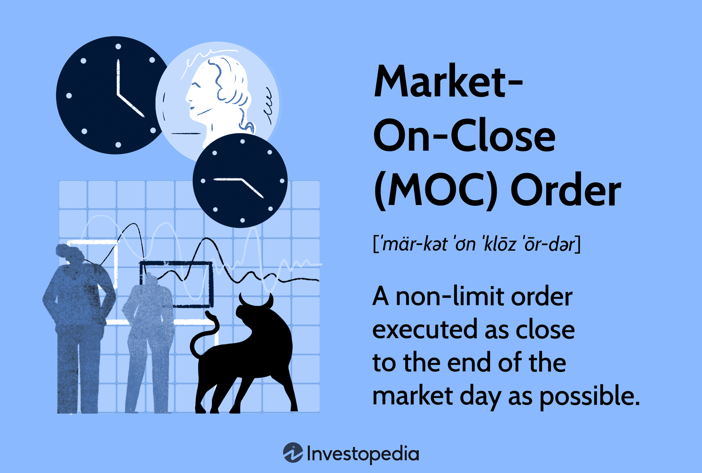

## Table of Contents

## What is a market-on-close (MOC) order?

A market-on-close (MOC) order is a type of order that you can place to buy or sell a stock at the very end of the trading day. When you use an MOC order, your trade will happen at the closing price of the stock. This can be useful if you want to make sure your trade happens at the final price of the day, which some people think can be a good average of the day's trading activity.

MOC orders are often used by investors who want to take advantage of the closing price, which is considered an important benchmark. However, there is a risk because the closing price can be different from what you expect, especially if there are big price movements at the end of the day. It's important to know that MOC orders must be placed before a certain time, usually a few minutes before the market closes, and they are only executed at the close of the market.

## How does a market-on-close order differ from a market order?

A market-on-close (MOC) order and a market order are both ways to buy or sell stocks, but they work differently. A market order is an instruction to buy or sell a stock right away at the best available price in the market. When you place a market order, it gets executed almost immediately during trading hours, which means you get your stocks quickly but the price might not be exactly what you expected if the market is moving fast.

On the other hand, a market-on-close order is placed to buy or sell a stock only at the end of the trading day, at the closing price. This means you have to wait until the market closes for your order to go through. MOC orders can be useful if you think the closing price will be a good one, but you have to place your order before the market closes, usually a few minutes before, and there's a risk that the closing price could be very different from what you were hoping for.

## What are the basic steps to place a market-on-close order?

To place a market-on-close order, you first need to choose a brokerage that supports MOC orders. Once you have an account set up, log into your trading platform. Look for an option to place a new order, and then select "market-on-close" or "MOC" from the types of orders available. You will need to enter the stock symbol of the company you want to buy or sell, and then specify how many shares you want to trade.

After entering your order details, make sure to submit the order before the market's cutoff time, which is usually a few minutes before the market closes. This is important because if you miss the cutoff time, your MOC order won't be executed at the closing price. Once you've submitted your order, it will be queued up and will be executed at the closing price of the stock at the end of the trading day.

## What are the potential benefits of using market-on-close orders?

Using market-on-close orders can be helpful for investors who want to trade at the end-of-day price. The closing price is often seen as a good summary of the day's trading, so some people think it's a fair price to buy or sell at. This can be useful if you believe the stock will end the day at a good price, and you want to make sure you get that price. Also, MOC orders can help you avoid the ups and downs of the market during the day, as you're only trading at the very end.

Another benefit is that MOC orders can be good for people who manage large amounts of money, like big investors or fund managers. They can use MOC orders to make sure all their trades happen at the same time, which can help them get a better average price for their trades. This can make their job easier and might help them save money or make more money in the long run.

## What risks are associated with market-on-close orders?

One risk of using market-on-close orders is that the closing price can be very different from what you expect. The price at the end of the day can change a lot because of big trades or news that comes out right before the market closes. If you're not careful, you might end up buying or selling at a price that's much worse than you wanted.

Another risk is that you have to place your MOC order before a certain time, usually a few minutes before the market closes. If you miss this cutoff time, your order won't happen at the closing price, and you might have to wait until the next day to trade. This can be frustrating and might make you miss out on a good trading opportunity.

## How can market-on-close orders impact stock prices at the close of trading?

Market-on-close orders can have a big effect on stock prices at the end of the trading day. When a lot of people place MOC orders, it can change the supply and demand for a stock right at the close. If there are more MOC orders to sell than to buy, the stock price might go down because there are more people wanting to sell than to buy. On the other hand, if there are more MOC orders to buy, the price might go up because more people want to buy than sell.

This can sometimes cause big price swings at the end of the day. For example, if a big investor places a huge MOC order to sell, it can push the price down a lot. Or, if a lot of people place MOC orders to buy, it can push the price up. These last-minute changes can be risky for people using MOC orders because they might not get the price they were hoping for.

## What are some common strategies that involve market-on-close orders?

One common strategy that uses market-on-close orders is called "end-of-[day trading](/wiki/day-trading-spy)." People who use this strategy think that the closing price is a good average of the day's trading. They might place MOC orders to buy or sell stocks at the end of the day because they believe the closing price will be a fair price. This can be helpful for people who don't want to watch the market all day and just want to trade at the end.

Another strategy is used by big investors or fund managers who need to trade a lot of shares. They use MOC orders to make sure all their trades happen at the same time, at the closing price. This can help them get a better average price for their trades and make their job easier. It's also less likely to move the market price too much if they trade all at once at the end of the day, instead of spreading their trades out during the day.

Sometimes, traders use MOC orders to take advantage of news or events that happen right before the market closes. If they think the news will affect the stock price at the close, they might place an MOC order to buy or sell at the end of the day. This can be risky because the closing price can be different from what they expect, but it can also be a way to make quick decisions based on new information.

## How does the timing of a market-on-close order affect its execution?

The timing of a market-on-close order is really important because you have to place it before a certain time, usually a few minutes before the market closes. If you don't place your order before this cutoff time, it won't happen at the closing price. You might have to wait until the next day to trade, which can be frustrating and might make you miss out on a good chance to buy or sell.

Once you place your MOC order before the cutoff time, it will be queued up and will be executed at the very end of the trading day, at the closing price. This means you have to wait until the market closes to see what price you get. The closing price can be different from what you expect because of big trades or news that comes out right before the market closes. So, it's important to think about the timing carefully when you use MOC orders.

## What role do market-on-close orders play in portfolio management?

Market-on-close orders can be a helpful tool for people who manage their investments, like portfolio managers. They use MOC orders to buy or sell stocks at the end of the trading day, at the closing price. This can be good for them because the closing price is often seen as a fair average of the day's trading. By using MOC orders, they can make sure all their trades happen at the same time, which can help them get a better average price for their trades. This can be especially useful for big investors who need to trade a lot of shares without moving the market price too much.

However, using MOC orders also comes with risks. The closing price can be very different from what they expect, especially if there are big trades or news right before the market closes. This means they might end up buying or selling at a worse price than they wanted. Also, they have to place their MOC orders before a certain time, usually a few minutes before the market closes. If they miss this cutoff time, their orders won't happen at the closing price, and they might have to wait until the next day to trade. So, while MOC orders can be a useful tool in managing a portfolio, it's important to use them carefully and understand the risks involved.

## How do market-on-close orders interact with other types of orders at market close?

Market-on-close orders work together with other types of orders at the end of the trading day. When the market is about to close, different orders like limit orders and stop orders can affect the closing price. A limit order is when you set a specific price you want to buy or sell at, and it will only happen if the price reaches that level. A stop order is when you want to buy or sell if the price moves past a certain point. These orders can change the supply and demand for a stock right at the close, which can push the closing price up or down.

If there are a lot of MOC orders to buy and a lot of limit orders to sell at a certain price, the closing price might end up being close to that limit price. On the other hand, if there are a lot of MOC orders to sell and a lot of limit orders to buy, the closing price might be close to the buy limit price. This interaction can cause the closing price to be different from what people using MOC orders expect. It's important for people using MOC orders to know how these different orders can affect the closing price, so they can make better decisions about when and how to use them.

## What are the regulatory considerations for using market-on-close orders?

When using market-on-close orders, there are some rules and guidelines from the stock market that you need to know about. Different stock exchanges, like the New York Stock Exchange (NYSE) or the NASDAQ, have their own rules about when you can place MOC orders and how they are handled. For example, you have to place your MOC order before a certain time, usually a few minutes before the market closes. If you don't do this, your order won't happen at the closing price. Also, there might be rules about how much you can trade with MOC orders to make sure the market stays fair for everyone.

Another thing to think about is that big investors, like those who manage a lot of money, might have extra rules to follow when using MOC orders. These rules are there to stop them from affecting the market too much with their big trades. For example, they might have to report their MOC orders to the exchange, or they might not be allowed to place MOC orders if they would change the closing price too much. It's important for everyone using MOC orders to know these rules and follow them, so they can trade without any problems.

## How can advanced traders optimize the use of market-on-close orders to minimize risks and maximize benefits?

Advanced traders can optimize the use of market-on-close orders by carefully timing their trades and understanding how the closing price is determined. They need to place their MOC orders before the cutoff time, usually a few minutes before the market closes, to make sure their orders are executed at the end of the day. By doing this, they can take advantage of the closing price, which is often seen as a good average of the day's trading. Advanced traders also keep an eye on the market throughout the day to predict how the closing price might move. If they think the closing price will be good, they can use MOC orders to buy or sell at that price, which can help them get a better deal.

To minimize risks, advanced traders should be aware of how other types of orders, like limit and stop orders, can affect the closing price. They need to understand that big trades or news right before the market closes can change the closing price a lot, so they should be ready for unexpected price movements. One way to manage this risk is to use MOC orders along with other strategies, like setting up limit orders to buy or sell at a specific price if the closing price goes too high or too low. By combining different types of orders, advanced traders can protect themselves from big price swings at the end of the day and make the most out of their MOC orders.

## References & Further Reading

[1]: Bergstra, J., Bardenet, R., Bengio, Y., & Kégl, B. (2011). ["Algorithms for Hyper-Parameter Optimization."](https://dl.acm.org/doi/10.5555/2986459.2986743) Advances in Neural Information Processing Systems 24.

[2]: ["Advances in Financial Machine Learning"](https://www.amazon.com/Advances-Financial-Machine-Learning-Marcos/dp/1119482089) by Marcos Lopez de Prado

[3]: ["Evidence-Based Technical Analysis: Applying the Scientific Method and Statistical Inference to Trading Signals"](https://www.amazon.com/Evidence-Based-Technical-Analysis-Scientific-Statistical/dp/0470008741) by David Aronson

[4]: ["Machine Learning for Algorithmic Trading"](https://github.com/stefan-jansen/machine-learning-for-trading) by Stefan Jansen

[5]: ["Quantitative Trading: How to Build Your Own Algorithmic Trading Business"](https://www.amazon.com/Quantitative-Trading-Build-Algorithmic-Business/dp/1119800064) by Ernest P. Chan