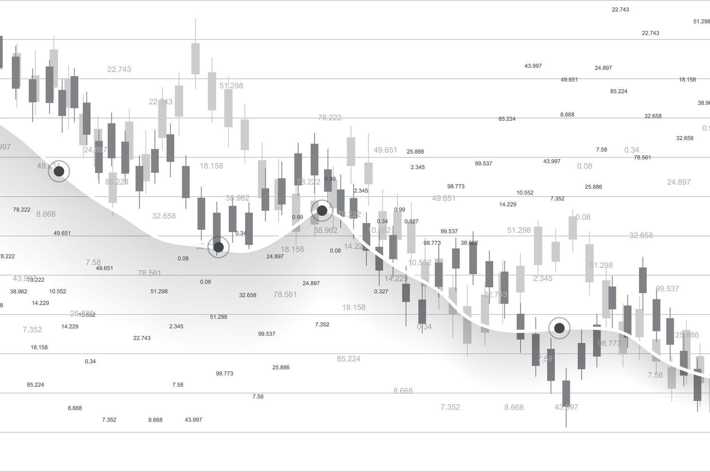

In the fast-paced world of stock trading, having a robust investment strategy is crucial for success. Among various approaches, the Market-on-Close (MOC) order stands out as a strategic instrument for traders aiming to execute trades at or near the market's closing price. As a non-limit market order, the MOC order plays a significant role in ensuring trades are executed based on the final available price of the trading day, a time often associated with increased volatility and volume due to the closing of daily positions by institutional investors.

Understanding the mechanics and benefits of MOC orders is essential for traders seeking to enhance their precision and potentially improve market outcomes. These orders are predominantly used in large exchange markets like the NYSE and NASDAQ, where they are activated shortly before the market closes. By allowing traders to focus on closing prices, MOC orders provide a strategic advantage, particularly when anticipating overnight news or developments that may influence the next trading day's opening.



The integration of MOC orders with algorithmic trading offers further opportunities for traders to optimize their strategies. Algorithmic trading leverages computer programs to execute trades automatically based on pre-determined criteria, improving both speed and accuracy. By incorporating MOC orders into algorithmic trading frameworks, traders can automate end-of-day trades, reduce manual errors, and benefit from systematic execution, all of which contribute to enhanced trading precision.

Through this exploration of MOC orders and their synergy with algorithmic trading, traders can not only refine their strategies but also prepare to navigate the ever-evolving financial markets with greater confidence.

## Table of Contents

## Understanding Market-on-Close (MOC) Orders

Market-on-Close (MOC) orders represent a class of market orders that are specifically designed to be executed as the trading day approaches its conclusion, aiming to secure the trade at the final market price of the day. These orders become active a short time before the market officially closes, ensuring that the transaction takes place at or near the closing bell, which is typically seen as a key price point due to its reflection of the day's cumulative trading activity.

The operational mechanics of MOC orders render them particularly prevalent in major stock exchanges such as the New York Stock Exchange (NYSE) and NASDAQ. These exchanges delineate specific cut-off times and rules for the receipt and modification of MOC orders, which traders must adhere to. For instance, the NYSE traditionally requires that MOC orders be submitted before 3:45 PM ET, after which modifications are generally restricted except to reduce the size or cancel the order entirely. On the NASDAQ, the regulations may vary slightly but follow a similar structure aimed at maintaining orderly trading.

Traders opt for MOC orders for a variety of strategic purposes. One prominent reason is the facilitation of executing end-of-day trades when [liquidity](/wiki/liquidity-risk-premium) is typically higher as institutional investors finalize their trades to balance portfolios. Additionally, the closing price is often used as a benchmark in performance evaluations, making MOC orders a logical choice for traders looking to ensure their transactions align with this standard reference point. 

Furthermore, traders who utilize MOC orders often do so to mitigate the impact of overnight news and events that might occur outside regular trading hours. By locking in transactions at the close, they effectively cap their exposure to such after-hours developments, providing them a degree of predictability in volatile markets.

In summary, MOC orders are a valuable tool for traders aiming to leverage the strategic benefits of executing trades at the closing price. This facilitates alignment with end-of-day market conditions and benchmarks, while accommodating specific trading goals within the constraints and opportunities presented by major exchanges.

## Benefits and Risks of MOC Orders

Market-on-Close (MOC) orders provide traders with strategic advantages and potential risks that must be carefully evaluated. These orders are executed at or near the trading day's closing price, enabling traders to react swiftly to anticipated developments. A significant benefit of MOC orders is their ability to capitalize on news or economic events that might occur after the market closes, influencing the next trading day's opening. By securing an execution at the day's closing price, traders can pre-emptively position themselves based on expected market shifts.

MOC orders offer substantial convenience, particularly for investors operating across diverse time zones. By automating the execution of strategically significant trades at the close of trading, market participants can circumvent the need for real-time oversight across global markets. This feature is particularly advantageous for institutional investors and fund managers who require timely responses to market conditions without the constraint of geographical disparities.

However, the utilization of MOC orders is not devoid of drawbacks. A central risk associated with these orders is the intrinsic price uncertainty. As MOC orders are executed at the closing price, traders are subject to the [volatility](/wiki/volatility-trading-strategies) inherent in the market's final moments. Sudden shifts in demand or supply can lead to unanticipated price adjustments, potentially resulting in execution at a less favorable price than anticipated.

Moreover, the end-of-day market congestion often poses execution challenges for MOC orders. The increased [volume](/wiki/volume-trading-strategy) of transactions towards market closure can lead to delays, slippage, or partial fills, adversely impacting the intended outcome of the trade. Traders must remain vigilant to these risks, incorporating measures such as liquidity analysis and volatility assessment to mitigate potential adverse effects.

Understanding the balance between the benefits and risks of MOC orders is crucial for effective trading strategies. While they offer compelling advantages for aligning trades with overnight market expectations, the inherent uncertainties and execution challenges necessitate thorough analysis and risk management practices. By comprehensively evaluating these factors, traders can make informed decisions, optimizing their strategies to achieve improved market outcomes.

## Integrating Algorithmic Trading with MOC Orders

Algorithmic trading, often referred to as algo trading, employs sophisticated computer programs to execute a massive volume of trades at an accelerated pace based on specific rules and criteria. Within this framework, Market-on-Close (MOC) orders serve as an effective strategy for traders looking to capitalize on end-of-day price movements.

The integration of MOC orders into [algorithmic trading](/wiki/algorithmic-trading) strategies offers a multitude of advantages. One of the primary benefits is the automation of the trading process, where algorithms systematically execute MOC orders at the market close without human intervention, thereby reducing manual errors and enhancing precision. By executing trades at the day's closing price, traders can take advantage of the liquidity typically observed at this time, alongside assessing the most accurate daily price reflecting market sentiment.

Algorithmic systems designed to manage MOC orders are generally built to monitor specified conditions during trading hours, dynamically responding to market changes by queuing MOC orders before the market closes. This monitoring involves analyzing volume, price trends, and volatility, which can be implemented using Python programming. For example, a simplistic Python script utilizing a library like `pandas` alongside `TradingAPI` (a fictional library for demonstration) could be designed as follows:

```python
import pandas as pd
from TradingAPI import TradingClient

client = TradingClient(api_key='YOUR_API_KEY')

# Monitor market data
market_data = client.get_market_data(symbol='AAPL')
closing_price = market_data['close']

# Define MOC order criteria
def place_moc_order():
    if market_data['volume'] > 1000000:  # Check if volume condition is met
        client.place_order(symbol='AAPL', order_type='MOC', quantity=100)
        print("MOC Order Placed")

# Execute at end of day
place_moc_order()
```

This code snippet represents a basic form of algorithmic trading, where specific conditions around volume are checked before placing an MOC order. Such algorithms can be intricately designed to consider a multitude of other factors, including historical data patterns and predictive analytics models, to enhance trade accuracy and effectiveness.

Traders commonly employ [machine learning](/wiki/machine-learning) models to improve their strategy's performance. Techniques such as regression analysis can help predict the optimal timing and quantity for MOC orders, based on historical price and volume trends. The goal is to minimize slippage—the difference between expected and actual execution prices—and optimize trade execution costs.

Challenges such as latency can arise, reflecting issues in communication delays that may hinder the timely placement of MOC orders. Advanced algorithmic strategies incorporate latency reduction measures, such as utilizing high-speed data feeds or locating in proximity to exchange servers, to ensure timely order execution.

By effectively integrating MOC orders with algorithmic trading, traders can systematically manage end-of-[day trading](/wiki/day-trading-spy) activities, optimizing their investment strategies while minimizing potential pitfalls associated with manual trading.

## Types and Variations of MOC Orders

Market-on-Close (MOC) orders are versatile tools for traders aiming to execute trades at or near the closing price of a trading session. While standard MOC orders are used to target the final available price of securities, there are several variations and types that offer customization to meet specific trading needs.

**1. Limit MOC Orders:**

Limit MOC orders combine the features of limit orders with MOC orders. A trader can specify a price limit at which they are willing to execute the trade at the market close. If the closing price does not meet the specified limit criteria, the order will not be executed. This variation provides a safeguard against executing at an unfavorable closing price while still taking advantage of the benefits of a MOC order.

**2. Time-in-Force (TIF) Orders:**

Traders can further refine their execution strategy using time-in-force options. These instructions specify how long an order remains active in the market. Common TIF instructions include:

- **Day Orders:** These orders are valid only for the trading day on which they are placed. If not executed by the end of the day's trading session, they expire automatically. This is typically the default setting for MOC orders.

- **Fill or Kill (FOK):** An FOK order must be executed immediately and in full; otherwise, it will be canceled. This type of order is useful when a trader absolutely must execute the full order size without leaving portions unfilled.

- **Immediate or Cancel (IOC):** An IOC order requires that any portion of the order that can be filled immediately is executed, and the remaining portion is canceled. This type is beneficial when immediate execution is partially acceptable.

**Strategic Uses:**

The availability of these variations allows for strategic flexibility in trade management. Limit MOC orders are particularly useful in volatile markets, where closing prices can vary significantly from expectations. They provide a mechanism to engage the closing price advantage while controlling price risk. Time-in-force variations like FOK and IOC offer further control over execution timing, enabling traders to respond to liquidity concerns or to align with precise risk management strategies.

By selecting the appropriate type of MOC order, traders can align their strategies with market conditions and individual investment goals, optimizing their trade execution process and potentially enhancing market outcomes.

## Practical Use Cases and Examples

Market-on-Close (MOC) orders find significant utility in various real-world trading scenarios, particularly due to their execution at the closing price of trading sessions. This capability makes them suitable for responding effectively to earnings reports, market announcements, and other influential market activities.

### Reacting to Earnings Reports and Market Announcements

MOC orders are strategically employed when companies release quarterly earnings reports. These announcements often lead to significant stock price movements due to the anticipated and actual performance metrics disclosed. Traders use MOC orders to align their positions with the closing prices of stocks affected by such reports. For instance, if a company like Apple Inc. announces higher-than-expected earnings, traders anticipating a positive market reaction might place MOC buy orders to capitalize on potential overnight gains.

### Portfolio Adjustments and Risk Hedging

MOC orders are also valuable for portfolio managers aiming to rebalance their holdings. At the end of a trading day, adjustments may be required to align a portfolio with a target allocation or to hedge against identified risks. An example could involve a mutual fund rebalancing its equity portion by executing MOC orders to ensure that trades occur at the market closing prices, maintaining consistent NAV calculations for investor reports.

For hedging purposes, consider a scenario where a trader holds multiple positions susceptible to specific economic announcements. The trader can use MOC orders to enter derivative positions, such as options or futures, that mirror the exposure of the underlying securities. By doing this, the trader creates a hedge that ensures the portfolio's value remains stable despite noticeable market movements at the close.

### Practical Illustrations

To illustrate, suppose a trader has a diversified portfolio including tech stocks. Anticipating an industry-wide announcement on regulatory changes, which may affect tech stocks negatively, the trader can employ MOC sell orders to reduce exposure to affected stocks by the market close. The ability to execute these orders at the session's end ensures the trader reacts with minimum delay after the full extent of news impact is observed.

Moreover, consider a quantitative [hedge fund](/wiki/hedge-fund-trading-strategies) implementing algorithmic strategies where MOC orders are programmed into algorithms for systematic trades. These algorithms might assess market sentiment derived from daily news feeds. By concentrating trades at the day's end, the fund can achieve consistent results across diverse market scenarios, ensuring that deviations caused by intraday volatility are mitigated.

In conclusion, MOC orders provide traders with robust tools to exploit end-of-day price movements effectively. By leveraging MOC orders in reaction to specific market drivers, traders can achieve precise portfolio adjustments and risk hedging, benefiting from the strategy's inherent alignment with closing market dynamics.

## Challenges and Solutions in MOC Algo Trading

Algorithmic trading, particularly when deploying Market-on-Close (MOC) orders, presents unique challenges, primarily revolving around latency issues and order rejection risks near market closure. These challenges can undermine the efficiency and accuracy of trading strategies, leading to potential miscalculations in closing prices and, subsequently, financial losses.

### Challenges

**1. Latency:**  
Latency is the delay from when a trade order is placed to when it is executed. In the context of MOC orders, high latency can result in trades being executed at prices significantly different from those anticipated. This issue is exacerbated as markets approach closing times, where rapid volatility can heavily influence MOC order execution.

**2. Order Rejection:**  
Order rejection near market close is another significant hurdle. This happens when exchanges refuse to accept an order due to constraints like insufficient liquidity or technical glitches in trading systems. Given that MOC orders are intended for execution at the close, any rejection can lead to missed trading opportunities and financial ramifications.

### Solutions

**1. Custom Session Creation:**  
One potential solution is the creation of custom trading sessions. By calibrating trading algorithms to initiate orders during optimal periods, traders can minimize exposure to end-of-day volatility. Custom sessions can be programmed to trigger MOC orders slightly before the standard closing auction, providing a buffer against the market congestion typically seen at close.

**Example in Python:**

```python
import datetime

def schedule_moc_order():
    current_time = datetime.datetime.now()
    # Setting a custom session 10 minutes before market close
    market_close = datetime.datetime(current_time.year, current_time.month, current_time.day, 15, 50)

    if current_time >= market_close:
        place_moc_order()
    else:
        schedule_moc_order()  # Re-run until the condition meets

def place_moc_order():
    print("Placing MOC Order at:", datetime.datetime.now())
```

**2. Strategic Timing Modifications:**  
Strategies involving timing modifications can help reduce latency. Traders could adjust the timing of their order submissions by incorporating more sophisticated predictive analytics to anticipate the optimal moment for order entry, thus circumventing periods of expected high traffic and potential exchange bottlenecks.

**3. Infrastructure Enhancement:**  
Upgrading network infrastructure to reduce latency is critical. Leveraging low-latency networks and co-location services (where trading systems are placed in proximity to exchange servers) can significantly minimize execution delays.

**4. Algorithm Optimization:**  
Improving the underlying algorithms to handle edge cases and unexpected market behaviors is essential. Implementing robust error-handling routines and adaptive machine learning algorithms can adapt to real-time market conditions, reducing the impact of unforeseen issues.

In conclusion, tackling the challenges associated with MOC orders in algorithmic trading requires a blend of strategic planning and technological upgrades. By addressing latency and order rejection through custom sessions, timing adjustments, and infrastructure improvements, traders can enhance their systems, ensuring better performance and reliability under high-pressure trading scenarios.

## Conclusion and Best Practices

The Market-on-Close (MOC) order investment strategy is integral to contemporary trading, offering traders an avenue to execute trades at the closing price of the trading day. This approach leverages the predictability of trading settlements around the end of the trading session, providing both a tactical advantage in capitalizing on price movements and a method for managing portfolio adjustments. However, like any investment strategy, it encompasses certain risks and necessitates strategic management to maximize its efficiency and minimize potential downsides.

Regarding best practices, traders should be keenly aware of the specific cut-off times for submitting or adjusting MOC orders in different exchanges, such as the NYSE and NASDAQ. Timely submission is crucial to ensure the intended execution of orders. Moreover, integrating MOC orders with algorithmic trading can significantly optimize their use. Algorithms help automate the transaction process, reduce human error, and ensure swift execution. This integration facilitates systematic trading, which can enhance a trader's ability to respond to market conditions effectively.

It's essential for traders and investors to consistently engage in market analytics and brisk decision-making, given the inherent price volatility and execution uncertainties associated with MOC orders. A trader should assess market news and events that might influence closing prices, adapting their strategies in response to this information. Additionally, employing variations and hybrids of MOC orders, such as limit MOC and time-in-force orders, can provide more flexibility, catering to specific trading strategies and risk appetites.

Ongoing education and adaptation are key components to sustaining a competitive advantage. The market environment is always changing, with technological advances continually reshaping how trading is conducted. Staying informed, understanding new trading tools, and remaining adaptable allow traders to refine their strategies effectively. Traders should also participate in seminars, workshops, and forums for continuous learning and networking with other market participants. By doing so, traders not only enhance their proficiency in utilizing MOC orders but also ensure they remain agile in a constantly evolving trading landscape.

## References & Further Reading

[1]: Bergstra, J., Bardenet, R., Bengio, Y., & Kégl, B. (2011). ["Algorithms for Hyper-Parameter Optimization."](https://dl.acm.org/doi/10.5555/2986459.2986743) Advances in Neural Information Processing Systems 24.

[2]: ["Advances in Financial Machine Learning"](https://www.amazon.com/Advances-Financial-Machine-Learning-Marcos/dp/1119482089) by Marcos Lopez de Prado

[3]: ["Evidence-Based Technical Analysis: Applying the Scientific Method and Statistical Inference to Trading Signals"](https://www.amazon.com/Evidence-Based-Technical-Analysis-Scientific-Statistical/dp/0470008741) by David Aronson

[4]: ["Machine Learning for Algorithmic Trading"](https://github.com/stefan-jansen/machine-learning-for-trading) by Stefan Jansen

[5]: ["Quantitative Trading: How to Build Your Own Algorithmic Trading Business"](https://www.amazon.com/Quantitative-Trading-Build-Algorithmic-Business/dp/1119800064) by Ernest P. Chan