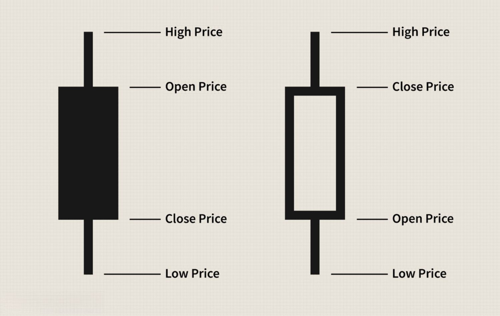

Financial analysis is a cornerstone of stock market trading, providing the methodology and tools necessary for investors and traders to make informed decisions. It encompasses a wide range of techniques and processes used to evaluate financial data, market trends, and economic variables, enabling participants to forecast future price movements and optimize their investment strategies. The market open represents a critical juncture for traders and analysts alike, as it sets the stage for daily trading activities. This is a time when accumulated data from overnight markets and news events have their initial impact, leading to increased volatility and trading volume. As such, the actions taken by traders and analysts during this period can significantly influence the day's trading outcomes and long-term portfolio performance.

Stock market indicators play a pivotal role in formulating trading decisions. These mathematical calculations are based on historic price, volume, or even market psychology data, and they serve as signals or guidance points for traders. Popular indicators such as moving averages, the Relative Strength Index (RSI), and the Moving Average Convergence Divergence (MACD) provide critical insights into market dynamics by highlighting trends, overbought or oversold conditions, and potential price reversals. Understanding these indicators and their implications can greatly enhance a trader's ability to predict market movements and execute profitable trades.

Algorithmic trading has gained substantial traction in recent years, revolutionizing the landscape of financial markets. By leveraging complex algorithms and computational models, traders can execute orders at speeds and frequencies that far exceed human capabilities. This form of automated trading capitalizes on the minute price discrepancies and market inefficiencies that occur in real-time, particularly influential during the market open when volatility is high. The increasing popularity of algorithmic trading is driven by its ability to minimize human error, implement rigorous risk management strategies, and optimize execution costs.

The purpose of this article is to equip readers with a comprehensive understanding of how financial analysis, stock market indicators, and algorithmic trading converge to inform and elevate trading strategies. Readers can expect to gain insights into the technical and theoretical frameworks that underpin these concepts, explore real-world applications and case studies, and discover emerging trends in market analysis tools. By the conclusion, traders will be encouraged to synthesize traditional analysis techniques with innovative algorithmic solutions, paving the way for a more dynamic and informed approach to stock market trading.

## Table of Contents

## Understanding Financial Analysis in the Stock Market

Financial analysis in the stock market involves the evaluation of various financial metrics and data to assess the value and potential future performance of a company or security. It serves as a cornerstone for making informed investment decisions, offering a structured approach to understanding market operations and company performance.

The significance of financial analysis in trading lies in its ability to provide insights into the financial health and future prospects of companies, thereby aiding traders and investors in identifying profitable investment opportunities and avoiding potential risks. It is a critical tool for evaluating stocks, as it allows analysts and traders to determine whether a stock is undervalued or overvalued.

Key components of financial analysis include both quantitative and qualitative assessments. Quantitative analysis involves evaluating financial statements, such as balance sheets, income statements, and cash flow statements. Key metrics used in quantitative analysis include earnings per share (EPS), price-to-earnings (P/E) ratio, return on equity (ROE), and debt-to-equity ratio. For example, EPS is calculated as:

$$
\text{EPS} = \frac{\text{Net Income} - \text{Dividends on Preferred Stock}}{\text{Average Outstanding Shares}}
$$

Qualitative analysis, on the other hand, focuses on factors such as management effectiveness, industry conditions, competitive position, and market trends. This type of analysis requires a deep understanding of the broader context in which a company operates and is often more subjective than quantitative analysis.

Financial analysis informs investment strategies by providing data-driven insights that can be used to forecast future market conditions and make strategic decisions. Investors use these analyses to determine the intrinsic value of a stock, which involves comparing its current market price to an estimated fair value. If the current price is below the estimated fair value, the stock might be a good buying opportunity, and vice versa.

The impact of accurate analysis on profitability and risk management is profound. Precise financial analysis can lead to significant returns by identifying undervalued stocks poised for growth or by advising timely exits from overvalued positions. Moreover, it aids in risk management by highlighting the financial vulnerabilities of companies, thus guiding investors to diversify their portfolios and hedge against potential losses.

In conclusion, financial analysis is an indispensable element in stock market trading, shaping investment strategies through the meticulous evaluation of financial data and contributing significantly to profitability and the effective management of investment risks. Through careful analysis, traders can gain a competitive edge, optimize their portfolios, and make well-informed decisions that reflect both current market conditions and future expectations.

## The Role of Stock Market Indicators

Stock market indicators are quantitative tools that traders and analysts use to interpret market data and predict future price movements. These indicators are derived from applying mathematical computations to historical price data, which help in identifying patterns and trends crucial for making informed trading decisions.

**Types of Stock Market Indicators**

Stock market indicators can be broadly categorized into three types: trend, [momentum](/wiki/momentum), and [volatility](/wiki/volatility-trading-strategies) indicators. 

1. **Trend Indicators**: These indicators show the direction of the market. A classic example is the *Moving Average (MA)*. The MA smooths out price data by creating a constantly updated average price. For instance, a 50-day moving average represents an average of the last 50 days' prices. Traders often look for "crossovers," such as when a short-term MA crosses above a long-term MA, suggesting a bullish trend.

2. **Momentum Indicators**: These indicators measure the speed or rate of change of price movement, providing insights into the strength of a trend. The *Relative Strength Index (RSI)* is a widely used momentum indicator that ranges from 0 to 100. Traditionally, RSI values above 70 indicate overbought conditions, while values below 30 suggest oversold conditions.

3. **Volatility Indicators**: These indicators assess the rate at which the price of a security increases or decreases. The *Bollinger Bands*, consisting of a middle band (simple moving average) and two outer bands (standard deviations), provide a visual overview of volatility. A squeeze (when the bands are close together) can indicate a potential period of high volatility.

**Application of Stock Market Indicators**

Indicators like MA, RSI, and MACD (Moving Average Convergence Divergence) are integral in formulating various trading strategies. MACD, a trend-following momentum indicator, is typically used to identify short-term price momentum. It involves the calculation of the difference between two exponential moving averages (EMAs), usually the 12-day EMA and the 26-day EMA.

The formula for MACD is:

$$
\text{MACD} = \text{EMA}_{12} - \text{EMA}_{26}
$$

A nine-day EMA of the MACD, known as the "signal line," is plotted on top of the MACD line to signal buy or sell opportunities. A trader might execute a trade when the MACD crosses above the signal line, anticipating a bullish trend.

**Analyzing Market Trends and Patterns**

By observing how indicators interact with price charts, traders can detect various market patterns. A moving average crossover might indicate a trend reversal, while persistent RSI levels can signal the trend's strength. For instance, a persistent RSI above 70 may corroborate a strong upward momentum, encouraging traders to hold their positions longer.

**Case Studies of Indicator-Driven Trades**

To illustrate, consider a scenario using the moving average crossover strategy. A trader might notice that during past engagements when the 50-day moving average crossed the 200-day moving average (a "Golden Cross"), the stock price generally rose over the subsequent months. Ensuing trades based on this premise could have yielded positive results in instances where market conditions align with this historical pattern.

Such examples underscore the importance of stock market indicators not as solitary predictors but as tools that, when combined and analyzed accurately, can lead to more consistent trading outcomes.

## Key Events at Market Open and Their Impact

Market open represents a crucial period for stock market traders, as it is characterized by heightened volatility and trading [volume](/wiki/volume-trading-strategy). This is where key events unfold, impacting trading strategies and decision-making.

Market open holds significant importance due to the market's adjustment to overnight developments and pre-market indicators. It is during this period that traders assimilate data from diverse sources, including geopolitical events, macroeconomic news, earnings reports, or any unexpected announcements that occurred after the previous market close. Such overnight news can create gaps between the previous day's closing prices and the opening prices, leading to opportunities as well as risks for traders. Pre-market data, such as futures prices and economic indicators released before the market opens, provide insights into market sentiment and expected movement. Traders analyze this data to place their orders as the market opens, influencing initial price actions.

The strategies employed during the first hour of trading, known as the "opening range," are pivotal in capitalizing on market momentum and identifying potential reversals. Traders may use several strategies, like gap trading and opening range [breakout](/wiki/breakout-trading) strategies. Gap trading involves taking positions based on price disparities between the previous day's close and the current open. Traders may attempt to profit by betting on whether the gap will continue or close. For example, if a stock opens significantly higher due to positive overnight news, traders might anticipate a continuation of this movement or a correction. In contrast, the opening range breakout strategy focuses on the early establishment of support and resistance levels within the first hour. Traders take long or short positions once prices break out of these ranges, anticipating sustained movement in the breakout direction.

Historical examples highlight the profound impact of market open events on trading days. For instance, significant corporate earnings announcements made after market hours can cause sharp movements at the open, impacting not only individual stocks but also broader indices. On September 8, 2008, the announcement of the U.S. government's takeover of Fannie Mae and Freddie Mac prompted a rally at the market open, reflecting the immediate assimilation of the news. Similarly, geopolitical tensions, like unexpected military actions or trade policy announcements, can lead to abrupt shifts in market sentiment, reflected almost instantaneously in the market open prices.

In summary, the market open is a pivotal stage for traders due to its inherent volatility and the assimilation of overnight news and pre-market data. Traders adopt various strategies to navigate and exploit this early trading phase, aiming to benefit from the rapid price movements that define the opening moments of trading.

## The Rise of Algorithmic Trading

Algorithmic trading refers to the use of computer algorithms to automate trading decisions and executions in financial markets. These algorithms rely on complex mathematical models and statistical analysis to make trading decisions at speeds and frequencies that are impossible for human traders. The mechanics of [algorithmic trading](/wiki/algorithmic-trading) involve programming computers to follow a defined set of instructions for placing a trade in order to generate profits at a speed and frequency that human traders cannot match.

One of the primary advantages of using algorithms in trading, particularly during market open, is the ability to process vast amounts of data in real time. This capability allows for the identification of trading opportunities that might be missed by human traders due to information overload or slower processing speeds. Algorithms can quickly assimilate overnight news, pre-market data, and other variables to make informed trading decisions as soon as the market opens. Additionally, algorithms help in maintaining discipline during trading by adhering strictly to the pre-defined set of rules, thereby reducing the impact of emotional and psychological factors in trading decisions.

Despite these advantages, algorithmic trading faces several challenges. One significant challenge is the risk of market anomalies and flash crashes, which can occur when algorithms interact in unforeseen ways. To address these issues, developers implement robust risk management protocols, including circuit breakers and stop-loss orders, to prevent excessive losses during volatile market conditions. Another challenge is the requirement for continuous adaptation and fine-tuning of algorithms to cope with changing market dynamics. This necessitates ongoing research, [backtesting](/wiki/backtesting), and simulation to ensure that the trading strategies remain profitable and relevant.

Artificial intelligence (AI) and [machine learning](/wiki/machine-learning) have significantly impacted the evolution of algorithmic trading by enhancing the predictive power and efficiency of algorithms. Machine learning models can identify complex patterns and correlations in historical market data, improving the accuracy of predictions about future market movements. These advancements allow for the creation of adaptive algorithms that learn from new data, dynamically adjusting their strategies in response to evolving market conditions. This integration of AI and machine learning represents a paradigm shift in algorithmic trading, moving it from rule-based systems to more sophisticated models capable of continuous learning and improvement.

In conclusion, algorithmic trading represents a significant advancement in stock market trading, offering substantial speed and efficiency advantages. While it presents challenges, particularly concerning market stability and the need for constant adaptation, the incorporation of AI and machine learning continues to drive innovation, improving the robustness and sophistication of trading strategies. As technology advances, the synergy between algorithms and financial analysis looks set to deepen, promising further enhancements in trading performance and decision-making.

## Integrating Algorithms with Financial Analysis and Indicators

Algorithms in stock market trading leverage financial analysis and indicators to execute data-driven trading strategies. These algorithms process vast amounts of financial data, identifying patterns and executing trades at speeds beyond human capability. 

Firstly, financial analysis forms the foundation upon which algorithmic trading strategies are built. Algorithms incorporate various analytical models to interpret financial information, incorporating fundamental and technical analysis to predict stock price movements. Key indicators such as Moving Averages (MA), Relative Strength Index (RSI), and Moving Average Convergence Divergence (MACD) are often embedded within these algorithms to signal trading opportunities. For example, a simple algorithm might use the crossover of short-term and long-term moving averages as a signal to buy or sell a stock.

In addition, the integration of algorithms with human analytics represents a powerful synergy in trading. While humans possess the intuition and qualitative insights required for understanding market nuances, algorithms offer precision, speed, and the ability to analyze large datasets without bias. Traders often use a hybrid approach where they formulate a strategy based on their analysis and deploy algorithms to implement these strategies efficiently. For example, a trader might use an algorithm to monitor multiple stocks simultaneously, setting pre-determined conditions for executing trades.

Several examples illustrate the effectiveness of integrating financial data and indicators into algorithmic strategies. One notable approach is pairs trading, where algorithms exploit the price relationship between two historically correlated stocks. By analyzing historical trading data and employing statistical techniques, algorithms can determine divergence and convergence points between these stocks, enabling profitable trading decisions. Another strategy involves using sentiment analysis from news articles and social media to anticipate market movements, which, when combined with traditional financial indicators, can enhance the predictive power of trading algorithms.

Looking to the future, the integration of [artificial intelligence](/wiki/ai-artificial-intelligence) (AI) and machine learning (ML) techniques with financial analysis and indicators is poised to revolutionize algorithmic trading. AI and ML can process unstructured data, learning from historical trends to improve prediction accuracy. These technologies can dynamically adapt to changing market conditions, optimizing strategies based on real-time data analysis. Furthermore, the increased use of quantum computing in trading promises to expedite complex simulations and analytics, potentially transforming the efficiency and scope of algorithmic trading.

In conclusion, financial data and stock market indicators are integral to algorithmic trading, offering robust frameworks for decision-making. The fusion of algorithmic systems with traditional human analytics continues to enhance trading effectiveness, while ongoing advancements in AI and ML signal a promising future for even more sophisticated integration in trading strategies.

## Conclusion

Financial analysis and stock market indicators remain crucial elements in making informed trading decisions. These tools provide traders with the insights needed to assess market conditions, evaluate asset performance, and identify potential opportunities. Financial analysis, which includes evaluating market data, financial statements, and macroeconomic factors, helps traders develop well-grounded strategies, ultimately impacting profitability and risk management. Stock market indicators, such as moving averages, Relative Strength Index (RSI), and Moving Average Convergence Divergence (MACD), offer traders essential information on market trends and potential reversals, thereby facilitating more precise decision-making.

The advent of algorithmic trading has significantly transformed the landscape of stock markets. Algorithms, using sophisticated mathematical models and vast data analysis, have automated many aspects of trading, increasing efficiency and speed. These systems are particularly effective in high-frequency trading environments, outperforming traditional methods by executing trades within microseconds. The integration of artificial intelligence and machine learning has further enhanced algorithmic trading's capabilities, enabling these systems to adapt and refine their strategies based on real-time market data.

Market analysis tools have evolved from [fundamental analysis](/wiki/fundamental-analysis) and technical indicators to incorporate advanced quantitative models. The continuous enhancement of these tools ensures that traders can access diverse and comprehensive data analytics, supporting more nuanced decision-making. This evolution underscores the importance of ongoing education and adaptation in trading techniques, as market dynamics continue to change.

While algorithmic trading offers numerous advantages, traders are encouraged to maintain a balance with traditional analysis methods. Human intuition, experience, and qualitative assessment still play essential roles in evaluating market sentiment and unforeseen events that algorithms might not completely anticipate. Successful traders often integrate both algorithmic solutions and traditional analysis to maximize their trading outcomes, acknowledging that each approach has its unique strengths and limitations. As market technologies continue to advance, a balanced strategy will likely remain a pivotal element in effective trading.

## References & Further Reading

[1]: ["Algorithms for Hyper-Parameter Optimization"](https://dl.acm.org/doi/10.5555/2986459.2986743) by Bergstra, J., Bardenet, R., Bengio, Y., & Kégl, B., Advances in Neural Information Processing Systems 24 (2011).

[2]: ["Advances in Financial Machine Learning"](https://www.amazon.com/Advances-Financial-Machine-Learning-Marcos/dp/1119482089) by Marcos Lopez de Prado.

[3]: ["Evidence-Based Technical Analysis: Applying the Scientific Method and Statistical Inference to Trading Signals"](https://www.amazon.com/Evidence-Based-Technical-Analysis-Scientific-Statistical/dp/0470008741) by David Aronson.

[4]: ["Machine Learning for Algorithmic Trading"](https://github.com/stefan-jansen/machine-learning-for-trading) by Stefan Jansen.

[5]: ["Quantitative Trading: How to Build Your Own Algorithmic Trading Business"](https://www.amazon.com/Quantitative-Trading-Build-Algorithmic-Business/dp/1119800064) by Ernest P. Chan.