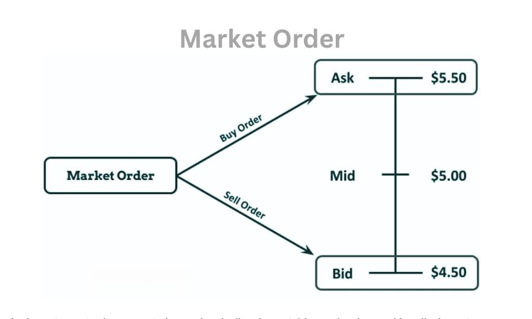

## Table of Contents

## What is a market order?

A market order is a type of order you can use when you want to buy or sell something, like stocks or other investments, right away. When you place a market order, you're telling the trading system to complete your order as quickly as possible at the current market price. This means you might not know the exact price you'll get until the order is filled, but it's a fast way to make a trade.

Market orders are popular because they are simple and quick. They are useful when you want to get into or out of a position without delay. However, there's a small risk that the price could change quickly before your order is completed, especially in fast-moving or less liquid markets. So, while market orders are great for speed, it's good to be aware of these potential price changes.

## How does a market order differ from other types of orders?

A market order is different from other types of orders because it's all about speed. When you use a market order, you're saying, "I want to buy or sell this right now, at whatever the current price is." It's the fastest way to make a trade because it gets done right away. But, you don't know the exact price you'll get until it's done, which can be a bit risky if prices are changing fast.

Other types of orders, like limit orders and stop orders, give you more control over the price. A limit order lets you set a specific price you're willing to buy or sell at. So, you might say, "I want to buy this stock, but only if it's $50 or less." It won't happen right away if the price isn't right, but you know you won't pay more than you want. A stop order, on the other hand, is used to limit losses or protect profits. You set a "stop price," and when the market hits that price, it turns into a market order. This can help you sell a stock if it starts to drop too much, but you still might not get the exact price you want because it becomes a market order once the stop price is hit.

## When should you use a market order?

You should use a market order when you want to buy or sell something quickly. This is good if you see a price you like and want to make sure you get the trade done fast. For example, if you're watching a stock and it suddenly goes down a lot, you might want to buy it right away before the price goes back up. A market order makes sure your trade happens as soon as possible.

Market orders are also useful when you're not too worried about getting a specific price. If the price moving a little bit up or down doesn't bother you, a market order is a simple way to get your trade done. Just remember, in fast-moving or less liquid markets, the price might change a bit before your order is filled, so it's best for times when speed is more important than the exact price.

## What are the advantages of using a market order?

One big advantage of using a market order is that it's fast. When you want to buy or sell something quickly, a market order gets the job done right away. This is really helpful if you see a price you like and don't want to miss out. For example, if a stock suddenly drops and you want to buy it before it goes back up, a market order makes sure you get in fast.

Another advantage is that market orders are simple to use. You don't need to worry about setting specific prices or waiting for the market to reach a certain point. You just tell the system to buy or sell at the current price, and it happens. This simplicity is great if you're new to trading or if you just want a straightforward way to make a trade without thinking too much about the details.

## What are the potential risks or disadvantages of using a market order?

One risk of using a market order is that you might not get the exact price you expect. When you place a market order, you're telling the system to buy or sell at the best available price right now. But in fast-moving markets, that price can change quickly before your order is filled. This means you could end up paying more than you thought if you're buying, or getting less if you're selling. It's a small risk, but it's something to keep in mind, especially if the market is moving a lot.

Another disadvantage is that market orders can be risky in less liquid markets. In these markets, there might not be many people buying or selling at any given time. So, when you place a market order, it might take a bit longer to fill, and the price could move even more while the system tries to find someone to trade with. This can lead to what's called "slippage," where the final price you get is different from what you expected when you placed the order. If you're not careful, this could affect your trading strategy or the overall outcome of your trade.

## How is the execution price of a market order determined?

When you place a market order, the execution price is the best available price at that moment in the market. If you're buying, the execution price will be the lowest price someone is willing to sell at right then. If you're selling, it will be the highest price someone is willing to buy at. This is because a market order tells the system to get your trade done as fast as possible, so it takes the first price it can find.

In a very active market with lots of buyers and sellers, the execution price is usually close to the price you see when you place your order. But in markets that are moving fast or don't have many people trading, the price can change quickly. This means the price you end up with might be a bit different from what you expected. It's all about how quickly the system can match your order with someone else's, and that depends on what's happening in the market at that exact moment.

## Can a market order be used for both buying and selling securities?

Yes, a market order can be used for both buying and selling securities. When you want to buy a security, you can use a market order to get it as quickly as possible. You tell the trading system, "I want to buy this right now at the best available price." The system then looks for the lowest price someone is willing to sell at and completes your order at that price.

When you want to sell a security, a market order works the same way but in reverse. You tell the system, "I want to sell this right now at the best available price." The system finds the highest price someone is willing to buy at and completes your order at that price. So, whether you're buying or selling, a market order is a fast and simple way to make a trade, but remember the price might not be exactly what you expect if the market is moving quickly.

## How does market volatility affect market orders?

Market [volatility](/wiki/volatility-trading-strategies) can make a big difference when you use market orders. When the market is moving a lot, prices can change really fast. If you place a market order during this time, the price you end up with might be different from what you saw when you placed your order. This is because a market order tells the system to buy or sell right away at the best available price. So, if the market is jumping around, the best price can change before your order is filled.

This can be a bit risky because you might end up paying more if you're buying or getting less if you're selling. It's called "slippage," and it happens more often in volatile markets. If you're okay with a little bit of price change and you want to get your trade done quickly, a market order can still work. But if the exact price is really important to you, you might want to think about using a different type of order, like a limit order, during times when the market is moving a lot.

## What is the impact of liquidity on market orders?

Liquidity means how easy it is to buy or sell something in the market without the price changing a lot. When a market is very liquid, there are lots of people buying and selling, so when you use a market order, it's usually filled quickly at a price close to what you expect. This is because there are plenty of buyers and sellers ready to trade at any moment, so the system can match your order without much delay.

But if the market isn't very liquid, it can be harder to find someone to trade with. When you use a market order in a less liquid market, it might take longer to fill your order, and the price could move more before it's done. This is called slippage, and it can mean you end up paying more than you thought if you're buying, or getting less if you're selling. So, in less liquid markets, market orders can be riskier because the final price might be different from what you expected when you placed your order.

## How do market orders work in different types of markets (e.g., stock, forex, futures)?

Market orders work a bit differently in different types of markets, but the main idea is the same: they let you buy or sell quickly at the current market price. In the stock market, when you use a market order to buy or sell a stock, the system looks for the best price available right away. If the stock is very popular and lots of people are trading it, your order will probably be filled fast and close to the price you see. But if it's a less popular stock, it might take a bit longer, and the price could change before your order is done.

In the [forex](/wiki/forex-system) market, where you trade currencies, market orders work similarly but can be affected more by big changes in price. Currencies can move a lot because of news or events around the world, so when you use a market order, you might see more slippage, where the final price is different from what you expected. Still, market orders are useful if you want to get into or out of a trade fast without worrying too much about the exact price.

In the futures market, where you trade contracts for things like oil or wheat, market orders also aim to get your trade done quickly. Futures markets can be very liquid, especially for popular contracts, so your order might be filled at a good price. But if you're trading something less common, there might be less [liquidity](/wiki/liquidity-risk-premium), and your market order could take longer to fill, with a bigger chance of slippage. Overall, market orders are about speed and simplicity, but the exact outcome can vary depending on the market's liquidity and how fast prices are moving.

## What are some advanced strategies involving market orders?

One advanced strategy involving market orders is called "[scalping](/wiki/gamma-scalping)." This is where traders try to make small profits from quick changes in price. They might use market orders to get in and out of trades very fast, often within minutes or even seconds. The idea is to catch small price moves and add them up over time. Because market orders fill quickly, they're perfect for this kind of fast trading. But it's important to be careful because even small changes in price can add up to big losses if you're not watching closely.

Another strategy is using market orders to manage risk in a portfolio. For example, if you have a stock that's dropping fast and you want to sell it to avoid losing more money, a market order can help you get out of the position quickly. This is useful in volatile markets where prices can change a lot in a short time. By using a market order, you can make sure your trade happens right away, even if it means you might not get the exact price you wanted. This can be a good way to protect your investments when things get unpredictable.

## How can one mitigate the risks associated with market orders?

One way to reduce the risks of using market orders is to be careful about when you use them. Try to use market orders in markets that are very active and have lots of people buying and selling. This way, your order is more likely to be filled quickly at a price close to what you expect. Also, try to avoid using market orders when the market is moving a lot or when there's big news that could change prices fast. If you can, wait for things to calm down a bit before placing your order.

Another way to lower the risks is to use other types of orders along with market orders. For example, you can use a limit order to set a specific price you're willing to buy or sell at. This can help you avoid big surprises in price. If you're worried about a stock dropping too much, you can use a stop order to sell it automatically if it hits a certain price. This can help you limit your losses. By mixing different types of orders, you can still use market orders for speed but also have more control over the price you get.

## References & Further Reading

[1]: Bergstra, J., Bardenet, R., Bengio, Y., & Kégl, B. (2011). ["Algorithms for Hyper-Parameter Optimization."](https://papers.nips.cc/paper/4443-algorithms-for-hyper-parameter-optimization) Advances in Neural Information Processing Systems 24.

[2]: ["Advances in Financial Machine Learning"](https://www.amazon.com/Advances-Financial-Machine-Learning-Marcos/dp/1119482089) by Marcos Lopez de Prado

[3]: ["Evidence-Based Technical Analysis: Applying the Scientific Method and Statistical Inference to Trading Signals"](https://www.amazon.com/Evidence-Based-Technical-Analysis-Scientific-Statistical/dp/0470008741) by David Aronson

[4]: ["Machine Learning for Algorithmic Trading"](https://github.com/PacktPublishing/Machine-Learning-for-Algorithmic-Trading-Second-Edition) by Stefan Jansen

[5]: ["Quantitative Trading: How to Build Your Own Algorithmic Trading Business"](https://books.google.com/books/about/Quantitative_Trading.html?id=j70yEAAAQBAJ) by Ernest P. Chan