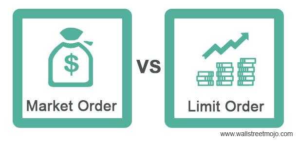

Trading orders are a fundamental aspect of stock and securities trading, serving as the primary mechanism through which investors and traders execute their buy and sell strategies. At the core, understanding the different types of trading orders, such as market orders and limit orders, is essential for effective trading. Market orders allow for immediate execution at the current market price, offering speed and simplicity, whereas limit orders enable traders to specify the price at which they are willing to buy or sell, thus offering greater price control.

This article aims to explore these order types and their utilization in algorithmic trading strategies. Algorithmic trading, which uses computer programs to execute trades at speeds and frequencies unattainable by human traders, often leverages both market and limit orders to optimize execution and manage risks. By examining the advantages and limitations inherent to each order type, traders can better understand how to employ them strategically. For instance, while market orders are advantageous for securing trades swiftly, they may suffer from price slippage in volatile markets. Conversely, limit orders can secure desired pricing but may face the risk of non-execution if the market does not hit the specified price.



The objective here is to provide clarity on how these order mechanisms can be utilized to optimize trading decisions. By understanding the nuances of each order type, traders can potentially enhance their decision-making processes, aligning their trading strategies with their financial goals while navigating the complexities of modern markets.

## Table of Contents

## Market Orders

Market orders are a foundational aspect of trading, frequently favored by traders for their straightforward execution mechanism. A market order is executed immediately at the current market price, which is the main reason for its popularity among investors seeking quick transaction completion. This order type is primarily used when the prompt execution of a trade is more critical than the precise price at which it occurs.

The fundamental principle of market orders is based on the immediacy of execution. When an investor places a market order to buy, it will transact at the lowest ask price available, while a sell market order will occur at the highest bid price available. This characteristic makes market orders particularly suitable for highly liquid and stable markets, where price fluctuations are minimal, and the best available price is close to the expected market price.

Despite their usefulness, market orders bear the inherent risk of price slippage. Slippage occurs when the final execution price of a trade deviates from the expected price due to rapid changes in the market. This risk is more pronounced in highly volatile markets, where swift price movements can lead to significant discrepancies between the anticipated and actual prices at which trades are executed. For example, in a fast-moving market, a buy order meant to be executed at $100 could be filled at $102, leading to an unexpected increase in purchase cost.

The advantages of market orders include immediate execution, which is crucial for investors prioritizing the swift entry or [exit](/wiki/exit-strategy) from market positions. For long-term investors, the slight variations in price that might result from slippage are often outweighed by the benefits of ensuring that a trade is executed without delay. Conversely, in illiquid markets where few orders are available at any given time, the impact of a market order can be large, potentially moving the stock price unfavorably at the execution.

Financial algorithms used by institutional investors often incorporate market orders to ensure fast execution. These algorithms are designed to evaluate current market conditions and determine the optimal timing for placing market orders, thereby minimizing the adverse effects of slippage. For individual traders, the decision to use market orders often depends on their trading strategy, tolerance for price variations, and market conditions at the time of trading.

In summary, market orders are a key tool for investors who prioritize the immediate execution of trades, accepting the potential risk of slippage as a trade-off for speed. While they offer simplicity and quick execution, it is crucial for traders to understand the market conditions under which they are operating to maximize the effectiveness of market orders in their trading strategies.

## Limit Orders

Limit orders allow traders to specify the maximum price they are willing to pay when buying or the minimum price they are willing to accept when selling a security. This type of order provides traders with enhanced control over the execution price of their transactions, which is particularly advantageous in fluctuating market conditions. By setting a specific price, traders can avoid the unpredictability of executing trades at current market rates, thereby mitigating the risk associated with price [volatility](/wiki/volatility-trading-strategies).

The precision offered by limit orders is beneficial when the market for a security is volatile or illiquid. In such scenarios, the dissemination of up-to-date price information is inconsistent, making it challenging for traders to gauge the current market price. A limit order permits a trader to set a predefined entry or exit point, ensuring that any transaction meets their price expectation.

However, a notable disadvantage of limit orders is the possibility that they may not execute if the market price never reaches the level specified by the trader. As a result, traders face the potential of missing out on opportunities if the price narrowly misses their target. For instance, consider a situation where a trader sets a buy limit order for a stock at $50. If the stock price fluctuates between $51 and $52, the order will not execute, and the trader will miss the chance to buy into that position.

There are scenarios where limit orders are particularly advantageous. For example, in cases where a stock is thinly traded and subject to significant price swings, a limit order ensures trades occur strictly within pre-defined price boundaries. Additionally, swing traders, who aim to exploit short- to medium-term price movements, often use limit orders to maximize gains during these brief periods by setting clear price entry and exit objectives aligned with their strategic risk management plans. These features make limit orders a crucial tool for traders seeking precise entry and exit points in volatile and rapidly shifting markets.

## Key Differences Between Market and Limit Orders

Understanding the differences between market orders and limit orders is crucial for effective trading. Market orders are primarily designed to secure immediate execution. When a market order is placed, it instructs the broker to buy or sell a security at the best available current price. This ensures that the trade is executed swiftly, making it ideal for situations where speed is more critical than the exact price. In contrast, limit orders specify the maximum price at which a buyer is willing to pay or the minimum price a seller is willing to accept. This feature of limit orders allows traders to have greater control over the price at which transactions are executed.

The execution process for each type of order is distinct. Market orders are executed almost instantaneously at prevailing prices, which means they often get filled quicker than limit orders. However, they may be susceptible to price slippage, especially in fast-moving or volatile markets. This slippage occurs when the price at which the trade is executed differs from the last-traded price due to rapid market fluctuations.

Limit orders, on the other hand, are only executed if the market reaches the specified price. This means they provide security against unexpected price jumps or drops, thereby protecting the trader's investments from adverse price movements. However, they [carry](/wiki/carry-trading) the risk that they may not be executed at all if market conditions do not reach the predefined price parameters set by the trader.

When choosing between these orders, traders need to consider both their trading strategy and prevailing market conditions. Market orders are advantageous when [liquidity](/wiki/liquidity-risk-premium) is high, and the primary concern is the speed of execution rather than the exact transaction price. They are often employed in markets where the bid-ask spread is narrow, indicating low volatility and higher liquidity.

Limit orders are more appropriate for strategies focused on price, such as when traders anticipate significant market swings or wish to enter or exit positions at precise price points. These orders are favored during periods of high volatility or when engaging in trading instruments with wide bid-ask spreads.

In summary, the choice between market and limit orders hinges on the specific needs of the trader. Those prioritizing immediacy and the certainty of executing trades promptly may lean toward market orders. Conversely, traders seeking precision and willing to place conditions on their transactions may prefer limit orders. The decision should align with one's broader trading strategy, market environment, and risk tolerance, ensuring that order types are utilized to enhance trading outcomes effectively.

## Special Considerations

Trading orders, whether market or limit, present unique dynamics and considerations that traders must account for to optimize their trading outcomes. Market orders, due to their inherent design for fast execution, may incur higher costs. This is mainly due to price slippage, where the executed price deviates from the expected price due to rapid market movements. Particularly in volatile markets, the price at which a market order is executed can be significantly different from the price quoted when the order was placed, potentially affecting the trading cost and final outcomes.

In contrast, limit orders provide traders with control over the execution price by setting a maximum or minimum price for buying or selling. However, this precision comes at the cost of execution certainty. Limit orders might result in partial fills or complete non-execution if the market fails to reach the specified price. This characteristic necessitates a strategic placement of limit orders to balance the desired price with the likelihood of execution.

Another crucial consideration is the impact of the bid-ask spread, especially pertinent to limit orders. The bid-ask spread represents the difference between the highest price a buyer is willing to pay for an asset and the lowest price a seller is willing to accept. Limit orders often target specific price points within or at the edges of this spread, which could lead to delayed execution if the spread widens or if the order price doesn't match current bid or ask levels.

Traders must also consider market liquidity, as it directly impacts the execution of both market and limit orders. In highly liquid markets, orders are executed more swiftly and with less slippage, while in less liquid markets, even well-placed limit orders might remain unexecuted due to insufficient matching orders.

In addition to these factors, brokerage fees can influence the net gain or cost of a trade. Each execution strategy, whether via market orders or limit orders, might attract different fee structures. Brokers often charge per transaction or based on the [volume](/wiki/volume-trading-strategy) of trade; understanding these fees is integral to crafting a cost-effective strategy.

A thorough understanding of these considerations is crucial for traders. Integrating insights about potential slippage, partial fills, bid-ask spread implications, liquidity levels, and brokerage fees can significantly enhance trading strategies and improve decision-making processes.

## Integrating Trading Orders with Algorithmic Trading

Algorithmic trading utilizes sophisticated computer programs to execute trades according to predefined criteria. This approach not only enhances trading efficiency but also minimizes human intervention, thereby reducing emotional biases in trading decisions. By integrating both market and limit orders into [algorithmic trading](/wiki/algorithmic-trading) systems, traders can optimize execution strategies to maximize returns and manage risks more effectively.

**Market and Limit Order Integration**

In algorithmic trading, market orders are employed to promptly execute trades, capitalizing on the immediacy and current trends within the market. The high-speed advantage of market orders makes them suitable for capturing fleeting opportunities where rapid entry or exit is desirable. Conversely, limit orders are favored by algorithms to execute trades with greater precision regarding price. This integration allows for trades to be made at specific price points, optimizing the cost of transactions while adhering to the strategic parameters set by the trader.

**Dynamic Strategy Adjustment**

Algorithms can analyze and react to real-time market data quickly, adjusting trading strategies dynamically. For instance, an algorithm might adjust the proportion of market to limit orders based on market volatility. During high volatility, the algorithm might preferentially execute limit orders to control entry and exit prices, but during stable conditions, it might switch to market orders to ensure transaction execution. This continuous adaptation helps mitigate risks associated with either order type.

**Risk Management**

The adaptability of algorithmic trading systems aids in managing the various risks attached to market and limit orders. By incorporating risk management models, algorithms can execute trades that align with predefined risk thresholds. For example, algorithms may employ measures such as stop-loss limits or trailing stops to guard against unfavorable market movements. Moreover, they can allocate funds dynamically between trades, balancing the need for fast execution against price control to maintain overall portfolio health.

**Harnessing Algorithmic Tools**

To effectively utilize algorithmic trading, traders often employ programming languages such as Python or C++, which are well-suited for developing and [backtesting](/wiki/backtesting) trading strategies. The following Python code snippet illustrates a simple framework to integrate both market and limit orders using the popular "pandas" and "numpy" libraries for managing data, and "ccxt" for interacting with [cryptocurrency](/wiki/cryptocurrency) exchanges:

```python
import ccxt
import pandas as pd
import numpy as np

# Example function to place market or limit orders using CCXT
def execute_order(exchange, symbol, order_type, volume, price=None):
    if order_type == 'market':
        order = exchange.create_market_order(symbol, 'buy', volume)
    elif order_type == 'limit' and price is not None:
        order = exchange.create_limit_order(symbol, 'buy', volume, price)
    return order

# Trading logic example
def trading_strategy(exchange, symbol):
    ohlcv_data = exchange.fetch_ohlcv(symbol, timeframe='1m')  # Fetch recent market data
    df = pd.DataFrame(ohlcv_data, columns=['timestamp', 'open', 'high', 'low', 'close', 'volume'])

    current_price = df['close'].iloc[-1]
    moving_average = df['close'].rolling(window=20).mean().iloc[-1]

    if current_price > moving_average:
        order_type = 'market'
    else:
        order_type = 'limit'
        price = current_price * 0.99  # Aiming to buy slightly below current price

    execute_order(exchange, symbol, order_type, volume=1, price=price if order_type == 'limit' else None)

# Initialize exchange and run strategy
exchange = ccxt.binance({
    'apiKey': 'YOUR_API_KEY',
    'secret': 'YOUR_SECRET',
})
symbol = 'BTC/USDT'

trading_strategy(exchange, symbol)
```

This example highlights how algorithms not only automate trade execution but also decisively manage the intricate relationships between market conditions, risk exposure, and strategic objectives. By intelligently implementing these systems, traders are better equipped to navigate the complexities of the financial markets.

## The Role of Trading Orders in Investment Strategies

Investment strategies significantly influence the selection between market and limit orders. Long-term investors often prefer market orders due to their ability to ensure prompt execution of trades. This immediate execution is critical for securing desired positions in a rapidly changing market. Market orders are executed at the best available price, reducing the risk of missing out on investment opportunities that can occur due to price movements over time. For example, if an investor wishes to acquire shares of a promising company expected to rise in the long term, placing a market order guarantees acquisition at the current market price, even if it fluctuates slightly during the transaction process.

Conversely, short-term traders frequently rely on limit orders to exploit market volatility. By setting specific price targets, these investors can capitalize on price fluctuations and maximize their profit margins. Limit orders provide precision, allowing traders to buy or sell assets when they reach a predetermined price point. This approach can be particularly effective in markets characterized by frequent and unpredictable price changes. For instance, a trader might place a limit order to buy shares at a lower price during an anticipated dip or sell them at a higher price during a brief rally.

Understanding the strategic impact of market and limit orders is vital for coherent investment planning. Each order type aligns differently with various financial goals, and blending them into a cohesive strategy is key to optimizing investment outcomes. Long-term investors prioritize stability and consistent returns, which aligns with market orders that secure positions swiftly. On the other hand, short-term traders aim to profit from price movements, making limit orders a better fit due to their price-specific nature.

Aligning order choice with broader financial goals requires recognizing the primary objectives of the trading strategy. For instance, a portfolio with a growth focus might incorporate market orders to ensure diversification and capture upside potential quicker. Meanwhile, a strategy centered around value investing might employ limit orders to acquire assets at prices deemed undervalued, waiting for specific entry points without urgency.

In summary, the choice between market and limit orders should reflect the investor's time horizon, risk tolerance, and overall financial strategy. By aligning order types with their investment goals, traders can execute more effective and profitable trades. As market dynamics evolve, so too should the strategies and tools employed to navigate them, ensuring that trades align not only with market conditions but also with broader financial objectives.

## Conclusion

Market and limit orders are indispensable tools in the trading landscape. Designed to meet diverse trader needs, each order type is optimized for particular market conditions: market orders are ideal for swift execution at the current price, while limit orders provide precise control over transaction prices, albeit with the risk of not being executed.

Understanding these order types is crucial for executing more effective trades. Each has its own advantages and limitations, which can significantly impact a trader’s ability to achieve desired investment outcomes. By considering factors such as urgency, price volatility, and liquidity, traders can make informed decisions that align with their financial goals.

Traders are encouraged to thoroughly assess current market conditions and refine their strategies in line with these dynamics. This proactive approach involves adapting to changes in market sentiment, evaluating the bid-ask spread, and optimizing order placement to manage costs and maximize profitability.

Embracing the nuances of market and limit orders will enhance trading acumen, leading to more strategic transactions. By doing so, traders can not only mitigate risks but also seize opportunities presented by various market scenarios, ultimately improving their trading outcomes.

## References & Further Reading

[1]: Bergstra, J., Bardenet, R., Bengio, Y., & Kégl, B. (2011). ["Algorithms for Hyper-Parameter Optimization."](https://papers.nips.cc/paper/4443-algorithms-for-hyper-parameter-optimization) Advances in Neural Information Processing Systems 24.

[2]: ["Advances in Financial Machine Learning"](https://www.amazon.com/Advances-Financial-Machine-Learning-Marcos/dp/1119482089) by Marcos Lopez de Prado

[3]: ["Evidence-Based Technical Analysis: Applying the Scientific Method and Statistical Inference to Trading Signals"](https://www.wiley.com/en-us/Evidence+Based+Technical+Analysis%3A+Applying+the+Scientific+Method+and+Statistical+Inference+to+Trading+Signals-p-9780470008744) by David Aronson

[4]: ["Machine Learning for Algorithmic Trading"](https://github.com/stefan-jansen/machine-learning-for-trading) by Stefan Jansen

[5]: ["Quantitative Trading: How to Build Your Own Algorithmic Trading Business"](https://www.amazon.com/Quantitative-Trading-Build-Algorithmic-Business/dp/1119800064) by Ernest P. Chan