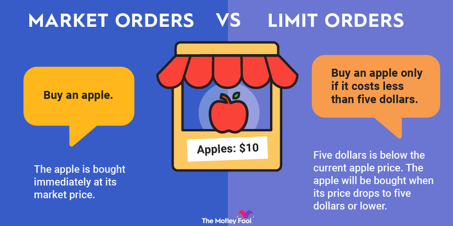

## Table of Contents

## What is a market order?

A market order is a type of order you can use when you want to buy or sell something quickly. When you place a market order, you are telling the market that you want to buy or sell at the best price available right now. This means your order will be filled almost instantly, but the exact price you get might be a little different from what you expected because prices can change quickly.

Market orders are useful when you need to make a trade fast, like if you see a sudden change in the market and want to act right away. However, because the price isn't guaranteed, there's a small risk that you might not get the exact price you were hoping for. This risk is usually small, but it's something to keep in mind, especially in markets that move quickly or when trading large amounts.

## What is a limit order?

A limit order is a way to buy or sell something at a specific price or better. When you place a limit order, you tell the market the exact price you want. For example, if you want to buy a stock, you can set a limit order to buy it only if the price drops to your chosen amount. If you want to sell, you can set it to sell only if the price goes up to your chosen amount. This gives you more control over the price you pay or receive.

However, there's a catch with limit orders. They are not guaranteed to be filled. If the market price never reaches your limit price, your order won't be completed. This means you might miss out on a trade if the price moves quickly past your limit without hitting it. So, while limit orders help you get a better price, they require patience and can sometimes mean you don't buy or sell at all if the market doesn't move in your favor.

## How does a market order work?

A market order is a way to buy or sell something quickly. When you place a market order, you're telling the market that you want to do the trade right away at the best price available. For example, if you want to buy a stock, your market order will get you the stock at the lowest price someone is willing to sell it for at that moment. If you want to sell, it will sell your stock at the highest price someone is willing to buy it for right then.

The main thing about market orders is that they are fast. They get filled almost instantly, which is good if you need to make a quick decision. But because they happen so fast, the exact price you get might be a little different from what you see when you place the order. Prices can change quickly, so you might end up paying a bit more or getting a bit less than you expected. This difference is usually small, but it's something to think about, especially in markets that move fast or when you're trading a lot.

## How does a limit order work?

A limit order lets you buy or sell something at a specific price or better. When you place a limit order, you choose the exact price you want to trade at. For example, if you want to buy a stock, you can set your limit order to buy it only if the price goes down to your chosen amount. If you want to sell, you can set it to sell only if the price goes up to your chosen amount. This gives you control over the price you pay or receive, which can be really helpful if you have a target price in mind.

However, there's a downside to limit orders. They are not guaranteed to be filled. If the market price never reaches your limit price, your order won't happen. This means you might miss out on a trade if the price moves quickly past your limit without hitting it. So, while limit orders can help you get a better price, they require patience and can sometimes mean you don't buy or sell at all if the market doesn't move in your favor.

## What are the main differences between market orders and limit orders?

The main difference between market orders and limit orders is how they work and the control they give you over the price. A market order is used when you want to buy or sell something quickly. When you place a market order, you tell the market to do the trade right away at the best price available. This means your order will be filled fast, but the exact price might be a little different from what you expected because prices can change quickly. Market orders are great if you need to act fast, but there's a small risk that you won't get the exact price you wanted.

On the other hand, a limit order gives you more control over the price. With a limit order, you set a specific price at which you want to buy or sell. For example, you can set a limit order to buy a stock only if the price drops to your chosen amount, or sell it only if the price goes up to your chosen amount. This is helpful if you have a target price in mind. However, limit orders are not guaranteed to be filled. If the market price never reaches your limit price, your order won't happen, and you might miss out on the trade. So, limit orders require patience and can sometimes mean you don't buy or sell at all if the market doesn't move in your favor.

## When should you use a market order?

You should use a market order when you want to buy or sell something quickly. It's the best choice if you see a sudden change in the market and need to act fast. For example, if you're watching a stock and it suddenly starts to go up or down a lot, a market order will let you buy or sell right away at the best price available at that moment.

However, remember that with a market order, the exact price you get might be a little different from what you expected. Prices can change very fast, so you might end up paying a bit more or getting a bit less than you thought. This difference is usually small, but it's something to think about, especially if you're trading a lot or in a market that moves quickly.

## When should you use a limit order?

You should use a limit order when you want to buy or sell something at a specific price. It's good if you have a target price in mind and you don't want to pay more or accept less than that price. For example, if you see a stock you like but it's too expensive right now, you can set a limit order to buy it only if the price drops to your chosen amount. This way, you can get the stock at the price you want, without having to watch the market all the time.

However, limit orders are not guaranteed to be filled. If the market price never reaches your limit price, your order won't happen. This means you might miss out on a trade if the price moves quickly past your limit without hitting it. So, limit orders are useful when you can be patient and are okay with waiting for the right price, even if it means you might not buy or sell at all if the market doesn't move in your favor.

## What are the potential risks associated with market orders?

When you use a market order, the biggest risk is that you might not get the exact price you expect. Prices in the market can change very quickly, so the price you see when you place your order might be different from the price you actually get. This difference is usually small, but it can be bigger in fast-moving markets or when you're trading a lot of something. This is called "slippage," and it's something to think about, especially if you're trying to buy or sell a large amount.

Another risk with market orders is that they might not be the best choice in markets with low trading activity. If there aren't many people buying or selling, your order might have a bigger impact on the price. For example, if you want to buy a lot of a stock that not many people are trading, your order could push the price up more than you expected. So, it's good to check how active the market is before you use a market order.

## What are the potential risks associated with limit orders?

One risk with limit orders is that they might not get filled. If the market price never reaches the price you set, your order won't happen. This means you could miss out on buying or selling if the price moves quickly past your limit without hitting it. For example, if you set a limit order to buy a stock at $50, but the price only drops to $51 and then goes back up, you won't get the stock. This can be frustrating if you really wanted to make the trade.

Another risk is that you might miss out on a good opportunity. If the market moves fast and goes past your limit price without filling your order, you could lose the chance to buy or sell at a good price. For instance, if you want to sell a stock at $100 but the price jumps from $99 to $101 in a flash, your order won't be filled, and you might have to wait for another chance to sell at your desired price. So, while limit orders give you control over the price, they require patience and can sometimes mean you don't get to trade at all.

## How can market conditions affect the execution of market and limit orders?

Market conditions can really change how market orders work. When the market is moving fast, like during big news or events, prices can jump around a lot. If you use a market order, you might end up buying or selling at a price that's different from what you expected. This is called slippage. Also, if the market isn't very busy, with not many people buying or selling, your market order could push the price up or down more than you thought. So, it's good to check how active the market is before you use a market order.

Limit orders can also be affected by market conditions. If the market is moving fast, your limit order might not get filled if the price quickly goes past your limit without hitting it. For example, if you want to buy a stock at $50 but the price only drops to $51 before going back up, you won't get the stock. On the other hand, if the market is slow and not many people are trading, your limit order might sit there for a long time without being filled. So, you need to be patient and ready to wait for the right price when using limit orders.

## What advanced strategies involve using both market and limit orders?

One advanced strategy that uses both market and limit orders is called a "bracket order." When you use a bracket order, you set up a main order, usually a market order, to buy or sell something right away. At the same time, you also set up two limit orders: one to take a profit if the price goes up, and another to stop a loss if the price goes down. This way, you can quickly enter a trade with the market order and then use the limit orders to manage your risk and potential profit without having to watch the market all the time.

Another strategy is called "[scalping](/wiki/gamma-scalping)," where traders make lots of small trades to take advantage of tiny price changes. In this strategy, you might use a market order to quickly buy something when you see a good opportunity, and then set a limit order to sell it at a slightly higher price. This way, you can make a small profit from the quick price change. But because the profits are small, you need to do this many times to make a big difference. Both of these strategies show how you can use market and limit orders together to manage your trades better.

## How do market and limit orders impact trading algorithms and high-frequency trading?

Market and limit orders are really important for trading algorithms and high-frequency trading. Trading algorithms are computer programs that make trades automatically. They use market orders to buy or sell things very quickly when they see a good chance. This is good for high-frequency trading, where traders want to make lots of small trades in a short time. They need to act fast, so market orders help them do that. But, because prices can change fast, they need to be careful about the price they get.

Limit orders are also used in trading algorithms, especially to manage risk and set goals. For example, a trading algorithm might use a limit order to sell something at a higher price to make a profit, or to buy something at a lower price to save money. In high-frequency trading, limit orders help traders set up their trades without having to watch the market all the time. But, because limit orders might not get filled, traders need to think about this when they plan their strategies. So, both market and limit orders are key parts of how trading algorithms and high-frequency trading work.

## References & Further Reading

[1]: Bergstra, J., Bardenet, R., Bengio, Y., & Kégl, B. (2011). ["Algorithms for Hyper-Parameter Optimization."](https://papers.nips.cc/paper/4443-algorithms-for-hyper-parameter-optimization) Advances in Neural Information Processing Systems 24.

[2]: ["Advances in Financial Machine Learning"](https://www.amazon.com/Advances-Financial-Machine-Learning-Marcos/dp/1119482089) by Marcos Lopez de Prado

[3]: ["Evidence-Based Technical Analysis: Applying the Scientific Method and Statistical Inference to Trading Signals"](https://www.wiley.com/en-us/Evidence+Based+Technical+Analysis%3A+Applying+the+Scientific+Method+and+Statistical+Inference+to+Trading+Signals-p-9780470008744) by David Aronson

[4]: ["Machine Learning for Algorithmic Trading"](https://github.com/stefan-jansen/machine-learning-for-trading) by Stefan Jansen

[5]: ["Quantitative Trading: How to Build Your Own Algorithmic Trading Business"](https://www.amazon.com/Quantitative-Trading-Build-Algorithmic-Business/dp/1119800064) by Ernest P. Chan