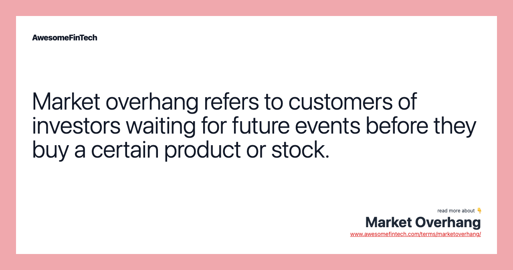

## Table of Contents

## What is market overhang?

Market overhang refers to a situation where there is a large amount of a product or security available for sale, but not enough demand from buyers. This often happens when a company issues more shares than the market can absorb, leading to an excess supply. As a result, the price of the product or security can drop because sellers are competing to find buyers.

In the stock market, overhang can occur after a company goes public through an initial public offering (IPO) and insiders or early investors decide to sell their shares. If too many shares are sold at once, it can create a perception that the stock is less valuable, causing the price to fall. This situation can make investors hesitant to buy, as they worry about further price drops, which in turn can lead to a longer period of low stock prices until the excess supply is absorbed by the market.

## How does market overhang affect stock prices?

Market overhang can make stock prices go down. This happens when there are too many shares of a company's stock that people want to sell, but not enough people want to buy them. When a company first sells its stock to the public, or if early investors decide to sell their shares, it can lead to a lot of shares being available. If everyone tries to sell at the same time, it can make the stock price drop because there are more sellers than buyers.

When stock prices drop because of market overhang, it can make other investors worried. They might think the stock is not worth as much anymore and decide not to buy it. This can keep the stock price low for a long time until enough people start buying the shares again. So, market overhang can cause a stock to stay cheap until the extra shares are all bought up.

## What are the common causes of market overhang?

Market overhang often happens when a company sells a lot of new shares to the public through an initial public offering (IPO). If the company sells more shares than people want to buy, it can lead to too many shares being available. This can also happen if early investors or company insiders decide to sell their shares all at once. When there are more shares for sale than people want to buy, it can make the stock price go down.

Another common cause of market overhang is when a company does a secondary offering. This is when a company that is already public decides to sell more shares. If the market is not ready for these extra shares, it can create an overhang. Also, if there is bad news about the company or the economy, it can make people want to sell their shares, leading to more shares available than buyers, which can also cause market overhang.

## Can market overhang occur in other financial markets besides stocks?

Yes, market overhang can happen in other financial markets too, not just stocks. For example, in the real estate market, if there are too many houses for sale but not enough people wanting to buy them, it can lead to a market overhang. This can make house prices go down because sellers have to lower their prices to attract buyers.

In the bond market, market overhang can occur if a government or company issues more bonds than investors want to buy. When there are too many bonds for sale and not enough buyers, the price of the bonds can drop. This can make it harder for the issuer to sell new bonds in the future because investors might be worried about the price going down even more.

## What are the signs that a market is experiencing overhang?

You can tell a market is experiencing overhang when there are more things for sale than people wanting to buy them. This could be stocks, houses, or bonds. When this happens, the price of what's for sale often goes down because sellers have to lower their prices to find buyers. If you see that prices are dropping and it's hard to sell something, it might be a sign of market overhang.

Another sign of market overhang is when there is a lot of something available for sale but not many people are buying. For example, if a company sells a lot of new stock but the price keeps going down, it could mean there are too many shares for sale. This can also happen in the real estate market if there are a lot of houses for sale but not many people are buying them, causing house prices to drop.

## How can investors identify market overhang before it impacts their investments?

Investors can spot market overhang by watching how much of something is for sale and how many people want to buy it. If there are a lot of stocks, houses, or bonds for sale but not many buyers, it might be a sign of market overhang. For example, if a company sells a lot of new stock and the price starts to drop, it could mean there are too many shares for sale. Investors should pay attention to how quickly prices are falling and how hard it is for sellers to find buyers.

Another way to identify market overhang is by looking at news and market reports. If there is news about a company issuing a lot of new shares or if there are reports of too many houses or bonds for sale, these can be early warnings. Investors should also watch for signs that people are worried about the market, like when prices keep going down even though nothing else has changed. By staying alert to these signs, investors can take steps to protect their investments before market overhang causes big problems.

## What strategies can investors use to mitigate the risks associated with market overhang?

Investors can protect themselves from market overhang by being careful about what they buy. They should look at how much of a stock, house, or bond is for sale and see if there are enough buyers. If there are too many things for sale and not enough people wanting to buy them, it might be a good idea to wait before investing. By watching the market closely and waiting for the right time, investors can avoid buying when prices are about to drop because of too much supply.

Another way to reduce the risks of market overhang is to spread out investments. Instead of putting all their money into one thing, investors can buy different types of stocks, houses, or bonds. This way, if one market has too much supply and prices drop, the other investments might not be affected as much. By having a mix of investments, investors can protect their money and be safer from the problems caused by market overhang.

## How does market overhang influence market sentiment and investor behavior?

Market overhang can make people feel worried about the market. When there are too many things for sale but not enough buyers, it can make the price go down. This can make investors think that the stock, house, or bond is not worth as much anymore. They might decide not to buy because they are scared the price will keep dropping. This fear can spread and make more people feel the same way, which can keep the price low for a long time.

To deal with this, investors might change how they act. They might wait to buy until they see that the market is getting better and there are more buyers. They might also spread their money across different types of investments so that if one market has too much supply, the other investments might not be affected as much. By being careful and spreading their money around, investors can feel safer and make better choices even when there is market overhang.

## What historical examples illustrate the impact of market overhang on financial markets?

One famous example of market overhang happened with the IPO of Facebook in 2012. When Facebook first sold its stock to the public, they offered a lot of shares. But, there were not enough people wanting to buy them at the price they were set. This led to too many shares being available and the stock price dropped a lot right after the IPO. Many investors who bought the stock at the beginning lost money because of this market overhang.

Another example is the housing market in the United States during the 2008 financial crisis. Before the crisis, a lot of houses were built and sold. But then, the economy got worse and fewer people wanted to buy houses. This led to too many houses for sale and not enough buyers, which is a type of market overhang. As a result, house prices fell a lot, and many people who owned houses lost a lot of money. This situation made the whole economy suffer because of the big impact of the housing market overhang.

## How do regulatory changes contribute to or alleviate market overhang?

Regulatory changes can make market overhang worse or better. When the government makes new rules that make it easier for companies to sell more stocks or bonds, it can lead to too many of them being for sale. If there are not enough people wanting to buy, this can create a market overhang. For example, if rules are changed to let companies sell more shares without having to tell everyone first, it might lead to a sudden increase in shares for sale, causing the price to drop because of too much supply.

On the other hand, regulatory changes can also help fix market overhang. If the government makes rules that slow down how fast companies can sell new stocks or bonds, it can help balance out the supply and demand. For instance, if rules are put in place that require companies to wait longer before they can sell more shares, it gives the market time to absorb the existing supply. This can help keep prices more stable and prevent the kind of sudden drops that happen when there is too much for sale and not enough buyers.

## What role do large institutional investors play in creating or resolving market overhang?

Large institutional investors, like big banks or investment firms, can make market overhang worse or better. When these big investors decide to sell a lot of shares or bonds all at once, it can lead to too many of them being available for sale. If there are not enough people wanting to buy, this can cause the price to drop because there is too much supply. For example, if a big investor decides to sell a lot of a company's stock because they think the price will go down, it can make other people worried and want to sell too, making the market overhang even worse.

On the other hand, these large investors can also help fix market overhang. If they decide to buy a lot of shares or bonds when there are too many for sale, it can help balance out the supply and demand. By stepping in and buying when others are selling, they can help keep the price from dropping too much. For instance, if a big investor sees that a stock is undervalued because of market overhang, they might buy a lot of it, which can make other people feel more confident and start buying too, helping to solve the overhang problem.

## How can advanced quantitative models help predict and manage market overhang?

Advanced quantitative models can help predict market overhang by looking at a lot of data to find patterns and signs of too much supply. These models use math and computer programs to see how much of something, like stocks or bonds, is for sale and how many people want to buy them. By watching these numbers closely, the models can spot when there might be too many things for sale and not enough buyers, which could lead to prices going down. This early warning can help investors know when to be careful about buying or selling.

Once market overhang is predicted, these models can also help manage it. They can suggest ways to spread out investments so that if one market has too much supply, the other investments might not be affected as much. For example, the models might tell investors to buy different types of stocks or bonds to lower the risk. By using these models, investors can make smarter choices and protect their money from the problems caused by market overhang.

## What is Market Overhang: Concept and Implications?

Market overhang refers to a condition in financial markets where potential sellers refrain from selling their assets due to anticipated unfavorable outcomes or market conditions. This restraint can create a build-up of pressure that may significantly influence market dynamics. When the sellers eventually decide to release their assets, it often results in price stagnation or unexpected drops, as the sudden influx of supply outstrips demand. Understanding market overhang is crucial for investors as it allows them to predict potential market shifts and respond appropriately to minimize losses and capitalize on opportunities.

An example of market overhang can be observed in the stock market when a large corporation's executives hold a significant number of shares. If these executives anticipate negative press or upcoming financial trouble, they might delay selling their shares. This action prevents the market from adjusting in response to the expected downturn. Once the information becomes public and the executives begin selling, the sudden release of shares onto the market can result in a rapid price decline, reflecting the anticipated downturn that had initially been withheld.

Market overhang can profoundly impact investor sentiment and stock prices. In scenarios where investors are aware of a potential overhang, there is often a pervasive bearish sentiment, with many anticipating a future price dip once the overhang is resolved. This sentiment can depress prices even before the actual selling begins. Conversely, in the absence of clear information, uncertainty can dominate, leading to hesitancy in trading and low market [liquidity](/wiki/liquidity-risk-premium).

In quantitative terms, market overhang can be represented by the excess quantity of an asset that sellers are expected to offload once market conditions shift. For instance, suppose a company's shares are largely held by insiders, and these insiders possess information about an impending regulation set to negatively impact the industry. The formula for potential market impact could be expressed as:

$$
\Delta P = \frac{S}{D} \times E
$$

where:
- $\Delta P$ is the expected change in price,
- $S$ represents the volume of shares that constitutes the overhang,
- $D$ is the average daily trading volume,
- $E$ denotes the elasticity of the asset's price with respect to volume.

This formula highlights how significant overhang (large $S$) relative to daily [volume](/wiki/volume-trading-strategy) ($D$) can lead to considerable price changes ($\Delta P$), especially when elasticity ($E$) is high.

Investors should account for market overhang in their strategies by monitoring insider trading reports, regulatory updates, or industry news that might precipitate future sell-offs. By staying informed, investors can adjust their portfolios ahead of time, either hedging against potential losses or preparing to buy at lower prices once the overhang is resolved. Understanding and anticipating the effects of market overhang are key steps in mitigating risks and seizing profitable opportunities within financial markets.

 to Algorithmic Trading

Algorithmic trading, commonly referred to as algo trading, revolutionizes the traditional trading paradigm by leveraging sophisticated computer algorithms to automate the trading process. Unlike human traders, who are limited by speed and the ability to process complex data sets, [algorithmic trading](/wiki/algorithmic-trading) systems can execute a multitude of trades with unmatched precision and efficiency. This section explores the core components and advantages of algorithmic trading.

At the heart of algorithmic trading are algorithms—sets of defined rules and instructions programmed in a computer to autonomously conduct trading decisions. These algorithms are designed to analyze real-time market data, monitor price movements, and execute buy or sell orders based on specified criteria. For instance, an algorithm might trigger a buy order if the stock price drops below a predetermined threshold or meets other quantitative signals.

The structure of an algorithmic trading system generally includes several key components: 

1. **Data Feed**: Access to high-quality, real-time market data is crucial. This includes price feeds, trading volumes, and news analytics. Reliable and fast data feeds allow the algorithm to make timely decisions.

2. **Trading Algorithm**: The core logic that determines the trading strategy. This could be based on various strategies such as statistical arbitrage, trend following, or machine learning models that predict price movements.

3. **Execution Engine**: This component interacts with financial markets to place orders. It must be capable of handling order routing, trade execution, and order management efficiently to ensure minimal slippage and optimal order fulfillment.

4. **Risk Management System**: Algorithms incorporate risk management protocols to assess and mitigate potential losses. This includes setting stop-loss limits, maximum order sizes, and exposure limits to prevent significant financial damage.

5. **Backtesting Environment**: Before deploying an algorithm live, it is tested against historical data to evaluate its performance and robustness. This involves simulating trades to see how the strategy would have performed in past market conditions.

The advantages of algorithmic trading are numerous. It drastically enhances trading speed, executing thousands of transactions in mere seconds, which is impossible for human traders. This speed is particularly advantageous in markets where price discrepancies can disappear within milliseconds. Furthermore, algorithmic trading minimizes human errors and emotional biases, as trade decisions are made based on pure data and pre-defined instructions. The ability to process vast sets of historical and real-time data allows algorithms to identify trading opportunities that might be invisible to human eyes.

Moreover, algorithmic systems can also handle complex strategies across multiple markets and instruments simultaneously—a feat human traders would find challenging. This enables the diversification of investment strategies, potentially improving overall portfolio performance.

With these advanced capabilities, algorithmic trading represents a significant shift in financial markets, offering traders and institutions the tools needed to optimize their trading activities in increasingly automated and fast-paced environments.

## References & Further Reading

[1]: Bergstra, J., Bardenet, R., Bengio, Y., & Kégl, B. (2011). ["Algorithms for Hyper-Parameter Optimization."](https://dl.acm.org/doi/10.5555/2986459.2986743) Advances in Neural Information Processing Systems 24.

[2]: ["Advances in Financial Machine Learning"](https://www.amazon.com/Advances-Financial-Machine-Learning-Marcos/dp/1119482089) by Marcos Lopez de Prado

[3]: ["Evidence-Based Technical Analysis: Applying the Scientific Method and Statistical Inference to Trading Signals"](https://www.amazon.com/Evidence-Based-Technical-Analysis-Scientific-Statistical/dp/0470008741) by David Aronson

[4]: ["Machine Learning for Algorithmic Trading"](https://github.com/stefan-jansen/machine-learning-for-trading) by Stefan Jansen

[5]: ["Quantitative Trading: How to Build Your Own Algorithmic Trading Business"](https://www.amazon.com/Quantitative-Trading-Build-Algorithmic-Business/dp/1119800064) by Ernest P. Chan