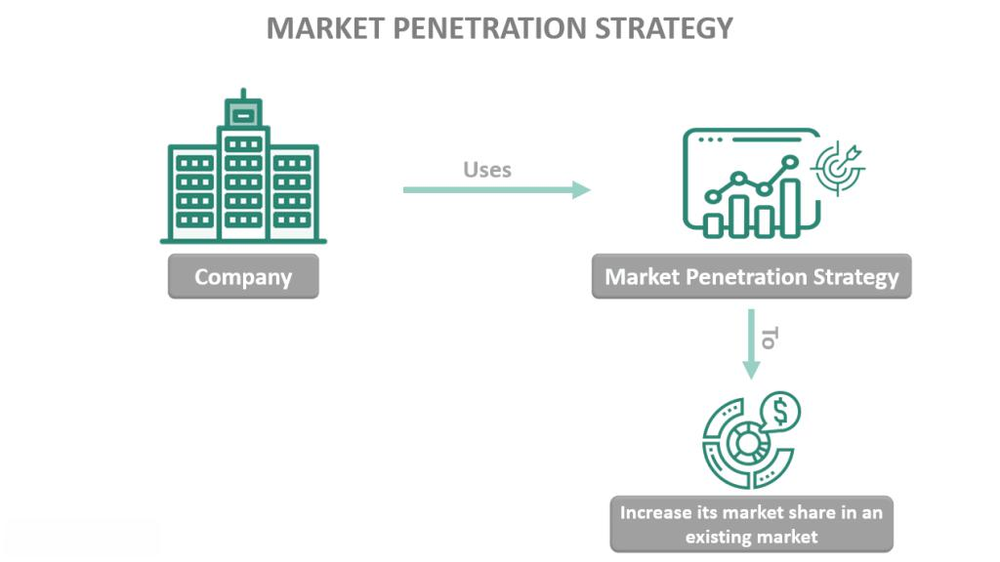

In today's competitive business environment, companies continuously seek effective growth strategies to enhance their market presence. A market strategy is crucial as it determines how an organization plans to increase its market share, ensuring its long-term sustainability and profitability. Within this framework, market penetration emerges as one of the core strategies companies use to achieve growth in existing markets. By increasing market share, businesses aim to maximize their reach and influence over current target areas, creating a stronger hold against competitors.

Technological advancements have introduced algorithmic trading as a powerful tool to execute market strategies efficiently. Through the application of pre-programmed instructions, businesses can swiftly carry out trades that align with their growth objectives, enhancing the effectiveness of their strategic efforts. This article will explore growth strategies that underline business expansion, examine the essentials of a market strategy focusing on market penetration and highlight the significant role that algorithmic trading plays in achieving these corporate goals. By leveraging these concepts, organizations can refine their approaches and strengthen their overall market position.



## Table of Contents

## Understanding Growth Strategies

Growth strategies are essential plans implemented by businesses aiming for expansion and increased profitability. These strategies allow companies to target specific areas for growth, optimizing their resources to maximize outcomes. Below are some of the principal avenues businesses pursue within growth strategies:

1. **Market Development**: This involves extending the reach of existing products into new markets. A company engages in market development by identifying new geographical areas or customer segments that have not been previously targeted. For instance, a company might take a domestic product and adapt it for an international audience, considering local tastes and regulatory requirements.

2. **Product Development**: Here, businesses focus on introducing new products to existing markets. Companies must innovate and continuously bring forth products that meet the evolving needs and preferences of their current customer base, thereby staying competitive and relevant.

3. **Diversification**: This strategy involves introducing new products to new markets. Diversification can be risky but potentially offers high rewards. Companies may choose to diversify to reduce reliance on a single market or product line. Diversification can be related, where new offerings are aligned with current operations, or unrelated, where new lines are completely distinct from existing operations.

4. **Market Penetration**: Aimed at increasing market share within existing markets using current products, market penetration is often achieved through competitive pricing, marketing campaigns, and product enhancement. This strategy focuses on increasing the usage rate among existing customers or attracting new customers from competitors.

A well-defined growth strategy can enable a company to outpace its competitors and capture a larger market share by leveraging strengths and addressing market demands effectively. The appropriate selection of a growth strategy aids businesses in navigating competitive landscapes, ensuring both sustainability and long-term success. Each strategy should be carefully aligned with a company's overall goals, taking into consideration available resources, market conditions, and the firm's core competencies. This strategic alignment is instrumental in maximizing both immediate profits and future growth potential, ensuring that the business remains agile and responsive to industry changes.

## Exploring the Market Strategy Framework

Market strategy is a fundamental element of business planning, involving a comprehensive approach to reach potential customers and convert them into actual buyers. A successful market strategy is multi-faceted, incorporating key elements such as understanding the target market, marketing mix, positioning, and value proposition.

Understanding the target market is crucial, as it involves identifying specific consumer segments that a company aims to serve. This process requires extensive market research and data analysis to determine the needs, preferences, and behaviors of potential customers. By accurately defining the target market, businesses can tailor their marketing efforts to resonate effectively with these groups, thereby increasing the likelihood of converting prospects into customers.

The marketing mix, often represented as the four Ps—Product, Price, Place, and Promotion—is another critical component. Each element of the marketing mix must be carefully managed to align with the overall strategy. For instance, the product must meet the needs of the target market, pricing should reflect both value and competitive positioning, placement ensures that products are accessible to the consumer, and promotional activities must engage and persuade the target audience effectively.

Positioning is the process of establishing a brand or product in the consumer's mind, highlighting its distinct advantages over competitors. Effective positioning differentiates a company from its competitors, creating a unique impression that enhances consumer loyalty and preference.

A strong value proposition is essential to communicate the specific benefits and value that a product or service offers. The value proposition must be clear and compelling, addressing the core problems and needs of the target market while distinguishing the business from its competitors.

Market strategies must continuously evolve in response to changing market conditions and consumer preferences. As the external environment shifts, companies should regularly assess and adjust their strategies to maintain relevance. This might include adapting to technological advancements, shifts in consumer behavior, or new market entries by competitors. Consistent evaluation allows companies to refine their approach, optimize resource allocation, and ensure alignment with overarching business objectives.

By incorporating these elements, businesses can effectively engage their target audience, building meaningful relationships that convert potential customers into loyal buyers. A dynamic and responsive market strategy not only supports organizational goals but also enhances long-term competitive advantage.

## Diving into Market Penetration

Market penetration is a strategic approach focused on increasing a company's share within its existing markets using its current product offerings. It is recognized as one of the least risky strategies in Ansoff's Matrix, commonly employed when companies aim to grow within familiar territories without diversifying into new products or markets[^1^].

One of the primary tactics utilized in market penetration is competitive pricing. By reducing prices, companies can make their products more attractive to cost-conscious consumers, thereby increasing sales [volume](/wiki/volume-trading-strategy). For example, a company may decide to lower prices temporarily through discounts or introduce value packs to appeal to a broader customer base. This strategy can be effective in a market where price elasticity of demand is high, meaning that consumers are likely to increase their purchasing volume significantly in response to lower prices.

Promotions play a crucial role in enhancing market penetration by increasing product visibility and appeal. Marketing initiatives such as advertising campaigns, customer loyalty programs, and special offers can draw the attention of potential customers and encourage repeat purchases. Enhanced product features can also incentivize existing customers to choose your product over competitors'. When these features align with consumer needs and preferences, they can significantly boost a product's attractiveness.

In markets that are considered underdeveloped, where consumer needs are not fully met, companies may find ample opportunities to apply market penetration strategies effectively. This scenario provides the chance to satisfy unmet consumer demands with existing offerings, thereby gaining a competitive edge.

Similarly, when a company endeavors to capture a portion of a competitor's market, market penetration becomes a pivotal strategy. By differentiating their products through superior quality, improved service delivery, or unique features, companies can entice customers away from competing products.

Collaborations and enhancements in distribution channels are additional strategies that firms may employ to bolster market penetration. Collaborations or partnerships with other entities can expand a company's reach and accessibility to new customer segments. Furthermore, optimizing distribution channels ensures that products are readily available where and when consumers demand them. This might involve investing in logistics, forming strategic alliances, or utilizing technology to streamline the supply chain.

By leveraging these focused tactics, companies aim to reinforce their position within established markets, drive sales growth, and improve overall market share, ultimately contributing to their long-term strategic objectives.

[^1^]: Ansoff, H. I. (1957). Strategies for Diversification. Harvard Business Review, 35(5), 113-124.

## Role of Algorithmic Trading in Market Strategy

Algorithmic trading leverages sophisticated mathematical models and computer programs to make high-speed trading decisions. This practice relies on pre-programmed rules and algorithms to determine the optimal timing and price for buying and selling financial assets. In the context of market strategy, [algorithmic trading](/wiki/algorithmic-trading) is instrumental in executing strategies with greater efficiency compared to manual trading processes.

One of the primary advantages of algorithmic trading is its ability to handle substantial volumes of trades in a fraction of the time it would take a human trader. This capability is particularly beneficial for market penetration efforts, where rapid execution and high-frequency trading can capture favorable positions in the market before competitors, thus increasing market share.

Precision and speed are hallmarks of algorithmic trading. By reducing the time interval between making a trading decision and its execution, algorithmic trading minimizes the risks associated with human intervention, such as decision fatigue or errors in judgment. This assures traders of consistent results and lowers the likelihood of market impact, which refers to the change in the market price caused by an investor’s trade.

Algorithmic trading also provides analytical tools that are invaluable for analyzing current and historical market data, identifying trends, and making informed decisions about strategy development. These tools allow for complex data analyses that can include price, volume, timing, and other relevant metrics. For example, a moving average crossover strategy might involve executing a buy order when a short-term moving average crosses above a long-term moving average. Here is a simple Python example of calculating moving averages:

```python
import pandas as pd

# Assuming 'price_data' is a DataFrame with a 'close' column representing daily closing prices
price_data['short_ma'] = price_data['close'].rolling(window=5).mean()
price_data['long_ma'] = price_data['close'].rolling(window=20).mean()

# Generate signals
price_data['signal'] = 0
price_data['signal'][price_data['short_ma'] > price_data['long_ma']] = 1  # Buy signal
price_data['signal'][price_data['short_ma'] <= price_data['long_ma']] = -1  # Sell signal
```

By utilizing algorithmic trading strategies like this, businesses can gain actionable insights that support their market strategies and extend their competitive advantage. With such precision and analytical power, algorithmic trading bolsters the strategic capabilities of organizations, helping them to penetrate markets effectively and enhance overall market presence.

## Implementing Strategy in Practice

Implementing growth strategies in a practical context necessitates a comprehensive understanding of both market dynamics and consumer behavior. For businesses aiming to succeed in their growth strategies, the integration of market research, analytics, and technological competence is essential. Market research provides insights into consumer preferences, competitive landscape, and emerging trends, forming the backbone of any strategic plan. Analytics, on the other hand, allows companies to interpret data and derive actionable insights, enabling informed decision-making.

The process of effective implementation begins with setting clear, achievable objectives that align with the overall strategic goals of the organization. These objectives serve as benchmarks against which performance can be measured. Performance measurement is crucial as it helps identify areas where the strategy is lacking and where it is excelling. For measuring performance, businesses employ various key performance indicators (KPIs) relevant to their specific strategy and objectives. For example, market share growth, customer acquisition rates, and return on investment (ROI) are common KPIs in market penetration strategies.

Adjusting tactics based on performance data is another critical aspect of effective implementation. This adaptability ensures that the strategy remains relevant in dynamic market conditions. Companies can use statistical models and algorithms to simulate different scenarios and predict outcomes, allowing them to adjust their tactics proactively. Here is an example of a simple Python script using pandas and numpy to analyze and visualize sales data for better decision-making:

```python
import pandas as pd
import numpy as np
import matplotlib.pyplot as plt

# Sample data
data = {'Month': ['Jan', 'Feb', 'Mar', 'Apr'],
        'Sales': [150, 160, 170, 180]}

df = pd.DataFrame(data)

# Calculate growth rate
df['Growth Rate'] = df['Sales'].pct_change().fillna(0) * 100

# Plotting the data
plt.figure(figsize=(10,5))
plt.plot(df['Month'], df['Sales'], marker='o', label='Sales')
plt.plot(df['Month'], df['Growth Rate'], marker='x', label='Growth Rate (%)')
plt.title('Sales and Growth Rate Over Months')
plt.xlabel('Month')
plt.ylabel('Values')
plt.legend()
plt.grid(True)
plt.show()
```

Collaboration between various departments, such as marketing, finance, and IT, is integral to the successful execution of a market strategy. Marketing teams focus on understanding consumer needs and communicating the company's value proposition, finance professionals ensure that resources are allocated efficiently, and IT specialists provide the technological infrastructure to support analytics and data management. A collaborative approach ensures that each department's strengths are leveraged, contributing to a cohesive and effective strategy implementation.

In conclusion, the execution of growth strategies in practice demands a holistic approach encompassing market research, data analytics, technological integration, and cross-departmental collaboration. By adhering to these principles, companies can navigate complex market landscapes, achieve their growth objectives, and sustain long-term success.

## Conclusion

Growth strategies, particularly market penetration, are crucial for companies seeking to increase their presence and customer base within existing markets. Market penetration focuses on enhancing a company's market share by leveraging current products and services, often involving competitive pricing, promotional activities, and improvements in product features. This approach not only aims to attract new customers but also to capture market share from competitors.

A well-structured market strategy is essential for aligning growth objectives with actionable plans, ensuring optimal allocation of resources, and ultimately achieving desired business outcomes. The alignment of these objectives serves as a roadmap for companies, guiding them through the process of capturing larger market segments and achieving sustainable growth.

The integration of algorithmic trading into market strategies plays a pivotal role by offering efficiency, speed, and data-driven insights. Algorithmic trading systems utilize automated, pre-programmed instructions to execute trading tasks, which enhances precision and reduces the likelihood of human errors. This technological advancement allows businesses to swiftly respond to market changes and effectively implement their market strategies, thereby enhancing their competitive edge.

Furthermore, the insights gained from algorithmic trading systems equip companies with a better understanding of market trends and consumer behaviors, facilitating informed decision-making in strategy development. By combining these technological tools with well-crafted market strategies, businesses can foster a sustainable competitive advantage and drive long-term growth.

In conclusion, by capitalizing on growth strategies such as market penetration and leveraging technological tools like algorithmic trading, companies position themselves to navigate dynamic markets successfully. Consistently adapting and refining these approaches ensures that they maintain their relevance and effectiveness in achieving long-term business objectives.

## References & Further Reading

[1]: Ansoff, H. I. (1957). ["Strategies for Diversification."](https://archive.org/details/strategiesfordiversificationansoff1957hbr) Harvard Business Review, 35(5), 113-124.

[2]: Lopez de Prado, M. (2018). ["Advances in Financial Machine Learning."](https://www.amazon.com/Advances-Financial-Machine-Learning-Marcos/dp/1119482089) Wiley.

[3]: Chan, E. P. (2008). ["Quantitative Trading: How to Build Your Own Algorithmic Trading Business."](https://github.com/ftvision/quant_trading_echan_book) Wiley.

[4]: Aronson, D. R. (2006). ["Evidence-Based Technical Analysis: Applying the Scientific Method and Statistical Inference to Trading Signals."](https://www.amazon.com/Evidence-Based-Technical-Analysis-Scientific-Statistical/dp/0470008741) Wiley.

[5]: Jansen, S. (2020). ["Machine Learning for Algorithmic Trading."](https://github.com/stefan-jansen/machine-learning-for-trading) Packt Publishing.