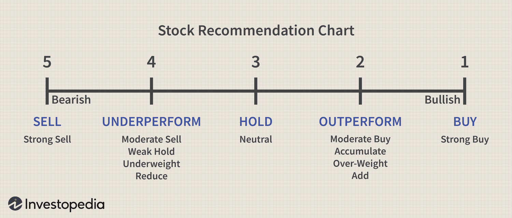

In the dynamic world of finance, mastering the intricacies of investment ratings and algorithmic trading has become essential for modern investors. With markets evolving rapidly, the ability to interpret and act on financial data can significantly impact investment outcomes. This article addresses the importance of understanding 'market perform' ratings, an essential tool for evaluating how a stock is expected to perform relative to the market. It serves as a neutral benchmark, distinct from more decisive 'buy' or 'sell' recommendations.

Comprehending financial analysis is equally critical. It lays the foundation for sound investment decisions by enabling investors to evaluate a company's financial health, assess market trends, and consider broader economic conditions. Solid financial analysis helps unravel a company's potential growth and profitability prospects, providing a lens through which market perform ratings can be better understood and utilized.



The revolution of algorithmic trading has further transformed financial markets. This approach, which uses automated systems to execute trades based on pre-defined criteria, enhances the speed and precision of trading activities. Key algorithmic strategies such as trend following, statistical arbitrage, and mean reversion are employed to harness market movements efficiently. By reducing emotional bias and improving execution accuracy, algorithmic trading has emerged as a formidable tool in modern investment practice.

Incorporating these elements allows investors to make informed decisions, balancing risks and returns while exploiting opportunities efficiently. By leveraging technology, investors can optimize their returns and effectively manage risks, ensuring they remain competitive in an ever-changing financial landscape.

## Table of Contents

## Understanding Market Perform Investment Rating

Market perform is an investment rating that signifies a stock is anticipated to perform in line with the overall market. This rating is employed by financial analysts who assess that a particular stock neither underperforms nor outperforms the average market return. Unlike 'buy' or 'sell' recommendations, which suggest a stock will surpass or lag the market respectively, market perform offers a balanced outlook. 

Analysts use market perform ratings by evaluating the projected growth and stability of a stock relative to broader market indices. This assessment involves a comprehensive examination of a company's financial health, which includes reviewing its income statements, balance sheets, cash flow statements, and other pertinent financial documents. The intention is to predict the stock's future returns, taking into account both macroeconomic factors—like interest rates, inflation, and economic growth—and microeconomic aspects particular to the company or industry.

For investors, a market perform rating can serve as a neutral benchmark against which to measure individual investment goals and strategies. Given that this rating implies expected performance parity with the market, investors should incorporate their risk tolerance, time horizon, and financial objectives when considering such recommendations. Moreover, understanding the economic landscape, such as shifts in fiscal policy or global economic conditions, is imperative when evaluating market perform ratings, to align them with personal financial goals.

In summary, market perform ratings provide investors with a neutral lens through which to appraise individual stocks, advocating neither strong buy nor sell actions but rather consistency with overall market averages.

## Financial Analysis: A Foundation for Investment Decisions

Effective financial analysis plays a crucial role in interpreting market perform ratings and making informed investment decisions. This process involves several key components, including the evaluation of a company's financial statements, comprehension of market trends, and assessment of prevailing economic conditions.

**Evaluating Financial Statements**

The analysis of financial statements is fundamental to understanding a company's current financial health and future potential. This involves a detailed examination of the income statement, balance sheet, and cash flow statement. Each of these documents provides insights into different aspects of a company's operations. The income statement reveals the company's profitability over a specific period, while the balance sheet offers a snapshot of its assets, liabilities, and equity at a particular point in time. The cash flow statement, on the other hand, highlights the company's [liquidity](/wiki/liquidity-risk-premium) and cash generation capabilities. By assessing these elements, investors can determine a company's financial stability and operational efficiency.

**Understanding Market Trends**

Another vital component of financial analysis is understanding the broader market trends. This requires investors to study the industry landscape, competitive dynamics, and various other external factors that might influence a company's performance. Market trends can signify potential growth areas or highlight emerging risks. For instance, technological advancements or shifts in consumer behavior can open up new opportunities for a company, whereas regulatory changes or economic downturns may pose challenges. Analyzing these trends helps investors anticipate the direction in which a company's market is heading, thereby aiding in better investment decisions.

**Assessing Economic Conditions**

Economic conditions significantly impact investment outcomes. Factors such as interest rates, inflation, and GDP growth can influence a company's performance. For example, rising interest rates might increase borrowing costs, while inflation can erode purchasing power. Understanding these macroeconomic indicators allows investors to align their strategies with the prevailing economic environment. Additionally, recognizing the phase of the economic cycle can assist in timing investments more effectively, thus optimizing returns.

By integrating the analysis of financial statements, market trends, and economic conditions, investors can gain a comprehensive view of a company's potential for future growth and profitability. This holistic approach refines the interpretation of market perform ratings, ensuring that investors make sound decisions aligned with their financial objectives. Through continual analysis and adaptation to new insights, investors can bolster their investment strategies and enhance their ability to achieve favorable outcomes.

## Algorithmic Trading: Revolutionizing Financial Markets

Algorithmic trading employs automated systems to execute trades according to predefined criteria, significantly enhancing both the speed and efficiency of transactions in financial markets. By removing the human element from the decision-making process, [algorithmic trading](/wiki/algorithmic-trading) reduces emotional bias and increases precision in trade execution, enabling traders to exploit market opportunities more effectively.

Key strategies utilized in algorithmic trading include [trend following](/wiki/trend-following), statistical [arbitrage](/wiki/arbitrage), and mean reversion. Trend following strategies capitalize on sustained movements in asset prices; they are based on the premise that asset movements will continue in a given direction. For instance, a simple moving average crossover strategy—buying when a short-term moving average crosses above a long-term moving average—can be easily implemented to capture upward trends.

Statistical arbitrage, in contrast, involves the simultaneous buying and selling of securities to exploit price inefficiencies between them. This strategy often utilizes complex mathematical models and quantitative techniques to identify mispriced assets or correlations between multiple securities. A common example involves pairs trading, where an underpriced stock is bought while simultaneously selling an overpriced stock, expecting the prices to converge.

Mean reversion is another widely adopted strategy that assumes asset prices will revert to their historical averages over time. This approach involves identifying price extremes and trading against the direction of recent moves. For example, if an asset's price significantly above or below its long-term mean, a mean reversion strategy would involve betting on the price moving back towards this average.

To illustrate these strategies programmatically, consider a simple trend following strategy implemented in Python using moving averages:

```python
# Example of a moving average crossover strategy using Python pandas library
import pandas as pd

# Sample stock price data
data = {'Price': [100, 102, 101, 105, 107, 110, 108, 105, 107, 109]}
df = pd.DataFrame(data)

# Calculating short-term and long-term moving averages
df['Short_MA'] = df['Price'].rolling(window=3).mean()
df['Long_MA'] = df['Price'].rolling(window=5).mean()

# Generating buy/sell signals
df['Signal'] = 0
df['Signal'][df['Short_MA'] > df['Long_MA']] = 1  # Buy signal
df['Signal'][df['Short_MA'] < df['Long_MA']] = -1  # Sell signal

print(df)
```

This script generates buy and sell signals based on the crossover of moving averages, demonstrating the simplicity and power of algorithmic strategies.

The advantages of algorithmic trading extend beyond speed and efficiency. By enabling trades to be executed in milliseconds, algorithmic trading supports more dynamic risk management, allowing for immediate reaction to market changes. It also enhances liquidity by increasing the number and [volume](/wiki/volume-trading-strategy) of trades, which benefits market participants by narrowing bid-ask spreads and reducing transaction costs.

In summary, algorithmic trading represents a transformative force in financial markets, utilizing technology to optimize trading operations and strategies. Through sophisticated algorithms, traders can efficiently capitalize on market movements with unparalleled precision and minimal emotional interference, thereby maximizing potential returns.

## Evaluating Algorithmic Trading Strategies

Evaluating the performance of algorithmic trading strategies is critical for ensuring that they align with specific investment goals, as well as maintaining optimal risk management and returns. Metrics like the Sharpe Ratio, maximum drawdown, and win rate provide a quantitative basis for assessing these strategies.

The Sharpe Ratio is a key metric that measures the risk-adjusted return of a trading strategy. It is calculated as the difference between the strategy's return and the risk-free rate, divided by the standard deviation of the strategy's return. Mathematically, it is expressed as:

$$
\text{Sharpe Ratio} = \frac{R_s - R_f}{\sigma_s}
$$

where $R_s$ is the average return of the strategy, $R_f$ is the risk-free rate, and $\sigma_s$ is the standard deviation of the strategy’s returns. A higher Sharpe Ratio indicates a more attractive risk-adjusted return.

Maximum drawdown represents the largest peak-to-trough decline in the portfolio value before a new peak is achieved. It provides insight into the potential risk of significant losses during turbulent periods. The maximum drawdown is crucial for understanding the worst-case scenario that an investor might face while using a particular algorithmic trading strategy.

The win rate of a trading strategy indicates the proportion of profitable trades over the total number of trades executed. While a high win rate is desirable, it should not be viewed in isolation. A strategy with a high win rate may still be unsuccessful if the average loss is significantly greater than the average gain from winning trades.

For investors, it is important to regularly assess these metrics in the context of evolving market conditions. Algorithmic trading strategies should be adaptive, continuously refined to capture new opportunities and mitigate risks. This often involves [backtesting](/wiki/backtesting) strategies using historical data and employing [machine learning](/wiki/machine-learning) techniques to predict market movements.

Here is a simple Python function to calculate the Sharpe Ratio:

```python
def calculate_sharpe_ratio(returns, risk_free_rate=0.01):
    mean_return = returns.mean()
    std_dev = returns.std()
    sharpe_ratio = (mean_return - risk_free_rate) / std_dev
    return sharpe_ratio

# Example usage with hypothetical data
import numpy as np

# Simulated monthly returns
monthly_returns = np.random.normal(0.02, 0.05, 500)

# Calculate Sharpe Ratio
sharpe_ratio = calculate_sharpe_ratio(monthly_returns)
print('Sharpe Ratio:', sharpe_ratio)
```

Monitoring and regularly updating these evaluations allow investors to maintain a robust and successful algorithmic trading strategy, ensuring that the trading objectives are met even as market conditions change.

## Integrating Market Perform, Financial Analysis, and Algo Trading

Smart investors combine market perform assessments, financial analysis, and algorithmic trading to create a holistic approach to investing. This integration is crucial as it facilitates informed decision-making by balancing risks and returns while taking advantage of market opportunities.

Market perform ratings serve as a neutral benchmark for evaluating individual securities. These ratings suggest that a stock will perform in line with the broader market, which helps investors calibrate their expectations. Incorporating financial analysis into this equation enables a deeper understanding of a company's financial health and potential. By evaluating financial statements, market trends, and economic conditions, investors can identify stocks with a favorable market perform rating that align with their financial objectives.

Algorithmic trading further enhances this comprehensive approach by employing technology-driven strategies to execute trades with speed and precision. This method utilizes pre-defined rules based on statistical models and historical data, mitigating emotional biases that often affect human decision-making. For example, Python, a popular programming language, can be used to code algorithmic trading strategies:

```python
import pandas as pd
import numpy as np

# Example simple mean reversion trading strategy
def mean_reversion_strategy(data, short_window=40, long_window=100):
    signals = pd.DataFrame(index=data.index)
    signals['signal'] = 0.0
    signals['short_mavg'] = data['Close'].rolling(window=short_window, min_periods=1, center=False).mean()
    signals['long_mavg'] = data['Close'].rolling(window=long_window, min_periods=1, center=False).mean()
    signals['signal'][short_window:] = np.where(signals['short_mavg'][short_window:] > signals['long_mavg'][short_window:], 1.0, 0.0)    
    signals['positions'] = signals['signal'].diff()
    return signals

# Assuming 'data' is a DataFrame containing the historical price data
signals = mean_reversion_strategy(data)
```

By integrating these components, investors gain a more nuanced perspective of market dynamics, allowing them to craft strategies that are both defensive and opportunistic. This comprehensive approach empowers investors to navigate the complexities of modern financial markets, leveraging data-driven insights and technology to achieve desired investment outcomes.

In conclusion, the integration of market perform assessments, financial analysis, and algorithmic trading yields a robust strategy for meeting today's investment challenges.

## Conclusion

Combining investment ratings like market perform with thorough financial analysis and advanced trading algorithms can significantly enhance investment outcomes. Investors who successfully integrate these elements can better navigate the complexities of financial markets and optimize their strategies. Market perform ratings provide a neutral benchmark, encouraging investors to remain vigilant and consider market movements without the polarization of 'buy' or 'sell' extremes. By utilizing financial analysis methods—assessing financial statements, market trends, and economic indicators—investors gain valuable insights that inform their strategies and decision-making processes.

Algorithmic trading further augments this approach by enabling precise and rapid trade execution, reducing emotional biases that can affect human traders. Strategies within algorithmic trading, such as trend following and mean reversion, offer ways to capitalize on market fluctuations, enhancing the scope for achieving favorable returns. Evaluating these strategies through metrics like the Sharpe Ratio and maximum drawdown ensures that investors can measure and align their risk-adjusted performance with investment objectives.

In the rapidly evolving finance landscape, staying informed and adaptable is crucial for long-term success. Continual learning and application of these concepts equip investors to manage risks effectively and exploit emerging opportunities. Technology and data-driven insights play a critical role, providing investors with tools to critically assess market conditions and adjust their approaches accordingly. As the financial markets continue to change, a strong foundation in these integrated principles empowers investors to face future challenges with confidence and resilience.

## References & Further Reading

[1]: ["Quantitative Trading: How to Build Your Own Algorithmic Trading Business"](https://www.amazon.com/Quantitative-Trading-Build-Algorithmic-Business/dp/1119800064) by Ernest P. Chan

[2]: ["Advances in Financial Machine Learning"](https://www.amazon.com/Advances-Financial-Machine-Learning-Marcos/dp/1119482089) by Marcos Lopez de Prado

[3]: Bergstra, J., Bardenet, R., Bengio, Y., & Kégl, B. (2011). ["Algorithms for Hyper-Parameter Optimization."](https://dl.acm.org/doi/10.5555/2986459.2986743) Advances in Neural Information Processing Systems 24.

[4]: ["Evidence-Based Technical Analysis: Applying the Scientific Method and Statistical Inference to Trading Signals"](https://www.amazon.com/Evidence-Based-Technical-Analysis-Scientific-Statistical/dp/0470008741) by David Aronson

[5]: ["Machine Learning for Algorithmic Trading"](https://github.com/stefan-jansen/machine-learning-for-trading) by Stefan Jansen