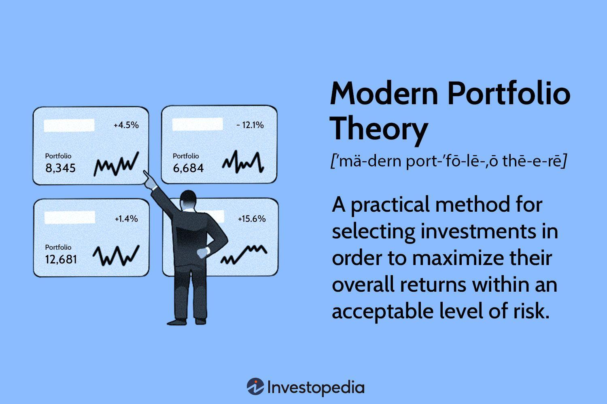

## Table of Contents

## What is a market portfolio?

A market portfolio is a type of investment that includes a little bit of everything that you can buy and sell in the market. Imagine it like a big basket where you put a small piece of every stock, bond, and other types of investments that are available. The idea is to own a piece of the whole market, so you are not just betting on one company or one type of investment.

The main reason people like the market portfolio is because it helps spread out the risk. If one company does badly, it won't hurt your whole investment because you have pieces of many different companies. This way, you can still make money even if some parts of the market go down. It's like not putting all your eggs in one basket.

## How does the concept of a market portfolio relate to modern portfolio theory?

The concept of a market portfolio is central to modern portfolio theory (MPT), which was developed by Harry Markowitz in the 1950s. MPT is all about figuring out the best way to invest your money by balancing risk and reward. The market portfolio, in MPT, is seen as the ideal mix of all available investments. It's like a perfect blend that gives you the highest possible return for the least amount of risk. The theory suggests that if you own a market portfolio, you're as diversified as you can be, which means your investment is spread out over many different types of assets.

In MPT, the market portfolio is used as a benchmark to compare other portfolios. If your portfolio is different from the market portfolio, MPT helps you understand if you're taking on more risk than necessary for the return you're getting. The idea is that by comparing your portfolio to the market portfolio, you can make smarter choices about where to put your money. This way, you can try to get the best possible return without taking on too much risk.

## What are the key components of a market portfolio?

A market portfolio includes a little bit of everything you can buy and sell in the market. This means it has stocks from different companies, bonds from governments and corporations, and other types of investments like real estate or commodities. The idea is to own a piece of the whole market, so you're not just betting on one thing. By including all these different types of investments, the market portfolio helps spread out the risk. If one type of investment does badly, it won't hurt your whole portfolio because you have pieces of many different things.

The key to a market portfolio is that it's weighted according to the total value of each type of investment in the market. This means that if stocks make up a big part of the market, they will also make up a big part of your market portfolio. The same goes for bonds and other investments. By matching the weights of the market, the market portfolio aims to give you the same returns as the market as a whole. This way, you can enjoy the growth of the market without taking on extra risk by betting on just one or a few investments.

## How is a market portfolio constructed?

To construct a market portfolio, you start by including a little bit of every type of investment available in the market. This means adding stocks from all different companies, bonds from governments and corporations, and even other types of investments like real estate or commodities. The idea is to own a piece of the whole market, so you're not just betting on one thing. By including all these different types of investments, you spread out the risk. If one type of investment does badly, it won't hurt your whole portfolio because you have pieces of many different things.

The next step is to make sure each part of your market portfolio matches the total value of that type of investment in the market. This is called weighting the portfolio. If stocks make up a big part of the market, they will also make up a big part of your market portfolio. The same goes for bonds and other investments. By matching the weights of the market, the market portfolio aims to give you the same returns as the market as a whole. This way, you can enjoy the growth of the market without taking on extra risk by betting on just one or a few investments.

## What is the role of diversification in a market portfolio?

Diversification is a key part of a market portfolio. It means spreading your investments across many different types of assets, like stocks, bonds, and other things you can buy and sell. When you do this, you're not putting all your money into just one thing. If one type of investment does badly, it won't hurt your whole portfolio because you have pieces of many different things. This way, you can still make money even if some parts of the market go down.

In a market portfolio, diversification helps you manage risk. By owning a little bit of everything in the market, you're as diversified as you can be. This means you're less likely to lose a lot of money if one company or one type of investment does badly. The goal is to match the overall performance of the market, so you can enjoy its growth without taking on extra risk by betting on just one or a few investments.

## How does a market portfolio differ from an individual stock portfolio?

A market portfolio and an individual stock portfolio are different in what they include and how they work. A market portfolio is like a big basket that holds a little bit of everything you can buy and sell in the market. This means it has stocks from many different companies, bonds, and other types of investments. The idea is to own a piece of the whole market, so you're not just betting on one company or one type of investment. By including all these different things, a market portfolio helps spread out the risk. If one company does badly, it won't hurt your whole investment because you have pieces of many different companies.

On the other hand, an individual stock portfolio is much more focused. It only includes stocks from specific companies that you choose. This means you're betting on those particular companies to do well. If one of those companies does badly, it can hurt your whole portfolio a lot more because you're not as spread out. An individual stock portfolio can be riskier because it's not as diversified as a market portfolio. But it also gives you the chance to pick companies you think will do better than the market as a whole.

## What are the benefits of investing in a market portfolio?

Investing in a market portfolio has many benefits. One big benefit is that it helps spread out your risk. Instead of betting on just one company or one type of investment, you own a little bit of everything in the market. This means if one company does badly, it won't hurt your whole investment because you have pieces of many different companies. It's like not putting all your eggs in one basket. By owning a piece of the whole market, you're as diversified as you can be, which makes your investment safer.

Another benefit is that a market portfolio aims to match the overall performance of the market. This means you can enjoy the growth of the market without taking on extra risk by betting on just one or a few investments. Over time, the market tends to go up, so by owning a market portfolio, you can benefit from this growth. It's a simple way to invest that doesn't require you to pick individual stocks or try to time the market. You just need to hold onto your market portfolio and let it grow with the market.

## How can one measure the performance of a market portfolio?

To measure the performance of a market portfolio, you can look at how much it grows over time. This is usually done by calculating the total return, which includes any increase in the value of the investments and any money you get from dividends or interest. You can compare this total return to a benchmark, like a stock market index such as the S&P 500, to see if your market portfolio is doing as well as the overall market. If your portfolio's return is close to the benchmark's return, it means your market portfolio is performing well and matching the market's growth.

Another way to measure the performance of a market portfolio is by looking at its risk-adjusted return. This means you consider not just how much your portfolio grows, but also how much risk you took to get that growth. A common measure for this is the Sharpe ratio, which compares the return of your portfolio to the risk-free rate of return (like what you'd get from a government bond) and then divides it by the standard deviation of the portfolio's returns. A higher Sharpe ratio means your market portfolio is giving you good returns for the amount of risk you're taking. By using these measures, you can get a clear picture of how well your market portfolio is doing.

## What are some common indices used as proxies for a market portfolio?

Some common indices used as proxies for a market portfolio are the S&P 500 and the Dow Jones Industrial Average in the United States. The S&P 500 includes 500 of the largest companies in the U.S., covering different industries like technology, healthcare, and finance. It's a good way to measure the performance of the overall market because it represents a big part of it. The Dow Jones Industrial Average, on the other hand, includes 30 large companies and is another way to see how the market is doing. These indices help investors see if their market portfolio is doing as well as the market as a whole.

Another index often used as a proxy for a market portfolio is the MSCI World Index. This index includes stocks from developed countries all around the world, not just the U.S. It gives a broader view of the global market, which can be useful if you want to see how your investments are doing compared to the world's markets. By comparing your market portfolio's performance to these indices, you can get a good idea of whether you're keeping up with the market's growth.

## How do market conditions affect the composition of a market portfolio?

Market conditions can change the composition of a market portfolio because the value of different investments goes up and down over time. If stocks are doing well and their value is going up, they will make up a bigger part of the market portfolio. On the other hand, if bonds are not doing as well and their value is going down, they will make up a smaller part of the portfolio. The idea is to always match the weights of the market, so if the market changes, the market portfolio needs to change too.

Rebalancing is a way to keep the market portfolio in line with the market's changes. This means selling some investments that have grown a lot and buying more of the ones that have not grown as much. By doing this, you can make sure your market portfolio still looks like the market as a whole. It's important to keep an eye on market conditions and adjust your portfolio to stay diversified and match the market's performance.

## What are the challenges and limitations of implementing a true market portfolio?

Trying to make a true market portfolio can be tough because it's hard to own a little bit of everything in the market. There are so many different types of investments out there, like stocks, bonds, real estate, and even things like commodities. It's not easy to buy a small piece of all of them, especially if some of these investments are hard to get or cost a lot of money. Also, keeping the portfolio balanced can be a lot of work. As the market changes, you need to keep buying and selling different investments to make sure your portfolio still matches the market. This can take a lot of time and effort.

Another challenge is that some parts of the market might be harder to invest in than others. For example, you might find it easy to buy stocks from big companies, but it can be much harder to invest in smaller companies or in things like private equity. This means your market portfolio might not really be a perfect match for the whole market. Plus, there are costs to think about. Every time you buy or sell something, you might have to pay fees, and these can add up over time. So, while a market portfolio is a great idea, it can be tricky to actually put it into practice and keep it going.

## How do advanced financial models enhance the understanding and management of market portfolios?

Advanced financial models help us understand and manage market portfolios better by giving us more detailed information about how different investments work together. These models can look at lots of data and tell us how much risk we're taking and how much return we can expect. They can also show us how different parts of the market affect each other. For example, if stocks go up, how does that change the value of bonds? By using these models, we can see the big picture and make smarter choices about where to put our money.

These models also help us keep our market portfolios in line with the market as it changes. They can tell us when it's time to buy or sell different investments to keep our portfolio balanced. This is called rebalancing, and it's important for making sure our portfolio still looks like the market as a whole. By using advanced financial models, we can do this rebalancing more accurately and with less work. This way, we can enjoy the growth of the market while managing our risk better.

## What is the understanding of the Market Portfolio?

A market portfolio is a theoretical construct that represents a fully diversified portfolio comprising all available assets in the market, each weighted in proportion to its total market value. This concept forms the cornerstone of the Capital Asset Pricing Model (CAPM), which posits that the market portfolio is the optimal risky portfolio that investors can hold to maximize returns relative to the risk undertaken. Within CAPM, the expected return of any security or portfolio is determined by its beta ($\beta$) in relation to the market portfolio. The formula for determining expected returns in CAPM is:

$$

E(R_i) = R_f + \beta_i (E(R_m) - R_f)
$$

where $E(R_i)$ is the expected return on the investment, $R_f$ is the risk-free rate, $\beta_i$ is the beta of the investment, and $E(R_m)$ is the expected return of the market portfolio.

In terms of diversification, the market portfolio embodies the principle of optimal diversification, as it theoretically includes every available asset, thereby eliminating unsystematic risk. Unsystematic risk, or idiosyncratic risk, is specific to individual assets and can be mitigated through diversification. Conversely, systematic risk—also known as market risk—pertains to factors affecting the entire market and cannot be diversified away. In a market portfolio, investors are only exposed to systematic risk, which is compensated by the risk premium in the CAPM formula.

Despite its theoretical appeal, the market portfolio is subject to several limitations. One notable critique is Roll's Critique, proposed by Richard Roll, which argues that the market portfolio is unobservable because it comprises all investable assets, including non-tradable ones such as human capital. Roll posited that empirical tests of the CAPM are invalid unless the true market portfolio is known, as any proxy used may lead to inaccurate assessments of performance and risk.

Additionally, another limitation is the assumption of investor homogeneity, suggesting that all investors have the same expectations and access to the same information—a notion that does not hold in reality. Furthermore, the assumption of frictionless markets, where transaction costs do not exist, oversimplifies investment environments and may not represent true market dynamics.

In summary, while the concept of a market portfolio provides a foundational framework for diversification and risk management in investment theory, its practical application is encumbered by theoretical assumptions and limitations that must be recognized in real-world portfolio management.

## What is the role of Portfolio Theory in Modern Investing?

Modern Portfolio Theory (MPT), introduced by Harry Markowitz in 1952, is a cornerstone of financial economics that aims to optimize the balance between risk and return within an investment portfolio. The theory proposes that it is not enough to look at the expected risk and return of one particular stock; by investing in multiple assets, investors can diversify away unsystematic risk, which is specific to individual securities, and focus instead on maximizing returns for a given level of market risk (systematic risk).

The core principle of MPT is risk-reward optimization, where the goal is to construct a portfolio that offers the highest possible expected return for a given level of risk. This is achieved through diversification, where the combined [volatility](/wiki/volatility-trading-strategies) of a portfolio's assets is reduced relative to the average volatility of its components. Mathematically, MPT is often represented by the efficient frontier, a curve showing the set of optimal portfolios that offer maximal returns for a defined level of risk. The efficient frontier is calculated by solving the following optimization problem:

$$
\begin{align*}
\minimize_{\omega} \quad & \frac{1}{2} \omega^{T} \Sigma \omega \\
\subject \quad & \mu^T \omega = \mu_p, \quad \omega^T \mathbf{1} = 1
\end{align*}
$$

where $\omega$ is the vector of weights for the assets in the portfolio, $\Sigma$ is the covariance matrix of asset returns, $\mu$ is the vector of expected returns, and $\mu_p$ is the desired portfolio return.

One notable example inspired by MPT principles is the Ray Dalio All Weather Portfolio, designed to perform well under various economic conditions. This portfolio capitalizes on MPT's diversification concept by allocating assets across different classes, such as equities, bonds, commodities, and cash, thereby aiming to balance risk exposure against historically proven returns for each asset class.

MPT remains highly influential in shaping modern investment strategy frameworks. It encourages investors to make decisions based on quantifiable metrics of risk and return rather than on emotions or speculation. By optimizing asset allocation based on target risk levels, MPT enhances the strategic approach to investing, wherein the significance of diversification, correlation, and covariance between assets is emphasized. Consequently, MPT provides the foundation for various other advanced investment strategies, such as Black-Litterman and robust optimization models, enhancing decision-making processes within the contexts of individual investors, institutional fund managers, and [algorithmic trading](/wiki/algorithmic-trading) platforms.

## What are examples of market portfolio and algo trading integration?

Market portfolios represent a theoretical basket of investments that optimizes diversification across the entire market, while algorithmic trading represents a shift towards efficiency and precision in executing trades. Integrating algorithmic trading with market portfolio strategies offers a robust framework for managing diversified portfolios.

Several asset management firms and hedge funds are at the forefront of utilizing algorithmic trading to manage market portfolios. For example, Renaissance Technologies, a quantitative [hedge fund](/wiki/hedge-fund-trading-strategies), employs complex algorithms to manage its Medallion Fund, which is known for its high returns. These algorithms analyze massive datasets to quickly identify profitable trading opportunities, holding a diversified range of assets.

Algorithmic trading impacts the creation of diversified portfolios by enabling rapid execution across multiple markets and asset classes. Algorithms can automatically adjust portfolio compositions in response to market changes, thereby maintaining optimal diversification. This ability is critical in environments with high volatility where human intervention might be too slow.

Risk management and portfolio rebalancing are vital components enhanced through algorithms. Algorithms can continuously monitor risk exposure across a portfolio. For instance, if an asset class becomes too dominant, algorithms can automatically rebalance the portfolio to its target allocation. This process might include the use of the Value-at-Risk (VaR) model, calculated as:

$$
\text{VaR} = \mu - z \times \sigma
$$

where $\mu$ is the portfolio's mean return, $z$ is the z-score associated with the confidence level, and $\sigma$ is the standard deviation of the portfolio's returns.

Additionally, automated systems enable the efficient execution and optimization of trades. They utilize various algorithmic strategies like statistical [arbitrage](/wiki/arbitrage), which identifies price inefficiencies between related securities, and executes trades to exploit these for profit. This level of analysis and execution enhances the overall efficiency and performance of large investment portfolios, promoting better capital allocation.

Real-time data analysis and instant execution provided by algorithmic systems significantly reduce transaction costs and minimize slippage, enabling large investment entities to move quickly without impacting market prices significantly.

In conclusion, the integration of algorithmic trading with market portfolio strategies exemplifies a significant advancement in investment management. It reinforces the potential to achieve a well-balanced, diversified portfolio with enhanced risk management, providing investors with the opportunity for optimized returns in a technology-driven marketplace.

## References & Further Reading

[1]: ["Portfolio Selection"](https://archive.org/details/portfolio_selection) by Harry Markowitz, Journal of Finance, 1952.

[2]: ["The Capital Asset Pricing Model: Theory and Evidence"](http://www-personal.umich.edu/~kathrynd/JEP.FamaandFrench.pdf) by Eugene F. Fama and Kenneth R. French, Journal of Economic Perspectives, 2004.

[3]: ["Algorithmic Trading and DMA: An introduction to direct access trading strategies"](https://www.amazon.com/Algorithmic-Trading-DMA-introduction-strategies/dp/0956399207) by Barry Johnson

[4]: ["All About High-Frequency Trading"](https://toxigon.com/high-frequency-trading-explained) by Michael Durbin

[5]: ["The Quants: How a New Breed of Math Whizzes Conquered Wall Street and Nearly Destroyed It"](https://www.amazon.com/Quants-Whizzes-Conquered-Street-Destroyed/dp/0307453383) by Scott Patterson