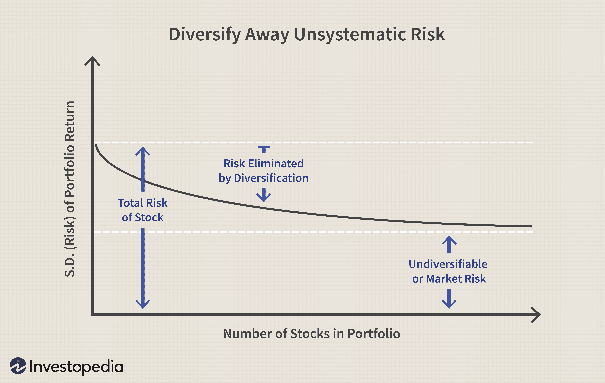

In today's dynamic financial markets, investment strategies continually evolve, driven by advancements in theoretical frameworks and technological innovations. Three pivotal concepts that have significantly influenced this evolution include the market portfolio, portfolio theory, and algorithmic trading. These elements collectively shape the decision-making processes of investors seeking to optimize returns while managing risks effectively.

The market portfolio forms the foundation of portfolio investment strategies, offering a theoretical benchmark for optimal investment. Rooted in the Capital Asset Pricing Model (CAPM), it serves as a theoretical model that assumes investors can achieve maximum diversification by holding a portfolio that reflects the entire market. This diversification theoretically eliminates unsystematic risk, offering investors exposure to only systematic risk, which is inherent to the entire market.



Portfolio theory, particularly Modern Portfolio Theory (MPT) developed by Harry Markowitz, introduces the concept of risk-reward optimization. MPT posits that an investor can construct an 'efficient frontier' of optimal portfolios that offer the highest expected return for a given level of risk. This theory has become integral to contemporary investment strategies, encouraging a systematic approach to balancing risk against expected returns.

Amidst these theoretical foundations, algorithmic trading has emerged as a transformative force in the investment landscape. Algorithmic trading leverages computer algorithms to execute trades at speeds and frequencies that are impossible for human traders. These algorithms utilize complex mathematical models and data analysis to optimize trading decisions, thus enhancing the efficiency and effectiveness of portfolio management.

The integration of algorithmic trading with portfolio theory enables investors to quickly adapt to market changes, rebalance portfolios, and execute diversified trading strategies with precision. This synergy is increasingly relevant as financial markets become more complex, necessitating robust solutions that navigate vast amounts of data and fluctuating market conditions.

The growing popularity of algorithmic trading within investment communities underscores its importance. Algorithms reduce emotional bias, enhance transaction speed, and allow for the implementation of sophisticated strategies, such as momentum trading, arbitrage, and portfolio rebalancing. These capabilities make algorithmic trading indispensable in modern portfolio management, arming investors with powerful tools to maximize returns while minimizing risks.

In conclusion, the interplay between market portfolio theory, modern portfolio principles, and algorithmic technology is reshaping investment strategies. This confluence of theory and technology empowers investors to embrace innovative solutions that optimize portfolio performance in an ever-evolving financial world.

## Table of Contents

## Understanding the Market Portfolio

A market portfolio is a theoretical construct that represents a fully diversified portfolio comprising all available assets in the market, each weighted in proportion to its total market value. This concept forms the cornerstone of the Capital Asset Pricing Model (CAPM), which posits that the market portfolio is the optimal risky portfolio that investors can hold to maximize returns relative to the risk undertaken. Within CAPM, the expected return of any security or portfolio is determined by its beta ($\beta$) in relation to the market portfolio. The formula for determining expected returns in CAPM is:

$$

E(R_i) = R_f + \beta_i (E(R_m) - R_f)
$$

where $E(R_i)$ is the expected return on the investment, $R_f$ is the risk-free rate, $\beta_i$ is the beta of the investment, and $E(R_m)$ is the expected return of the market portfolio.

In terms of diversification, the market portfolio embodies the principle of optimal diversification, as it theoretically includes every available asset, thereby eliminating unsystematic risk. Unsystematic risk, or idiosyncratic risk, is specific to individual assets and can be mitigated through diversification. Conversely, systematic risk—also known as market risk—pertains to factors affecting the entire market and cannot be diversified away. In a market portfolio, investors are only exposed to systematic risk, which is compensated by the risk premium in the CAPM formula.

Despite its theoretical appeal, the market portfolio is subject to several limitations. One notable critique is Roll's Critique, proposed by Richard Roll, which argues that the market portfolio is unobservable because it comprises all investable assets, including non-tradable ones such as human capital. Roll posited that empirical tests of the CAPM are invalid unless the true market portfolio is known, as any proxy used may lead to inaccurate assessments of performance and risk.

Additionally, another limitation is the assumption of investor homogeneity, suggesting that all investors have the same expectations and access to the same information—a notion that does not hold in reality. Furthermore, the assumption of frictionless markets, where transaction costs do not exist, oversimplifies investment environments and may not represent true market dynamics.

In summary, while the concept of a market portfolio provides a foundational framework for diversification and risk management in investment theory, its practical application is encumbered by theoretical assumptions and limitations that must be recognized in real-world portfolio management.

## Portfolio Theory in Modern Investing

Modern Portfolio Theory (MPT), introduced by Harry Markowitz in 1952, is a cornerstone of financial economics that aims to optimize the balance between risk and return within an investment portfolio. The theory proposes that it is not enough to look at the expected risk and return of one particular stock; by investing in multiple assets, investors can diversify away unsystematic risk, which is specific to individual securities, and focus instead on maximizing returns for a given level of market risk (systematic risk).

The core principle of MPT is risk-reward optimization, where the goal is to construct a portfolio that offers the highest possible expected return for a given level of risk. This is achieved through diversification, where the combined [volatility](/wiki/volatility-trading-strategies) of a portfolio's assets is reduced relative to the average volatility of its components. Mathematically, MPT is often represented by the efficient frontier, a curve showing the set of optimal portfolios that offer maximal returns for a defined level of risk. The efficient frontier is calculated by solving the following optimization problem:

$$
\begin{align*}
\minimize_{\omega} \quad & \frac{1}{2} \omega^{T} \Sigma \omega \\
\subject \quad & \mu^T \omega = \mu_p, \quad \omega^T \mathbf{1} = 1
\end{align*}
$$

where $\omega$ is the vector of weights for the assets in the portfolio, $\Sigma$ is the covariance matrix of asset returns, $\mu$ is the vector of expected returns, and $\mu_p$ is the desired portfolio return.

One notable example inspired by MPT principles is the Ray Dalio All Weather Portfolio, designed to perform well under various economic conditions. This portfolio capitalizes on MPT's diversification concept by allocating assets across different classes, such as equities, bonds, commodities, and cash, thereby aiming to balance risk exposure against historically proven returns for each asset class.

MPT remains highly influential in shaping modern investment strategy frameworks. It encourages investors to make decisions based on quantifiable metrics of risk and return rather than on emotions or speculation. By optimizing asset allocation based on target risk levels, MPT enhances the strategic approach to investing, wherein the significance of diversification, correlation, and covariance between assets is emphasized. Consequently, MPT provides the foundation for various other advanced investment strategies, such as Black-Litterman and robust optimization models, enhancing decision-making processes within the contexts of individual investors, institutional fund managers, and [algorithmic trading](/wiki/algorithmic-trading) platforms.

## Algorithmic Trading: Transforming Investment Approaches

Algorithmic trading, often referred to as algo trading, employs computer algorithms to automate trading strategies and manage investment portfolios. This approach leverages computational power and mathematical models to execute trades at speeds and frequencies unachievable through human intervention. 

### Mechanics of Algorithmic Trading

At its core, algorithmic trading involves the use of complex algorithms to make decisions about buying or selling securities. These algorithms can process vast datasets, analyzing market conditions, historical data, and other variables to make informed trading decisions. Once these conditions align with the pre-specified criteria set by traders, computers execute trades automatically. 

The process typically involves coding algorithms in programming languages such as Python or C++. These codes specify conditions under which trades occur, ranging from simple moving averages to intricate statistical models. For example, a basic algorithm could be as simple as:

```python
# Example of simple moving average strategy
def moving_average_strategy(prices, short_window, long_window):
    short_mavg = prices.rolling(window=short_window).mean()
    long_mavg = prices.rolling(window=long_window).mean()

    signal = short_mavg > long_mavg
    return signal
```

This script calculates short and long-term moving averages of prices and generates a buy signal when the short-term average exceeds the long-term average.

### Types of Algorithmic Trading Strategies

Algorithmic trading encompasses various strategies, each serving distinct market conditions and objectives:

1. **Momentum Trading**: Capitalizes on existing market trends, assuming a continuation of current price movements. Algorithms identify assets experiencing significant trend momentum and execute trades based on predefined criteria to maximize returns.

2. **Arbitrage**: Exploits price discrepancies of an asset between different markets or forms. Through high-speed trades, algorithms lock in profits by simultaneously buying and selling an asset in separate markets.

3. **Scalping**: Focuses on profiting from small price changes over a short time frame. It requires a high frequency of trades, taking advantage of minimal price fluctuations. Algorithms execute rapid trades, capturing small gains multiple times throughout the day.

### Advantages of Algorithmic Trading

Algorithmic trading offers significant benefits over traditional manual trading methods:

- **Speed and Efficiency**: Algorithms can process complex calculations and execute trades at speeds measured in microseconds. This efficiency enables traders to capitalize on short-lived opportunities that human traders often miss.

- **Reduced Emotional Bias**: Human emotions can sometimes negatively impact trading decisions. Algorithmic trading removes these psychological barriers, relying solely on data-driven decisions.

- **Consistent Strategy Execution**: Algorithms follow predefined rules, ensuring that strategies are executed consistently without deviations. This consistency minimizes errors and enhances the reliability of investment strategies.

Through these capabilities, algorithmic trading has transformed the investment landscape, allowing traders and portfolio managers to augment their decision-making processes and optimize portfolio performance. Its integration represents a significant evolution in how markets are approached, providing tools for executing sophisticated strategies with precision and efficiency.

## Examples of Market Portfolio and Algo Trading Integration

Market portfolios represent a theoretical basket of investments that optimizes diversification across the entire market, while algorithmic trading represents a shift towards efficiency and precision in executing trades. Integrating algorithmic trading with market portfolio strategies offers a robust framework for managing diversified portfolios.

Several asset management firms and hedge funds are at the forefront of utilizing algorithmic trading to manage market portfolios. For example, Renaissance Technologies, a quantitative [hedge fund](/wiki/hedge-fund-trading-strategies), employs complex algorithms to manage its Medallion Fund, which is known for its high returns. These algorithms analyze massive datasets to quickly identify profitable trading opportunities, holding a diversified range of assets.

Algorithmic trading impacts the creation of diversified portfolios by enabling rapid execution across multiple markets and asset classes. Algorithms can automatically adjust portfolio compositions in response to market changes, thereby maintaining optimal diversification. This ability is critical in environments with high volatility where human intervention might be too slow.

Risk management and portfolio rebalancing are vital components enhanced through algorithms. Algorithms can continuously monitor risk exposure across a portfolio. For instance, if an asset class becomes too dominant, algorithms can automatically rebalance the portfolio to its target allocation. This process might include the use of the Value-at-Risk (VaR) model, calculated as:

$$
\text{VaR} = \mu - z \times \sigma
$$

where $\mu$ is the portfolio's mean return, $z$ is the z-score associated with the confidence level, and $\sigma$ is the standard deviation of the portfolio's returns.

Additionally, automated systems enable the efficient execution and optimization of trades. They utilize various algorithmic strategies like statistical [arbitrage](/wiki/arbitrage), which identifies price inefficiencies between related securities, and executes trades to exploit these for profit. This level of analysis and execution enhances the overall efficiency and performance of large investment portfolios, promoting better capital allocation.

Real-time data analysis and instant execution provided by algorithmic systems significantly reduce transaction costs and minimize slippage, enabling large investment entities to move quickly without impacting market prices significantly.

In conclusion, the integration of algorithmic trading with market portfolio strategies exemplifies a significant advancement in investment management. It reinforces the potential to achieve a well-balanced, diversified portfolio with enhanced risk management, providing investors with the opportunity for optimized returns in a technology-driven marketplace.

## Challenges and Limitations in Algo-Based Portfolio Management

Algorithmic trading has become a pivotal component in contemporary portfolio management, offering significant advantages in execution speed and efficiency. However, the adoption of these sophisticated systems is not without its challenges and limitations. This section addresses the primary concerns associated with algorithmic trading and portfolio management, highlighting technical, regulatory, and human oversight aspects.

### Technical Challenges and Risks

One of the primary challenges of algorithmic trading is the potential for technical malfunctions, which can arise from software bugs, hardware failures, or connectivity issues. These technical disruptions can lead to mispricings or missed opportunities, causing significant financial losses. Moreover, the complexity of algorithmic systems means that they are inherently prone to overfitting. Overfitting occurs when an algorithm is tailored too closely to historical data, capturing noise instead of the underlying market trends. This results in a model that performs well on past data but fails to adapt to new or unseen market conditions. To mitigate these risks, traders must employ robust validation techniques, such as cross-validation and out-of-sample testing.

### Absence of Human Judgment

While algorithmic systems are designed to execute trades without human intervention, the absence of human judgment can be a significant limitation. Human intuition and experience can often identify market anomalies or unforeseeable events that an algorithm might overlook. For example, during unexpected geopolitical events or market crises, human traders may exercise discretionary decision-making that algorithms cannot replicate. As such, it is crucial to maintain a balance between automated processes and human oversight. An integrated approach that combines algorithmic precision with human intuition is often recommended to enhance decision-making in volatile markets.

### Regulatory Concerns and Compliance

The burgeoning use of algorithmic trading has drawn the attention of regulatory bodies worldwide. The primary concerns include market manipulation, such as spoofing (placing large orders with no intention of execution), and the increase in market volatility due to high-frequency trading activities. Regulatory frameworks necessitate stringent compliance measures to ensure that algorithmic trading does not compromise market integrity. Traders and financial institutions must adhere to guidelines that promote transparency, such as recording and monitoring algorithmic strategies and their execution logs. Moreover, continuous auditing and compliance checks are essential to align trading activities with regulatory standards.

### Balancing Algorithmic Decision-Making and Human Oversight

To effectively manage algorithmic trading portfolios, it is vital to strike a balance between automated decision-making and human oversight. This can be achieved by implementing monitoring systems that flag anomalies or discrepancies in algorithmic performance. Human analysts can then review these flags to determine whether manual intervention is required. Additionally, organizations should emphasize training human operators to understand the intricacies of algorithms and their potential scenarios. By promoting a culture of accountability and continuous learning, financial professionals can ensure that the adoption of algorithmic trading is both efficient and secure.

In conclusion, while algorithmic trading offers numerous advantages in speed and efficiency, it is accompanied by specific challenges that must be addressed to safeguard portfolio management effectiveness. By recognizing and mitigating technical risks, relying on human oversight when necessary, and ensuring strict regulatory compliance, financial professionals can leverage algorithmic trading to enhance investment outcomes while minimizing potential drawbacks.

## Conclusion

The intersection of market portfolio theory, portfolio diversification, and algorithmic trading marks a transformative period in investment strategy formulation. Market portfolio theory provides foundational insights into diversification benefits, enabling investors to optimize their risk-reward profiles. When combined with the principles of algorithmic trading, portfolio management strategies achieve unprecedented precision and efficiency. Algorithmic trading harnesses powerful computational capabilities to execute complex strategies, facilitating large-scale portfolio rebalancing and enhancing risk management in ways that traditional methods cannot match.

Advanced technologies play a significant role in modern investment strategies by offering tools that maximize efficiency and reduce emotional biases in trading. Automated systems empowered by sophisticated algorithms leverage vast amounts of data to make informed decisions, reacting more swiftly to market changes than human counterparts. This technological progression underscores the importance of embracing innovation to maintain a competitive edge in a continuously evolving financial landscape.

As the investment field evolves with technological advancements, it's crucial for investors and financial professionals to adopt innovative solutions for optimized portfolio management. The synergy between algorithmic trading and market portfolio principles exemplifies a progressive approach, integrating historical theories with cutting-edge technology to craft strategies that adapt to the dynamic nature of modern markets. The ongoing transformation in investment strategies, driven by technological advancements, will continue to shape the future of finance, urging stakeholders to remain agile and forward-thinking in their portfolio management practices.

## References & Further Reading

[1]: ["Portfolio Selection"](https://archive.org/details/portfolio_selection) by Harry Markowitz, Journal of Finance, 1952.

[2]: ["The Capital Asset Pricing Model: Theory and Evidence"](http://www-personal.umich.edu/~kathrynd/JEP.FamaandFrench.pdf) by Eugene F. Fama and Kenneth R. French, Journal of Economic Perspectives, 2004.

[3]: ["Algorithmic Trading and DMA: An introduction to direct access trading strategies"](https://www.amazon.com/Algorithmic-Trading-DMA-introduction-strategies/dp/0956399207) by Barry Johnson

[4]: ["All About High-Frequency Trading"](https://toxigon.com/high-frequency-trading-explained) by Michael Durbin

[5]: ["The Quants: How a New Breed of Math Whizzes Conquered Wall Street and Nearly Destroyed It"](https://www.amazon.com/Quants-Whizzes-Conquered-Street-Destroyed/dp/0307453383) by Scott Patterson