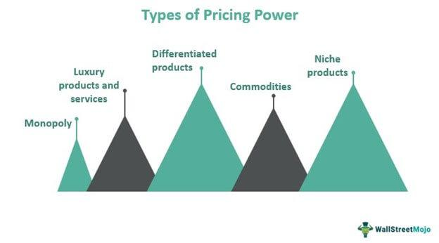

## Table of Contents

## What is market power?

Market power is when a company can control the price of what it sells. It happens when there are not many other companies selling the same thing, so the company can charge more money without losing customers. For example, if only one store in town sells milk, that store has market power because people have to buy milk from them, even if the price goes up.

Having market power can be good for the company because it can make more money. But it can be bad for customers because they have to pay more. Governments sometimes make rules to stop companies from having too much market power. They do this to keep prices fair and to make sure there is competition, which is good for everyone.

## What is pricing power?

Pricing power is when a company can raise the price of its products or services without losing customers. It means the company can charge more money and people will still buy from them. This happens because the company's product is special or different, or because people really like the brand.

Having pricing power is good for a company because it can make more money. It's like having a strong position in the market. But if a company raises prices too much, it might lose customers to other companies. So, companies need to be careful and smart about how they use their pricing power.

## How do market power and pricing power relate to each other?

Market power and pricing power are closely related because they both deal with a company's ability to control prices. Market power happens when a company has little competition, so it can set higher prices because people don't have many other choices. For example, if there's only one gas station in a small town, that gas station has market power because people have to buy gas there, even if the price goes up.

Pricing power, on the other hand, is when a company can raise prices and still keep its customers. This can happen even if there are other companies selling similar things, but the company's product is special or the brand is very popular. For instance, if people love a certain brand of shoes, the company can raise the price a little and people will still buy them. So, while market power comes from having few competitors, pricing power comes from having a strong product or brand.

Both types of power can help a company make more money. But they also need to be careful not to raise prices too much, or they might lose customers. Governments sometimes make rules to stop companies from having too much market power, to keep prices fair and make sure there's competition.

## What are the sources of market power?

Market power comes from different things. One big reason is when there aren't many other companies selling the same thing. If a company is the only one selling something in a certain area, like the only grocery store in a small town, it has market power. This is called a monopoly. Another reason is when it's hard for new companies to start selling the same thing. This can happen if it costs a lot of money to start the business or if there are special rules that make it hard for new companies to come in.

Another source of market power is when a company has something special that others don't have. This can be a secret way of making something, a special ingredient, or a brand that people really like. For example, if a company makes a famous soda that people love, it can have market power because people will keep buying it even if the price goes up. Also, if a company can sell its product cheaper than others because it makes a lot of it, that can give it market power too. This is called economies of scale.

In short, market power can come from having few competitors, high barriers for new companies to enter the market, having something unique, or being able to produce things cheaper than others. All these things help a company control prices and make more money.

## How can a company increase its pricing power?

A company can increase its pricing power by making its product or service special. This means having something that other companies don't have, like a secret recipe, a cool design, or a brand that people really like. For example, if a company makes a phone that is better than others and people want it, they can raise the price a little and people will still buy it. This is because the phone is special and people think it's worth the extra money.

Another way to increase pricing power is by making customers loyal to the brand. This can happen if the company treats its customers well, gives them good service, or makes them feel special. When customers are loyal, they are more likely to keep buying from the company even if the price goes up a bit. For example, if a coffee shop always remembers a customer's favorite drink and gives them a friendly smile, that customer might be willing to pay a little more for their coffee.

In summary, a company can increase its pricing power by making its product unique and by building strong relationships with its customers. Both of these things help the company charge more money without losing customers.

## What are the economic implications of high market power?

When a company has high market power, it can set higher prices because people don't have many other choices. This can be good for the company because it makes more money. But it can be bad for customers because they have to pay more for things. It can also make it hard for new companies to start selling the same thing because they can't compete with the big company's prices. This means less competition, which can lead to fewer choices for customers and less innovation in the market.

High market power can also affect the whole economy. When companies with a lot of market power make more money, they might invest it in new things or pay their workers more. But if they just keep the money, it might not help the economy grow. Also, when prices are high because of market power, people might not buy as much, which can slow down the economy. Governments sometimes make rules to stop companies from having too much market power. They do this to keep prices fair and make sure there's competition, which is good for everyone.

## Can you provide examples of companies with high market power?

One example of a company with high market power is De Beers. They used to control most of the world's diamond supply. Because they had so many diamonds, they could decide how much to sell and at what price. This made it hard for other companies to compete because they couldn't get enough diamonds to sell. People who wanted to buy diamonds had to buy from De Beers, even if the prices were high.

Another example is Microsoft. They have a lot of market power in the computer software market, especially with their Windows operating system. Many people and businesses use Windows, so it's hard for other companies to make a different operating system that people will use. This means Microsoft can keep selling Windows at a high price because people don't have many other choices.

## How does market structure affect market power?

Market structure is how many companies are selling the same thing and how easy it is for new companies to start selling it too. If there are only a few companies selling something, like in an oligopoly, those companies can have a lot of market power. They can set higher prices because people don't have many other choices. For example, if there are only two big airlines flying to a certain place, they can charge more for tickets because people have to fly with one of them.

If it's hard for new companies to start selling the same thing, the companies that are already there can have more market power. This can happen if it costs a lot of money to start the business or if there are special rules that make it hard for new companies to come in. For example, if a company needs a special license to sell medicine, and it's hard to get that license, the companies that already have it can charge more because new companies can't easily start selling medicine too. So, the structure of the market, like how many companies there are and how easy it is for new ones to join, really affects how much market power a company can have.

## What are the regulatory concerns associated with market power?

When a company has a lot of market power, it can set high prices because people don't have many other choices. This can be bad for customers because they have to pay more for things. It can also make it hard for new companies to start selling the same thing because they can't compete with the big company's prices. This means less competition, which can lead to fewer choices for customers and less innovation in the market. Governments worry about this because they want to keep prices fair and make sure there's competition, which is good for everyone.

To deal with these concerns, governments can make rules to stop companies from having too much market power. They might break up big companies into smaller ones, so there's more competition. Or they might stop big companies from buying other companies that could make them even bigger. Governments also watch to make sure companies don't work together to set high prices, which is called collusion. By doing these things, governments try to make sure the market stays fair and that companies can't use their market power to hurt customers or other businesses.

## How do economists measure market power and pricing power?

Economists measure market power by looking at how much a company can raise prices without losing customers. They often use something called the Lerner Index, which is the difference between the price a company charges and the cost to make the product, divided by the price. If the number is high, it means the company has a lot of market power because it can charge a lot more than it costs to make the product. Another way is to look at how much of the market a company controls, called market share. If a company has a big market share, it might have a lot of market power.

Pricing power is a bit different but related. Economists measure it by seeing if a company can raise prices and still keep its customers. They might look at how much a company can increase its prices without losing sales. If a company can raise prices a lot and people still buy from them, it has strong pricing power. This can be because the company's product is special or because people really like the brand. So, both market power and pricing power are about how much control a company has over prices, but they focus on different things.

## What strategies can firms use to maintain or increase their market power?

Firms can maintain or increase their market power by making it hard for new companies to enter the market. They can do this by spending a lot of money on things that are hard for new companies to copy, like special technology or a strong brand. For example, if a company spends a lot on advertising and people really like its brand, new companies will have a hard time getting customers. Another way is to make it expensive for new companies to start. If it costs a lot of money to build factories or get special licenses, new companies might not be able to start selling the same thing.

Another strategy is to keep prices low to make it hard for other companies to compete. If a company can make things cheaper because it makes a lot of them, it can sell them for less money than smaller companies. This is called economies of scale. By selling things for less, the company can take customers away from other companies and make it hard for them to stay in business. This way, the company can keep its market power and make it harder for new companies to come in.

## What are the potential risks for companies relying heavily on pricing power?

When a company relies a lot on pricing power, it can face some risks. One big risk is losing customers. If a company keeps raising prices, people might start looking for cheaper options. Even if the company's product is special or the brand is popular, there's a limit to how much people will pay. If the company goes over that limit, it might lose a lot of customers to other companies that offer similar products for less money.

Another risk is that competitors might find a way to offer something better or cheaper. If a company relies on high prices because it thinks its product is special, other companies might come up with their own special products. They might even find a way to make things cheaper or better, which can take customers away from the company that was relying on pricing power. So, while pricing power can help a company make more money, it's important for the company to keep an eye on what other companies are doing and make sure it doesn't raise prices too much.

## References & Further Reading

[1]: Posner, R. A. (2001). ["Antitrust Law, Second Edition."](https://press.uchicago.edu/ucp/books/book/chicago/A/bo3628468.html) University of Chicago Press.

[2]: Stigler, G. J. (1964). ["A Theory of Oligopoly."](https://www.semanticscholar.org/paper/A-Theory-of-Oligopoly-Stigler/d33bef53cddf86e5719740df576e887ec64cfb00) The Quarterly Journal of Economics, 72(1), 44-61.

[3]: Shapiro, C., & Varian, H. R. (1998). ["Information Rules: A Strategic Guide to the Network Economy."](https://link.springer.com/article/10.1023/A:1007897212472) Harvard Business School Press.

[4]: Hendershott, T., Jones, C. M., & Menkveld, A. J. (2011). ["Does Algorithmic Trading Improve Liquidity?"](https://onlinelibrary.wiley.com/doi/full/10.1111/j.1540-6261.2010.01624.x) The Review of Financial Studies, 24(8), 2523-2554.

[5]: Kirilenko, A. A., Kyle, A. S., Samadi, M., & Tuzun, T. (2017). ["The Flash Crash: High-Frequency Trading in an Electronic Market."](https://onlinelibrary.wiley.com/doi/abs/10.1111/jofi.12498) The Journal of Law and Economics, 29(1), 225-259.