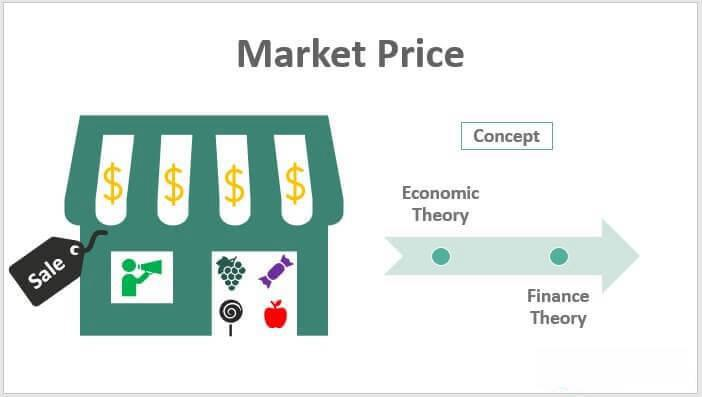

In the fast-paced world of finance and commerce, successfully navigating market price determination and implementing effective pricing strategies are critical for achieving business success. These processes are influenced by a multitude of factors, including supply and demand dynamics, economic theories, technology, and market sentiment. Understanding these concepts is crucial not only for professionals within the finance sector, who are directly engaged in market activities, but also for anyone involved in business operations, as pricing directly impacts a firm's profitability.

Pricing strategies are essential tools for businesses striving to establish competitive advantages and enhance financial performance. Companies employ a myriad of strategies such as cost-plus pricing, competitive pricing, and penetration pricing to determine the optimal price points for their goods and services. These approaches are designed to align with specific business objectives and react to rapidly changing market conditions. The choice of strategy depends heavily on industry dynamics, consumer behavior, and overarching market trends.

In addition to understanding how market prices are driven and how companies strategize their pricing decisions, it is equally important to recognize the technological advancements that have revolutionized trading. The advent of algorithmic trading, or algo trading, has significantly altered the financial markets landscape. By deploying complex algorithms, traders can execute transactions at unprecedented speeds, enhancing market efficiency and liquidity while reducing human error.

As markets evolve, pricing dynamics and technologies continually adapt, presenting both opportunities and challenges for businesses. This article will explore these intricate relationships within modern markets, providing insights into the transactional mechanisms that drive market prices and the strategies and technologies businesses can employ to remain competitive. Insights into these topics can equip individuals and organizations with the knowledge necessary to make informed, strategic business decisions in a complex financial landscape.

## Table of Contents

## Understanding Market Price Determination

Market price determination is the complex process by which the price of a good or service is set in the market. This process is influenced by several key factors that interact dynamically to establish equilibrium prices. Among these factors, supply and demand dynamics are paramount. According to the law of supply and demand, prices tend to adjust based on the quantity of a good that consumers are willing to buy and the quantity suppliers are willing to sell. When demand exceeds supply, prices typically rise, while excess supply often leads to price reductions.

Moreover, competition significantly impacts market prices. In a highly competitive market, businesses may lower their prices to attract customers, whereas in monopolistic conditions, a single provider might set higher prices due to the lack of alternatives for consumers. Additionally, production costs, including raw materials, labor, and overhead expenses, also play a critical role. As these costs increase, the minimum price at which a business can profitably sell its product rises, potentially leading to higher market prices.

Market sentiment, reflecting the collective expectations and emotions of investors and consumers, can further influence pricing. For instance, if consumers are optimistic about economic growth, demand might increase, driving prices up. Conversely, fear or uncertainty can lead to decreased demand and lower prices.

Economic theories provide valuable frameworks for understanding these pricing dynamics. The equilibrium price concept, for instance, refers to the price at which the quantity of goods supplied equals the quantity demanded, ensuring market stability. Mathematically, this can be represented by solving the equation:

$$
Q_d(P) = Q_s(P)
$$

where $Q_d$ is the quantity demanded, $Q_s$ is the quantity supplied, and $P$ represents the price level. Graphically, this equilibrium is illustrated at the intersection of the supply and demand curves.

To comprehend market price changes in practical terms, consider the example of the oil industry. A geopolitical event disrupting oil supply often causes immediate price increases due to anticipated shortages (a supply-side [factor](/wiki/factor-investing)). Conversely, advancements in energy efficiency might reduce oil demand over time, exerting downward pressure on prices.

Understanding these mechanisms that drive market prices is crucial for businesses and economists alike. By analyzing both external influences such as economic conditions and internal factors like production efficiencies, stakeholders can better anticipate and respond to market price fluctuations. This comprehensive understanding ultimately equips them to make more informed strategic decisions in the economic and financial landscape.

## Exploring Different Pricing Strategies

Pricing strategies are essential tools for businesses aiming to set prices for their products or services in a manner that aligns with their overarching objectives and market environment. Various methods exist, each tailored to specific conditions and strategic goals, ranging from maximizing profit to increasing market share or supporting brand positioning. Here, we explore several widely utilized pricing strategies, highlighting their advantages and potential pitfalls through examples from diverse industries.

**Cost-plus Pricing**  
Cost-plus pricing is one of the most straightforward approaches, where a fixed percentage mark-up is added to the cost of producing a good or service to determine its selling price. This strategy ensures coverage of production costs while providing a guaranteed profit margin. It's particularly prevalent in industries with stable cost structures, such as manufacturing. For instance, a toy manufacturer might use cost-plus pricing by adding a 30% margin above production costs to account for overhead and profit. While it simplifies price setting and ensures cost recovery, it may not reflect value perceived by customers or market demand dynamics.

**Competitive Pricing**  
In competitive pricing, prices are set based on competitors' pricing strategies. This method is commonly employed in markets with high levels of competition and relatively homogeneous products, such as the airline industry. Airlines often adjust ticket prices in response to competitors' rates to maintain market share. While this strategy can help retain customers and keep prices attractive, it may result in price wars, eroding profit margins if not managed carefully.

**Penetration Pricing**  
Penetration pricing involves setting a low initial price to enter a competitive market and attract customers. The goal is to quickly gain market share, often in a price-sensitive segment. This approach is frequently used in the technology sector, such as when a software company offers a new application at a low price or even for free initially, later increasing prices as the user base grows. Although effective for rapid market entry, it can be risky if the initial price is too low to cover expenses, or if the anticipated customer base growth does not materialize.

**Value-based Pricing**  
Value-based pricing sets prices primarily according to the perceived value to the customer rather than on the cost of production or competitors' prices. This strategy is often adopted for unique products or services, where the perceived benefits justify a premium price, such as in the luxury goods market. For example, brands like Rolex or Tesla price their products not just on cost but on the prestige and performance perceived by consumers. The advantage lies in capturing consumer surplus, but accurately gauging customer value perception can be challenging and requires in-depth market research.

**Dynamic Pricing**  
Dynamic pricing involves adjusting prices in real-time based on current market demand, consumer behavior, and other external factors. It is commonly used in industries such as hospitality and e-commerce, where prices for rooms or products fluctuate based on availability, demand, and competitor pricing. Online retailers like Amazon employ sophisticated algorithms to continually optimize prices. This strategy maximizes revenue opportunities but requires advanced technical infrastructure and algorithms to execute effectively.

Utilizing the appropriate pricing strategy depends on a company's specific market conditions, product type, and business objectives. A nuanced understanding of these strategies allows businesses to tailor their approach to the given market scenario, thereby optimizing profitability and achieving strategic goals.

## The Role of Algorithmic Trading

Algorithmic trading, often referred to as algo trading, employs advanced algorithms to execute trades with remarkable speed and precision. This technology has profoundly transformed traditional trading mechanisms, offering enhanced efficiency and substantially minimizing the likelihood of human error. At its core, [algorithmic trading](/wiki/algorithmic-trading) leverages mathematical models and historical data to evaluate the optimal timing and price for trades. By doing so, it enables traders to capitalize on market opportunities instantaneously, which would otherwise be unattainable through manual trading.

The impact of algorithmic trading on market prices is both profound and multifaceted. One of its primary contributions lies in its ability to provide [liquidity](/wiki/liquidity-risk-premium) to the markets. Liquidity, a measure of how quickly an asset can be bought or sold in the market without affecting its price, is crucial for maintaining healthy trading environments. Algo trading enhances liquidity by executing numerous trades in short durations, thereby narrowing the bid-ask spread. Furthermore, algorithmic systems can respond to market fluctuations rapidly, ensuring that assets are consistently valued in alignment with supply and demand dynamics.

Despite these advantages, algorithmic trading is not without its challenges. A significant concern is the potential for exacerbated market [volatility](/wiki/volatility-trading-strategies). The speed and [volume](/wiki/volume-trading-strategy) of trades executed by algorithms can, at times, lead to rapid price movements, creating an unpredictable trading atmosphere. For instance, during the May 6, 2010, Flash Crash in the United States, algorithmic trading contributed to a sudden and dramatic plunge in major stock indices, illustrating the potential risks associated with its unregulated use.

Moreover, algorithmic trading systems are highly dependent on technology, making them susceptible to glitches and technical failures. Such incidents can have widespread repercussions, potentially leading to erroneous trades or system outages. As a result, robust risk management frameworks and continuous monitoring are imperative to mitigate these risks.

Despite these challenges, the benefits of algorithmic trading are substantial. Beyond liquidity provision, algo trading allows for greater market efficiency by enabling price discovery and reducing human biases in decision-making processes. Additionally, by automating routine trading tasks, financial institutions can allocate their human resources to more strategic, value-adding activities.

In conclusion, algorithmic trading is reshaping the financial landscape by introducing unprecedented levels of efficiency and precision into trading activities. While it brings along challenges such as increased volatility and technological risk, the overall improvements in market liquidity and efficiency underscore its value in modern financial markets. As technology continues to evolve, the role of algo trading is expected to expand, further influencing the dynamics of global markets.

## Integrating Pricing Strategies with Algo Trading

In the modern financial landscape, the integration of pricing strategies with algorithmic trading is an emerging approach that promises to revolutionize how businesses compete. This synergy allows for the creation of more dynamic and responsive pricing methods, capable of adapting to real-time market fluctuations.

Algorithmic trading utilizes algorithms to analyze a multitude of market variables simultaneously, providing invaluable insights that inform pricing decisions. By leveraging data-driven algorithms, businesses can adjust prices rapidly in response to live market conditions, thus optimizing their pricing strategies for maximum profitability. For instance, algorithms can incorporate factors such as competitor pricing, customer demand, and even geopolitical events to set optimal prices that enhance revenue and market share.

One real-world example of successful integration is the retail sector, where companies like Amazon employ intricate algorithms to continuously adjust product prices. These adjustments are based on current sales data, competitor prices, and inventory levels. This method not only allows for competitive pricing but also maximizes profit margins and ensures that inventory is sold efficiently without excessive markdowns.

Financial institutions and high-frequency trading firms are also prime examples of applying algorithmic trading strategies to pricing decisions. By using predictive analytics and automated trading algorithms, these firms can execute trades at optimal prices, thus securing a competitive edge. The integration of [machine learning](/wiki/machine-learning) techniques further enhances this ability, allowing algorithms to learn from historical data and improve future performance.

Furthermore, advanced algorithmic systems enable businesses to experiment with pricing models through A/B testing. By deploying different pricing strategies simultaneously and analyzing customer response, companies can effectively determine the most lucrative approach. This method is invaluable for tailoring prices to specific market segments, ultimately leading to a more personalized pricing strategy.

The integration of pricing strategies with algorithmic trading brings with it numerous advantages. Primarily, it facilitates real-time pricing adjustments, aligns pricing with market dynamics, and enhances decision-making efficiency. However, to successfully implement this integration, businesses must invest in robust technological infrastructure and skilled personnel capable of managing complex trading systems.

In conclusion, combining pricing strategies with algorithmic trading allows companies to remain agile in a fast-paced market environment, thus improving competitiveness and profitability. As technology continues to advance, the potential benefits of this integration are likely to expand, offering businesses new ways to capture market opportunities.

## Challenges and Considerations

Market price determination and pricing strategy implementation, while offering substantial benefits, come with their own set of challenges and considerations. Businesses aiming to maintain a competitive edge must address these effectively.

**Market Volatility**

Market volatility represents one of the most significant challenges in price determination and pricing strategy. This volatility can result from numerous factors, including geopolitical events, economic shifts, and sudden changes in consumer preferences. For instance, commodity markets are notorious for their price fluctuations due to supply chain disruptions and variable demand. Businesses need to employ robust risk management strategies, such as diversifying their portfolios and using financial instruments like options and futures to hedge against potential price swings. These tools can help stabilize pricing strategies against unpredictable market conditions.

**Regulatory Concerns**

Another critical consideration is compliance with regulatory requirements, which can vary widely across different jurisdictions. These regulations are designed to ensure fair competition, prevent consumer exploitation, and maintain market integrity. However, navigating these rules can be complex and costly. Adhering to the General Data Protection Regulation (GDPR) in the European Union, for example, affects not only data handling practices but also pricing strategies, especially for digital businesses. Companies are advised to invest in compliance systems and stay updated on regulatory changes to avoid legal penalties and ensure their pricing strategies remain viable.

**Technological Risks**

With the growing reliance on technology in pricing and trading, businesses face several technological risks. System failures, cybersecurity threats, and algorithmic misjudgments could lead to significant financial losses and reputational damage. For example, algorithmic trading disasters, such as the 2010 Flash Crash in the U.S. stock market, highlight the potential risks associated with automated trading systems. To mitigate these risks, businesses should invest in robust IT infrastructure, employ rigorous testing of their algorithms, and implement comprehensive cybersecurity measures. Regular audits and monitoring can detect and rectify potential vulnerabilities in technology-driven pricing models.

**Practical Solutions**

To overcome these challenges, businesses are encouraged to adopt a multi-faceted approach:

1. **Robust Analytics**: Companies should leverage data analytics to gain insights into market trends and consumer behavior, allowing for more informed pricing decisions.

2. **Dynamic Pricing Models**: Utilizing flexible pricing models can help businesses adapt to market changes in real time. These models, supported by machine learning algorithms, can analyze vast datasets to predict future trends and adjust prices accordingly.

3. **Cross-functional Teams**: Creating cross-functional teams that include finance, legal, and IT experts can foster a more holistic approach to managing pricing strategies, ensuring that all aspects, from compliance to technical systems, are effectively covered.

4. **Continuous Learning and Adaptation**: In a rapidly changing environment, continuous learning and adaptation are crucial. Companies should invest in training programs and stay abreast of industry innovations and emerging technological advancements.

Understanding and preparing for these challenges enables businesses to not only protect their interests but also to strategically position themselves for growth and success in competitive markets. By addressing market volatility, regulatory compliance, and technological risks, firms can optimize their pricing strategies for improved profitability and sustainability.

## Conclusion

Market price determination, pricing strategies, and algorithmic trading are integral components of today's financial markets. Their synergy forms the backbone of how businesses operate and compete effectively. Understanding these elements is imperative for businesses striving to thrive in an increasingly competitive environment. As markets are influenced by rapid technological changes and evolving economic conditions, staying informed about pricing dynamics and advancements in trading technologies is essential for maintaining a competitive edge.

This article provided a comprehensive overview of these critical areas. By dissecting market price determination, we emphasized the influence of factors such as supply and demand, competition, and production costs. Additionally, the examination of various pricing strategies, including cost-plus, competitive, penetration, and value-based pricing, highlighted how businesses adapt to shifting market conditions and pursue their specific objectives. Meanwhile, insights into algorithmic trading showcased how technology optimizes trading processes, enhancing efficiency and liquidity in the markets.

Businesses are encouraged to embrace the opportunities these strategies and technologies offer. Leveraging advanced pricing strategies combined with algorithmic trading capabilities can lead to more dynamic and responsive pricing models. These tools equip businesses to better navigate real-time market fluctuations and improve profitability.

In conclusion, mastering the interplay of market price determination, innovative pricing strategies, and algorithmic trading is crucial for businesses to not only survive but also excel in the modern market landscape. As we continue to witness rapid developments in technology and market infrastructure, the ability to adapt and implement informed strategies will define successful enterprises. Embracing these opportunities can ensure sustainable growth and a strategic advantage in the ever-evolving market terrain.

## References & Further Reading

[1]: Bergstra, J., Bardenet, R., Bengio, Y., & Kégl, B. (2011). ["Algorithms for Hyper-Parameter Optimization."](https://papers.nips.cc/paper/4443-algorithms-for-hyper-parameter-optimization) Advances in Neural Information Processing Systems 24.

[2]: Lopez de Prado, Marcos. ["Advances in Financial Machine Learning."](https://www.amazon.com/Advances-Financial-Machine-Learning-Marcos/dp/1119482089)

[3]: Aronson, David R. ["Evidence-Based Technical Analysis: Applying the Scientific Method and Statistical Inference to Trading Signals."](https://www.semanticscholar.org/paper/Evidence-Based-Technical-Analysis%3A-Applying-the-and-Aronson/3b33df8737f1772e9e14d66a08c9696f140a2ee1)

[4]: Jansen, Stefan. ["Machine Learning for Algorithmic Trading."](https://github.com/stefan-jansen/machine-learning-for-trading)

[5]: Chan, Ernest P. ["Quantitative Trading: How to Build Your Own Algorithmic Trading Business."](https://github.com/ftvision/quant_trading_echan_book)

[6]: Hull, John C. ["Options, Futures, and Other Derivatives."](https://www.pearson.com/en-us/subject-catalog/p/options-futures-and-other-derivatives/P200000005938/9780136939917) 

[7]: "Flash Crash Analysis Report" by the U.S. Commodity Futures Trading Commission and Securities & Exchange Commission. [Link](https://www.cftc.gov/sites/default/files/idc/groups/public/@economicanalysis/documents/file/oce_flashcrash0314.pdf)

[8]: "The Handbook of High Frequency Trading" by Greg N. Gregoriou. [Link](https://www.sciencedirect.com/book/9780128022054/handbook-of-high-frequency-trading)

[9]: McMillan, Lawrence G. ["Options as a Strategic Investment."](https://www.amazon.com/Options-Strategic-Investment-Lawrence-McMillan/dp/0735201978) 

[10]: Hasbrouck, Joel. ["Empirical Market Microstructure: The Institutions, Economics, and Econometrics of Securities Trading."](https://academic.oup.com/book/52241)