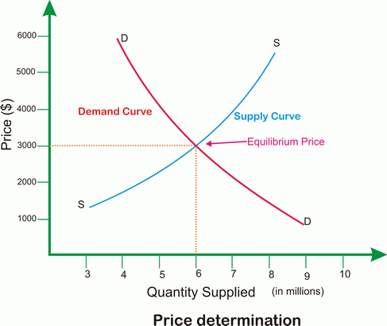

## Table of Contents

## What is market price?

Market price is the current price at which a product or service can be bought or sold in the market. It is determined by the forces of supply and demand. When many people want to buy something but there isn't much of it available, the market price goes up. On the other hand, if there is a lot of something available but not many people want to buy it, the market price goes down.

Market prices are important because they help people make decisions about buying and selling. For example, if you are selling apples and see that the market price for apples is high, you might decide to sell more apples to make more money. If you are buying apples and see that the market price is low, you might decide to buy more apples because they are cheaper. Market prices change all the time based on what is happening in the market.

## How is market price determined?

Market price is determined by how many people want to buy something and how much of that thing is available. This is called supply and demand. If a lot of people want to buy something, but there isn't much of it, the price goes up. This happens because people are willing to pay more to get it. On the other hand, if there is a lot of something but not many people want it, the price goes down. Sellers have to lower the price to sell it.

Other things can also affect market price. For example, if it costs more to make something, the price might go up. If people think the price will go up in the future, they might buy more now, which can make the price go up right away. Also, things like the weather, new laws, or big news can change how much people want to buy or how much is available, which changes the market price.

## What factors influence market price?

Market price is influenced by how many people want to buy something and how much of it is available. This is called supply and demand. If a lot of people want something but there isn't much of it, the price goes up. People are willing to pay more to get it. On the other hand, if there is a lot of something but not many people want it, the price goes down. Sellers have to lower the price to sell it.

Other things can also affect market price. For example, if it costs more to make something, the price might go up. If people think the price will go up in the future, they might buy more now, which can make the price go up right away. Also, things like the weather, new laws, or big news can change how much people want to buy or how much is available, which changes the market price.

Sometimes, competition between sellers can influence market price too. If there are many sellers offering the same thing, they might lower their prices to attract more buyers. This can lead to a lower market price. On the other hand, if there are only a few sellers, they might keep prices high because they don't have much competition.

## Can you explain the concept of supply and demand in relation to market price?

Supply and demand is a simple idea that helps explain why things cost what they do. When a lot of people want something, but there isn't much of it, the price goes up. This happens because people are willing to pay more to get what they want. For example, if there are only a few apples in the market and many people want to buy them, the price of apples will go up. On the other hand, if there are a lot of apples but not many people want them, the price will go down because sellers have to lower the price to sell their apples.

This balance between how much people want something and how much of it is available is what sets the market price. When the supply of a product is low and demand is high, the price goes up. When the supply is high and demand is low, the price goes down. It's like a seesaw: when one side goes up, the other goes down. This is why you might see the price of things like toys go up during the holidays when everyone wants them, and then go down after the holidays when the demand drops.

## How do market structures affect price determination?

Market structures are the different ways that markets are organized. They can be perfect competition, where many sellers offer the same thing and no one can control the price; monopolies, where one seller controls the market and can set the price; oligopolies, where a few big sellers control the market and can affect the price; and monopolistic competition, where many sellers offer slightly different things and can set their own prices a bit. Each type of market structure affects how prices are determined.

In perfect competition, the price is set by the market because no single seller can change it. If one seller tries to charge more, buyers will go to another seller. In a monopoly, the single seller can set a higher price because buyers have no other choice. In an oligopoly, a few big sellers might agree to keep prices high, or they might compete and lower prices to attract more buyers. In monopolistic competition, sellers can charge a bit more if they can convince buyers that their product is better or different, but they still have to keep prices close to what others are charging.

## What role do government policies play in influencing market prices?

Government policies can have a big impact on market prices. One way they do this is by setting taxes. If the government puts a tax on something, like a tax on cigarettes, it makes the price go up. This is because sellers have to pay the tax, and they usually pass that cost on to buyers by charging more. Another way is through subsidies, which is when the government gives money to sellers to make their products cheaper. For example, if the government wants to help farmers, it might give them money to lower the price of food.

Government can also set rules that affect prices. For example, they might set a minimum price, called a price floor, for things like milk to make sure farmers can make enough money. Or they might set a maximum price, called a price ceiling, for things like rent to make sure people can afford to live in certain places. These rules can change how much people want to buy or how much sellers want to sell, which changes the market price. Sometimes, governments also control how much of something can be produced or sold, like limiting how many fishing boats can go out to sea, which can make prices go up if there is less of something available.

## How do global economic conditions impact market prices?

Global economic conditions can change market prices in big ways. If the world economy is doing well, people have more money to spend, so they buy more things. This can make prices go up because there is more demand. But if the world economy is not doing well, people might not have as much money, so they buy less. This can make prices go down because there is less demand. Also, if one country's money becomes worth more compared to another country's money, it can make things from that country cheaper or more expensive in other places.

Another way global economic conditions affect market prices is through things like trade rules and big events. If countries decide to put taxes on things they buy from other countries, it can make those things more expensive. For example, if a country puts a tax on imported cars, the price of those cars goes up. Big events like wars or natural disasters can also change prices. If a big storm destroys a lot of crops, there will be less food available, which can make food prices go up. All these things show how the world's economy can change what things cost.

## What are price elasticity of demand and its effects on market price?

Price elasticity of demand is a way to measure how much people change their buying when the price of something changes. If the price goes up and people still buy the same amount, we say the demand is inelastic. This means the price doesn't affect how much people want it. Things like medicine or gas often have inelastic demand because people need them no matter the price. On the other hand, if the price goes up and people buy a lot less, we say the demand is elastic. This means the price really affects how much people want it. Things like luxury items or non-essential goods often have elastic demand because people can choose not to buy them if the price is too high.

The effect of price elasticity on market prices is important. If a product has inelastic demand, sellers can raise the price without losing many customers, which can lead to higher market prices. For example, if the price of medicine goes up, people will still buy it because they need it, so the market price can stay high. But if a product has elastic demand, sellers have to be careful about raising prices. If they do, people might buy a lot less, so sellers might have to lower the price to sell more. This can keep market prices lower or more stable. Understanding price elasticity helps businesses and policymakers make better decisions about pricing and how changes might affect the market.

## How do technological advancements influence market price determination?

Technological advancements can change market prices by making it easier and cheaper to make things. For example, new machines or computer programs can help factories make more stuff faster and with less waste. This means there is more supply, which can make the price go down because sellers have to compete to sell their products. Also, technology can help find new ways to make things, like using cheaper materials or finding new sources of energy. This can lower the cost of making things, which can also make the price go down.

On the other hand, technology can also make some things more expensive. If a new technology is really good and people want it a lot, the price can go up because there isn't enough of it to meet the demand. For example, when a new smartphone comes out, the price might be high at first because everyone wants it but not many are available. Over time, as more are made and the technology becomes common, the price might go down. So, technology can affect market prices in different ways, depending on how it changes supply and demand.

## Can you discuss the impact of consumer behavior on market prices?

Consumer behavior plays a big role in deciding market prices. When lots of people want to buy something, the demand goes up, and this can make the price go up too. For example, if everyone wants the newest toy, stores might raise the price because they know people will still buy it. On the other hand, if people start buying less of something, like if they think it's too expensive or they find something better, the demand goes down. This can make sellers lower the price to get people to buy more.

Also, the way people feel about a product can change its price. If a product gets good reviews or becomes popular on social media, more people might want to buy it, which can drive the price up. But if people start thinking a product isn't as good as they thought or if there's a big problem with it, they might stop buying it, and the price can go down. So, what people think and do can really move market prices around.

## What are the differences between short-term and long-term market price dynamics?

Short-term market price dynamics are about what happens to prices over a short time, like a few days or weeks. These changes can happen because of things like the weather, news events, or even what people are talking about on social media. For example, if there's a sudden cold snap, the price of heating oil might go up quickly because more people need it to stay warm. Or if a new smartphone comes out and everyone wants it, the price might go up right away because there aren't enough phones to meet the demand. These short-term changes can be big and fast, but they usually don't last long.

Long-term market price dynamics look at how prices change over months or years. These changes are often caused by bigger things like new technology, changes in how much people earn, or new laws. For example, if a new way to make solar panels cheaper comes out, the price of solar energy might go down over time because it costs less to make. Or if more people start [earning](/wiki/earning-announcement) more money, they might buy more things, which can make prices go up over time. Long-term changes are usually slower and more steady, but they can have a bigger impact on the market in the end.

## How can predictive analytics be used to forecast market price changes?

Predictive analytics is a way to use data and math to guess what will happen in the future. When it comes to market prices, businesses and economists use it to look at past prices, how much people are buying, and other things like the weather or big news. They put all this information into computer programs that can find patterns and make guesses about what prices will do next. For example, if the data shows that every time there's a big storm, the price of heating oil goes up, the computer can predict that the next big storm might make the price go up too.

These predictions help people make better choices. If a business thinks the price of something will go up, they might buy more of it now to save money. Or if they think the price will go down, they might wait to buy it later. Governments can use these predictions to plan things like taxes or subsidies. For example, if they think the price of food will go up, they might help farmers with money to keep food prices from getting too high. Predictive analytics isn't perfect, but it gives a good idea of what might happen, which can help everyone make smarter decisions about buying and selling.

## How is market price determined?

Market price determination is the complex process by which the price of a good or service is set in the market. This process is influenced by several key factors that interact dynamically to establish equilibrium prices. Among these factors, supply and demand dynamics are paramount. According to the law of supply and demand, prices tend to adjust based on the quantity of a good that consumers are willing to buy and the quantity suppliers are willing to sell. When demand exceeds supply, prices typically rise, while excess supply often leads to price reductions.

Moreover, competition significantly impacts market prices. In a highly competitive market, businesses may lower their prices to attract customers, whereas in monopolistic conditions, a single provider might set higher prices due to the lack of alternatives for consumers. Additionally, production costs, including raw materials, labor, and overhead expenses, also play a critical role. As these costs increase, the minimum price at which a business can profitably sell its product rises, potentially leading to higher market prices.

Market sentiment, reflecting the collective expectations and emotions of investors and consumers, can further influence pricing. For instance, if consumers are optimistic about economic growth, demand might increase, driving prices up. Conversely, fear or uncertainty can lead to decreased demand and lower prices.

Economic theories provide valuable frameworks for understanding these pricing dynamics. The equilibrium price concept, for instance, refers to the price at which the quantity of goods supplied equals the quantity demanded, ensuring market stability. Mathematically, this can be represented by solving the equation:

$$
Q_d(P) = Q_s(P)
$$

where $Q_d$ is the quantity demanded, $Q_s$ is the quantity supplied, and $P$ represents the price level. Graphically, this equilibrium is illustrated at the intersection of the supply and demand curves.

To comprehend market price changes in practical terms, consider the example of the oil industry. A geopolitical event disrupting oil supply often causes immediate price increases due to anticipated shortages (a supply-side [factor](/wiki/factor-investing)). Conversely, advancements in energy efficiency might reduce oil demand over time, exerting downward pressure on prices.

Understanding these mechanisms that drive market prices is crucial for businesses and economists alike. By analyzing both external influences such as economic conditions and internal factors like production efficiencies, stakeholders can better anticipate and respond to market price fluctuations. This comprehensive understanding ultimately equips them to make more informed strategic decisions in the economic and financial landscape.

## References & Further Reading

[1]: Bergstra, J., Bardenet, R., Bengio, Y., & Kégl, B. (2011). ["Algorithms for Hyper-Parameter Optimization."](https://papers.nips.cc/paper/4443-algorithms-for-hyper-parameter-optimization) Advances in Neural Information Processing Systems 24.

[2]: Lopez de Prado, Marcos. ["Advances in Financial Machine Learning."](https://www.amazon.com/Advances-Financial-Machine-Learning-Marcos/dp/1119482089)

[3]: Aronson, David R. ["Evidence-Based Technical Analysis: Applying the Scientific Method and Statistical Inference to Trading Signals."](https://www.semanticscholar.org/paper/Evidence-Based-Technical-Analysis%3A-Applying-the-and-Aronson/3b33df8737f1772e9e14d66a08c9696f140a2ee1)

[4]: Jansen, Stefan. ["Machine Learning for Algorithmic Trading."](https://github.com/stefan-jansen/machine-learning-for-trading)

[5]: Chan, Ernest P. ["Quantitative Trading: How to Build Your Own Algorithmic Trading Business."](https://github.com/ftvision/quant_trading_echan_book)

[6]: Hull, John C. ["Options, Futures, and Other Derivatives."](https://www.pearson.com/en-us/subject-catalog/p/options-futures-and-other-derivatives/P200000005938/9780136939917) 

[7]: "Flash Crash Analysis Report" by the U.S. Commodity Futures Trading Commission and Securities & Exchange Commission. [Link](https://www.cftc.gov/sites/default/files/idc/groups/public/@economicanalysis/documents/file/oce_flashcrash0314.pdf)

[8]: "The Handbook of High Frequency Trading" by Greg N. Gregoriou. [Link](https://www.sciencedirect.com/book/9780128022054/handbook-of-high-frequency-trading)

[9]: McMillan, Lawrence G. ["Options as a Strategic Investment."](https://www.amazon.com/Options-Strategic-Investment-Lawrence-McMillan/dp/0735201978) 

[10]: Hasbrouck, Joel. ["Empirical Market Microstructure: The Institutions, Economics, and Econometrics of Securities Trading."](https://academic.oup.com/book/52241)