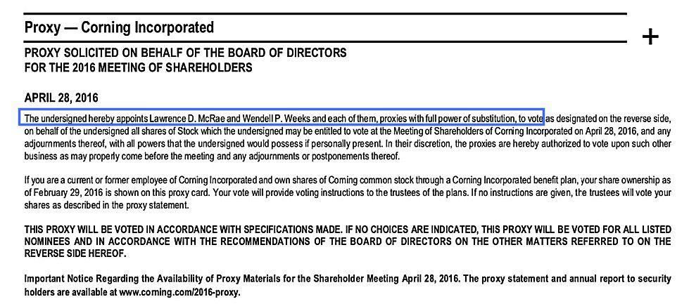

The financial markets have undergone significant transformation over the years, characterized by increased complexity and diversification. This evolution has brought forth the need for sophisticated investment strategies that can efficiently navigate the changing financial landscape. Modern investment approaches often incorporate advanced tools and techniques, among which the integration of market proxies and algorithmic trading plays a crucial role.

Market proxies serve as comprehensive indicators of market performance, acting as benchmarks for various investment strategies. They are essential for investors and analysts in understanding and predicting market trends. For instance, the S&P 500 Index is a widely recognized market proxy representing the performance of the U.S. stock market. These proxies are instrumental in statistical analysis, aiding in the construction of index funds and Exchange-Traded Funds (ETFs), thus facilitating effective risk assessment and portfolio management.



Algorithmic trading, on the other hand, represents a technology-driven approach that offers investors a strategic edge through automation and data analytics. By employing complex mathematical models and high-speed computing, algorithmic trading enables the automation of trading processes based on predetermined criteria. This significantly reduces the influence of human emotions and errors, allowing for precise and efficient execution of trades. High-frequency trading and the ability to exploit small market discrepancies are notable advantages of algorithmic trading.

The integration of market proxies with algorithmic trading creates a robust framework for investors seeking optimized investment outcomes. This article aims to provide insights and practical guidelines for leveraging these tools effectively, enhancing investors' ability to achieve consistent and favorable returns in the dynamic financial markets.

## Table of Contents

## Understanding Market Proxies

Market proxies represent a comprehensive overview of a market's performance by acting as benchmarks that capture the underlying economic and financial conditions of the market they represent. One of the most prominent examples is the S&P 500 Index, which serves as a primary market proxy for the U.S. stock market. Consisting of 500 leading companies, this index is frequently used to guide various investment strategies, providing a reliable measure of market health and investor sentiment.

Market proxies are fundamentally important in statistical analysis as they facilitate the construction of index funds and exchange-traded funds (ETFs). These financial products aim to replicate the performance of a specific index, allowing investors to gain diversified exposure to a market segment with reduced risks compared to individual stock investments. By serving as reference points for market behavior, market proxies assist in risk assessment and portfolio management by reflecting general trends and potential shifts in economic conditions.

Investors and financial analysts utilize market proxies to predict market trends and evaluate the impact of economic events. These proxies allow for a systematic approach to forecasting and interpretation, as they provide clear metrics on which to base predictions and strategic decisions. By comparing the performance of individual securities to the market proxy, investors can determine whether specific investments are outperforming or underperforming the broader market.

In practical terms, a proxy such as the S&P 500 can be analyzed through various metrics like aggregate price-earnings ratios, dividend yields, and market capitalization. For [algorithmic trading](/wiki/algorithmic-trading) systems and quantitative analyses, market proxies provide essential datasets for modeling and simulations. By using statistical methods and [machine learning](/wiki/machine-learning) algorithms, investors can extract meaningful patterns and craft strategies that align with prevailing market conditions.

Given these applications, market proxies are indispensable tools in modern finance, allowing market participants to navigate complexity with more informed and strategic approaches.

## Investment Strategies Leveraging Market Proxies

Investment strategies utilize market proxies to align investment decisions with prevailing market trends. Market proxies, such as indices, provide a benchmark that represents a segment or the entirety of the financial market. This allows investors to gauge market performance and make informed decisions.

### Index Fund Investment

One prevalent strategy that leverages market proxies is index fund investment. An index fund aims to replicate the performance of a specific market index like the S&P 500 or the FTSE 100. By using market proxies, these funds offer diversified exposure to a wide range of assets within the index. This diversification minimizes unsystematic risk, providing investors with stability.

The passive nature of index funds translates into lower costs for investors. Since index funds mirror market proxies, they do not require active management, thus reducing management fees and operational expenses. This cost-efficiency combined with diversification makes index funds an attractive option for investors seeking to align with market performance while minimizing unnecessary risk.

### Exchange-Traded Funds (ETFs)

ETFs also exploit market proxies to provide [liquidity](/wiki/liquidity-risk-premium) and flexibility in asset management. Similar to index funds, ETFs track market indices and provide diversified exposure. However, ETFs trade on stock exchanges, offering features such as the ability to buy and sell at market prices throughout the trading day. This liquidity allows investors to adjust their portfolios more flexibly in response to market conditions.

ETFs also provide options for implementing various strategic considerations like sector rotation or thematic investing based on market trends observed in the proxies. This adaptability makes ETFs a versatile tool for managing investments against market benchmarks.

### Constructing Robust Portfolios

Understanding market proxies and how they relate to index funds and ETFs is crucial for constructing robust, long-term investment portfolios. A well-constructed portfolio, informed by market proxies, enables investors to achieve their financial goals while keeping risk in check. The process involves selecting a combination of index funds and ETFs that align with the investor's risk tolerance and return objectives.

The integration of market proxies into investment strategies ensures informed decision-making, aligning investments with market trends and optimizing asset allocation. By focusing on broad market performance indicators, investors can make strategic choices that reflect a comprehensive understanding of market dynamics.

 to Algorithmic Trading

Algorithmic trading is a method of executing trades that utilizes computer algorithms to automate and manage the process based on specific, predefined criteria. This approach leverages complex mathematical models to analyze market data, making real-time decisions about buying and selling in financial markets.

The integration of advanced mathematical models is central to algorithmic trading, facilitating the prediction of price movements by analyzing large sets of data. For instance, algorithms can apply statistical techniques, such as linear regression or machine learning models, to identify patterns and make statistical inferences about price trajectories. This analytical depth enables traders to anticipate potential market shifts with a level of precision that surpasses human capabilities.

One significant advantage of algorithmic trading is its speed and precision, which eliminate human errors and reduce the influence of emotions on trading decisions. Algorithms can process volumes of data and execute trades in milliseconds, a speed impossible for human traders to achieve. This automation is crucial in high-frequency trading ([HFT](/wiki/high-frequency-trading-strategies)), where the success of trading strategies depends on identifying and exploiting minuscule price discrepancies across markets swiftly.

Moreover, algorithmic trading transforms traditional investment methods by enabling strategies that were impractical before the advent of modern computing power. Traditional approaches, relying heavily on manual decision-making, are often slower and subject to emotional biases. Algorithms, conversely, employ logical, data-driven processes, which enhance consistency and repeatability in trades.

For example, consider a simplified Python snippet that demonstrates how an algorithm might execute a basic trading strategy based on moving averages:

```python
import pandas as pd

def initialize(context):
    context.asset = "AAPL"
    context.short_window = 40
    context.long_window = 100

def handle_data(context, data):
    short_mavg = data.history(context.asset, 'price', bar_count=context.short_window, frequency="1d").mean()
    long_mavg = data.history(context.asset, 'price', bar_count=context.long_window, frequency="1d").mean()

    if short_mavg > long_mavg:
        order_target_percent(context.asset, 1.0)  # Buy
    elif short_mavg < long_mavg:
        order_target_percent(context.asset, -1.0) # Sell

```

This code snippet illustrates a basic strategy where trades are executed automatically based on the crossover of short-term and long-term moving averages. Such algorithmic strategies can be further fortified with sophisticated models for better accuracy and efficiency.

The transformation achieved by algorithmic trading is not only about speed but also the opportunity to harness machine learning, quantitative analysis, and automated data processing to reshape trading strategies. Therefore, algorithmic trading represents a paradigm shift in how market participants operate, shifting the focus from manual analysis to a more automated and data-driven trading environment.

## Types of Algorithmic Trading Strategies

Algorithmic trading strategies employ diverse approaches to capitalize on price movements and market inefficiencies. Each strategy is designed to exploit specific market conditions, utilizing a systematic and data-driven methodology.

**Trend Following** is a strategy that seeks to benefit from sustained market movements. It identifies a directional movement in asset prices and positions trades in alignment with the trend. Trend-following algorithms typically employ moving averages to devise strategies. For instance, a common method is the crossover approach, where a short-term moving average crossing above a long-term moving average signals a buy position, while the reverse indicates a sell position.

**Mean Reversion** assumes prices will return to their historical averages. This strategy is based on the statistical principle that deviations from the mean are temporary. Traders implement this approach by identifying assets that deviate significantly from historical averages and predict a reversal. A simple test for mean reversion is the Augmented Dickey-Fuller test, which helps determine if a time series is stationary or exhibits mean-reverting properties.

**Scalping** involves executing high-frequency trades to profit from small price changes. This strategy relies on swift execution and precise timing to increase cumulative gains over numerous trades. Scalping algorithms deploy technical indicators like Bollinger Bands or stochastic oscillators to identify short-term trading opportunities and execute trades within seconds or minutes.

**Momentum Trading** capitalizes on the strength of current market trends by executing trades in line with the prevailing price direction. This strategy assumes that assets exhibiting a strong trend will maintain this momentum. Momentum algorithms use indicators such as the Relative Strength Index (RSI) or Moving Average Convergence Divergence (MACD) to assess the strength and continuation of a trend, triggering buy or sell signals accordingly.

**Index Fund Rebalancing** anticipates market fluctuations arising from changes in index fund compositions. Such trading strategies exploit temporary price disparities as funds adjust their holdings to reflect the updated index. Traders predict these adjustments by analyzing index methodologies and anticipated changes, positioning their trades to benefit from resultant market movements.

Automated implementation of these strategies demands thorough [backtesting](/wiki/backtesting) on historical data to ensure profitability under various market conditions. Importantly, these strategies require continuous monitoring and refinement to adapt to evolving market dynamics and maintain effectiveness.

## Implementing Algorithmic Trading

Implementing algorithmic trading necessitates a comprehensive understanding of investment objectives and risk tolerance. Clearly defining these parameters is essential in determining the appropriate algorithmic strategies to deploy. For instance, an investor focused on long-term growth may prioritize trend-following algorithms, while a risk-averse investor might lean towards mean reversion strategies.

The backbone of robust algorithmic trading strategies is backtesting. By utilizing historical market data, traders can simulate strategy performance, enabling the validation of the proposed algorithms prior to actual deployment. Backtesting incorporates statistical measures such as Sharpe Ratio and maximum drawdown to assess risk-adjusted returns and the strategy's resilience under varying market conditions. In Python, backtesting can be performed using libraries like `[backtrader](/wiki/backtrader)` or `zipline`. A basic Python code snippet for backtesting might look like this:

```python
import backtrader as bt

class TestStrategy(bt.Strategy):
    def __init__(self):
        self.sma = bt.indicators.SimpleMovingAverage(self.data, period=15)

    def next(self):
        if self.data.close[0] > self.sma[0]:
            self.buy(size=10)
        elif self.data.close[0] < self.sma[0]:
            self.sell(size=10)

cerebro = bt.Cerebro()
cerebro.addstrategy(TestStrategy)
data = bt.feeds.YahooFinanceData(dataname='AAPL', fromdate=datetime(2020, 1, 1), todate=datetime(2021, 1, 1))
cerebro.adddata(data)
cerebro.run()
```

Selecting a reliable algorithmic trading software platform is crucial for effective strategy execution and automation. Decisive factors include the platform’s computational efficiency, data integration capabilities, and ease of updating the strategy code. Popular platforms like MetaTrader, NinjaTrader, and Algorithmic Trading solutions offer varied features that cater to different algorithmic trading needs.

Continuous monitoring and strategy adjustment are necessary to align with dynamic market conditions and evolving investment goals. This process involves reviewing strategy performance metrics and tweaking algorithm parameters to enhance efficacy. This may include recalibrating risk management thresholds or updating prediction models in response to changing market [volatility](/wiki/volatility-trading-strategies).

It is vital to recognize the limitations inherent in algorithmic trading. Technological risks such as software bugs or latency can impact performance adversely. Furthermore, algorithms are generally unable to predict sudden, unforeseen market events, making human oversight and versatility in adapting strategies imperative. To mitigate these risks, investors should incorporate fail-safes such as stop-loss mechanisms and periodic audits of algorithm code and performance.

## Market Proxy and Algorithmic Trading: A Synergistic Approach

Combining market proxies with algorithmic trading creates a structured, data-driven investment strategy that enhances the ability to predict and respond to market conditions. Market proxies, such as indices, serve as valuable benchmarks that provide a comprehensive view of market trends and performance. By calibrating algorithms using these benchmarks, investors can enhance predictive accuracy and refine their trading strategies to align with observable market trends.

Algorithmic trading, known for its speed and precision, maximizes the benefits of market proxies. Through automation, it efficiently captures market opportunities that may arise even from minor fluctuations in the proxy index. For instance, an algorithm detecting a shift in the S&P 500 Index can swiftly execute trades based on pre-defined criteria, minimizing reaction time and human error. This interaction is particularly effective in high-frequency trading environments where speed and agility offer competitive advantages.

Together, these methodologies facilitate automated, low-cost, and passive investment strategies. The alignment with overall market performance ensures that the investment portfolio dynamically adjusts in response to the market's movements, minimizing the need for active management. This synergy not only optimizes resource allocation but also reduces transaction costs, which is advantageous for investors seeking to maximize net returns over time.

Moreover, this combinatory approach improves the odds of achieving consistent, long-term investment returns. By leveraging market proxies as foundational reference points, algorithms can be fine-tuned to react predictably to shifts in market dynamics, thus maintaining a balanced risk-return profile. Consequently, investors can achieve stable growth, with reduced exposure to the volatility often associated with manual trading practices.

In conclusion, the integration of market proxies with algorithmic trading forms a robust framework for modern investment strategies, allowing investors to harness data and technology for informed, efficient decision-making in the financial markets.

## Conclusion

Mastering investment strategies in the modern financial landscape necessitates the integration of market proxies and algorithmic trading. Market proxies serve as indispensable tools in simplifying the complexity of financial markets by providing benchmarks that facilitate strategic alignment. By offering a comprehensive snapshot of market performance, these proxies enable investors to construct and manage portfolios with insight and precision.

Algorithmic trading, on the other hand, harnesses technology to deliver precise, automated trading experiences that significantly reduce the likelihood of human error. By employing sophisticated algorithms driven by data and advanced analytics, investors can execute trades with a high level of accuracy, speed, and efficiency. This technological prowess not only optimizes transaction costs but also enhances the ability to capitalize on fleeting market opportunities.

To fully realize the potential of these tools, investors must actively incorporate them into their investment practices. By leveraging the insights provided by market proxies and the technical capabilities of algorithmic trading, investors can optimize their risk and return profiles. This optimization is crucial for achieving diversified and resilient portfolios that are aligned with both short-term objectives and long-term financial goals.

Moreover, the financial markets are constantly evolving, and the strategies that yielded success in the past may not be effective in the future. Therefore, continual learning and strategy adaptation are critical components of successful investing. Investors should remain vigilant in updating their approaches to account for emerging trends, technological advancements, and shifts in market dynamics. This proactive stance ensures that investment strategies remain robust and adaptive, positioning investors to navigate the complexities of the financial markets effectively. By embracing innovation and remaining adaptable, investors are better equipped to achieve sustained success in the ever-changing landscape of financial markets.

## References & Further Reading

[1]: Bergstra, J., Bardenet, R., Bengio, Y., & Kégl, B. (2011). ["Algorithms for Hyper-Parameter Optimization."](https://dl.acm.org/doi/10.5555/2986459.2986743) Advances in Neural Information Processing Systems 24.

[2]: ["Advances in Financial Machine Learning"](https://www.amazon.com/Advances-Financial-Machine-Learning-Marcos/dp/1119482089) by Marcos Lopez de Prado

[3]: ["Evidence-Based Technical Analysis: Applying the Scientific Method and Statistical Inference to Trading Signals"](https://www.amazon.com/Evidence-Based-Technical-Analysis-Scientific-Statistical/dp/0470008741) by David Aronson

[4]: ["Machine Learning for Algorithmic Trading"](https://github.com/stefan-jansen/machine-learning-for-trading) by Stefan Jansen

[5]: ["Quantitative Trading: How to Build Your Own Algorithmic Trading Business"](https://www.amazon.com/Quantitative-Trading-Build-Algorithmic-Business/dp/1119800064) by Ernest P. Chan