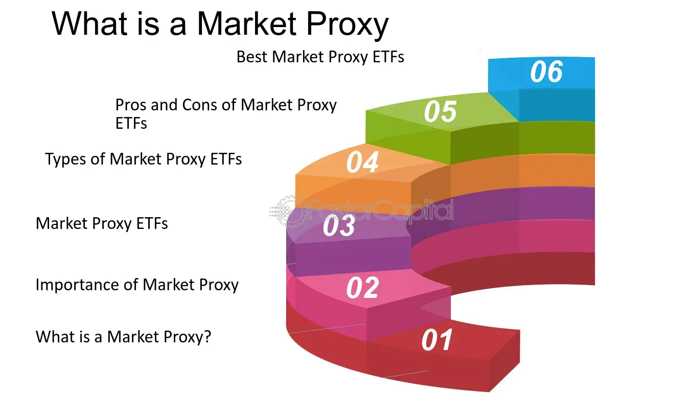

## Table of Contents

## What is a market proxy?

A market proxy is a way to represent the overall performance of a stock market. It's like a stand-in or a shortcut that investors use to get a quick idea of how the market is doing without looking at every single stock. Usually, a market proxy is an index, like the S&P 500 or the Dow Jones Industrial Average. These indexes are made up of a selection of stocks that are meant to show what's happening in the market as a whole.

When people talk about the market going up or down, they're often referring to how these market proxies are doing. For example, if the S&P 500 goes up, people might say the market is doing well. It's a helpful tool because it simplifies a lot of complex information into something easier to understand. But it's important to remember that a market proxy doesn't show everything. It's just a sample, and different proxies might give different pictures of the market.

## Why are market proxies important in financial analysis?

Market proxies are important in financial analysis because they help people understand how the overall market is doing without having to look at every single stock. Imagine trying to figure out if the market is up or down by checking thousands of stocks one by one. It would take forever! Instead, analysts can look at a market proxy like the S&P 500, which gives them a quick snapshot of the market's health. This makes it easier to make decisions about buying or selling investments.

Also, market proxies help analysts compare different investments. If you want to know if your stock or portfolio is doing better or worse than the market, you can compare it to a market proxy. This helps you see if you're beating the market or if you need to change your strategy. It's like having a benchmark to measure your performance against. While market proxies don't show everything, they are a handy tool that simplifies a lot of data into something useful for making financial decisions.

## How does a market proxy represent the overall market?

A market proxy represents the overall market by using a collection of stocks that are chosen to show what's happening in the market as a whole. Think of it like a team of players that represent a whole country in a sports tournament. The performance of this team gives you an idea of how the country is doing in that sport. In the same way, a market proxy, like the S&P 500, is made up of a group of stocks that are meant to show how the market is doing. If the stocks in the S&P 500 are going up, it means the market is generally doing well.

But it's important to know that a market proxy is just a sample, not the whole market. It's like taking a spoonful of soup to taste it instead of eating the whole pot. The spoonful gives you an idea of what the soup tastes like, but it might not be exactly the same as the whole pot. Different market proxies might use different groups of stocks, so they can give slightly different pictures of the market. Still, they are very helpful because they make it easier to understand and talk about how the market is doing without having to look at every single stock.

## What are common examples of market proxies?

Some common examples of market proxies are the S&P 500, the Dow Jones Industrial Average, and the Nasdaq Composite. The S&P 500 is a popular market proxy that includes 500 of the largest companies in the United States. It's often used to show how the U.S. stock market is doing because it covers a wide range of industries. The Dow Jones Industrial Average, or just the Dow, is another well-known market proxy. It includes 30 big companies and is often used to give a quick snapshot of the market's health.

Another example is the Nasdaq Composite, which focuses on technology and internet companies. It's a good market proxy for understanding how the tech sector is doing. Each of these market proxies gives a different view of the market, but they all help people get a quick idea of how things are going without looking at every single stock. They're like shortcuts that make it easier to understand the big picture of the stock market.

## How is a market proxy different from an index?

A market proxy and an index are very similar, but they're not exactly the same thing. An index is a list of stocks that are grouped together to show how a certain part of the market is doing. For example, the S&P 500 is an index that includes 500 big companies in the U.S. It's like a collection of stocks that people use to see how the market is performing. 

A market proxy, on the other hand, is a way to represent the whole market using an index. It's like using the S&P 500 as a stand-in for the entire U.S. stock market. So, while an index is just a list of stocks, a market proxy is that list being used to show what's happening in the market as a whole. It's a tool that helps people get a quick idea of the market's health without looking at every single stock.

## What criteria are used to select components of a market proxy?

The components of a market proxy, like the S&P 500 or the Dow Jones Industrial Average, are chosen based on certain rules. For the S&P 500, the companies must be big and important in the U.S. market. They look at things like the company's size, how much it's worth, how many shares people can buy, and how much of the company is owned by the public. The goal is to pick companies that show what's happening in the market as a whole.

The Dow Jones Industrial Average, on the other hand, picks 30 big companies that are leaders in their industries. They want to show how the industrial part of the economy is doing. The companies are chosen to represent different sectors, like technology, finance, and health care. Both market proxies try to give a good picture of the market, but they use different rules to pick their stocks.

## How can market proxies be used in investment strategies?

Market proxies can be a big help when you're making plans for your investments. One way to use them is by comparing your own investments to a market proxy like the S&P 500. If your stocks or funds are doing better than the S&P 500, you're doing a great job! But if they're doing worse, you might want to think about changing your plan. Another way is to use market proxies to see if the market is going up or down. If the market is going up, you might want to buy more stocks. If it's going down, you might want to wait or sell some of your stocks.

Another way to use market proxies is by investing in them directly. You can buy funds that track market proxies, like an S&P 500 index fund. This way, your money is spread out over a lot of different stocks, which can be safer than [picking](/wiki/asset-class-picking) just a few stocks on your own. It's like betting on the whole team instead of just one player. By using market proxies, you can make smarter choices about when to buy or sell and how to spread out your money to lower your risk.

## What are the limitations of using market proxies?

Market proxies are useful, but they have some limits. One big limit is that they don't show the whole market. They are just a sample, like a spoonful of soup. If you only taste one spoonful, you might miss out on other flavors in the soup. In the same way, a market proxy like the S&P 500 only shows a part of the market, so it might not tell you everything about how the market is doing.

Another limit is that different market proxies can give you different pictures of the market. For example, the Dow Jones Industrial Average and the Nasdaq Composite show different parts of the market. The Dow focuses on big companies in different industries, while the Nasdaq looks more at tech companies. So, if you're only looking at one market proxy, you might miss out on what's happening in other parts of the market. It's like looking at a map of just one part of a city and thinking you know the whole city.

Lastly, market proxies can be affected by big changes in just a few stocks. If a few big companies in the S&P 500 do really well or really badly, it can change the whole proxy a lot. This means the proxy might not always show what's happening with smaller companies or other parts of the market. So, while market proxies are helpful, it's good to remember these limits and not rely on them too much.

## How do market proxies adjust for market capitalization?

Market proxies like the S&P 500 adjust for market capitalization by giving more weight to bigger companies. Imagine a market proxy is like a team where the bigger players get more say in how the team performs. In the S&P 500, a company's weight in the index is based on its market cap, which is how much the whole company is worth. So, if a big company like Apple does well, it can pull the whole index up more than a smaller company would.

This way of adjusting for market cap can make the market proxy more accurate in showing what's happening in the market. But it also means that the proxy can be heavily influenced by just a few big companies. If those big companies have a bad day, the whole proxy can go down, even if other smaller companies are doing well. So, while adjusting for market cap helps, it's important to know that it can make the proxy focus a lot on the big players.

## Can market proxies be used to assess market risk?

Market proxies can help you understand market risk by showing how the overall market is doing. If a market proxy like the S&P 500 goes up and down a lot, it means the market is risky. On the other hand, if the market proxy stays pretty steady, the market might be less risky. By watching how a market proxy moves, you can get a sense of how risky the market is at that time. This can help you decide if it's a good time to buy or sell stocks.

But market proxies don't show everything about market risk. They are just a sample of the market, so they might miss out on some risks that are happening in other parts of the market. Also, because market proxies often focus on big companies, they might not show risks that are more common in smaller companies. So, while market proxies can give you a good starting point to understand market risk, it's important to look at other information too.

## What are the differences between various market proxies in terms of sector representation?

Different market proxies represent different sectors of the market in their own way. The S&P 500 tries to show a broad picture of the U.S. market by including companies from many different sectors like technology, healthcare, finance, and more. This means it gives you a good idea of how the whole market is doing, not just one part of it. The Dow Jones Industrial Average also includes companies from different sectors, but it only has 30 companies. This smaller group might not show as much about the whole market, but it can still tell you a lot about big companies in different industries.

The Nasdaq Composite, on the other hand, focuses more on technology and internet companies. This means it's really good at showing what's happening in the tech sector, but it might not tell you as much about other parts of the market like energy or manufacturing. So, if you want to know how tech companies are doing, the Nasdaq is a great choice. But if you want to see a wider view of the market, you might want to look at the S&P 500. Each market proxy gives you a different view of the market, depending on which sectors it focuses on.

## How do international market proxies compare to domestic ones in terms of functionality and application?

International market proxies, like the MSCI World Index or the FTSE All-World Index, work a lot like domestic market proxies, but they cover a bigger area. They include companies from many different countries, so they show you how the global market is doing. This can be really helpful if you're investing in stocks from all over the world. You can use these proxies to see if your international investments are doing better or worse than the global market. They also help you understand risks that come from investing in different countries, like changes in currency values or political problems.

Domestic market proxies, like the S&P 500 or the Dow Jones Industrial Average, focus on just one country, usually the U.S. They're great for understanding how the market in that country is doing. If you're only investing in U.S. stocks, these proxies can help you see if your investments are beating the market or if you need to change your strategy. They also give you a quick way to see how the economy in that country is doing, which can be helpful for making investment decisions. While both types of proxies help you understand market trends, international proxies give you a global view, and domestic proxies give you a more focused view of one country's market.

## References & Further Reading

[1]: Bergstra, J., Bardenet, R., Bengio, Y., & Kégl, B. (2011). ["Algorithms for Hyper-Parameter Optimization."](https://dl.acm.org/doi/10.5555/2986459.2986743) Advances in Neural Information Processing Systems 24.

[2]: ["Advances in Financial Machine Learning"](https://www.amazon.com/Advances-Financial-Machine-Learning-Marcos/dp/1119482089) by Marcos Lopez de Prado

[3]: ["Evidence-Based Technical Analysis: Applying the Scientific Method and Statistical Inference to Trading Signals"](https://www.amazon.com/Evidence-Based-Technical-Analysis-Scientific-Statistical/dp/0470008741) by David Aronson

[4]: ["Machine Learning for Algorithmic Trading"](https://github.com/stefan-jansen/machine-learning-for-trading) by Stefan Jansen

[5]: ["Quantitative Trading: How to Build Your Own Algorithmic Trading Business"](https://www.amazon.com/Quantitative-Trading-Build-Algorithmic-Business/dp/1119800064) by Ernest P. Chan