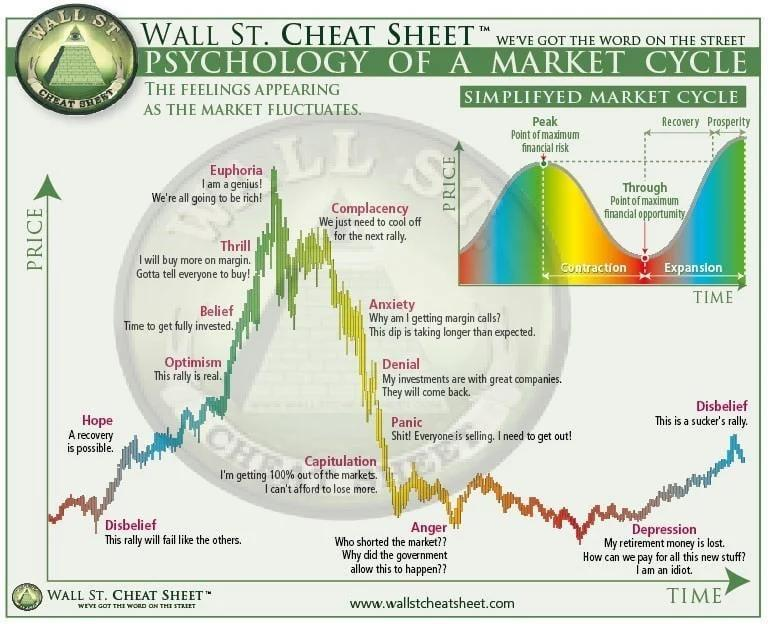

The financial markets represent a multifaceted ecosystem encompassing a wide range of participants, from individual investors seeking personal financial growth to large institutional entities that drive significant market movements. In recent years, the intersection of financial predictions, market psychology, and algorithmic (algo) trading has emerged as a significant focus for both academic researchers and industry practitioners.

This article examines the intricate connections between these elements and their impact on investor behavior. Understanding these interactions is essential for gaining insights into market trends and devising effective trading strategies, particularly in an era where technology plays an increasingly critical role in shaping financial markets.



Whether you are a seasoned investor, a financial analyst, or someone interested in understanding the mechanics of financial markets, this article aims to deliver a comprehensive overview of these fundamental components. It discusses financial predictions, market psychology, investor behavior, and algo trading, highlighting both their distinct roles and their combined influence on financial markets.

By the conclusion of this article, readers will have a deeper comprehension of the various factors driving market trends and will be better equipped to navigate the complexities of financial markets. The knowledge gained here could prove invaluable in devising trading strategies that are informed, adaptive, and strategically sound, fostering both insight and innovation in the ever-evolving landscape of financial markets.

## Table of Contents

## Understanding Financial Predictions

Financial predictions serve as the foundation of effective investment strategies, offering insights into potential future market behaviors through sophisticated modeling and analysis. These predictions primarily rely on two interconnected approaches: fundamental and technical analysis.

Fundamental analysis evaluates economic factors such as corporate earnings, interest rates, inflation, and overall economic growth. By analyzing financial statements, assessing management efficiency, and gauging industry conditions, analysts derive intrinsic values for stocks and other assets. Conversely, technical analysis examines historical price movements and trading volumes using charts and indicators to forecast future price trends. It assumes that all relevant market information is reflected in current prices and that patterns and trends tend to repeat over time.

Technological advancements have significantly enhanced the predictive capabilities in finance. The integration of [machine learning](/wiki/machine-learning) algorithms and big data analytics allows for more accurate and complex analyses of large datasets, identifying patterns and trends not immediately evident to human analysts. Machine learning models, such as regression analysis, neural networks, and decision trees, are employed to improve the precision of financial forecasts. For instance:

```python
from sklearn.linear_model import LinearRegression
import numpy as np

# Example: Predicting stock prices based on historical data
X = np.array([[1], [2], [3], [4], [5]])  # Dates
y = np.array([100, 105, 110, 120, 115])  # Stock prices

model = LinearRegression().fit(X, y)
predicted_price = model.predict([[6]])
print(f"Predicted stock price: {predicted_price}")
```

In this example, linear regression—a common statistical method—is employed to predict future stock prices based on historical data.

The accuracy and reliability of financial predictions profoundly influence investor behavior and market confidence. Accurate predictions can sway investor sentiment, impacting asset prices and overall market dynamics. For example, optimistic financial forecasts can lead to increased buying activity, driving up asset prices, while negative predictions may cause selling pressure and price declines.

Financial forecasting methodologies, including quantitative models and qualitative assessments, critically shape market dynamics. Quantitative models employ mathematical techniques to generate data-driven predictions, while qualitative analysis considers non-numerical factors, such as political events and market sentiment, affecting asset prices.

Understanding and leveraging financial predictions allows investors to navigate market complexities effectively, making informed decisions that can lead to improved investment outcomes. As technology continues to evolve, the sophistication and accuracy of financial predictions are expected to advance, offering even deeper insights into market behaviors and potential investment opportunities.

## Exploring Market Psychology

Market psychology refers to the collective emotions and sentiments of investors in the financial markets, which significantly influence market trends beyond what traditional financial metrics might predict. It plays a crucial role in how markets operate and evolve, often defying purely economic or rational explanations.

Understanding market psychology entails recognizing patterns of behavior driven by emotions such as fear, greed, and euphoria. These emotions can lead to significant market movements and are often encapsulated in concepts like 'herd behavior' and 'animal spirits'. Herd behavior describes a situation where individuals in a market collectively move in the same direction, often leading to significant market trends or corrections. This phenomenon can result from the natural human tendency to mimic the actions of others, particularly in uncertain environments. The term 'animal spirits', coined by John Maynard Keynes, refers to the instincts and emotions that drive human behavior in economic contexts, which can lead to unpredictable market swings.

The work of psychologists Amos Tversky and Daniel Kahneman has been pivotal in highlighting the deviations from rational behavior observed in markets, forming the bedrock of behavioral economics. Their research illuminated how cognitive biases and heuristics influence decision-making processes, often leading to systematic errors in judgment. For example, Tversky and Kahneman's prospect theory highlights how people value potential gains and losses, showing that losses typically [carry](/wiki/carry-trading) more emotional weight than equivalent gains, a bias known as 'loss aversion'.

Market psychology can create bubbles and influence market sentiment indicators, leading to prolonged periods of irrational market behavior. Financial bubbles are characterized by the unjustified escalation of asset prices, which can burst, leading to sharp declines and economic consequences. These bubbles often form when investors collectively subscribe to overly optimistic predictions, fueled by the excitement of rising prices. Indicators of market sentiment, such as the CBOE Volatility Index (VIX), help quantify investor sentiment and expectation of market [volatility](/wiki/volatility-trading-strategies), providing insights into prevailing moods of fear or complacency within the markets.

By grasping these psychological factors, investors can better anticipate potential market shifts and adjust their strategies accordingly. For instance, during periods of high volatility and fear, investors may choose to reduce exposure to risky assets or diversify their portfolios to mitigate potential losses. On the other hand, recognizing a euphoria-driven bubble might prompt caution and defensive strategies.

Incorporating an understanding of market psychology into trading strategies can enhance decision-making. Investors and traders can use sentiment analysis tools to gauge market mood, utilizing data from social media, news outlets, and other sources to inform their positions. Machine learning algorithms can also be employed to detect sentiment trends, offering quantitative insights into how collective emotions might influence future market behavior.

In summary, market psychology encompasses the crucial emotional and cognitive dimensions of investing, offering a lens through which market dynamics can be better understood and predicted. Recognizing the power of emotions and group psychology can provide invaluable foresight, allowing investors to navigate the complexities of financial markets more effectively.

## Investor Behavior and Its Impact

Investor behavior is a critical component in financial markets, driven by various factors, including personal biases, market sentiment, and external information like news and financial predictions. These elements collectively influence decisions, often leading to outcomes that deviate from rational financial strategies. 

Behavioral biases, such as overconfidence, loss aversion, and the disposition effect, often lead to irrational decisions. Overconfidence can lead investors to overestimate their knowledge or ability to predict market movements, often resulting in excessive trading and risk-taking. Loss aversion refers to the tendency to prefer avoiding losses rather than acquiring equivalent gains, which can cause investors to hold onto losing positions longer than warranted. The disposition effect is the propensity to sell winning investments too early while retaining losing ones in hopes of a rebound, which can adversely impact overall portfolio returns.

Historical market crashes and bubbles highlight the profound impact of collective investor behavior. Events like the dot-com bubble of the late 1990s and the 2008 financial crisis illustrate how investor psychology and mass movements can drive significant market volatility. During these periods, the confluence of fear, greed, and herd behavior can lead to drastic market movements, creating periods of overvaluation or undervaluation in asset prices.

To mitigate the risks associated with these psychological traps, investors can employ strategies focused on awareness and strategic planning. Educating oneself about common biases and actively questioning one's own investment decisions can help reduce their impact. Additionally, strategies such as diversification, systematic investment plans, and employing stop-loss orders can help manage emotional decisions.

By analyzing investor behavior, we gain insights into how sentiment translates to market actions, influencing asset pricing and market volatility. For instance, sentiment indicators such as the VIX (Volatility Index) can provide clues about market stress and investor uncertainty, potentially guiding investment strategies. Understanding these dynamics enables investors to better predict market movements and adjust their strategies to align with market conditions, ultimately contributing to more informed and successful investment outcomes.

## The Rise of Algorithmic Trading

Algorithmic trading, or algo trading, significantly impacts financial markets by using computer programs to execute trades at high speeds and frequencies. These systems rely on complex algorithms and real-time data analysis to make trading decisions, which enhances market efficiency. However, while improving [liquidity](/wiki/liquidity-risk-premium) and reducing transaction costs, [algorithmic trading](/wiki/algorithmic-trading) also raises concerns about market stability.

Algo trading methods are designed to operate on millisecond timescales, allowing traders to exploit even minor price discrepancies across various platforms. Using algorithms, traders can identify patterns and trends not immediately visible to human investors, often capitalizing on market psychology. This feature allows for the execution of strategies like statistical [arbitrage](/wiki/arbitrage), [trend following](/wiki/trend-following), and [market making](/wiki/market-making).

The algorithms start with a defined set of rules and data inputs, from which they generate outputs regarding when and how to execute trades. A common type of algorithm used is the moving average crossover strategy, which generates buy and sell signals based on moving averages over defined time periods. For example:

```python
def moving_average_crossover(prices, short_window=40, long_window=100):
    short_mavg = prices.rolling(window=short_window, min_periods=1).mean()
    long_mavg = prices.rolling(window=long_window, min_periods=1).mean()

    signals = pd.DataFrame(index=prices.index)
    signals['signal'] = 0.0

    signals['signal'][short_window:] = np.where(short_mavg[short_window:] > long_mavg[short_window:], 1.0, 0.0)
    signals['positions'] = signals['signal'].diff()

    return signals
```

Despite their advantages, algorithmic trading systems are not without their risks. One significant challenge is the potential for "flash crashes," which occur when algorithms react to market anomalies almost instantaneously, leading to sudden and dramatic price changes. For instance, the Flash Crash of May 6, 2010, saw the Dow Jones Industrial Average drop nearly 1,000 points in minutes, partially attributed to high-frequency trading systems.

Recent advancements in machine learning and [artificial intelligence](/wiki/ai-artificial-intelligence) offer new dimensions to algorithmic trading. These technologies enable the development of more adaptive algorithms that can improve decision-making with changing market conditions. However, this increased complexity also presents challenges in system oversight and risk management. Ensuring the reliability of these systems requires robust testing and validation processes to prevent unintended market disruptions.

Regulatory bodies continue to scrutinize algorithmic trading practices, seeking a balance between fostering innovation and maintaining market stability. The imposition of circuit breakers and enhanced reporting requirements are among the measures introduced to mitigate systemic risks associated with rapid trading.

In summary, while algorithmic trading represents a major evolution in market dynamics, offering both efficiencies and challenges, it must be carefully managed to mitigate potential risks, particularly those associated with rapid, large-scale trades that can impact market stability.

## Conclusion

The interplay of financial predictions, market psychology, investor behavior, and algorithmic trading creates a complex and fascinating landscape in financial markets. Understanding these interconnected elements is crucial for investors aiming to navigate market uncertainties and seize opportunities effectively. Investors are encouraged to adopt a holistic approach that considers each of these factors, as doing so can provide a clearer picture of market dynamics and inform better decision-making.

Continuous research, especially in technological advancements, is essential to further illuminate these interactions. Improved predictive models and more sophisticated analytical tools can offer enhanced frameworks for understanding and predicting market behavior. For instance, advances in big data analytics and behavioral finance analysis can refine financial predictions, making them more responsive to market changes and investor sentiment adjustments.

Looking ahead, developments in artificial intelligence (AI) and machine learning hold promise for revolutionizing how these elements integrate into trading strategies and market analysis. AI techniques can process vast amounts of data far beyond human capacity, identifying subtle patterns and correlations that inform strategic trading decisions. Machine learning models, especially those using neural networks, can adapt and improve over time, potentially outperforming traditional models in market analysis and prediction.

Ultimately, understanding the dynamics between financial predictions, market psychology, investor behavior, and algorithmic trading is essential for investors seeking to enhance their strategies and achieve sustained financial success. Adapting to emerging technologies and evolving market conditions will be crucial for navigating the future landscape of financial markets.

## References & Further Reading

[1]: Kahneman, D., & Tversky, A. (1979). ["Prospect Theory: An Analysis of Decision under Risk."](http://web.mit.edu/curhan/www/docs/Articles/15341_Readings/Behavioral_Decision_Theory/Kahneman_Tversky_1979_Prospect_theory.pdf) Econometrica, 47(2), 263-292.

[2]: Shiller, R. J. (2000). ["Irrational Exuberance."](https://press.princeton.edu/books/paperback/9780691173122/irrational-exuberance) Princeton University Press.

[3]: Lo, A. W. (2004). ["The Adaptive Markets Hypothesis: Market Efficiency from an Evolutionary Perspective."](https://papers.ssrn.com/sol3/papers.cfm?abstract_id=602222) The Journal of Portfolio Management, 30(5), 15-29.

[4]: Tetlock, P. C. (2007). ["Giving Content to Investor Sentiment: The Role of Media in the Stock Market."](https://onlinelibrary.wiley.com/doi/abs/10.1111/j.1540-6261.2007.01232.x) Management Science, 53(2), 237-251.

[5]: Mitra, G., & Mitra, L. (Eds.). (2011). ["The Handbook of News Analytics in Finance."](https://onlinelibrary.wiley.com/doi/book/10.1002/9781118467411) John Wiley & Sons.

[6]: Aldridge, I. (2010). ["High-Frequency Trading: A Practical Guide to Algorithmic Strategies and Trading Systems."](https://www.ahmetbeyefendi.com/wp-content/uploads/2020/07/High-Frequency-Trading-Irene-Aldridge.pdf) John Wiley & Sons.

[7]: Hendershott, T., Jones, C. M., & Menkveld, A. J. (2011). ["Does Algorithmic Trading Improve Liquidity?"](https://onlinelibrary.wiley.com/doi/full/10.1111/j.1540-6261.2010.01624.x) The Review of Financial Studies, 24(3), 660-704.