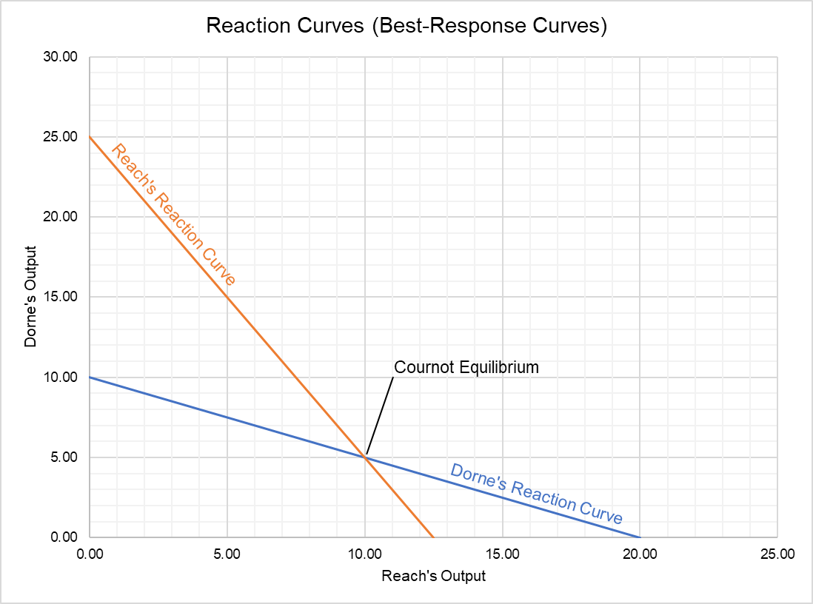

Algorithmic trading, often referred to as algo trading, leverages computer programs and algorithms to execute trading strategies at high speeds and frequencies. Unlike traditional trading, which relies on human decision-making and manual order placement, algorithmic trading automates these processes, facilitating rapid transactions and reducing the likelihood of human error. The relevance of algorithmic trading in modern financial markets is exemplified by its substantial contribution to the increase in trading volumes and liquidity, making it a pivotal component of contemporary trading ecosystems.

Market reaction modeling within the context of algorithmic trading involves using algorithms to predict and respond to market events and price changes. This process requires the analysis of significant data sets to model how markets might react to various stimuli, such as economic news, geopolitical events, or changes in market sentiment. The objective of modeling market reactions using algorithms is to enhance the accuracy and speed of trading decisions, optimize trade execution, and identify profitable trading opportunities before they are visible to the broader market. Such models typically encompass statistical techniques, machine learning algorithms, and historical data analysis to refine predictions and gauge potential market responses.



The significance of accurate market reaction modeling cannot be understated, as it allows traders to exploit inefficiencies in the market and gain a competitive edge. By forecasting market movements, traders are positioned to devise strategies that maximize returns while minimizing risks. Furthermore, effective market reaction models contribute to more liquidity in the market, as they facilitate the swift execution of trades, ensuring that buy and sell orders are matched efficiently.

Technological advancements have been central to the growth of algorithmic trading. The continual improvement of computational power, faster data processing capabilities, and the development of sophisticated machine learning models have transformed the field, enabling more complex and nuanced market reaction models. High-frequency trading, a subset of algorithmic trading, exemplifies this evolution, where trades are executed within microseconds, necessitating highly advanced algorithms and technologies. Additionally, the proliferation of big data analytics has furnished traders with unprecedented access to a plethora of data sources, fostering more informed decision-making processes.

In conclusion, algorithmic trading represents a fusion of financial acumen and technological prowess, where the innovation of market reaction models serves as a cornerstone. These models not only drive efficiency and precision in trading but also embody the dynamic interplay between market forces and technological progress, underscoring the transformative impact of technology on modern financial markets.

## Table of Contents

## Understanding Market Reaction Modeling

Market reaction modeling is a critical component of algorithmic trading, focused on the quantification and prediction of how prices and volumes in financial markets change in response to various stimuli. This process entails dissecting and analyzing key elements such as market sentiment, trading volumes, price movements, and external economic indicators. The goal is to construct a predictive framework that captures the dynamic interactions within markets, enabling traders to anticipate and exploit potential opportunities.

Machine learning and data analytics play a pivotal role in market reaction modeling. Machine learning algorithms, particularly those involving supervised and unsupervised learning, facilitate the extraction of patterns from vast datasets. Techniques such as regression analysis, neural networks, and decision trees are employed to predict price trends and detect anomalies. Data analytics tools aggregate and process real-time market data, providing insights that inform trading decisions. Python libraries such as pandas, NumPy, and scikit-learn are commonly used for data manipulation and model development, offering robust functionalities for manipulating and analyzing financial data.

A variety of market reactions can be modeled through algorithms. These include price spikes in response to sudden news events, [liquidity](/wiki/liquidity-risk-premium) shifts, and [volatility](/wiki/volatility-trading-strategies) induced by large trades or economic announcements. Algorithms are designed to capture these reactions by identifying conditions under which such events are likely to occur. The models help predict whether a market will exhibit bullish or bearish tendencies, thereby guiding strategic trades.

However, modeling market reactions accurately is fraught with challenges. Financial markets are inherently stochastic and influenced by countless, often unpredictable factors. This unpredictability makes it difficult to create models that consistently deliver accurate predictions. Another challenge is overfitting, where a model performs well on historical data but fails to predict future market movements. Additionally, the sheer [volume](/wiki/volume-trading-strategy) and velocity of data require efficient processing capabilities, which can be computationally intensive and necessitate significant technological infrastructure.

The complexities involved in market reaction modeling necessitate a careful balance between model sophistication and interpretability. While advanced models tend to offer greater predictive power, they may also lack transparency, making it difficult for traders to understand and trust the underlying decision-making process. This necessitates a trade-off where models are both robust in prediction and comprehensible to the users deploying them.

## Types of Algorithmic Trading Strategies for Market Reaction

Algorithmic trading encompasses a variety of strategies aimed at predicting and acting upon market movements. Among these, [trend following](/wiki/trend-following) algorithms, mean reversion models, [arbitrage](/wiki/arbitrage) opportunities, and [market making](/wiki/market-making) stand out as prominent strategies.

### Trend Following Algorithms

Trend following algorithms are designed to harness historical data and identify market patterns to make informed trading decisions. These algorithms assume that asset prices often move in persistent directions, either upwards or downwards, for extended periods. By analyzing past price movements and volume data, trend-following strategies predict future behaviors. A basic implementation can be expressed through moving averages, where a trade is executed when a short-term moving average crosses a long-term moving average. This crossing often signals the continuation or reversal of a trend.

```python
# Example of a simple moving average crossover strategy
def moving_average_crossover(prices, short_window, long_window):
    signals = pd.DataFrame(index=prices.index)
    signals['signal'] = 0.0

    # Create short and long simple moving averages
    signals['short_mavg'] = prices.rolling(window=short_window, min_periods=1).mean()
    signals['long_mavg'] = prices.rolling(window=long_window, min_periods=1).mean()

    # Generate buy/sell signals
    signals['signal'][short_window:] = np.where(signals['short_mavg'][short_window:] > signals['long_mavg'][short_window:], 1.0, 0.0)   

    # Create trading orders
    signals['positions'] = signals['signal'].diff()

    return signals
```

### Mean Reversion Models

Mean reversion strategies are based on the principle that deviations from an average price level are temporary and that prices will eventually revert to their mean. These models are effective in stable markets where prices oscillate around a consistent central value. Traders utilize statistical measures, such as the z-score, to determine the extent of deviation and execute trades that capitalize on price corrections. The z-score can be calculated as:

$$
z = \frac{(X - \mu)}{\sigma}
$$

where $X$ is the current price, $\mu$ is the mean price, and $\sigma$ is the standard deviation.

### Arbitrage Opportunities

Arbitrage seeks to exploit price differences of identical or similar financial instruments across different markets or platforms. By simultaneously buying low and selling high, arbitrage strategies aim to capture risk-free profits. High-frequency trading systems often adopt arbitrage models due to the necessity for rapid execution and real-time market data integration to outpace competition.

### Market Making Algorithms

Market making involves providing liquidity to markets by presenting simultaneous buy and sell orders. Market makers profit from the bid-ask spread, the difference between the purchase and sale prices. These algorithms continuously adjust orders in response to market movements, aiming to buy securities at a lower bid price and sell them at a higher ask price. Effective market making requires sophisticated risk management practices to mitigate the impact of adverse price movements.

In summary, each [algorithmic trading](/wiki/algorithmic-trading) strategy—trend following, mean reversion, arbitrage, and market making—leverages unique market behaviors to achieve profitability. Understanding and implementing these strategies requires a balance of economic insight, mathematical modeling, and technological capability.

## Technological Platforms and Tools

Technological platforms and tools form the backbone of algorithmic trading, providing the necessary infrastructure for the development, testing, and execution of trading algorithms. Numerous platforms now support algorithmic trading features, catering to both novice traders and sophisticated institutional investors.

**Overview of Trading Platforms Offering Algorithmic Trading Features**

Several trading platforms have emerged with integrated algorithmic trading capabilities. These platforms enable users to design custom trading strategies, backtest them with historical data, and automate their execution in real-time markets. Key features often include strategy creation tools, historical data access, [backtesting](/wiki/backtesting) environments, and APIs for enhanced functionality.

**Popular Platforms: TradingView and QuantConnect**

TradingView and QuantConnect have gained recognition for their comprehensive toolsets and user-friendly interfaces. TradingView is renowned for its advanced charting tools and the Pine Script, which allows users to create and share their custom indicators and strategies. It supports a community-driven approach, facilitating learning and strategy development through shared knowledge.

QuantConnect, on the other hand, offers a robust platform with a focus on [quantitative trading](/wiki/quantitative-trading). It supports multiple asset classes and languages like Python and C#, allowing traders to implement complex strategies. QuantConnect emphasizes backtesting and collaborative strategy development, with features like LEAN engine for testing algorithms against historical data.

**Benefits of Advanced Trading Apps for Real-Time Data Analysis and Execution**

Advanced trading apps significantly enhance a trader's ability to analyze real-time data and execute trades quickly. They provide real-time market feeds, sophisticated analytical tools, and seamless integration with brokerage accounts. The advantage of real-time analysis lies in the ability to identify market trends and execute trades at optimal timings, minimizing latency and maximizing potential returns.

**Open-Source Platforms vs. Proprietary Trading Systems**

Choosing between open-source platforms and proprietary trading systems involves weighing the benefits of customization against those of convenience and support. Open-source platforms, like QuantConnect and others powered by community contributions, offer flexibility and adaptability. They allow users to modify and extend the platform's capabilities, tailoring it to specific trading needs. This is particularly advantageous for skilled developers who seek a customizable environment.

Proprietary systems, while often more restricted in terms of customization, provide integrated support and comprehensive solutions that can be advantageous for those desiring a streamlined, out-of-the-box experience. These systems also typically offer dedicated customer service and assurance of system stability, which are vital for time-sensitive trading operations.

In conclusion, trading platforms and tools are pivotal in algorithmic trading, with diverse options available to suit varying needs and expertise levels. Whether opting for community-driven platforms or dedicated proprietary systems, the choice should align with the trader's goals, technical proficiency, and market engagement level.

## Pros and Cons of Market Reaction Modeling in Algorithmic Trading

Algorithmic trading, particularly through market reaction modeling, offers several benefits to participants in the financial markets. One of the primary advantages is the enhancement of decision-making speed. Algorithms can process vast amounts of data and execute trades in fractions of a second, far surpassing human capabilities. This rapid execution is crucial in markets where price movements can be swift and opportunities fleeting. Furthermore, algorithms bring a high degree of accuracy to trading operations. By relying on quantitative models and historical data, they can identify patterns and make predictions that are less susceptible to human error.

Another significant benefit is the reduction of emotional bias. Human traders are often influenced by emotions such as fear and greed, which can lead to irrational decision-making. Algorithmic trading eliminates these emotional influences by adhering strictly to predefined rules and strategies. This objectivity can lead to more consistent and reliable trading outcomes.

Despite these advantages, there are potential downsides to market reaction modeling in algorithmic trading. One major concern is the reliance on technology. Since these models depend heavily on computer systems, any technological failure, be it due to network outages, software bugs, or hardware malfunctions, can lead to significant financial losses. Additionally, the complexity of these models can pose challenges. Developing and maintaining sophisticated trading algorithms requires specialized skills in programming, quantitative analysis, and market knowledge. This complexity can be a barrier to entry for individual traders or smaller firms without the necessary resources.

Risk management is a crucial component in algorithmic trading to address these challenges. Effective risk management strategies help mitigate potential losses and ensure that trading actions remain within acceptable risk parameters. Common risk management techniques include diversification, position sizing, and stop-loss orders. Diversification reduces exposure to any single market event, while position sizing determines the appropriate amount of capital to commit to each trade. Stop-loss orders automatically sell a position when it reaches a certain loss threshold, limiting potential losses.

In summary, while market reaction modeling in algorithmic trading brings speed, accuracy, and objectivity, it also requires careful management of technological and strategic complexities. Proper risk management is essential to harness the benefits while minimizing potential downsides.

## Starting with Market Reaction Modeling in Algo Trading

Developing and implementing personalized algorithmic strategies for market reaction modeling in algorithmic trading requires a structured approach encompassing several critical components. Here's a comprehensive guide to embark on this journey:

### Steps to Develop Personalized Algorithmic Strategies

1. **Define Trading Objectives**: Establish clear goals for your algorithmic trading strategy, which may include maximizing returns, minimizing risk, or enhancing portfolio diversification. These objectives will inform the design and implementation of your trading algorithms.

2. **Collect and Analyze Data**: Market reaction modeling is grounded in data. Gather historical market data, such as price, volume, and volatility metrics, to inform your algorithm's predictive capabilities. Data preprocessing, including cleaning and normalization, is essential to ensure high-quality inputs.

3. **Choose Appropriate Modeling Techniques**: Depending on the complexity and objectives of the trading strategy, select suitable modeling techniques. This could involve machine learning models, such as neural networks for deep learning, or simpler statistical methods for pattern recognition.

4. **Develop the Algorithm**: Craft the algorithm that will execute trades based on the modeled market reactions. The algorithm should be coded in a robust programming language like Python, which offers extensive libraries for data analysis and machine learning.

5. **Backtest the Strategy**: Conduct backtesting using historical data to evaluate the performance of the algorithm. This step involves analyzing the algorithm's behavior in past market conditions to identify strengths and weaknesses. The Sharpe ratio and other metrics can quantify the risk-adjusted return of the strategy.

```python
import pandas as pd
from pandas_datareader import data as pdr
import numpy as np

# Sample Backtesting with Moving Average Crossover Strategy
def backtest_strategy(data, short_window=40, long_window=100):
    signals = pd.DataFrame(index=data.index)
    signals['price'] = data['Adj Close']
    signals['short_mavg'] = data['Adj Close'].rolling(window=short_window, min_periods=1).mean()
    signals['long_mavg'] = data['Adj Close'].rolling(window=long_window, min_periods=1).mean()
    signals['signal'] = 0.0
    signals['signal'][short_window:] = np.where(signals['short_mavg'][short_window:] > signals['long_mavg'][short_window:], 1.0, 0.0)
    signals['positions'] = signals['signal'].diff()
    return signals

# Example usage with sample data
# Replace 'AAPL' with desired ticker and ensure internet connectivity for fetching data
data = pdr.get_data_yahoo('AAPL', start='2020-01-01', end='2023-12-31')
strategy_signals = backtest_strategy(data)
```

6. **Optimize and Refine**: Fine-tune the algorithm based on backtesting results. This could involve adjusting parameters or integrating additional data inputs to improve predictive accuracy.

### Skills and Knowledge Requirements

Developing market reaction models necessitates a combination of programming and financial expertise:

- **Programming Skills**: Proficiency in languages such as Python or C++ is essential for algorithm development. Familiarity with data science libraries, like Pandas and NumPy, and machine learning frameworks, such as TensorFlow or Scikit-learn, is advantageous.
- **Financial Acumen**: Understanding market structures, asset classes, and trading principles is crucial. Analyzing financial statements and economic indicators will enhance strategy formulation.

### Importance of Backtesting

Backtesting is crucial for validating the performance and efficacy of an algorithmic strategy before deploying it in live trading. This process helps identify potential pitfalls and refine strategies to better align with real-world market dynamics, thereby reducing the probability of unforeseen losses.

### Guidelines for Simulating Trading

Before executing trades in actual markets, simulate the trading strategy within a paper trade environment. This simulation enables testing under current market conditions without financial risks, providing valuable insights into strategy feasibility and resilience.

In conclusion, careful planning, rigorous testing, and continual optimization are keys to successfully starting with market reaction modeling in algorithmic trading. With the appropriate skills and tools, traders can harness the potential of algorithms to achieve informed and timely market interactions.

## Future Trends and Developments

The landscape of algorithmic trading is undergoing significant transformations due to the advancements in [artificial intelligence](/wiki/ai-artificial-intelligence) (AI) and [machine learning](/wiki/machine-learning). These technologies are pivotal in developing sophisticated market reaction models that are not only precise but also adaptive to dynamic market conditions. Machine learning algorithms are being employed to process vast amounts of historical and real-time data, which enables traders to predict market movements with greater accuracy. The use of [deep learning](/wiki/deep-learning), a subset of AI, facilitates the modeling of complex patterns and non-linear dynamics in financial markets, thus improving the efficiency of trading strategies.

Technological advancements are expected to further refine these models, reducing latency and increasing execution speed. High-frequency trading ([HFT](/wiki/high-frequency-trading-strategies)) operations, in particular, benefit from faster algorithms, enhancing competitiveness by exploiting minuscule price discrepancies. The incorporation of blockchain and distributed ledger technology (DLT) is also anticipated to bolster transparency and security in algo trading systems, thereby attracting more institutional investors.

Despite these advances, regulatory frameworks around algorithmic trading are in a state of evolution. As AI-driven models become more prevalent, financial regulators worldwide are faced with the challenge of ensuring these systems do not exacerbate market volatility or contribute to systemic risks. Potential regulatory changes could include stricter reporting requirements, enhanced scrutiny of algorithmic transparency, and the imposition of limits on trading speeds to mitigate risks associated with flash crashes.

Innovation in algorithmic trading is opening new market opportunities. The growth of [alternative data](/wiki/best-alternative-data) sources, such as satellite imagery and sentiment analysis from social media, is providing traders with novel insights into market behaviors. Additionally, the expansion of trading into emerging markets and asset classes is being facilitated by advanced algos, thus diversifying opportunities for investment and risk management. The continual development of these technologies promises to not only sustain but accelerate the growth of algorithmic trading, emphasizing the necessity for continuous innovation and adaptation.

## Conclusion

Algorithmic trading has transformed the landscape of modern financial markets, primarily through the application of market reaction modeling. This approach facilitates the prediction and response to market movements with precision and speed. Algorithms leverage vast datasets, alongside advancements in machine learning and data analytics, to create sophisticated models capable of enhancing trading strategies.

The core advantage of market reaction modeling lies in its ability to process complex data rapidly, thereby enabling traders to make informed decisions with reduced emotional bias. By employing strategies such as trend following, mean reversion, arbitrage, and market making, traders can exploit various market inefficiencies and opportunities.

The technological platforms available today, ranging from open-source tools to proprietary systems, offer robust frameworks for real-time data analysis and execution. TradingView and QuantConnect exemplify platforms that have democratized access to algorithmic trading features, empowering both novice and experienced traders.

Despite the benefits, the reliance on technology introduces challenges, including increased complexity and the need for rigorous risk management. Furthermore, future regulatory changes and technological advancements will continue to shape the framework and applications of algorithmic trading.

Looking ahead, the integration of AI and machine learning in market reaction modeling promises to enhance strategy development further. These technologies are poised to uncover new market opportunities and drive innovation within the industry. As the landscape of financial markets evolves, continuous learning and adaptation remain crucial for traders aiming to leverage algorithmic trading effectively.

In conclusion, while market reaction modeling presents opportunities and complexities, its role in algorithmic trading is undeniably significant. Embracing the continuous advancements in technology and methodology will be key to navigating the future of trading successfully.

## References & Further Reading

[1]: ["Machine Learning for Algorithmic Trading"](https://github.com/stefan-jansen/machine-learning-for-trading) by Stefan Jansen

[2]: ["Advances in Financial Machine Learning"](https://www.amazon.com/Advances-Financial-Machine-Learning-Marcos/dp/1119482089) by Marcos Lopez de Prado

[3]: ["Quantitative Trading: How to Build Your Own Algorithmic Trading Business"](https://www.amazon.com/Quantitative-Trading-Build-Algorithmic-Business/dp/1119800064) by Ernest P. Chan

[4]: Hautsch, N. (2012). ["Econometrics of Financial High-Frequency Data."](https://link.springer.com/content/pdf/10.1007/978-3-642-21925-2.pdf) Springer.

[5]: Aldridge, I. (2013). ["High-Frequency Trading: A Practical Guide to Algorithmic Strategies and Trading Systems,"](https://www.amazon.com/High-Frequency-Trading-Practical-Algorithmic-Strategies/dp/1118343506) 2nd Edition, Wiley.

[6]: Zakamulin, V. (2017). ["Market Timing with Moving Averages: The Anatomy and Performance of Trading Rules."](https://link.springer.com/book/10.1007/978-3-319-60970-6) Springer.

[7]: [QuantConnect](https://www.quantconnect.com/) - A platform for quantitative research and algorithmic trading development.

[8]: [TradingView](https://www.tradingview.com/) - An analytical platform with charting tools for algorithmic trading.