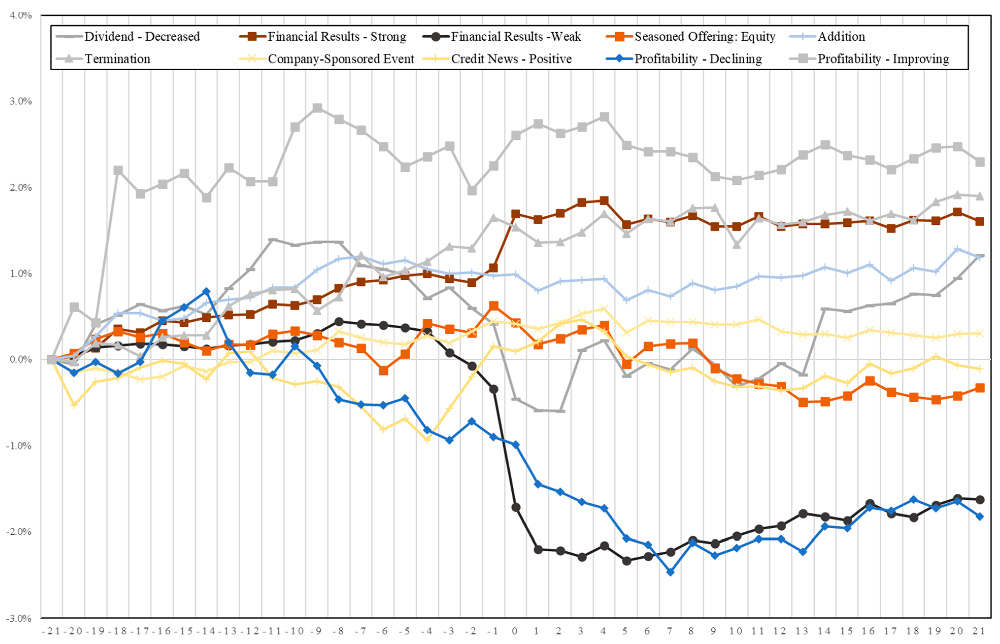

## Table of Contents

## What is market reaction to news?

Market reaction to news refers to how stock prices and other financial indicators change when new information comes out. When a company or the economy gets good or bad news, people who invest in the market might decide to buy or sell their stocks based on that news. This buying and selling can make stock prices go up or down quickly.

For example, if a company announces it made more money than expected, people might think the company is doing well and buy more of its stock. This can make the stock price go up. On the other hand, if a company says it's not doing well, people might sell their stock, which can make the price go down. News about the whole economy, like interest rates or jobs reports, can also affect the market in a big way.

## How do different types of news affect the market?

Different types of news can have big effects on the market, depending on what the news is about. News about a single company, like earnings reports or new product announcements, can make that company's stock price go up or down. If the news is good, like better-than-expected profits, people might buy more of the stock, pushing the price up. Bad news, like a product recall, can make people sell the stock, which drops the price. This kind of news mostly affects the company's stock but can also impact similar companies in the same industry.

News about the whole economy, like changes in interest rates or big economic reports, can move the entire market. For example, if the government says the economy is growing faster than expected, people might feel more confident and buy more stocks, making the market go up. But if the news is bad, like higher unemployment, people might worry and sell their stocks, causing the market to go down. This kind of news affects almost all stocks because it changes how people feel about the future of the economy.

Sometimes, unexpected events like natural disasters or political changes can also shake the market. These events can be hard to predict and can cause big swings in stock prices. For instance, if there's a big earthquake that disrupts a lot of businesses, the market might go down as people worry about the damage. Or if there's a sudden change in government, it might make the market uncertain and cause prices to move a lot. These events show how sensitive the market can be to news that people didn't see coming.

## What are the immediate impacts of news on stock prices?

When news comes out, it can make stock prices change right away. If the news is good, like a company saying it made more money than people thought, people might want to buy more of that company's stock. This buying can push the stock price up quickly. On the other hand, if the news is bad, like a company saying it's losing money, people might want to sell their stock. This selling can make the stock price drop fast.

News about the whole economy can also make stock prices move right away. If the government says the economy is doing better than expected, people might feel more confident and buy more stocks, making the market go up. But if the news is bad, like higher unemployment, people might worry and sell their stocks, causing the market to go down. These quick changes show how sensitive the market is to new information.

## How can investors predict market reactions to news?

Investors can try to predict how the market will react to news by looking at past reactions to similar news. For example, if a company usually sees its stock price go up when it announces good earnings, investors might expect the same thing to happen again. They also look at how the market as a whole has reacted to big economic news in the past. By studying these patterns, investors can make educated guesses about what might happen next time.

Another way investors predict market reactions is by understanding what people are thinking and feeling about the market. If people are feeling hopeful about the economy, good news might make stock prices go up even more than usual. But if people are worried, even good news might not help as much. Investors often use surveys and other tools to figure out these feelings and use that information to predict how news will affect the market.

It's important to remember that predicting market reactions is not easy and can be wrong sometimes. Unexpected events or changes in how people feel can make the market do something different than what investors expected. So, while looking at past reactions and understanding people's feelings can help, investors need to be ready for surprises and not rely too much on their predictions.

## What role do emotions play in market reactions to news?

Emotions play a big role in how the market reacts to news. When people hear news, they feel happy, sad, worried, or excited. These feelings can make them want to buy or sell stocks quickly. For example, if a company says it's doing great, people might feel happy and buy more of that company's stock, making the price go up. But if the news is bad, like a company losing money, people might feel scared and sell their stocks, which can make the price go down fast.

Understanding how people feel can help predict how the market will react to news. If people are already feeling good about the economy, good news might make stock prices go up even more. But if people are worried, even good news might not help as much. Investors often use surveys and other tools to figure out how people are feeling and use that information to guess what the market might do next. Emotions can make the market move in big ways, so it's important for investors to pay attention to them.

## How do news sources and their credibility influence market reactions?

News sources and how much people trust them can really change how the market reacts to news. If a news source is well-known and trusted, like a big newspaper or a respected financial news channel, people are more likely to believe what they say. When these trusted sources report news, it can make a big difference in stock prices. For example, if a trusted source says a company is doing well, investors might feel more sure about buying that company's stock, which can make the stock price go up.

On the other hand, if a news source is not very trusted or is known for spreading rumors, people might not believe the news as much. This can make the market react less strongly or not at all. For instance, if a less trusted source says something bad about a company, investors might not sell their stocks right away because they're not sure if the news is true. So, the credibility of a news source plays a big role in how quickly and strongly the market reacts to the news they report.

## What are some historical examples of significant market reactions to news?

One big example of the market reacting to news happened in 2008 when Lehman Brothers, a big bank, said it was going bankrupt. This news made people very worried about the whole economy. They started selling their stocks fast, and the stock market dropped a lot in just a few days. This event was a big part of the 2008 financial crisis, showing how news about one company can affect the whole market.

Another example is from 2016 when the UK voted to leave the European Union, which people called "Brexit." When the news came out that the UK voted to leave, the stock market in Europe and around the world went down a lot. People were unsure about what would happen to the economy, so they sold their stocks. This shows how news about big political changes can make the market move a lot.

A more recent example is from March 2020 when the news about the COVID-19 virus spreading quickly made the stock market drop a lot. People were scared about how the virus would hurt businesses and the economy, so they sold their stocks. This caused one of the biggest drops in the stock market in a short time. It shows how news about health and safety can make the market react strongly.

## How do algorithmic trading systems react to news?

Algorithmic trading systems are computer programs that trade stocks very quickly. When news comes out, these systems can read the news and decide to buy or sell stocks in just a few seconds. They look for certain words or phrases in the news that might mean the stock price will go up or down. If the news is good, like a company saying it made more money than expected, the system might buy more of that company's stock. If the news is bad, like a company losing money, the system might sell the stock fast.

These systems can make the market move a lot because they trade so quickly. When a lot of algorithmic systems react to the same news at the same time, it can make stock prices change very fast. For example, if many systems see good news and start buying a stock, the price can go up a lot in just a few minutes. But if the systems see bad news and start selling, the price can drop quickly. This shows how powerful and fast these systems can be when reacting to news.

## What are the differences in market reactions between short-term and long-term news?

Short-term news usually makes the market move fast but not for a long time. This kind of news can be things like a company saying it made more money than people thought or a sudden event like a natural disaster. When this news comes out, people might buy or sell stocks right away, making the stock prices go up or down quickly. But after a few days or weeks, the market might go back to how it was before because the news was just a short-term thing. For example, if a company has a good earnings report, its stock price might go up for a little while, but then it might come back down if people think the good news won't last.

Long-term news affects the market for a longer time because it changes how people think about the future. This kind of news can be things like changes in interest rates, big economic reports, or new laws that affect businesses. When this news comes out, it can make people feel more or less confident about the economy for months or even years. For example, if the government says the economy is growing fast, people might feel good and keep buying stocks, making the market go up for a long time. But if the news is bad, like higher unemployment, people might worry and keep selling their stocks, making the market go down for a while.

## How do global events impact market reactions differently across various regions?

Global events can affect markets in different ways depending on where you are in the world. For example, if there's a big earthquake in Japan, it might make the stock market in Japan go down a lot because people are worried about the damage. But in the United States, the market might not go down as much because the earthquake is far away and doesn't affect their businesses as much. So, the closer a country is to where the event happens, the more its market might react.

Sometimes, global events can make markets around the world move in the same way. For example, if there's a big war or a global health crisis like the COVID-19 pandemic, it can make people everywhere worried about the economy. This can make stock markets in many countries go down at the same time. But even then, some countries might feel the effects more than others. For example, countries that rely a lot on tourism might see their markets drop more if there's a global health crisis because fewer people are traveling.

## What advanced statistical models are used to analyze market reactions to news?

Advanced statistical models help people understand how the market reacts to news. One common model is called "event study methodology." This model looks at how stock prices change right after news comes out. It compares the stock's price before the news to its price after the news to see if there's a big difference. This helps people figure out if the news made the stock price go up or down and by how much. Another model is "time series analysis," which looks at how stock prices change over time. It can help predict how the market might react to similar news in the future by looking at past patterns.

Another useful model is "machine learning," which uses computers to learn from data. These models can read news articles and figure out which words or phrases make stock prices go up or down. They can also look at other information, like how people feel about the market, to make better predictions. "Sentiment analysis" is a part of machine learning that focuses on understanding people's feelings from the news. It can tell if the news is making people feel happy or worried, which can help predict how the market will react. These models help investors make smarter decisions by giving them a better understanding of how news affects the market.

## How can understanding market reactions to news be integrated into a comprehensive investment strategy?

Understanding how the market reacts to news can help people make better investment choices. By knowing how different kinds of news, like company earnings or big economic reports, affect stock prices, investors can decide when to buy or sell stocks. For example, if an investor knows that good earnings news usually makes a company's stock price go up, they might buy the stock before the earnings report comes out. Also, by using tools like event study methodology or machine learning, investors can predict how the market might react to future news. This can help them plan their investments better and maybe make more money.

Including this understanding in a full investment plan means looking at both short-term and long-term news. Short-term news can make stock prices change quickly, but these changes might not last long. So, investors need to think about if the news will affect the company or the economy for a long time or just a short time. Long-term news, like changes in interest rates or new laws, can change how people feel about the economy for months or years. By thinking about both kinds of news, investors can make a plan that helps them do well in the market over time. They can also use this knowledge to be ready for surprises and not just follow what the market does right away.

## What are practical strategies for news trading?

News trading is the practice of executing trades based on news announcements, economic reports, or any relevant events that potentially influence market prices. To construct and implement effective news trading strategies, one must consider the adaptability of these strategies to various news types, risk management in volatile environments, and real-world instances where such strategies have proven successful.

### Adapting Trading Strategies to Different Types of News Events

The adaptability of trading strategies to different news events is crucial for their success. News events can be categorized into several types, such as economic data releases, earnings reports, geopolitical developments, and natural disasters. Each type of news can have distinct market reactions, necessitating tailored trading strategies.

1. **Economic Data Releases**: Regularly scheduled announcements, such as GDP figures, employment numbers, and inflation data, often lead to significant market movements. Traders need to develop algorithms that anticipate these economic data releases and respond accordingly. Statistical models can predict potential price changes based on historical data.

2. **Earnings Reports**: Company-specific news, such as earnings reports, can lead to volatility in stock prices. A strategy here may involve using natural language processing (NLP) to quickly interpret earnings reports and gauge market sentiment. Algorithms can buy, sell, or hold positions based on the sentiment extracted.

3. **Geopolitical Events**: These are often unpredictable and can cause sudden market movements. A robust algorithm might integrate both structured (economic indicators) and unstructured data (social media, news articles), using machine learning models to forecast potential impacts on national or global markets.

### Managing Risks and Rewards in News-Based Trading Environments

Risk management is paramount in news-based trading due to the high volatility and unpredictability of markets in response to news. Effective strategies include:

- **Position Sizing**: Limiting the size of trades based on the level of anticipated volatility can reduce exposure to excessive risk. This can be mathematically represented by the formula:
$$
  \text{Position Size} = \frac{\text{Account Equity} \times \text{Risk Percentage}}{\text{Stop Loss Distance}}

$$

- **Stop Loss and Take Profit Orders**: Setting stop loss levels protects against significant losses, while take profit levels lock in gains when favorable market movements occur.

- **Diversification**: Holding a diversified portfolio of assets minimizes the impact of any single event on the overall portfolio.

- **Scenario Analysis**: This involves running simulations to assess potential outcomes of significant news events and adjusting strategies accordingly.

### Real-World Examples of Effective News Trading Strategies

Several real-world instances highlight the effectiveness of strategic news trading:

1. **Federal Reserve Announcements**: Traders often design strategies around Federal Reserve meetings, as interest rate decisions can lead to predictable market movements. Algorithms may track key phrases in official statements to forecast rate changes and adjust positions in foreign exchange or equities markets.

2. **Brexit-Related News**: During Brexit negotiations, algorithms that could process and assess sentiment from news outlets and social media effectively anticipated currency movements and allowed traders to position themselves advantageously in the forex market.

3. **Earnings Surprises**: Quantitative trading firms utilize high-frequency trading strategies that capitalize on rapid analysis of unexpected earnings results. They employ NLP algorithms to quickly decipher press releases and place trades faster than humanly possible.

Overall, successful news trading requires a dynamic approach that integrates adaptive strategies, rigorous risk management, and advanced technology such as AI and machine learning to interpret and respond to market-relevant information.

## References & Further Reading

[1]: Luss, R., D'Aspremont, A., & D'Eramo, N. (2015). ["Predicting Stock Market Movements from News Headlines."](https://arxiv.org/abs/0809.2792) arXiv preprint.

[2]: Lopez de Prado, M. (2018). ["Advances in Financial Machine Learning"](https://www.amazon.com/Advances-Financial-Machine-Learning-Marcos/dp/1119482089) Wiley.

[3]: Jansen, S. (2020). ["Machine Learning for Algorithmic Trading"](https://github.com/stefan-jansen/machine-learning-for-trading) Packt Publishing.

[4]: Chan, E. P. (2009). ["Quantitative Trading: How to Build Your Own Algorithmic Trading Business"](https://github.com/ftvision/quant_trading_echan_book) John Wiley & Sons.

[5]: Shynkevich, A. (2012). ["The effect of news analytics on stock market activity: A case study using sentiment analysis."](https://www.semanticscholar.org/paper/Predicting-Stock-Price-Movements-Based-on-Different-Shynkevich-McGinnity/bb8cddcafd73b3c4006c483c158161de451da19e) Managerial Finance, 38(8), 692-710.