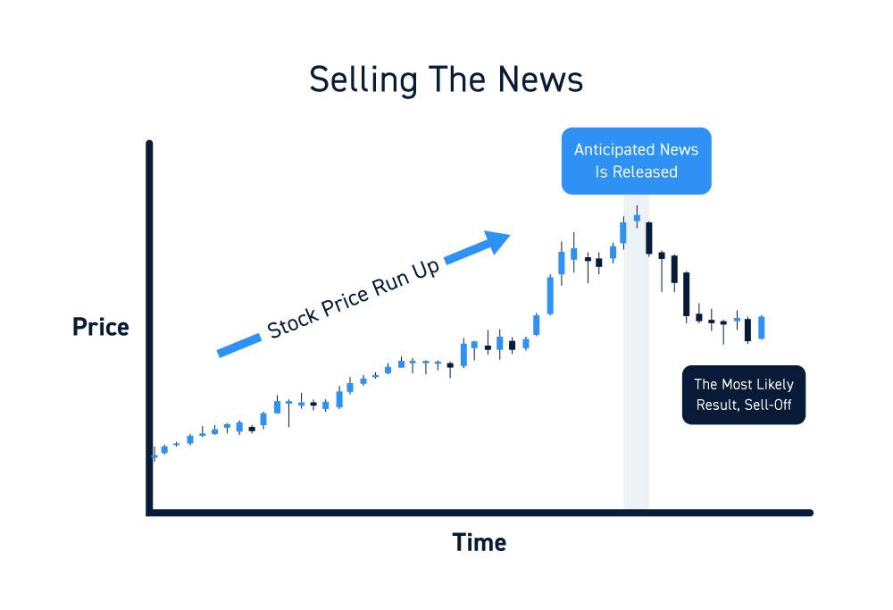

Algorithmic trading, commonly referred to as algo trading, is the execution of trades on financial markets using automated systems that utilize pre-set instructions. These systems leverage complex mathematical algorithms to make high-speed decisions and transactions, often beyond human speed and accuracy. In the contemporary financial landscape, algorithmic trading accounts for a significant portion of trading activities globally, greatly influencing market liquidity and efficiency.

News events, ranging from economic data releases to geopolitical developments, can trigger swift reactions in financial markets. When unexpected news hits the markets, asset prices can fluctuate extensively, affecting trader sentiment and leading to increased volatility. Traditional trading involved human interpretation of such news, which could result in delayed and subjective responses. In contrast, algorithmic trading provides the ability to react instantaneously to market-moving news, minimizing latency and potential information asymmetries.



The intertwining of news and algorithmic trading has profound implications. By incorporating news analytics into trading models, algorithms can potentially predict market trends and react with precision. For instance, natural language processing (NLP) and sentiment analysis are employed to monitor, interpret, and respond to news across vast data streams.

The primary aim of this article is to explore how news and algorithmic trading interact, assessing the present capabilities and forecasting future possibilities. As technology progresses and data analytics become increasingly sophisticated, this synergy is poised to evolve, offering enhanced tools for traders and investors. Balancing these advancements with the innate human capacity for strategic judgment presents a fascinating frontier for the financial sector.

## Table of Contents

## Understanding Market Reaction to News

News plays a crucial role in shaping market dynamics by influencing investor sentiment, expectations, and decision-making processes. Financial markets react to news as it often contains information that affects asset valuations, leading to changes in supply and demand dynamics.

News impacts market dynamics through several channels. Firstly, news alters investor perceptions about the future state of the economy, a company, or a specific asset class. For instance, positive news regarding a nation's GDP growth may lead to increased investor confidence, driving up stock prices. Conversely, negative news, such as an unexpected rise in unemployment rates, can trigger selling pressures.

One significant historical event where news profoundly impacted the markets was the 2008 financial crisis. The collapse of Lehman Brothers on September 15, 2008, was a pivotal news event that led to widespread panic in global financial markets. Stocks plummeted, and credit markets seized up due to fears of systemic failure. This event highlights how news of financial distress in major institutions can cause drastic market swings.

Another example is the COVID-19 pandemic in 2020. As news of the virus’s spread accelerated, markets reacted violently. On March 9, 2020, dubbed “Black Monday,” stock markets around the world experienced record losses. Investors feared the economic impact of lockdown measures, leading to a massive sell-off.

Types of news with potent market impact include economic data releases, earnings reports, and geopolitical events. Economic data, such as employment figures, inflation rates, and central bank policy announcements, directly influence [interest rate](/wiki/interest-rate-trading-strategies) expectations and economic growth projections. For example, if the U.S. Federal Reserve announces an interest rate hike, it can lead to a strengthening of the U.S. dollar and increased [volatility](/wiki/volatility-trading-strategies) in equities and bonds.

Earnings reports are vital for stock valuations. A company reporting higher-than-expected profits can see its stock price surge, while disappointing earnings can lead to a swift decline. Geopolitical events, such as trade tensions, military conflicts, or sanctions, also have significant market repercussions. Political instability in a major oil-producing country can lead to oil supply concerns, affecting global oil prices and related industries.

In conclusion, news serves as a critical catalyst for market movements by altering investor perceptions and expectations. Understanding these dynamics is essential for traders and investors to navigate market volatility effectively.

## Algorithmic Trading and News Detection

Algorithmic trading is a method of executing orders using automated and pre-programmed trading instructions that account for variables such as time, price, and [volume](/wiki/volume-trading-strategy). Its capabilities extend to reacting to market events, including news, within milliseconds, leading to the adoption of news detection and processing as a crucial component of such systems.

The detection of news events by algorithms involves utilizing a myriad of data sources and technologies. Algorithms are fed data from traditional news outlets, social media platforms, and financial news services. They employ techniques such as Natural Language Processing (NLP) to interpret human language and gain insights from textual content. For example, an NLP system can analyze sentiment in a news article to determine if the tone is positive, negative, or neutral, influencing buy or sell decisions accordingly.

Speed and accuracy are paramount in processing news for trading decisions, as financial markets react almost instantaneously to new information. Algorithms must process and interpret news swiftly to capitalize on market movements before they stabilize. This is often achieved through real-time data processing and the use of high-frequency trading systems capable of executing trades at lightning speeds.

To further illustrate, consider the Python pseudocode snippet employing NLP for news sentiment analysis:

```python
import nltk
from nltk.sentiment import SentimentIntensityAnalyzer

# Sample news headline
news_headline = "Company X reports record-breaking earnings."

# Initialize sentiment analyzer
sia = SentimentIntensityAnalyzer()

# Analyze the sentiment of the headline
sentiment = sia.polarity_scores(news_headline)

# Determine action based on sentiment
if sentiment['compound'] > 0.05:
    action = "buy"
elif sentiment['compound'] < -0.05:
    action = "sell"
else:
    action = "hold"

print("Recommended Action:", action)
```

In this example, the algorithm detects a news event, analyzes its sentiment, and determines an appropriate trading action based on the derived sentiment score. The importance of this process lies in its ability to make sophisticated recommendations that consider real-time data, thus providing a competitive edge in trading strategies.

In summary, algorithms' capability to rapidly detect and process news events plays a pivotal role in modern trading environments. Ensuring speed and accuracy in these processes enables traders to mitigate risks and maximize their potential returns in highly dynamic financial markets.

## Tools and Techniques in News-based Algorithmic Trading

In news-based [algorithmic trading](/wiki/algorithmic-trading), technologies such as Natural Language Processing (NLP) and sentiment analysis play pivotal roles in detecting and reacting to news events. These technologies are essential for transforming unstructured news headlines, social media posts, and financial reports into actionable trading signals.

NLP helps in processing and interpreting human language, enabling algorithms to understand nuances in news reports. For example, NLP can identify key financial metrics in earnings reports or detect sentiment in CEO statements. Sentiment analysis, a subset of NLP, assigns values — often numerical — to textual data to predict market reactions. By quantifying sentiment from positive, negative, or neutral tones, algorithms can assess market sentiment's potential impact on stock prices.

Machine learning and Artificial Intelligence (AI) are integral in analyzing and predicting market reactions to news. Machine learning models can be trained to recognize patterns in historical market data and news events, allowing them to predict how similar news might influence markets in the future. AI tools can process vast amounts of data swiftly, identifying correlations between news events and market movements that may not be apparent through traditional analysis. These models continuously learn and adapt, improving prediction accuracy over time.

Specific tools and techniques employed in this field include web scraping, text analysis, and data mining. Web scraping is used for data collection, enabling the extraction of large volumes of real-time news data from various online sources. This data serves as input for NLP and sentiment analysis processes. Text analysis algorithms then parse this data, breaking down text into tokens for in-depth examination.

Python, with libraries such as BeautifulSoup and Scrapy, is frequently used for web scraping. For NLP tasks, libraries such as Natural Language Toolkit (NLTK), spaCy, and TextBlob offer comprehensive functionalities for linguistic processing and sentiment analysis. SentimentIntensityAnalyzer from the VADER library is particularly effective in evaluating text sentiment in financial contexts. Sample Python code for basic sentiment analysis might look as follows:

```python
from vaderSentiment.vaderSentiment import SentimentIntensityAnalyzer

def analyze_sentiment(text):
    analyzer = SentimentIntensityAnalyzer()
    sentiment = analyzer.polarity_scores(text)
    return sentiment

# Example usage
text = "The company's quarterly profits exceeded all expectations."
sentiment_scores = analyze_sentiment(text)
print(sentiment_scores)
```

This illustrates how sentiment scores can be derived from textual data, providing a quantitative basis for trading decisions. As the field advances, these tools will become more sophisticated, offering increased accuracy and efficiency in responding to market-moving news.

## Designing a News Trading Algorithm

Designing a news trading algorithm requires a structured approach, beginning with a clear understanding of the necessary steps, data requirements, and validation techniques.

### Steps Involved in Building a News Trading Algorithm

1. **Define Trading Objectives and Strategy:**
   - Establish the specific financial instruments and markets of interest.
   - Determine the type of news events to monitor (e.g., economic reports, corporate earnings, geopolitical developments).
   - Decide whether the strategy will be directional (betting on price movements) or volatility-based.

2. **Data Collection and Management:**
   - **Data Sources:** Gather real-time and historical news data from reputable news agencies, social media platforms, and financial data providers.
   - **Data Formats:** News data should be in a machine-readable format (e.g., JSON, CSV) to facilitate processing.
   - **Storage Solutions:** Implement robust storage infrastructures such as relational databases or NoSQL systems to handle large volumes of text data.

3. **Data Preprocessing:**
   - Clean the data to remove any irrelevant information or duplicate entries.
   - Convert unstructured text into structured data using natural language processing (NLP) tools.
   - Implement sentiment analysis to gauge the tone of news articles, using tools like Python's `TextBlob` or `VADER`.

4. **Feature Engineering:**
   - Create features that represent the news impact on asset prices, such as sentiment scores, frequency of mentions, and event significance.
   - Incorporate technical indicators and historical price data as additional features.

5. **Algorithm Development:**
   - Convert the trading strategy into an algorithm, utilizing machine learning models if necessary.
   - Examples include sentiment-driven models or reinforcement learning for dynamic decision-making.

   ```python
   from sklearn.ensemble import RandomForestClassifier

   # Example setup for a sentiment-driven trading model
   model = RandomForestClassifier(n_estimators=100, random_state=42)
   model.fit(training_features, training_labels)
   ```

6. **Backtesting:**
   - Test the algorithm on historical data to assess its performance regarding accuracy, speed, and profitability.
   - Use performance metrics such as Sharpe Ratio, maximum drawdown, and cumulative return.

   ```python
   # Example backtesting function
   def backtest_strategy(prices, signals):
       # Calculate returns
       returns = prices.pct_change() * signals.shift(1)
       cumulative_return = (1 + returns).cumprod()
       return cumulative_return
   ```

7. **Validation and Optimization:**
   - Validate the trading algorithm on out-of-sample data to ensure robustness.
   - Optimize parameters such as signal thresholds, lookback periods, and sentiment score weights to enhance performance.

   ```python
   # Optimization loop for parameter tuning
   for threshold in thresholds:
       for lookback in lookback_periods:
           performance = backtest_with_params(threshold, lookback)
           if performance > best_performance:
               best_parameters = (threshold, lookback)
               best_performance = performance
   ```

8. **Risk Management:**
   - Incorporate risk controls such as stop-loss orders, position sizing limits, and diversification rules.
   - Ensure the algorithm complies with regulatory frameworks and market trading rules.

By systematically following these steps, traders and developers can construct a robust news trading algorithm capable of leveraging market-moving news events effectively. Implementing a combination of sophisticated data analytics, [machine learning](/wiki/machine-learning), and financial expertise will maximize the potential of the trading strategy.

## Practical Strategies for News Trading

News trading is the practice of executing trades based on news announcements, economic reports, or any relevant events that potentially influence market prices. To construct and implement effective news trading strategies, one must consider the adaptability of these strategies to various news types, risk management in volatile environments, and real-world instances where such strategies have proven successful.

### Adapting Trading Strategies to Different Types of News Events

The adaptability of trading strategies to different news events is crucial for their success. News events can be categorized into several types, such as economic data releases, earnings reports, geopolitical developments, and natural disasters. Each type of news can have distinct market reactions, necessitating tailored trading strategies.

1. **Economic Data Releases**: Regularly scheduled announcements, such as GDP figures, employment numbers, and inflation data, often lead to significant market movements. Traders need to develop algorithms that anticipate these economic data releases and respond accordingly. Statistical models can predict potential price changes based on historical data.

2. **Earnings Reports**: Company-specific news, such as earnings reports, can lead to volatility in stock prices. A strategy here may involve using natural language processing (NLP) to quickly interpret earnings reports and gauge market sentiment. Algorithms can buy, sell, or hold positions based on the sentiment extracted.

3. **Geopolitical Events**: These are often unpredictable and can cause sudden market movements. A robust algorithm might integrate both structured (economic indicators) and unstructured data (social media, news articles), using machine learning models to forecast potential impacts on national or global markets.

### Managing Risks and Rewards in News-Based Trading Environments

Risk management is paramount in news-based trading due to the high volatility and unpredictability of markets in response to news. Effective strategies include:

- **Position Sizing**: Limiting the size of trades based on the level of anticipated volatility can reduce exposure to excessive risk. This can be mathematically represented by the formula:
$$
  \text{Position Size} = \frac{\text{Account Equity} \times \text{Risk Percentage}}{\text{Stop Loss Distance}}

$$

- **Stop Loss and Take Profit Orders**: Setting stop loss levels protects against significant losses, while take profit levels lock in gains when favorable market movements occur.

- **Diversification**: Holding a diversified portfolio of assets minimizes the impact of any single event on the overall portfolio.

- **Scenario Analysis**: This involves running simulations to assess potential outcomes of significant news events and adjusting strategies accordingly.

### Real-World Examples of Effective News Trading Strategies

Several real-world instances highlight the effectiveness of strategic news trading:

1. **Federal Reserve Announcements**: Traders often design strategies around Federal Reserve meetings, as interest rate decisions can lead to predictable market movements. Algorithms may track key phrases in official statements to forecast rate changes and adjust positions in foreign exchange or equities markets.

2. **Brexit-Related News**: During Brexit negotiations, algorithms that could process and assess sentiment from news outlets and social media effectively anticipated currency movements and allowed traders to position themselves advantageously in the forex market.

3. **Earnings Surprises**: Quantitative trading firms utilize high-frequency trading strategies that capitalize on rapid analysis of unexpected earnings results. They employ NLP algorithms to quickly decipher press releases and place trades faster than humanly possible.

Overall, successful news trading requires a dynamic approach that integrates adaptive strategies, rigorous risk management, and advanced technology such as AI and machine learning to interpret and respond to market-relevant information.

## Future Trends in News-based Algorithmic Trading

The future of news-based algorithmic trading is poised for transformative advancements with the integration of [artificial intelligence](/wiki/ai-artificial-intelligence) (AI) and sophisticated data analytics. These technologies promise to enhance the speed, accuracy, and predictive capabilities of trading algorithms, thereby refining how traders respond to news events. 

AI, particularly through machine learning models, plays a critical role in improving the interpretative capabilities of algorithms. Advanced models, such as neural networks, are capable of processing vast quantities of unstructured data, including news articles, social media posts, and market reports, to gauge sentiment and potential market impact. These models evolve by learning from historical data and adapting to new information patterns, thereby increasing their predictive accuracy. The use of technologies such as Natural Language Processing (NLP) allows algorithms to discern the sentiment and potential implications of news items swiftly, thus enabling quicker trading decisions.

Data analytics further empowers these AI models by enhancing their data processing capabilities. Big data platforms enable the assimilation and analysis of diverse data sources, providing a comprehensive understanding of market dynamics. This data-centric approach facilitates the identification of subtle trends and correlations that might be overlooked in traditional analysis, thus offering a competitive edge in precision trading.

However, the rise of such sophisticated trading technologies presents both regulatory challenges and opportunities. Regulators face the task of ensuring fair and transparent trading practices in increasingly automated markets. Balancing innovation with regulation to prevent market manipulation and maintain [liquidity](/wiki/liquidity-risk-premium) is crucial. Transparent algorithmic operations and regular compliance checks are essential measures that can retain market integrity while fostering innovation.

On the opportunity front, regulatory frameworks that encourage technological innovation while safeguarding market stability stand to benefit both market participants and the broader financial ecosystem. Policymakers can leverage algorithmic audits and robust data privacy laws to ensure ethical AI applications, potentially setting global standards for algo trading practices.

With continuous advancements in AI, the potential for crafting more sophisticated and responsive trading algorithms is immense. Future trading systems will likely feature enhanced real-time data processing, cross-market analyses, and the ability to contextualize news events within broader economic narratives. As AI technologies mature, trading algorithms are expected to become more adaptive, learning from ever-evolving market conditions and offering insights that align with traders' strategic goals.

In summary, the progression of AI and data analytics heralds a new horizon for news-based algorithmic trading. While regulatory challenges persist, the opportunities to refine and innovate trading strategies through advanced algorithms remain substantial, paving the way for a more dynamic and efficient trading landscape.

## Conclusion

In reviewing the interplay between news and algorithmic trading, several critical points emerge. Firstly, news profoundly influences market dynamics, often triggering swift and significant shifts in asset prices. Historical events highlight instances where specific news—from economic releases to geopolitical developments—famously altered market trajectories. Consequently, algorithmic trading emerges as a potent tool, capable of rapidly interpreting and responding to such news within fractions of a second. Algorithms leverage various data sources and technologies, emphasizing the significance of speed and accuracy in trading decisions.

The integration of tools and techniques like natural language processing (NLP) and sentiment analysis further enhances these algorithms' capacity to discern informative signals from vast streams of unstructured data. Machine learning and artificial intelligence (AI) bolster this process, allowing for more nuanced predictions of market responses and facilitating more informed trading strategies.

Yet, this sophistication brings to light a crucial balance. While technology drives immense efficiency and precision, the human element remains indispensable. Traders' insights and judgment complement algorithmic analysis, especially in nuanced or unprecedented market conditions where pure data-driven approaches might falter.

Looking ahead, the fusion of technological advancements with human expertise ushers in a promising era for algorithmic trading. As AI and data analytics evolve, algorithms are expected to become even more sophisticated and responsive. However, the landscape is not without challenges, including regulatory considerations and ethical implications. It is crucial to navigate these facets thoughtfully, ensuring that the expansion of algorithmic trading aligns with broader market integrity and stability.

Ultimately, the future of algorithmic trading in the context of market news is marked by potential: potential for greater efficiency, potential for deeper market insights, and potential for enhanced trading outcomes. Nonetheless, achieving this potential necessitates a harmonious integration of advanced technologies and human acumen, fostering an ecosystem that robustly supports both innovation and regulation.

## References & Further Reading

[1]: Luss, R., D'Aspremont, A., & D'Eramo, N. (2015). ["Predicting Stock Market Movements from News Headlines."](https://arxiv.org/abs/0809.2792) arXiv preprint.

[2]: Lopez de Prado, M. (2018). ["Advances in Financial Machine Learning"](https://www.amazon.com/Advances-Financial-Machine-Learning-Marcos/dp/1119482089) Wiley.

[3]: Jansen, S. (2020). ["Machine Learning for Algorithmic Trading"](https://github.com/stefan-jansen/machine-learning-for-trading) Packt Publishing.

[4]: Chan, E. P. (2009). ["Quantitative Trading: How to Build Your Own Algorithmic Trading Business"](https://github.com/ftvision/quant_trading_echan_book) John Wiley & Sons.

[5]: Shynkevich, A. (2012). ["The effect of news analytics on stock market activity: A case study using sentiment analysis."](https://www.semanticscholar.org/paper/Predicting-Stock-Price-Movements-Based-on-Different-Shynkevich-McGinnity/bb8cddcafd73b3c4006c483c158161de451da19e) Managerial Finance, 38(8), 692-710.