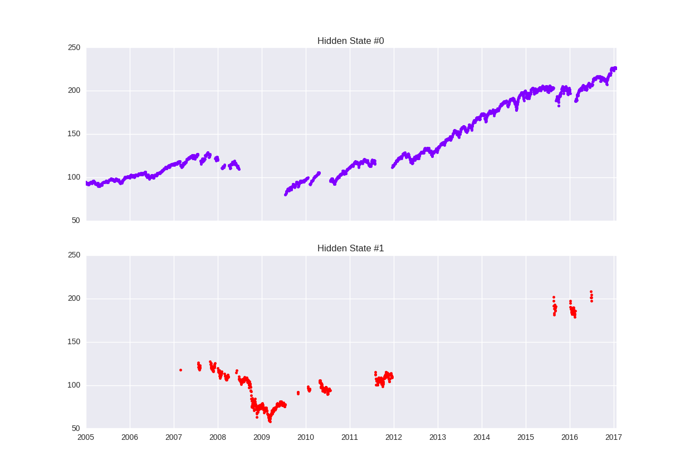

## Table of Contents

## What is market regime detection?

Market regime detection is a way to understand and predict how the stock market is behaving at different times. It helps investors figure out if the market is going up, going down, or staying the same. By looking at patterns and trends in the market, investors can decide the best times to buy or sell stocks. This can help them make smarter choices and possibly earn more money.

There are different ways to detect market regimes. Some people use math and computer programs to look at lots of data and find patterns. Others might look at news and events happening around the world to see how they affect the market. No matter the method, the goal is the same: to understand the current state of the market and use that knowledge to make better investment decisions.

## Why is market regime detection important for investors?

Market regime detection is important for investors because it helps them understand what's happening in the market right now. By knowing if the market is going up, going down, or staying the same, investors can make better decisions about when to buy or sell stocks. This can help them avoid losing money and possibly make more money. For example, if the market is going up, it might be a good time to buy stocks, but if it's going down, it might be better to wait or sell.

Understanding market regimes also helps investors plan for the future. If they can predict how the market might change, they can adjust their investment strategies accordingly. This means they can be ready for different situations, like a market crash or a big boom. By being prepared, investors can feel more confident and make choices that match their goals, whether they want to grow their money quickly or keep it safe over time.

## What are the different types of market regimes?

Market regimes can be thought of as different states that the market can be in. There are usually four main types of market regimes: bull markets, bear markets, sideways markets, and transition periods. A bull market is when stock prices are going up and people are feeling good about investing. It's a time when many investors want to buy stocks because they think the prices will keep going up. On the other hand, a bear market is when stock prices are going down and people are worried. During a bear market, investors might want to sell their stocks or wait before buying new ones.

A sideways market, also called a range-bound market, is when stock prices don't go up or down much. They just move sideways within a certain range. This can be a good time for investors who like to buy low and sell high within that range. Lastly, transition periods are times when the market is changing from one regime to another. These can be tricky because it's hard to know exactly when the market will fully switch to a new regime. Investors need to be careful and watch the market closely during these times to make the best decisions.

## How can historical data be used to identify market regimes?

Historical data is really helpful for figuring out what kind of market regime we're in. By looking at past stock prices, trading volumes, and other numbers, we can spot patterns that tell us if the market was in a bull, bear, sideways, or transition period. For example, if we see that stock prices went up a lot over a long time, that was probably a bull market. If prices kept going down, that was likely a bear market. By studying these patterns, investors can see how the market behaved in the past and use that to guess what might happen next.

One way to use historical data is by using math and computer programs to analyze it. These programs can look at tons of data really fast and find trends that might be hard for a person to see. They can also help predict when the market might change from one regime to another. Another way is by looking at what was happening in the world at the time, like big news events or changes in the economy. By connecting these events to what the market was doing, investors can better understand why the market moved the way it did. This can help them make smarter choices about when to buy or sell stocks.

## What are the common indicators used in market regime detection?

Common indicators used in market regime detection include moving averages, [volatility](/wiki/volatility-trading-strategies) measures, and economic indicators. Moving averages, like the 50-day or 200-day moving average, help investors see the general trend of the market over time. If the price of a stock is above its moving average, it might be in a bull market, and if it's below, it might be in a bear market. Volatility measures, like the VIX (Volatility Index), show how much the market is moving up and down. High volatility can signal a transition period or a bear market, while low volatility might mean the market is in a sideways or bull market.

Economic indicators also play a big role. Things like GDP growth, unemployment rates, and inflation can tell investors a lot about the health of the economy, which affects the market. For example, strong GDP growth and low unemployment might mean the market is in a bull regime. On the other hand, high inflation or rising unemployment could signal a bear market. By watching these indicators, investors can get a better idea of what kind of market regime they're in and make more informed decisions about their investments.

## How does machine learning enhance market regime detection?

Machine learning makes market regime detection better by looking at a lot of data quickly and finding patterns that people might miss. It can learn from past market data to see what happened during different regimes. For example, [machine learning](/wiki/machine-learning) can look at stock prices, trading volumes, and economic indicators to figure out if the market was in a bull, bear, or sideways period. By doing this, it can help investors predict what might happen next and make smarter choices about when to buy or sell stocks.

Another way machine learning helps is by adjusting to new information all the time. The market changes, and new data comes in every day. Machine learning models can update themselves with this new data, so they keep getting better at spotting market regimes. This means investors can have more up-to-date information to guide their decisions. Overall, machine learning makes market regime detection more accurate and helpful, which can lead to better investment results.

## What are the challenges in accurately detecting market regimes?

Detecting market regimes can be hard because the market is always changing and can be unpredictable. Sometimes, the market might seem like it's in one regime, but then it changes quickly. This can make it tough for investors to know if they're looking at a bull, bear, or sideways market. Also, there's a lot of data to look at, like stock prices, trading volumes, and economic indicators. It can be hard to figure out which pieces of data are the most important for understanding the current market regime.

Another challenge is that different people might see the same data in different ways. What one investor thinks is a bull market, another might think is a transition period. This can lead to different decisions and different results. Plus, machine learning and other tools can help, but they're not perfect. They can make mistakes or miss important changes in the market. So, even with all the help from technology, detecting market regimes accurately is still a tricky task that requires careful thought and attention.

## Can market regime detection be applied to different asset classes?

Yes, market regime detection can be used for different types of investments, not just stocks. It can help with things like bonds, commodities, and even real estate. The idea is the same: to figure out if the market for these assets is going up, going down, or staying the same. By understanding the current state of the market for a particular asset class, investors can make better choices about when to buy or sell, no matter what they're investing in.

For example, in the bond market, market regime detection can help investors see if interest rates are going up or down, which affects bond prices. In the commodities market, like gold or oil, it can show if prices are trending up or down due to supply and demand changes. Even in real estate, understanding market regimes can help investors know if it's a good time to buy or sell properties based on local market conditions. By using market regime detection across different asset classes, investors can have a clearer picture of the whole investment landscape and make more informed decisions.

## How do market regime shifts impact investment strategies?

When the market changes from one regime to another, like from a bull market to a bear market, it can really affect how investors plan their moves. If the market is going up, investors might want to buy more stocks to take advantage of the rising prices. But if the market starts going down, they might need to sell some stocks or move their money to safer places like bonds or cash. Knowing when these shifts happen helps investors pick the right time to make these changes, so they can protect their money or make more of it.

Market regime shifts also make investors think about their long-term plans. If they see a bull market coming, they might decide to take more risks to grow their money faster. But if a bear market is on the way, they might choose to be more careful and focus on keeping their money safe. By understanding these shifts, investors can adjust their strategies to match what's happening in the market, helping them reach their financial goals no matter what the market does.

## What are some popular models or algorithms used for market regime detection?

Some popular models for market regime detection include Hidden Markov Models (HMMs) and clustering algorithms like K-means. HMMs are good at figuring out hidden patterns in data. They can look at stock prices and other market numbers to see if the market is in a bull, bear, or sideways period. They do this by guessing what the market might do next based on what it did before. K-means, on the other hand, groups similar data points together. It can help find groups of data that show different market regimes, making it easier to see when the market changes from one regime to another.

Another common approach is using machine learning algorithms like Random Forests and Support Vector Machines (SVMs). Random Forests are good at looking at lots of different pieces of data at the same time, like stock prices, trading volumes, and economic indicators. They can figure out which pieces of data are most important for telling what kind of market regime we're in. SVMs are great at drawing lines between different groups of data. They can help separate data that shows a bull market from data that shows a bear market. By using these models, investors can get a better idea of the current market regime and make smarter choices about their investments.

## How can one validate the effectiveness of a market regime detection model?

To check if a market regime detection model works well, you need to test it with old data first. This means you take data from the past, like stock prices and economic numbers, and see if the model can correctly say what kind of market regime was happening back then. If the model gets it right most of the time, that's a good sign. You can also try using different sets of old data to make sure the model isn't just good at guessing one specific time period. This way, you can see if the model really understands the market or if it's just lucky.

Another way to see if the model is good is by comparing it to other models or to what people think. If your model does better than other models or matches what experts say about the market, that's a good sign. It's also important to keep watching the model as new data comes in. If it keeps getting things right over time, you can trust it more. But if it starts making mistakes, you might need to fix it or try a different model. By doing these checks, you can feel more sure that your market regime detection model is helping you make smart investment choices.

## What future developments can we expect in the field of market regime detection?

In the future, market regime detection will likely get even better thanks to new technology. One big change we might see is the use of more advanced [artificial intelligence](/wiki/ai-artificial-intelligence) (AI) and machine learning. These tools can look at huge amounts of data really quickly and find patterns that people might miss. They can also learn from new data as it comes in, so they keep getting better over time. This means that investors could have even more accurate predictions about what the market will do next, helping them make smarter choices about when to buy or sell.

Another thing that could happen is that market regime detection might start using more types of data. Right now, it mostly looks at things like stock prices and economic numbers. But in the future, it might also use data from social media, news articles, and even satellite images to get a fuller picture of what's happening in the world. By looking at all this information together, market regime detection could become even more powerful. This would help investors understand not just what the market is doing, but why it's doing it, leading to better investment strategies.

## References & Further Reading

[1]: Rabiner, L. R. (1989). ["A tutorial on Hidden Markov Models and selected applications in speech recognition."](https://ieeexplore.ieee.org/document/18626/?arnumber=18626) Proceedings of the IEEE, 77(2), 257-286.

[2]: Baum, L. E., Petrie, T., Soules, G., & Weiss, N. (1970). ["A maximization technique occurring in the statistical analysis of probabilistic functions of Markov chains."](https://www.semanticscholar.org/paper/A-Maximization-Technique-Occurring-in-the-Analysis-Baum-Petrie/3092a4929bdb3d6a8fe53f162586b7431b5ff8a4) The Annals of Mathematical Statistics, 41(1), 164-171.

[3]: Fraley, C., & Raftery, A. E. (2002). ["Model-based clustering, discriminant analysis, and density estimation."](https://www.stat.washington.edu/raftery/Research/PDF/fraley2002.pdf) Journal of the American Statistical Association, 97(458), 611-631.

[4]: Chinco, A., & Shapiro, A. H. (2020). ["The cross-section of expected stock returns: What have we learned from new methods?"](https://www.jstor.org/stable/pdf/26752819.pdf) National Bureau of Economic Research Working Paper No. 26721.

[5]: Murphy, K. P. (2002). ["Dynamic Bayesian Networks: Representation, Inference and Learning."](https://www.semanticscholar.org/paper/Dynamic-bayesian-networks%3A-representation%2C-and-Murphy-Russell/5e86e17d83c97dafa3413d1d0dae219bd527ed61) PhD thesis, University of California, Berkeley.

[6]: Alexander, C. (2001). ["Market Models: A Guide to Financial Data Analysis."](https://www.casact.org/sites/default/files/old/marketmodels.pdf) John Wiley & Sons.

[7]: Lopez de Prado, M. (2018). ["Advances in Financial Machine Learning."](https://www.amazon.com/Advances-Financial-Machine-Learning-Marcos/dp/1119482089) Wiley.

[8]: Tsay, R. S. (2010). ["Analysis of Financial Time Series."](https://onlinelibrary.wiley.com/doi/book/10.1002/9780470644560) Wiley Series in Probability and Statistics.