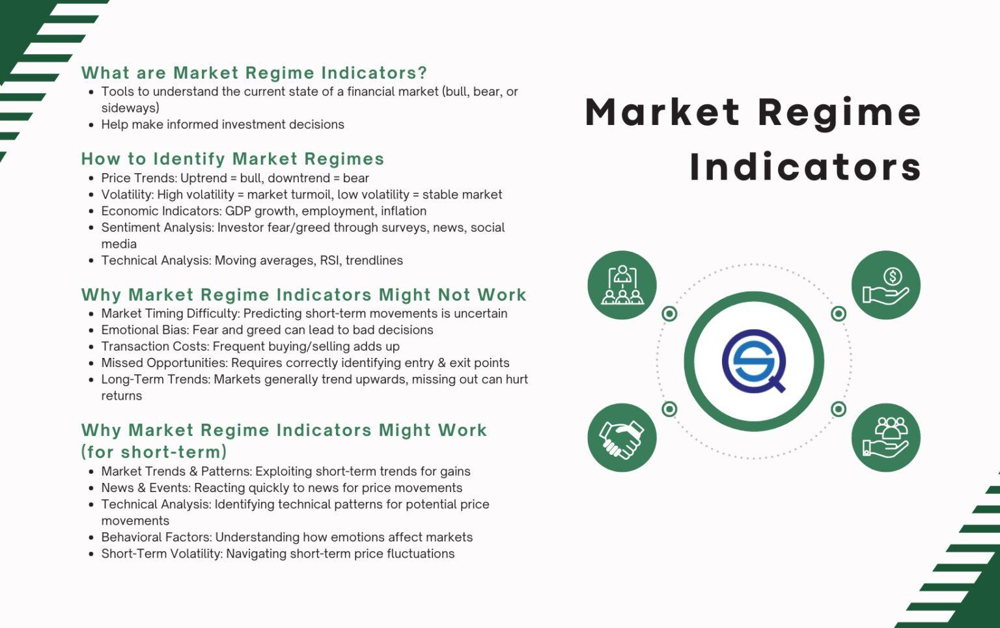

## Table of Contents

## What is a market regime?

A market regime is a period of time where the stock market behaves in a certain way. It's like the market has its own seasons, where it might be going up a lot, staying the same, or going down. These regimes can last for months or even years and are influenced by things like the economy, interest rates, and what people feel about the future.

Understanding market regimes is important for investors because it helps them make better decisions. If they know the market is in a "bull" regime, where prices are going up, they might decide to buy more stocks. But if it's in a "bear" regime, where prices are falling, they might want to be more careful or sell some of their stocks. Knowing the current market regime can help investors adjust their strategies to do better over time.

## How can you identify different market regimes?

To identify different market regimes, you need to look at how the market is behaving over time. One way to do this is by watching the overall trend of the market. If the market is going up steadily for a long time, it might be in a bull regime. If it's going down, it could be in a bear regime. You can also look at how much the market is moving up and down. If it's moving a lot, it might be in a volatile regime. If it's not moving much, it could be in a stable regime.

Another way to spot market regimes is by looking at economic indicators. Things like unemployment rates, inflation, and interest rates can give you clues about what's happening in the market. For example, if the economy is doing well and people are spending more money, it might signal a bull regime. On the other hand, if the economy is struggling and people are worried about their jobs, it might mean a bear regime is coming. By keeping an eye on these indicators, you can get a better sense of the current market regime.

Lastly, you can use technical analysis to help identify market regimes. This involves looking at charts and using tools like moving averages and trend lines to see patterns in the market. For instance, if the market is consistently above its moving average, it might be in a bull regime. If it's below, it could be in a bear regime. By combining these different methods, you can get a clearer picture of the market regime and make smarter investment choices.

## What are the common types of market regimes?

There are four common types of market regimes: bull, bear, volatile, and stable. A bull market is when stock prices are going up for a long time. People feel good about the economy and are buying more stocks. A bear market is the opposite, where stock prices are falling for a while. People are worried and might be selling their stocks.

A volatile market is when the prices move up and down a lot, and it's hard to predict what will happen next. This can be scary for some investors but exciting for others. A stable market is when the prices don't change much. It's calmer, and people might feel more confident about their investments.

Understanding these market regimes can help you make better choices with your money. If you know the market is in a bull regime, you might want to buy more stocks. But if it's in a bear regime, you might want to wait or sell some stocks. By keeping an eye on the market, you can adjust your plans to do better over time.

## How do market regimes affect investment strategies?

Market regimes can really change how you invest your money. If the market is in a bull regime, where prices are going up, you might want to buy more stocks. This is because you think the prices will keep going up and you can make more money. But you have to be careful not to buy too much, because if the market changes, you could lose money. On the other hand, if the market is in a bear regime, where prices are going down, you might want to sell some of your stocks or not buy any new ones. This way, you can avoid losing money if the prices keep falling.

Volatile and stable market regimes also affect how you invest. In a volatile market, where prices are moving a lot, you might want to be more careful. You could use strategies like buying and selling quickly to make money from the big price swings. But this can be risky, so some people might choose to wait it out. In a stable market, where prices don't change much, you might feel more comfortable buying stocks and holding onto them for a long time. This is because you think the market will stay calm and your investments will be safe. By understanding the market regime, you can pick the best way to invest your money and do well over time.

## What are the key indicators used to determine market regimes?

Key indicators used to determine market regimes include economic data like unemployment rates, inflation, and interest rates. If the unemployment rate is low and people are [earning](/wiki/earning-announcement) more money, it might signal a bull regime where the market is going up. On the other hand, if inflation is high and interest rates are rising, it could mean a bear regime is coming, where the market might go down. These economic indicators help investors understand the health of the economy and make better decisions about their investments.

Another important indicator is the overall trend of the stock market itself. If stock prices are going up steadily over time, it's a sign of a bull regime. But if prices are falling for a while, it suggests a bear regime. You can also look at how much the market is moving up and down. If it's moving a lot, it might be in a volatile regime, and if it's not moving much, it could be in a stable regime. By watching these trends, investors can get a sense of the current market regime and adjust their strategies accordingly.

Technical analysis tools like moving averages and trend lines are also useful for identifying market regimes. If the market is consistently above its moving average, it might be in a bull regime. If it's below, it could be in a bear regime. These tools help investors see patterns in the market and make predictions about where it might be headed. By combining these different indicators, investors can better understand the market regime and make smarter investment choices.

## How do market regimes transition from one to another?

Market regimes change from one to another because of many things happening in the economy and the world. A bull market can turn into a bear market if people start to worry about the economy. Maybe there are more people losing their jobs, or prices are going up too fast. When this happens, people might start selling their stocks because they think the prices will keep going down. On the other hand, a bear market can turn into a bull market if the economy starts to get better. If people feel more confident and start spending more money, stock prices might start going up again.

The change from a volatile market to a stable one, or the other way around, can also happen because of big events. If there's a lot of uncertainty, like a big election or a war, the market might become more volatile. Prices can go up and down a lot because people don't know what will happen next. But if things calm down and people feel more sure about the future, the market might become more stable. Prices won't move as much, and people might feel safer about their investments. By watching these changes, investors can adjust their plans to do better over time.

## What historical examples illustrate shifts in market regimes?

One big example of a shift in market regimes was the dot-com bubble in the late 1990s and early 2000s. At first, the market was in a bull regime. Everyone was excited about new internet companies, and stock prices kept going up. People were buying stocks left and right, thinking the prices would keep rising. But then, in 2000, the bubble burst. People realized that many of these companies weren't making money, and they started selling their stocks. This caused the market to shift into a bear regime, where stock prices fell a lot. It took years for the market to recover from this big change.

Another example is the 2008 financial crisis. Before the crisis, the market was in a bull regime. Housing prices were going up, and people were borrowing a lot of money to buy homes. Banks were making lots of loans, and the stock market was doing well. But then, people started defaulting on their loans, and the housing market crashed. This led to a big shift into a bear regime. Stock prices fell a lot, and many people lost their jobs. The market stayed in this bear regime for a while until the government stepped in with help, and slowly, things started to get better. These examples show how quickly market regimes can change and how important it is for investors to pay attention to what's happening in the economy.

## How do global economic factors influence market regimes?

Global economic factors can really change how the stock market behaves. Things like what's happening in other countries' economies, big world events, and even changes in trade rules can make the market go up or down. For example, if a big country like China is doing well, it might make people feel more confident about the world economy, and that can push the market into a bull regime. But if there's a big problem, like a war or a global health crisis, it can make people worried and cause the market to shift into a bear regime.

Also, things like changes in oil prices or currency values can shake up the market. If oil prices go up a lot, it can make businesses spend more money, and that might hurt the economy and push the market into a bear regime. On the other hand, if the value of the dollar goes down compared to other currencies, it can make American products cheaper for other countries to buy, which might help the economy and lead to a bull regime. By watching these global factors, investors can get a better idea of where the market might be headed and adjust their plans accordingly.

## What are the challenges in predicting changes in market regimes?

Predicting changes in market regimes is hard because the market is always changing and influenced by so many things. It's like trying to guess the weather, but instead of rain and sunshine, you're trying to figure out if the market will go up or down. Economic reports, world events, and even what people are feeling about the future can all make the market move in different ways. Sometimes, these things can surprise everyone, and the market can change suddenly, making it tough to predict what will happen next.

Another challenge is that the market doesn't always follow the rules. Sometimes, even when everything seems to be going well, the market can still fall, or when things look bad, it can rise. This is because people's feelings and decisions can be hard to predict. Also, new information can come out that no one expected, like a new law or a big company going bankrupt, and that can change the market regime quickly. So, while we can use tools and data to make guesses, predicting market regimes is never an exact science.

## How can advanced statistical models help in analyzing market regimes?

Advanced statistical models can help in analyzing market regimes by looking at a lot of data at once and finding patterns that might be hard to see otherwise. These models can take in information like stock prices, economic reports, and even what people are saying on social media. By using fancy math, they can figure out if the market is in a bull, bear, volatile, or stable regime. They can also help predict when the market might change from one regime to another by looking at how things are moving now and how they moved in the past.

Using these models can give investors a better idea of what's happening in the market and what might happen next. But even with all this help, it's important to remember that the market can still surprise us. The models are really good at finding patterns and making guesses, but they're not perfect. So, while they can be a big help, investors should still be careful and think about other things too, like big world events or changes in the law, when making their decisions.

## What role do market regimes play in portfolio management and asset allocation?

Market regimes are really important for managing your investments and deciding where to put your money. If you know the market is in a bull regime, where prices are going up, you might want to put more of your money into stocks. This is because you think the prices will keep going up and you can make more money. But if the market is in a bear regime, where prices are falling, you might want to be more careful. You could move some of your money into safer investments like bonds or cash, so you don't lose as much if the market keeps going down.

Understanding market regimes also helps you decide how to spread your money around. In a volatile market, where prices are moving a lot, you might want to have a mix of different types of investments. This way, if one type of investment goes down, another might go up, and you can balance out your risks. In a stable market, where prices don't change much, you might feel more comfortable putting more money into stocks and holding onto them for a long time. By keeping an eye on the market regime, you can adjust your investments to do better over time.

## How do different market regimes impact various asset classes differently?

Different market regimes can affect stocks, bonds, and other types of investments in different ways. In a bull market, where stock prices are going up, stocks usually do really well. People feel good about the economy and are buying more stocks, which pushes the prices higher. But in a bear market, where stock prices are falling, stocks can lose a lot of value. People are worried and might be selling their stocks, which makes the prices go down even more. Bonds, on the other hand, can be a safer bet during a bear market. They don't go up as much in a bull market, but they can help protect your money when stocks are falling.

In a volatile market, where prices are moving a lot, different types of investments can be all over the place. Stocks might go up and down quickly, and it can be hard to predict what will happen next. Some people might try to make money from these big swings by buying and selling quickly, but it's risky. Bonds can be a bit more stable, but they can still move around. In a stable market, where prices don't change much, stocks might not go up as fast as in a bull market, but they're less likely to fall a lot. Bonds can be a good choice here too, because they're usually steady and can provide a steady income. By understanding how different market regimes affect different types of investments, you can make smarter choices about where to put your money.

## How can you tailor your trading strategy to different market regimes?

Tailoring trading strategies to fit distinct market regimes is essential for maximizing trading efficacy. In bull markets, where optimism prevails and asset prices soar, trend-following strategies prove advantageous. Traders capitalize on upward [momentum](/wiki/momentum) by employing moving average crossovers or relative strength index (RSI) indications to identify buy signals. Specifically, when a short-term moving average (e.g., 50-day) crosses above a long-term moving average (e.g., 200-day), it may indicate a bullish trend continuation.

Conversely, bear markets, characterized by declining prices and pessimism, necessitate strategies like short-selling to profit from falling prices. Hedging tactics, using options or inverse funds, can also mitigate potential losses. Short-selling involves borrowing securities to sell at high prices, anticipating buying them back at lower prices to cover the positions. Calculating short-sale profitability can be expressed as:

$$
\text{Profit} = (\text{Sell Price} - \text{Buyback Price}) \times \text{Number of Shares}
$$

Efficient markets, predicated on the Efficient Market Hypothesis, suggest asset prices already reflect all available information. In such conditions, active trading becomes less impactful, favoring passive strategies. Index funds and ETFs, which seek to replicate market indices, align well with this regime due to their low costs and reduced market timing risks.

Chaotic markets present a challenging landscape with heightened [volatility](/wiki/volatility-trading-strategies), often influenced by unforeseen economic shifts or geopolitical crises. Here, dynamic risk management is pivotal. High-frequency trading ([HFT](/wiki/high-frequency-trading-strategies)) can exploit fleeting [arbitrage](/wiki/arbitrage) opportunities, while risk mitigation strategies, like setting stop-loss orders, help preserve capital. Advanced algorithms, leveraging [machine learning](/wiki/machine-learning), can enhance decision-making by rapidly analyzing real-time data.

To thrive across varying regimes, traders must maintain a versatile strategy arsenal. An adaptable approach ensures readiness for market transitions, which may not always present clear signals. For instance, a shift from a bull to a bear market might be subtle, marked by incremental increases in volatility. By utilizing a combination of technical analysis tools—moving averages, volatility indices like VIX, and sector rotation analysis—traders can refine entry and [exit](/wiki/exit-strategy) strategies.

Incorporating Python programming can further assist in tailoring strategies. Utilizing libraries such as pandas and NumPy allows historical data analysis, while libraries like TA-Lib enable integration of technical indicators:

```python
import pandas as pd
import talib

# Sample data: assume 'data' is a DataFrame with 'Close' prices
data['50_MA'] = talib.SMA(data['Close'], timeperiod=50)
data['200_MA'] = talib.SMA(data['Close'], timeperiod=200)

# Identifying trend-following signals
data['Signal'] = 0
data['Signal'][50:] = np.where(data['50_MA'][50:] > data['200_MA'][50:], 1, 0)
data['Position'] = data['Signal'].diff()
```

This script leverages moving averages to generate trading signals, elucidating a strategy aligning with bullish conditions. The adaptability of such tools underpins successful navigation through the four market regimes, ensuring traders capitalize on opportunities and adeptly manage risks.

## References & Further Reading

[1]: Fernandez, V. (2016). ["Risk Management and the Real-time Identification of Different Trading Regimes."](https://www.scribd.com/document/468189465/Fernandez-et-al-2016-Impact-of-quality-management) American Economic Review, 106(4), 1234-1258.

[2]: ["Advances in Financial Machine Learning"](https://www.amazon.com/Advances-Financial-Machine-Learning-Marcos/dp/1119482089) by Marcos Lopez de Prado

[3]: Mu, X., & Allen, D. E. (2017). ["Market Regime Detection using Volatility Index Components and Macroeconomic Variables."](https://www.quantstart.com/articles/market-regime-detection-using-hidden-markov-models-in-qstrader/) Journal of Risk and Financial Management, 10(3), 8.

[4]: ["Quantitative Technical Analysis: An Integrated Approach to Trading System Development and Trading Management"](https://www.amazon.com/Quantitative-Technical-Analysis-integrated-development/dp/0979183855) by Howard B. Bandy

[5]: Jegadeesh, N., & Titman, S. (1993). ["Returns to Buying Winners and Selling Losers: Implications for Stock Market Efficiency."](https://www.bauer.uh.edu/rsusmel/phd/jegadeesh-titman93.pdf) Journal of Finance, 48(1), 65-91.

[6]: Tsay, R. S. (2005). ["Analysis of Financial Time Series (Wiley Series in Probability and Statistics)."](https://onlinelibrary.wiley.com/doi/book/10.1002/9780470644560) 

[7]: Hsu, J. (2006). ["Cap-Weighted Portfolios are Sub-Optimal Portfolios."](https://papers.ssrn.com/sol3/papers.cfm?abstract_id=647001) Journal of Investment Management, 4(3), 52-63.

