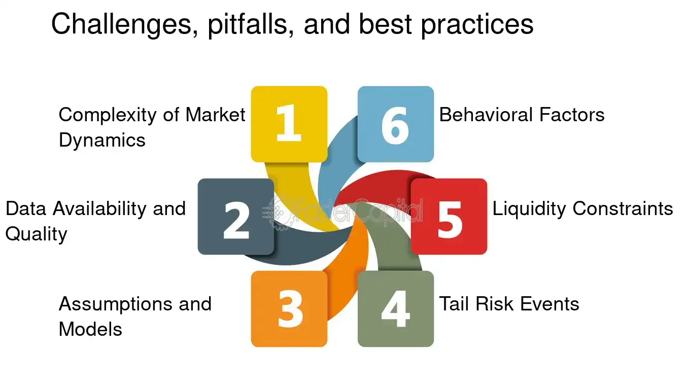

## Table of Contents

## What is market resilience?

Market resilience refers to how well a market can handle tough times and bounce back from problems. It's about how quickly a market can recover from things like economic downturns, natural disasters, or other big challenges. When a market is resilient, it means that businesses and people can keep going even when things get hard, and they can find new ways to do well.

A resilient market often has a lot of different kinds of businesses and industries. This variety helps because if one part of the market is struggling, other parts can still do well. For example, if a city's main industry is tourism and there's a big drop in visitors, a resilient market might have other strong industries like technology or manufacturing to help keep the economy stable. This mix makes the market stronger and better able to handle surprises and changes.

## Why is stress testing important for financial markets?

Stress testing is important for financial markets because it helps find out how strong they are when things get tough. It's like a practice run for bad times, where banks and other financial companies are tested to see if they can handle big problems like a financial crisis or a sudden drop in the economy. By doing these tests, we can see which parts of the market might be weak and need to be fixed before a real crisis happens. This helps keep the whole financial system safer and more stable.

These tests also help regulators and policymakers understand where they need to focus their efforts. If a stress test shows that many banks might fail in a certain kind of crisis, then rules and policies can be changed to make those banks stronger. This way, when a real crisis hits, the financial markets are better prepared and less likely to fall apart. Overall, stress testing is a key tool for making sure that financial markets can handle whatever challenges come their way.

## How do stress tests simulate market conditions?

Stress tests simulate market conditions by creating pretend scenarios where things go really bad. They use computers to model what might happen if there's a big economic crisis, like a housing market crash or a sudden drop in stock prices. These models look at lots of data and try to guess how banks and other financial companies would react. They check if these companies have enough money to keep going when times are tough.

The tests also look at different kinds of risks, like if a lot of people can't pay back their loans at the same time. They might pretend that interest rates go way up or that there's a big global event that hurts the economy. By running these pretend scenarios, stress tests help find out which parts of the financial system might be weak and need to be fixed. This way, everyone can work on making the market stronger and more ready for real problems.

## What are the key components of a stress test?

Stress tests have several key parts that help them work well. First, they need a set of scenarios that show what might happen if things go really bad. These scenarios could be things like a big drop in the stock market, a housing crisis, or a sudden rise in interest rates. The scenarios are made to test different kinds of risks, like if a lot of people can't pay back their loans at the same time. By using these scenarios, stress tests can see how banks and other financial companies would handle these tough times.

The second key part of a stress test is the data and models used to run the scenarios. Stress tests use a lot of information about banks, like how much money they have and what kinds of loans they've given out. This data is put into computer models that guess what might happen in the bad scenarios. These models help figure out if banks have enough money to keep going during a crisis. If the models show that some banks might not make it, then those banks need to fix their problems before a real crisis hits.

The third important part is the results and what they mean. After running the scenarios and models, stress tests give a report that shows which parts of the financial system might be weak. This report helps regulators and policymakers decide what needs to be done to make the market stronger. If the results show that many banks might fail in a certain kind of crisis, then rules can be changed to help those banks get ready. By looking at the results, everyone can work together to make the financial system more resilient.

## Can you explain the difference between scenario analysis and stress testing?

Scenario analysis and stress testing both look at what might happen to banks and financial markets in tough times, but they do it in different ways. Scenario analysis is like telling a story about the future. It looks at different possible futures and tries to guess what might happen in each one. For example, it might look at what would happen if interest rates went up a lot or if there was a big drop in the stock market. It helps people think about different possibilities and plan for them, but it doesn't focus on the worst-case scenarios.

Stress testing, on the other hand, is all about the worst-case scenarios. It's like a practice run for a big crisis. Stress tests use computers to model what would happen if there was a really bad economic situation, like a housing market crash or a sudden drop in the economy. The goal is to find out if banks and other financial companies can handle these tough times and still keep going. By focusing on these extreme situations, stress testing helps make sure the financial system is strong enough to survive big problems.

## How often should financial institutions conduct stress tests?

Financial institutions should conduct stress tests regularly, but how often can depend on rules from regulators and how risky their business is. In many countries, big banks have to do stress tests at least once a year. This helps make sure they are always ready for tough times and can fix any problems quickly.

For smaller banks or other financial companies, stress tests might not be needed as often. But it's still a good idea to do them every few years or when there are big changes in the economy or their business. This way, they can stay strong and be ready for any surprises that come their way.

## What are some common stress test scenarios used by banks?

Banks often use stress tests to see how they would handle really tough times. One common scenario is a big drop in the housing market. This test checks if the bank can still be okay if a lot of people can't pay back their home loans all at once. Another scenario is a sharp fall in the stock market, where the bank's investments lose a lot of value quickly. This helps see if the bank has enough money saved to keep going even when the stock market crashes.

Another common scenario is a sudden rise in interest rates. This test looks at what would happen if borrowing money suddenly became a lot more expensive. It checks if the bank can still make money and pay its bills when interest rates go up. Finally, banks also test for a big economic downturn, like a recession. This scenario sees if the bank can survive if the whole economy is struggling, and a lot of people and businesses can't pay back their loans.

## How do regulatory bodies use the results of stress tests?

Regulatory bodies use the results of stress tests to make sure banks and other financial companies are strong enough to handle tough times. When they see the results, they can tell which banks might have problems if there's a big economic crisis. This helps them decide if they need to make new rules or change old ones to make the banks stronger. For example, if a lot of banks fail the stress test, regulators might make them keep more money in reserve to be ready for bad times.

The results also help regulators keep an eye on the whole financial system. They can see where the weak spots are and work on fixing them before they cause big problems. By using stress test results, regulators can help make sure that the financial markets stay stable and safe, even when things get tough. This way, everyone can trust that the banks will be okay, no matter what happens in the economy.

## What are the limitations of current stress testing models?

Stress testing models have some problems that can make them less useful. One big problem is that they can't predict everything. They use past data and guesses about the future, but real life can be full of surprises. For example, a stress test might not be ready for a new kind of crisis that nobody has seen before, like a global health emergency. Also, these models can be really complicated, and sometimes they might miss important details or make wrong guesses about how people and businesses will act in a crisis.

Another issue is that stress tests can be too focused on certain scenarios and might not cover all the risks a bank could face. They often look at big, well-known problems like a housing market crash or a stock market drop, but they might not think about smaller, less obvious risks. This means that even if a bank passes a stress test, it could still have weak spots that the test didn't check. Plus, stress tests can be expensive and take a lot of time, so banks might not do them as often as they should, which can leave them less prepared for unexpected problems.

## How can stress testing be integrated into risk management strategies?

Stress testing can be a big help in risk management by showing banks and other financial companies where they might be weak. By running these tests, banks can see if they have enough money to handle tough times like a big drop in the stock market or a lot of people not paying back their loans. This helps them plan better and make sure they have enough cash saved up. If the stress test shows a problem, the bank can fix it before it turns into a real crisis. This way, stress testing becomes a key part of making sure the bank stays strong and safe.

To use stress testing in risk management, banks should do these tests regularly, like once a year or when big changes happen in the economy. They should also look at the results carefully and use them to make their plans better. For example, if a stress test shows that the bank might have trouble if interest rates go up a lot, the bank can start saving more money or change how it lends money to be ready for that. By making stress testing a normal part of their risk management, banks can stay ahead of problems and keep their customers' money safe.

## What advanced techniques are used in stress testing to predict market resilience?

Advanced stress testing uses computer models that can look at a lot of information at once to guess what might happen in the future. These models use things like [machine learning](/wiki/machine-learning) and big data to make their guesses more accurate. Machine learning can help find patterns in how the market has acted before and use those patterns to predict what might happen next. Big data means using a lot of information from different places, like how much people are borrowing, what's happening in the stock market, and even news about the economy. By putting all this information together, these advanced models can give a better idea of how strong the market might be when things get tough.

Another technique is called reverse stress testing. This is when banks and financial companies start with the end in mind—they think about what would make them fail and then work backward to see what would need to happen to get to that point. This helps them find hidden risks that normal stress tests might miss. For example, if a bank figures out that a sudden drop in a certain industry could make it fail, it can take steps to protect itself from that risk. By using these advanced techniques, banks can get a fuller picture of their risks and make better plans to stay strong no matter what happens in the market.

## How do global economic factors influence the design of stress tests?

Global economic factors play a big role in how stress tests are made. When banks design these tests, they look at what's happening around the world, like if there's a problem in a big country's economy or if there are changes in global trade. For example, if there's a big drop in oil prices, banks might include a scenario where that happens to see how it would affect them. They also think about things like inflation rates and currency changes because these can make a big difference in how much money they have and how much their loans are worth. By including these global factors, stress tests can be more realistic and help banks get ready for problems that might come from far away.

Another way global economic factors influence stress tests is by making them more detailed. Banks might use information from international markets to create different scenarios that could happen. For instance, if there's a big financial crisis in Europe, banks in other countries might include that in their stress tests to see how it could hurt them. They also pay attention to global rules and what other countries are doing to make sure their tests match up with what's happening worldwide. This helps make sure that the stress tests are not just about what's happening at home but also about what's going on everywhere, which is important because the world's economies are all connected.

## What are the steps to conduct effective stress testing?

Conducting stress testing in [algorithmic trading](/wiki/algorithmic-trading) involves the development and analysis of diverse market scenarios to evaluate the resilience of trading strategies. This process begins with the formulation of scenarios that reflect both historical market events and hypothetical situations, including geopolitical tensions or unexpected policy changes.

The first step in effective stress testing is the creation of these market scenarios. Historical events, such as the 2008 financial crisis, serve as crucial benchmarks for understanding how market conditions can rapidly deteriorate. Traders should also consider hypothetical scenarios that might involve extreme market [volatility](/wiki/volatility-trading-strategies) or unforeseen macroeconomic events.

Setting up appropriate indicators is critical to quickly detect stress signals and allow traders to adapt their strategies in real time. Common indicators used include measures such as moving averages, volatility indices, and [liquidity](/wiki/liquidity-risk-premium) metrics. These indicators help in assessing the immediate impact of stress scenarios on trading portfolios, enabling timely decision-making to mitigate risks.

Evaluation metrics are essential for quantifying the impact of stress scenarios. Metrics such as maximum drawdown, Value at Risk (VaR), and margin call risks provide comprehensive insights into the potential losses under adverse conditions. Maximum drawdown measures the largest peak-to-trough decline before a new peak is attained, offering a perspective on the worst-case loss scenario. Value at Risk estimates the potential loss in value of a trading portfolio over a defined period for a given confidence interval, allowing traders to understand the likelihood of portfolio performance under stress. It's typically calculated as:

$$
\text{VaR}_{\alpha} = \mu + \sigma \times Z_{\alpha}
$$

where $\mu$ is the mean return, $\sigma$ is the standard deviation of returns, and $Z_{\alpha}$ is the Z-score corresponding to the confidence level $\alpha$.

Advanced analytical tools greatly enhance the capability to conduct stress testing. Platforms like LuxAlgo offer functionalities to model complex scenarios and perform real-time analyses. With these tools, traders can simulate trading operations under a variety of stress conditions and obtain actionable insights on strategy performance.

To ensure the effectiveness of stress testing, it is advisable to follow a structured approach. Begin with scenario development, followed by the setting up of stress indicators and defining evaluation metrics. Incorporating advanced tools can streamline this process, making it possible to execute stress tests with higher precision and derive data-driven insights.

By systematically applying these steps, traders can optimize their trading strategies, ensuring that they not only survive but thrive amid fluctuating market conditions.

## How can one analyze and interpret stress test results?

Analyzing stress test results is crucial for identifying specific vulnerabilities within trading strategies. This process aids traders in pinpointing areas needing immediate attention and making necessary adjustments to enhance strategy resilience. Several performance metrics are pivotal in this analysis:

1. **Maximum Drawdown**: This metric measures the peak-to-trough decline in a trading portfolio, providing insights into the potential risks of significant losses over a specified period. A higher maximum drawdown indicates greater vulnerability to market downturns and necessitates strategy refinement.
$$
   \text{Maximum Drawdown} = \max \left( \frac{\text{Portfolio Peak Value} - \text{Lowest Value After Peak}}{\text{Portfolio Peak Value}} \right)

$$

2. **Sharpe Ratio**: This metric evaluates risk-adjusted return, offering a measure of portfolio performance by considering both return and volatility. A low Sharpe ratio may imply the need for better risk management practices.
$$
   \text{Sharpe Ratio} = \frac{R_p - R_f}{\sigma_p}

$$

   where $R_p$ is the average portfolio return, $R_f$ is the risk-free rate, and $\sigma_p$ is the standard deviation of portfolio return.

3. **Win/Loss Ratios**: This involves comparing the number of profitable trades to losing trades. A poor win/loss ratio suggests potential weaknesses in strategy execution and may require strategic adjustments.

Modern platforms can automate the analysis process, providing insights and suggesting optimizations for trading strategies. These platforms analyze data collected from stress tests and may recommend adjustments such as reallocation of assets or refined entry and [exit](/wiki/exit-strategy) signals to improve the strategy's resilience against market fluctuations.

Effective analysis of stress test data allows traders to adapt their strategies proactively, catering to expected future market uncertainties. Automated insights can guide strategic adjustments by pinpointing the exact parameters that help in achieving enhanced stability and profitability.

In conclusion, interpreting the outcomes from stress testing aids in anticipating market shocks more effectively. By continually refining trading strategies based on these results, traders can forge robust approaches capable of weathering unforeseen financial disruptions.

## References & Further Reading

[1]: Lopez de Prado, M. (2018). ["Advances in Financial Machine Learning."](https://www.amazon.com/Advances-Financial-Machine-Learning-Marcos/dp/1119482089) Wiley.

[2]: Aronson, D. R. (2006). ["Evidence-Based Technical Analysis: Applying the Scientific Method and Statistical Inference to Trading Signals."](https://www.amazon.com/Evidence-Based-Technical-Analysis-Scientific-Statistical/dp/0470008741) Wiley.

[3]: Jansen, S. (2020). ["Machine Learning for Algorithmic Trading: Predictive Models to Extract Signals from Market and Alternative Data for Systematic Trading Strategies with Python."](https://github.com/stefan-jansen/machine-learning-for-trading) Packt Publishing.

[4]: Chan, E. P. (2009). ["Quantitative Trading: How to Build Your Own Algorithmic Trading Business."](https://github.com/ftvision/quant_trading_echan_book) Wiley.

[5]: Kupiec, P. H. (1995). ["Techniques for Verifying the Accuracy of Risk Measurement Models."](https://papers.ssrn.com/sol3/papers.cfm?abstract_id=6697) Journal of Derivatives, 3(2), 73-84.

[6]: Duffie, D., & Singleton, K. J. (1999). ["Modeling Term Structures of Defaultable Bonds."](https://academic.oup.com/rfs/article-abstract/12/4/687/1578719) The Review of Financial Studies, 12(4), 687-720.