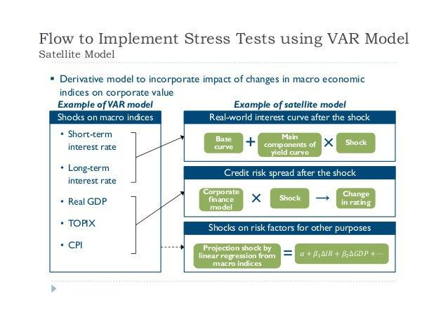

Algorithmic trading has become a mainstay in the financial markets, offering opportunities to execute complex strategies with speed and precision. As market dynamics grow increasingly unpredictable, the concepts of market resilience and stress testing have emerged as essential components for ensuring the stability and efficacy of trading systems. Stress testing, in particular, is instrumental for traders in understanding how their algorithmic strategies would fare under extreme and unforeseen conditions.

By mimicking historical market events and constructing hypothetical adverse scenarios, stress testing serves as a diagnostic tool that reveals possible weaknesses within trading strategies. This process allows traders to identify vulnerable areas and devise tactics to address these vulnerabilities proactively. Effective stress testing not only highlights potential pitfalls but also provides a blueprint for enhancing strategies to better withstand future market disruptions.



As the financial landscape continues to evolve with increasing complexity, understanding market resilience becomes critical for traders. It involves more than just acknowledging possible risks; it necessitates developing strategies that can secure portfolios against unexpected market shocks. Incorporating stress testing into the fabric of algorithmic trading processes is vital for maintaining both operational stability and optimal performance.

This introduction underscores the importance of stress testing in algorithmic trading and sets the stage for a detailed examination of its essential aspects. By doing so, it lays the groundwork for further exploration into methodologies that traders can employ to ensure strategy robustness and market resilience.

## Table of Contents

## Understanding Market Resilience

Market resilience is a fundamental characteristic of trading strategies and portfolios that emphasizes their ability to withstand and recover from extreme market conditions. The importance of market resilience is magnified during periods of high volatility and adverse economic events, which can otherwise lead to catastrophic losses for traders. 

Constructing resilient trading strategies necessitates a focus on several critical factors. Diversification is paramount; it involves spreading investments across various assets and markets to reduce the risk associated with any single asset class's poor performance. The principle of diversification is closely linked to the risk management practice that aims to optimize the trade-off between risk and return. Traders can employ risk management techniques such as stop-loss orders, position sizing, and risk-reward assessments to mitigate potential losses.

Adaptive trading algorithms further enhance market resilience by dynamically adjusting to evolving market conditions. These algorithms continuously analyze market data, detect patterns, and make informed decisions that bolster the strategy’s robustness against unforeseen market shifts.

To evaluate the resilience of trading strategies, it is essential to analyze historical stress scenarios. Historical data provides insights into how trading strategies have performed under past market stresses, such as the 2008 financial crisis. By understanding these patterns, traders can anticipate and prepare for potential market disruptions. Additionally, considering hypothetical market scenarios, such as geopolitical tensions or sudden [liquidity](/wiki/liquidity-risk-premium) crises, helps in further assessing a strategy’s resilience.

This foundational understanding of market resilience sets the stage for the role of stress testing in fortifying trading strategies. Stress testing enables traders to simulate extreme conditions and evaluate how their strategies would perform, ensuring continued stability and performance across diverse market landscapes.

## The Essentials of Stress Testing in Algo Trading

Stress testing is an essential mechanism for evaluating the robustness of trading algorithms under simulated extreme market conditions. Unlike standard [backtesting](/wiki/backtesting), which evaluates strategies against typical historical data, stress testing emphasizes potential worst-case scenarios, such as market crashes or liquidity shortages. This approach allows traders to identify weaknesses within their strategies, thus enhancing risk identification and mitigation efforts.

Stress testing involves subjecting trading algorithms to rare and volatile events to uncover vulnerabilities that would not be evident under normal market conditions. By focusing on extreme scenarios, traders can assess how their strategies might behave under significant market pressure. This process is crucial in ensuring that strategies are not only profitable under normal circumstances but also resilient during periods of unexpected turmoil.

Key benefits of stress testing include improved crisis preparedness, which enables traders to devise contingency plans for adverse events. This preparedness translates into greater confidence when executing trades, knowing that potential strategy weaknesses have been identified and addressed. Furthermore, stress testing leads to risk-adjusted strategy enhancements, allowing for more informed decisions in altering or reinforcing specific components of trading algorithms to better withstand market stressors.

Stress testing also contributes to robust portfolio protection by evaluating how potential vulnerabilities could affect overall portfolio performance. By analyzing the results of stress tests, traders can make adjustments to diversify their holdings, thereby reducing the risk of substantial financial losses during market downturns. 

In terms of technical execution, stress testing can utilize historical event data or hypothetical scenarios crafted to mimic extreme conditions. Advanced methodologies such as Monte Carlo simulations can be beneficial. For instance, simulating a series of random but extreme price movements can reveal how an algorithm might perform under continuous adverse conditions. Here's a simple example of how a Monte Carlo simulation can be implemented in Python:

```python
import numpy as np

# Simulate extreme market conditions
np.random.seed(42)
returns = np.random.normal(0, 1, 1000)  # Simulated returns

# Apply stress test using Monte Carlo approach
def monte_carlo_sim(initial_investment, returns, iterations=5000):
    results = []
    for _ in range(iterations):
        simulated_path = initial_investment
        for r in returns:
            simulated_path *= (1 + r)
        results.append(simulated_path)
    return np.percentile(results, 5)  # 5th percentile for worst-case analysis

initial_investment = 100000  # Example initial capital
worst_case_result = monte_carlo_sim(initial_investment, returns)
print(f"Worst-case scenario value: ${worst_case_result:.2f}")
```

This example highlights how traders can simulate various extreme conditions and statistically evaluate the potential financial impact on their trading strategies.

By incorporating stress testing into their strategic evaluation processes, traders are better prepared to navigate volatile markets and protect their portfolios against unforeseen market disruptions. This thorough understanding of stress testing fundamentals sets the stage for exploring more advanced techniques and methodologies aimed at further strengthening trading strategies.

## Steps to Conduct Effective Stress Testing

Conducting stress testing in [algorithmic trading](/wiki/algorithmic-trading) involves the development and analysis of diverse market scenarios to evaluate the resilience of trading strategies. This process begins with the formulation of scenarios that reflect both historical market events and hypothetical situations, including geopolitical tensions or unexpected policy changes.

The first step in effective stress testing is the creation of these market scenarios. Historical events, such as the 2008 financial crisis, serve as crucial benchmarks for understanding how market conditions can rapidly deteriorate. Traders should also consider hypothetical scenarios that might involve extreme market [volatility](/wiki/volatility-trading-strategies) or unforeseen macroeconomic events.

Setting up appropriate indicators is critical to quickly detect stress signals and allow traders to adapt their strategies in real time. Common indicators used include measures such as moving averages, volatility indices, and liquidity metrics. These indicators help in assessing the immediate impact of stress scenarios on trading portfolios, enabling timely decision-making to mitigate risks.

Evaluation metrics are essential for quantifying the impact of stress scenarios. Metrics such as maximum drawdown, Value at Risk (VaR), and margin call risks provide comprehensive insights into the potential losses under adverse conditions. Maximum drawdown measures the largest peak-to-trough decline before a new peak is attained, offering a perspective on the worst-case loss scenario. Value at Risk estimates the potential loss in value of a trading portfolio over a defined period for a given confidence interval, allowing traders to understand the likelihood of portfolio performance under stress. It's typically calculated as:

$$
\text{VaR}_{\alpha} = \mu + \sigma \times Z_{\alpha}
$$

where $\mu$ is the mean return, $\sigma$ is the standard deviation of returns, and $Z_{\alpha}$ is the Z-score corresponding to the confidence level $\alpha$.

Advanced analytical tools greatly enhance the capability to conduct stress testing. Platforms like LuxAlgo offer functionalities to model complex scenarios and perform real-time analyses. With these tools, traders can simulate trading operations under a variety of stress conditions and obtain actionable insights on strategy performance.

To ensure the effectiveness of stress testing, it is advisable to follow a structured approach. Begin with scenario development, followed by the setting up of stress indicators and defining evaluation metrics. Incorporating advanced tools can streamline this process, making it possible to execute stress tests with higher precision and derive data-driven insights.

By systematically applying these steps, traders can optimize their trading strategies, ensuring that they not only survive but thrive amid fluctuating market conditions.

## Analyzing and Interpreting Stress Test Results

Analyzing stress test results is crucial for identifying specific vulnerabilities within trading strategies. This process aids traders in pinpointing areas needing immediate attention and making necessary adjustments to enhance strategy resilience. Several performance metrics are pivotal in this analysis:

1. **Maximum Drawdown**: This metric measures the peak-to-trough decline in a trading portfolio, providing insights into the potential risks of significant losses over a specified period. A higher maximum drawdown indicates greater vulnerability to market downturns and necessitates strategy refinement.
$$
   \text{Maximum Drawdown} = \max \left( \frac{\text{Portfolio Peak Value} - \text{Lowest Value After Peak}}{\text{Portfolio Peak Value}} \right)

$$

2. **Sharpe Ratio**: This metric evaluates risk-adjusted return, offering a measure of portfolio performance by considering both return and volatility. A low Sharpe ratio may imply the need for better risk management practices.
$$
   \text{Sharpe Ratio} = \frac{R_p - R_f}{\sigma_p}

$$

   where $R_p$ is the average portfolio return, $R_f$ is the risk-free rate, and $\sigma_p$ is the standard deviation of portfolio return.

3. **Win/Loss Ratios**: This involves comparing the number of profitable trades to losing trades. A poor win/loss ratio suggests potential weaknesses in strategy execution and may require strategic adjustments.

Modern platforms can automate the analysis process, providing insights and suggesting optimizations for trading strategies. These platforms analyze data collected from stress tests and may recommend adjustments such as reallocation of assets or refined entry and [exit](/wiki/exit-strategy) signals to improve the strategy's resilience against market fluctuations.

Effective analysis of stress test data allows traders to adapt their strategies proactively, catering to expected future market uncertainties. Automated insights can guide strategic adjustments by pinpointing the exact parameters that help in achieving enhanced stability and profitability.

In conclusion, interpreting the outcomes from stress testing aids in anticipating market shocks more effectively. By continually refining trading strategies based on these results, traders can forge robust approaches capable of weathering unforeseen financial disruptions.

## Advanced Tools for Stress Testing

AI-powered platforms and advanced software solutions are significantly transforming the landscape of stress testing in algorithmic trading. These tools enable comprehensive evaluations across various market scenarios, ranging from historical extremes to hypothetical events, offering traders robust frameworks for understanding potential vulnerabilities.

One critical feature of these advanced tools is the Monte Carlo simulation, a statistical method used to model the probability of different outcomes in processes that are inherently unpredictable. This technique allows traders to generate and analyze numerous market scenarios, thus providing insights into the potential impact of extreme market conditions on trading strategies. Monte Carlo simulations aid in the identification of risk factors by running thousands of simulations to assess the probability of different outcomes, thereby enhancing the accuracy of stress testing.

Another significant component is the utilization of crisis template libraries, which provide pre-defined market conditions and crises for testing algorithms' resilience. These templates serve as benchmarks to test the robustness of trading strategies against past market upheavals, ensuring that they can withstand similar future events. By leveraging these tools, traders can simulate the impact of situations like the 2008 financial crisis or hypothetical geopolitical tensions, analyzing how their strategies might perform under such circumstances.

Furthermore, the integration of these advanced technologies with platforms like TradingView allows traders to apply stress testing methodologies in real-time. This integration facilitates practical implementation, enabling traders to adapt their strategies promptly as new data becomes available. For instance, traders can utilize real-time data feeds and analytical tools provided by such platforms to execute stress tests continuously, ensuring their strategies remain resilient in the face of ongoing market changes.

Python code can be used to implement Monte Carlo simulations for stress testing. Below is a simple example:

```python
import numpy as np

# Parameters for Monte Carlo simulation
num_simulations = 1000
num_days = 252
mean_return = 0.0002
volatility = 0.01

# Simulate daily returns
np.random.seed(42)
simulated_returns = np.random.normal(mean_return, volatility, (num_days, num_simulations))

# Simulate price paths
initial_price = 100
simulated_price_paths = initial_price * np.exp(np.cumsum(simulated_returns, axis=0))

# Analyze outcomes
expected_price = np.mean(simulated_price_paths[-1])
risk_assessment = np.percentile(simulated_price_paths, [5, 95], axis=1)
print(f"Expected Price: {expected_price}")
print(f"5th and 95th Percentile End Prices: {risk_assessment}")
```

This Python script runs a Monte Carlo simulation to project possible future prices of an asset over a year (252 trading days), offering insights into potential price movements and aiding in stress testing efforts.

The continual evolution of stress testing frameworks, empowered by [artificial intelligence](/wiki/ai-artificial-intelligence) and sophisticated software, underscores their importance in refining trading strategies. These advanced tools not only enhance risk assessment processes but also ensure algorithmic resilience, providing traders with the means to navigate and adapt to volatile and unpredictable market environments effectively.

## Optimizing Strategies Post Stress Testing

After identifying weaknesses through stress testing, systematic updates to trading strategies are necessary for optimal performance. Adjusting technical indicators and parameters based on insights from stress tests can significantly enhance the resilience of a trading strategy. For instance, a trader may need to recalibrate risk parameters, such as stop-loss limits or leverage ratios, to better withstand identified vulnerabilities. The adjustment process might involve optimizing the parameters of key indicators like moving averages or Bollinger Bands to improve responsiveness to market shifts.

Regular testing cycles, including weekly and quarterly reviews, ensure that strategies remain effective amidst evolving market conditions. Continuous monitoring allows for the identification of emerging risks and adjustment of strategies accordingly. A structured schedule for testing and reviewing results is paramount to maintaining strategy efficacy. This cyclical approach prevents outdated strategies from lagging in performance, ensuring that they are aligned with current market realities.

Automation plays a crucial role in effectively implementing these updates, and platforms like LuxAlgo offer tools that assist in this regard. Automated systems can swiftly incorporate parameter changes and execute modified strategies without manual intervention, thereby reducing the likelihood of human error and enhancing execution speed. Automation also facilitates real-time analysis, allowing traders to react promptly to market changes. A sample implementation in Python using an algorithmic trading platform's API could include automating the update of strategy parameters based on certain triggers identified during stress tests:

```python
import trading_platform_api as api

def update_strategy_parameters(new_params):
    strategy_id = 'your_strategy_id'
    api.update_parameters(strategy_id, new_params)

def automate_updates():
    # Example: Adjust moving average period based on stress test results
    new_ma_period = 20  # New moving average period determined by stress test
    new_params = {'moving_average_period': new_ma_period}

    # Update strategy parameters
    update_strategy_parameters(new_params)

    # Execute modified strategy
    api.execute_strategy(strategy_id)

if __name__ == '__main__':
    automate_updates()
```

This type of automation ensures that updates are implemented systematically and effectively, maximizing the benefits derived from stress test insights.

To optimize strategies continuously, traders should leverage these insights to focus on key improvements that enhance performance under stress-tested conditions. This ongoing optimization involves not only technical adjustments but also strategic shifts, such as reallocating resources or diversifying asset classes to mitigate identified risks. The integration of automated solutions, combined with a disciplined approach to testing and adapting, enables traders to fortify their strategies and improve overall trading outcomes.

## Conclusion

The integration of stress testing into algorithmic trading is vital for ensuring market resilience and enhancing strategy robustness. Traders who incorporate regular stress testing into their strategy validation processes are better equipped to navigate unpredictable market conditions. By using advanced tools and following structured methodologies, these traders can significantly improve their risk management practices.

Stress testing provides a framework for evaluating the impact of extreme market scenarios on trading strategies, allowing for the identification and mitigation of potential vulnerabilities. This is crucial in safeguarding portfolios from unforeseen market shocks and maintaining stability in trading performance.

Continual innovations in stress testing frameworks, such as AI-powered platforms and advanced software solutions, promise greater adaptability and proficiency in handling extreme market volatility. These tools can simulate a wide array of market scenarios, including both historical events and hypothetical crises, offering traders comprehensive evaluations of their strategies.

In conclusion, stress testing is a fundamental component in maintaining robustness in trading strategies. Its regular application not only enhances the resilience of trading algorithms but also strengthens overall risk management. As the financial landscape evolves, traders equipped with agile stress testing frameworks will be more adept at confronting and thriving amidst the volatility of today's markets.

## References & Further Reading

[1]: Lopez de Prado, M. (2018). ["Advances in Financial Machine Learning."](https://www.amazon.com/Advances-Financial-Machine-Learning-Marcos/dp/1119482089) Wiley.

[2]: Aronson, D. R. (2006). ["Evidence-Based Technical Analysis: Applying the Scientific Method and Statistical Inference to Trading Signals."](https://www.amazon.com/Evidence-Based-Technical-Analysis-Scientific-Statistical/dp/0470008741) Wiley.

[3]: Jansen, S. (2020). ["Machine Learning for Algorithmic Trading: Predictive Models to Extract Signals from Market and Alternative Data for Systematic Trading Strategies with Python."](https://github.com/stefan-jansen/machine-learning-for-trading) Packt Publishing.

[4]: Chan, E. P. (2009). ["Quantitative Trading: How to Build Your Own Algorithmic Trading Business."](https://github.com/ftvision/quant_trading_echan_book) Wiley.

[5]: Kupiec, P. H. (1995). ["Techniques for Verifying the Accuracy of Risk Measurement Models."](https://papers.ssrn.com/sol3/papers.cfm?abstract_id=6697) Journal of Derivatives, 3(2), 73-84.

[6]: Duffie, D., & Singleton, K. J. (1999). ["Modeling Term Structures of Defaultable Bonds."](https://academic.oup.com/rfs/article-abstract/12/4/687/1578719) The Review of Financial Studies, 12(4), 687-720.