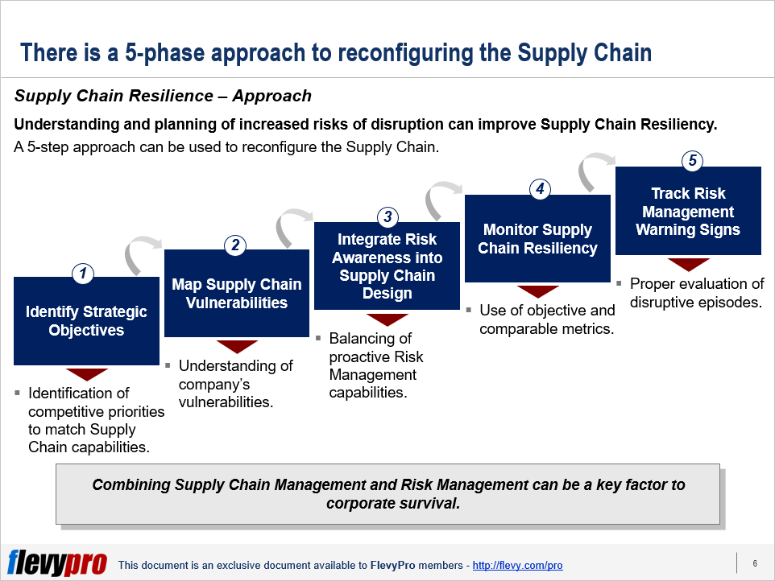

 to Market Resiliency Modeling in Algo Trading

Algorithmic trading has reshaped the financial landscape by enabling the execution of trades with remarkable speed and efficiency. Through the deployment of sophisticated algorithms, traders and institutions can automatically conduct transactions based on pre-defined criteria, drastically reducing human error and optimizing market strategies. However, the proficiency with which these trades are executed necessitates a robust understanding and assurance of market resiliency—a concept pivotal to maintaining stability and investor confidence in an increasingly automated environment.

Market resiliency refers to the ability of a market to absorb shocks and return to equilibrium without significant disruption. In the context of algorithmic trading, the significance of market resiliency becomes apparent as these automated systems can both stabilize and destabilize markets. A resilient market ensures not only the efficient functioning of these trading algorithms but also the protection against systemic risks and anomalies that can arise from rapid execution misalignments, such as flash crashes.

The growing demand for resilient financial markets is underscored by a multitude of global economic uncertainties. Factors such as geopolitical tensions, shifting economic policies, and the unpredictable ripple effects of major events can influence market stability. As markets face these challenges, the integration of market resiliency models into algorithmic trading systems becomes increasingly critical. These models are essential for forecasting potential disruptions, adjusting trading strategies in real-time, and maintaining an equilibrium that bolsters investor confidence even during volatile periods.

The objective of this article is to explore the intricate relationship between market resiliency and algorithmic trading. We aim to provide a comprehensive understanding of how market resiliency is modeled in the framework of algorithmic trading systems. Amidst the backdrop of rapid technological evolution, these models are pivotal not only in preserving market integrity but also in offering foresight and adaptation mechanisms against unforeseen market shifts.

By discussing the importance of market resiliency within algorithmic trading, we set the stage for a deeper examination of the methods and impacts of trading resiliency models. The insights garnered from this exploration not only inform current practices but also pave the way for ongoing advancements and innovations that ensure the robust functioning of financial markets in an algorithm-driven age.

## Table of Contents

## Understanding Market Resiliency

Market resiliency refers to the capacity of a financial market to recover from shocks or disturbances while maintaining its essential functions, including the efficient allocation of resources and the facilitation of trade. The key components of market resiliency include liquidity, volatility, and information flow.

Liquidity is a fundamental element of market resiliency. It represents the ease with which assets can be bought or sold in the market without causing significant price changes. A liquid market ensures that traders can execute large orders with minimal impact on the market price, contributing to stability.

Volatility, the degree of variation in trading prices over time, is another critical [factor](/wiki/factor-investing). While some level of [volatility](/wiki/volatility-trading-strategies) is natural, extreme volatility can undermine market stability and erode investor confidence. A resilient market can absorb volatility and minimize its disruptive effects.

Information flow is crucial as well. Efficient dissemination and processing of information allow traders to make informed decisions, reducing uncertainty and enhancing market stability. In contrast, information asymmetry can lead to mispricing and increased volatility, negatively impacting market resiliency.

Traditional methods for assessing market resiliency include quantitative measures like [liquidity](/wiki/liquidity-risk-premium) ratios, bid-ask spreads, and price impact functions. For instance, a narrow bid-ask spread generally indicates a liquid market. Additionally, statistical analyses of price movements and trade volumes can provide insights into market volatility and liquidity conditions.

Overall, a resilient market is vital for maintaining stability and investor confidence, particularly during periods of economic uncertainty. Ensuring robust market resiliency requires continuous assessment and improvement of the components influencing liquidity, volatility, and information flow.

## Role of Algorithmic Trading in Market Resiliency

Algorithmic trading, often referred to as algo trading, is a method that employs automated and pre-programmed trading instructions to manage orders. These instructions account for variables such as timing, price, and [volume](/wiki/volume-trading-strategy), allowing for rapid trade execution that would be impossible for manual human intervention. The prevalence of [algorithmic trading](/wiki/algorithmic-trading) in today's financial markets is significant, with a substantial portion of total market volume being executed by algorithms. This automation contributes to greater market efficiency and liquidity.

The impact of algorithmic trading on market resiliency is multifaceted. On the one hand, algorithmic trading can enhance market resiliency by providing liquidity and narrowing bid-ask spreads, which can cushion markets against adverse price movements. For example, during times of market stress, algorithms designed to provide liquidity can help stabilize prices by facilitating continuous trading operations. Furthermore, the speed at which algorithmic trading operates ensures that information is incorporated into prices much more quickly, thereby smoothing out potential volatility caused by information lags.

Conversely, algorithmic trading can also hinder market resiliency if not carefully designed and monitored. Algorithms that engage in high-frequency trading ([HFT](/wiki/high-frequency-trading-strategies)) or that are prone to malfunction can exacerbate market volatility. High-frequency trading algorithms are typically designed to make profits on minute price discrepancies, which can lead to increased trading volume but potentially destabilize the market if these algorithms start to operate counterproductively due to unforeseen market conditions or technical errors. Additionally, events like the 2010 Flash Crash highlight the potential for algorithm-driven feedback loops to create extreme volatility, undermining market stability.

The relationship between trading volume, speed, and market resiliency is intricate in the context of algorithmic trading. High trading volumes facilitated by algorithms generally enhance liquidity, contributing to market resiliency by allowing for large transactions to occur with minimal price impact. However, this relationship depends heavily on the design and objectives of the algorithms in use. For instance, algorithms that aim solely to maximize trading speed without regard to market conditions can lead to increased systemic risk, especially if they cause abrupt market movements.

Market resiliency, therefore, hinges on the balance between algorithmic trading speed and volume, and the stability of the market environment. The challenge lies in designing algorithms that are adaptable to varying market conditions and able to mitigate rather than exacerbate potential instabilities. Implementing robust risk management parameters and ensuring compliance with regulatory frameworks are essential to ensuring that algorithmic trading serves to enhance market resiliency rather than detract from it.

## Modeling Market Resiliency in Algorithmic Trading

Modeling market resiliency within the framework of algorithmic trading involves employing various quantitative models that simulate market conditions and measure the capacity of financial markets to absorb shocks without destabilizing. Several approaches are used to assess market resiliency, each with its unique emphasis on different market characteristics such as liquidity, volatility, and price dynamics.

One fundamental modeling approach is based on stochastic differential equations (SDEs), which allow the modeling of continuous-time price changes under the influence of random shocks. These models are useful for capturing the probabilistic nature of financial markets and simulating how prices react to trades. For example, the Ornstein-Uhlenbeck process, a type of mean-reverting SDE, models the tendency of asset prices to revert to an average level over time, which is a measure of resiliency.

Agent-based models (ABMs) provide another vital approach, focusing on simulating interactions between different trading entities, such as high-frequency trading algorithms and traditional investors. These models can capture the complexity of market dynamics by considering heterogeneous agent behaviors and strategies. ABMs are particularly effective in evaluating how collective actions can impact market resiliency and lead to emergent phenomena such as flash crashes.

Network models are employed to represent and analyze the complex interconnections between different market participants or financial instruments. These models often use graph theory to study systemic risk and identify critical nodes whose failure could lead to cascading effects in the market. By examining these networks' topology and robustness, researchers can gain insights into the resiliency of the market's underlying structure.

Despite the usefulness of these models, challenges and limitations persist in the digital trading era. One significant challenge is data availability and quality. Accurate and high-frequency data are crucial to model validation and calibration, yet such data are often restricted due to proprietary trading practices. Additionally, existing models may struggle to keep pace with the rapid evolution of algorithmic trading strategies, necessitating continuous adaptation and development of more sophisticated models.

The computational complexity of simulating vast numbers of [agents](/wiki/agents) or processing extensive financial networks also poses a limitation, requiring advanced computational resources and efficient algorithms. Moreover, models may fail to account for extreme market events or black swan events due to their focus on typical market conditions, limiting their predictive accuracy in rare but impactful scenarios.

Successful applications of these models demonstrate their value in real-world contexts. For instance, ABMs have been used to simulate and analyze the 2010 Flash Crash, improving understanding of how certain trading strategies can lead to rapid market destabilization. These insights have informed the design of regulatory measures aimed at enhancing market resiliency by curbing extreme market volatility.

In conclusion, diversifying modeling approaches allows for a more robust understanding of market resiliency within algorithmic trading. Continuous advancements in mathematical modeling, computational power, and data accessibility are essential to overcoming current limitations and ensuring stable and resilient financial markets in the face of evolving trading methodologies.

## Challenges and Future of Market Resiliency Modeling

Market resiliency modeling in algorithmic trading faces several challenges and opportunities for future advancement. These challenges span technical, regulatory, and predictive domains.

One of the foremost challenges is accurately capturing the dynamic complexities of financial markets. Traditional models often struggle to account for the non-linearities and feedback loops inherent in modern markets influenced heavily by algorithmic trading. As markets evolve, so too must the models, necessitating continuous updates and integration of real-time data.

Technological advancements hold promise for enhancing modeling capability. The advent of high-performance computing and cloud-based solutions facilitates the processing of vast datasets necessary for realistic simulations and has opened new avenues for more detailed and scalable models. Furthermore, [machine learning](/wiki/machine-learning) and [artificial intelligence](/wiki/ai-artificial-intelligence) are pivotal, offering robust tools to identify patterns and anomalies in trading data that may indicate stress or vulnerabilities in market resiliency. These technologies can automate model calibration, adapt to new data without manual intervention, and improve prediction accuracy through data-driven insights.

Regulatory and compliance considerations pose significant challenges to the development and deployment of market resiliency models. Financial regulations, which vary significantly across jurisdictions, aim to ensure market stability and protect investors but can limit the flexibility of algorithmic models. Compliance requirements often necessitate thorough documentation and traceability of algorithms, which can complicate the rapid deployment of new models. Future models will need to incorporate these constraints proactively, ensuring that they not only adhere to existing regulations but also anticipate potential regulatory changes.

Looking forward, the future of market resiliency modeling is likely to be shaped by a few key trends. The integration of AI and machine learning will likely continue, with models becoming increasingly sophisticated and dealing with larger data horizons. This shift will be supported by enhanced data availability and advances in data processing technologies. Additionally, there will be an emphasis on developing more holistic models that not only consider liquidity and volatility but also integrate external economic indicators and social sentiment analysis.

In summary, while challenges remain in effectively modeling market resiliency amidst the complexities introduced by algorithmic trading, technological advancements offer promising pathways. Regulatory frameworks, although sometimes restrictive, can guide the development of robust, compliant models. Ultimately, as AI and machine learning technologies evolve, they will play a crucial role in shaping the future landscape of market resiliency modeling, pushing the boundaries of what is currently possible.

## Conclusion

Market resiliency in algorithmic trading is pivotal for maintaining stable and robust financial markets. This exploration has highlighted how algorithmic trading interacts with market resiliency, emphasizing the necessity of understanding and modeling these dynamics to mitigate risks associated with global economic uncertainties. The examination of market resiliency has revealed critical factors—such as liquidity, volatility, and information flow—that must be addressed through strategic algorithm design and execution.

Algorithmic trading's role in enhancing market resiliency is clear yet complex, as these systems can either bolster or undermine stability based on their implementation. Thus, the continuous improvement and adaptation of resiliency models are essential. Advancements in quantitative models, simulations, and real-world case studies offer valuable insights into the effective application of these models. However, existing limitations highlight the need for more sophisticated approaches.

Future trends in market resiliency modeling, particularly the integration of AI and machine learning, promise to redefine prediction and adaptability capabilities. This underscores the importance of regulatory frameworks and compliance to ensure these technological advancements support market integrity and investor confidence.

As we continue to enhance our understanding and modeling of market resiliency within the context of algorithmic trading, a commitment to ongoing research and development is imperative. This will not only support the evolution of resilient financial markets but also equip us to better navigate the complexities of modern economic landscapes. Further investigation into these critical areas will foster stability and trust, ensuring that financial markets remain resilient amidst ever-changing global conditions.

## References & Further Reading

[1]: Aldridge, I. (2013). ["High-Frequency Trading: A Practical Guide to Algorithmic Strategies and Trading Systems"](https://www.wiley.com/en-us/High+Frequency+Trading%3A+A+Practical+Guide+to+Algorithmic+Strategies+and+Trading+Systems%2C+2nd+Edition-p-9781118343500). Wiley Finance.

[2]: Cartea, Á., Jaimungal, S., & Penalva, J. (2015). ["Algorithmic and High-Frequency Trading"](https://assets.cambridge.org/97811070/91146/frontmatter/9781107091146_frontmatter.pdf). Cambridge University Press.

[3]: Bouchaud, J. P., Farmer, J. D., & Lillo, F. (2009). "How Markets Slowly Digest Changes in Supply and Demand." In Handbook of Financial Markets: Dynamics and Evolution, pp. 57-160. Elsevier.

[4]: Johnson, N. F., Zhao, G., Hunsader, E., Meng, J., Ravindar, A., Carran, S., & Tivnan, B. (2013). ["Abrupt Rise of New Machine Ecology Beyond Human Response Time."](https://www.nature.com/articles/srep02627) Scientific Reports, 3, 2627.

[5]: Cont, R. (2001). ["Empirical Properties of Asset Returns: Stylized Facts and Statistical Issues."](http://rama.cont.perso.math.cnrs.fr/pdf/empirical.pdf) Quantitative Finance, 1(2), 223-236.