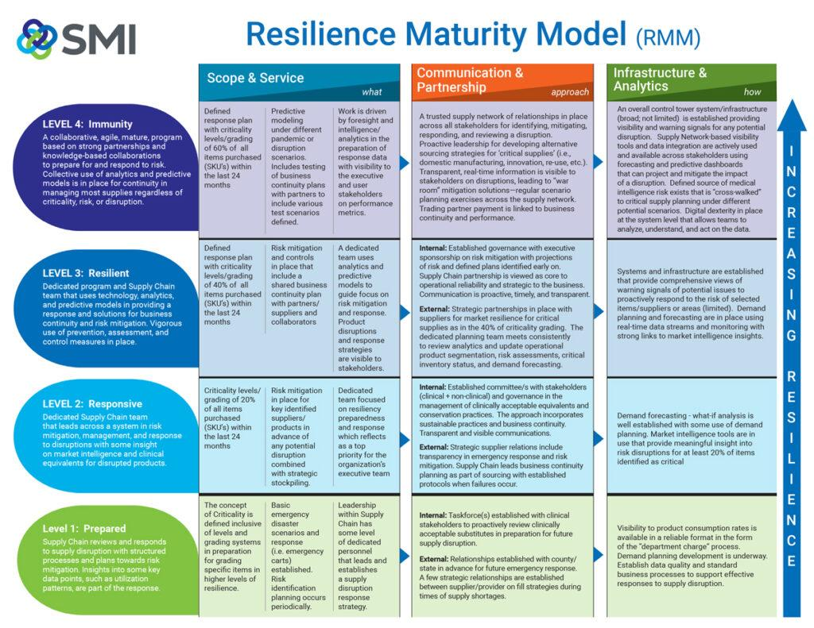

## Table of Contents

## What is market resiliency and why is it important?

Market resiliency is about how well a market can handle big changes or problems and still keep working well. It's like how a rubber ball bounces back after you drop it. In markets, this means that even if something bad happens, like a big company going bankrupt or a natural disaster, the market can still function and people can keep buying and selling things without too much trouble.

It's important because markets are where people and businesses exchange goods and services. If a market isn't resilient, a small problem could turn into a big one, making it hard for people to get what they need or for businesses to operate. A resilient market helps keep the economy stable and makes sure that life can go on smoothly, even when unexpected things happen.

## How does market resiliency modeling help in understanding economic stability?

Market resiliency modeling is a way to study and predict how markets will react to different problems or changes. It's like a practice run where experts can see what might happen if there's a big shock to the market, like a financial crisis or a sudden drop in demand for a product. By using these models, economists and policymakers can figure out which parts of the market are strong and which parts might need help to keep things running smoothly.

Understanding economic stability through market resiliency modeling is important because it helps us prepare for the future. If the models show that certain areas of the market are weak, steps can be taken to make them stronger before a real problem hits. This can include things like changing rules, providing financial support, or helping businesses become more flexible. By doing this, we can make the whole economy more stable and better able to handle whatever challenges come its way.

## What are the basic components of a market resiliency model?

A market resiliency model is made up of a few key parts that help us understand how markets might react to big changes or problems. One important part is the data about the market, like how much people are buying and selling, what prices are like, and how different parts of the market are connected. This data helps the model show what's happening now and guess what might happen if something changes. Another part is the rules or formulas that the model uses to predict how the market will behave. These rules are based on what we know about how markets usually work and can help us see how a shock might spread through the market.

Another key component is the way the model tests different scenarios. This means it runs through many different possible futures to see how the market might handle them. For example, the model might look at what happens if a big company goes bankrupt or if there's a sudden change in the economy. By trying out these different scenarios, the model can show us which parts of the market are strong and which parts might need help. This helps us plan and make the market more able to bounce back from problems.

The last part of a market resiliency model is how it shows its results. Good models make it easy to see and understand what they're telling us. They might use graphs, charts, or numbers to show how the market might react to different situations. This helps people who make decisions about the economy, like policymakers and business leaders, see where they need to focus their efforts to keep the market strong and stable.

## Can you explain the difference between market resiliency and market efficiency?

Market resiliency and market efficiency are two different ideas about how markets work. Market resiliency is about how well a market can handle big changes or problems and still keep working well. It's like how a rubber ball bounces back after you drop it. In markets, this means that even if something bad happens, like a big company going bankrupt or a natural disaster, the market can still function and people can keep buying and selling things without too much trouble. A resilient market helps keep the economy stable and makes sure that life can go on smoothly, even when unexpected things happen.

Market efficiency, on the other hand, is about how well a market uses all the information that's available to set prices that are fair and correct. It's like how a good detective uses all the clues to solve a mystery. An efficient market means that the prices of things, like stocks or goods, quickly change to reflect new information. This helps people make good decisions because they can trust that the prices they see are based on everything that's known. While market resiliency is about bouncing back from problems, market efficiency is about making sure the market works well all the time by using information the right way.

## What data sources are typically used in market resiliency modeling?

Market resiliency modeling uses different kinds of data to understand how markets might react to big changes or problems. One main source is economic data, like how much people are buying and selling, what prices are like, and how the economy is growing. This data can come from government reports, business surveys, and financial statements. Another important source is data about how different parts of the market are connected, like how banks lend money to each other or how companies depend on each other for supplies. This information helps the model see how a shock might spread through the market.

Another type of data used is from past events, like financial crises or natural disasters. By looking at what happened in the past, the model can learn how markets have reacted before and use that to guess what might happen in the future. Data from news and social media can also be helpful because they show what people are thinking and feeling, which can affect how they act in the market. All these different data sources together help make the market resiliency model more accurate and useful for understanding how markets might handle different situations.

## How do economic shocks impact market resiliency and how are they modeled?

Economic shocks, like a big company going bankrupt or a sudden drop in demand, can really test how well a market can bounce back. When these shocks happen, they can cause prices to change a lot, make it hard for people to buy and sell things, and sometimes even lead to a bigger problem in the economy. A market that's good at handling these shocks will be able to keep working well even when things get tough. It's like a tree that bends in the wind but doesn't break. If the market is strong and flexible, it can recover quickly and keep the economy stable.

To understand how these shocks might affect the market, experts use models that try to guess what will happen. These models use a lot of information, like how much people are buying and selling, what prices are like, and how different parts of the market are connected. They also look at what happened during past shocks to see how the market reacted before. By running these models with different scenarios, like a big company failing or a natural disaster, experts can see which parts of the market are strong and which parts might need help. This helps them plan and make the market better at handling future shocks.

## What are some common methodologies used in developing market resiliency models?

One common way to develop market resiliency models is by using something called agent-based modeling. This method looks at how different people or groups, called [agents](/wiki/agents), act in the market. Each agent follows certain rules based on what we know about how people usually behave. By watching how these agents interact, the model can show how the whole market might react to a big change or problem. This helps us see which parts of the market are strong and which parts might need help to keep things running smoothly.

Another method is called stress testing. This is like a practice run where experts put the market through different tough situations to see how it handles them. They might look at what happens if a big company goes bankrupt or if there's a sudden drop in demand. By trying out these different scenarios, the model can show us where the market might be weak and what could be done to make it stronger. This helps make the market better at bouncing back from problems.

A third approach is network analysis, which looks at how different parts of the market are connected. It's like looking at a map of roads to see how traffic might flow. By understanding these connections, the model can predict how a shock might spread through the market. This helps experts see where the market might be at risk and plan ways to make it more resilient.

## How can market resiliency models predict the recovery time after a market disruption?

Market resiliency models help predict how long it will take for a market to recover after a disruption by looking at past events and running different scenarios. These models use a lot of information, like how much people are buying and selling, what prices are like, and how different parts of the market are connected. By studying what happened during past disruptions, the models can guess how long it might take for the market to get back to normal. They do this by trying out different situations, like a big company going bankrupt or a natural disaster, to see how the market reacts and how quickly it can bounce back.

The models also use something called agent-based modeling, where they look at how different people or groups in the market act. Each person or group follows certain rules based on what we know about how people usually behave. By watching how these groups interact, the model can show how the whole market might recover from a big change or problem. This helps experts see which parts of the market are strong and which parts might need help to speed up the recovery. By understanding these things, the models can give a good guess about how long it will take for the market to get back on its feet after a disruption.

## What role do regulatory frameworks play in market resiliency modeling?

Regulatory frameworks are important for market resiliency modeling because they set the rules that markets have to follow. These rules can affect how well a market can handle big changes or problems. For example, rules about how much money banks have to keep on hand can make the market stronger and better able to bounce back if there's a financial crisis. By including these rules in the models, experts can see how they might help or hurt the market's ability to recover from a shock. This helps them understand what changes to the rules might make the market more resilient.

Regulatory frameworks also help by making sure there's good information available for the models. When markets have to follow certain rules about reporting what they're doing, it gives experts the data they need to make their models more accurate. This data can show how different parts of the market are connected and how they might react to a big change. By using this information, the models can give a better guess about how long it will take for the market to get back to normal after a disruption. This helps policymakers make smart decisions about how to keep the market strong and stable.

## How do advanced statistical techniques enhance the accuracy of market resiliency models?

Advanced statistical techniques help make market resiliency models more accurate by using math to find patterns and connections in the data. These techniques can look at a lot of information at once and figure out which parts are most important for understanding how the market might react to big changes or problems. For example, they can use something called regression analysis to see how different factors, like interest rates or company profits, affect the market. By understanding these relationships, the models can make better guesses about what might happen in the future and how quickly the market might recover from a shock.

Another way these techniques help is by testing how sure we can be about the model's predictions. They do this with methods like Monte Carlo simulations, where the model tries out many different possible futures to see how likely each one is. This helps experts see not just what might happen, but also how likely it is to happen. By using these advanced techniques, market resiliency models can give a clearer and more reliable picture of how the market might handle different situations, which helps everyone from business leaders to policymakers make better decisions about keeping the economy stable.

## What are the limitations and challenges faced in market resiliency modeling?

Market resiliency modeling has some limitations and challenges that make it hard to predict exactly how markets will react to big changes or problems. One big challenge is that markets are very complicated, with lots of different people and groups all doing their own thing. This makes it tough for models to capture everything that's going on. Also, the data we use to build these models might not be perfect. Sometimes it's missing important information, or it might be out of date. This can make the model's predictions less accurate.

Another limitation is that markets can change in ways we don't expect. People's behavior can be hard to predict, and new rules or technology can change how the market works. This means that even if a model is good at guessing what might happen based on past events, it might not be as good at predicting the future. It's also hard to test these models in real life because we can't control the market like we can in a lab. So, while market resiliency models are helpful, they have to be used carefully, knowing that they might not always get everything right.

## How can market resiliency models be integrated with other financial models for comprehensive risk assessment?

Market resiliency models can be integrated with other financial models to give a fuller picture of the risks a market might face. For example, combining market resiliency models with stress testing models can help experts see how different parts of the market might react to big changes or problems. Stress testing models look at how the market might handle tough situations, like a financial crisis or a sudden drop in demand. By using both types of models together, experts can get a better idea of which parts of the market are strong and which parts might need help to stay stable.

Another way to integrate market resiliency models is by using them with risk management models. Risk management models help businesses and policymakers plan for the future by figuring out what might go wrong and how to stop it from happening. When these models are used with market resiliency models, they can show not just how the market might react to a shock, but also what steps can be taken to make the market stronger and more able to bounce back. This helps everyone involved make smarter decisions about keeping the economy stable and ready for whatever challenges come its way.

## References & Further Reading

[1]: Aldridge, I. (2013). ["High-Frequency Trading: A Practical Guide to Algorithmic Strategies and Trading Systems"](https://www.wiley.com/en-us/High+Frequency+Trading%3A+A+Practical+Guide+to+Algorithmic+Strategies+and+Trading+Systems%2C+2nd+Edition-p-9781118343500). Wiley Finance.

[2]: Cartea, Á., Jaimungal, S., & Penalva, J. (2015). ["Algorithmic and High-Frequency Trading"](https://assets.cambridge.org/97811070/91146/frontmatter/9781107091146_frontmatter.pdf). Cambridge University Press.

[3]: Bouchaud, J. P., Farmer, J. D., & Lillo, F. (2009). "How Markets Slowly Digest Changes in Supply and Demand." In Handbook of Financial Markets: Dynamics and Evolution, pp. 57-160. Elsevier.

[4]: Johnson, N. F., Zhao, G., Hunsader, E., Meng, J., Ravindar, A., Carran, S., & Tivnan, B. (2013). ["Abrupt Rise of New Machine Ecology Beyond Human Response Time."](https://www.nature.com/articles/srep02627) Scientific Reports, 3, 2627.

[5]: Cont, R. (2001). ["Empirical Properties of Asset Returns: Stylized Facts and Statistical Issues."](http://rama.cont.perso.math.cnrs.fr/pdf/empirical.pdf) Quantitative Finance, 1(2), 223-236.