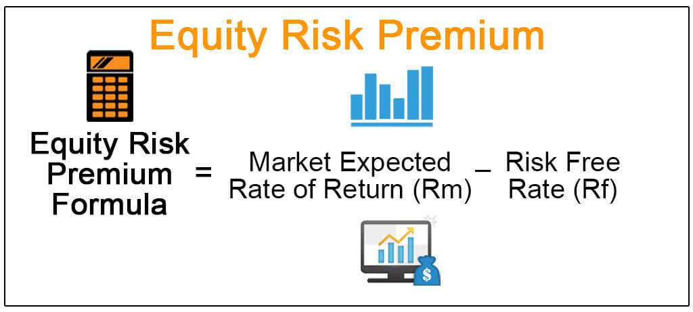

The world of finance is an intricate network of concepts and practices, where the understanding of market risk, financial risk, equity risk premium, and algorithmic trading is essential for navigating its complexities. These components are not only interconnected but also crucial for investors aiming to optimize their returns while managing potential risks effectively.

Market risk and financial risk are foundational elements that influence investment decisions. Market risk pertains to the exposure to losses resulting from factors that impact the overall financial market, including interest rate adjustments, currency variations, and market volatility. Financial risk, on the other hand, encompasses the risks tied to a company's financial stability, notably credit and liquidity risks. Both types of risk play a significant role in shaping investment strategies, necessitating thorough assessment to mitigate adverse outcomes.



Understanding the equity risk premium is equally vital. It is the additional return that investing in equities offers over a risk-free asset, compensating investors for the increased risk of equity investments. The equity risk premium is often highlighted using the formula:

$$
\text{Equity Risk Premium} = \text{Expected Market Return} - \text{Risk-Free Rate}
$$

This concept is instrumental in informing investment strategies and asset pricing models like the Capital Asset Pricing Model (CAPM), serving as a critical indicator of market sentiment and providing insights into portfolio diversification.

Algorithmic trading signifies a modern approach that integrates these financial concepts to enhance trading precision and efficiency. By leveraging complex algorithms, traders can automate financial trading, processing large volumes of data to identify and capitalize on fleeting market inefficiencies. This method not only minimizes human error but also reduces transaction costs and facilitates high-frequency trading.

In summary, the comprehensive understanding of market and financial risks, equity risk premium, and the application of algorithmic trading is crucial for investors and traders. This article aims to provide a thorough guide to these concepts, exploring their roles in modern investment strategies and highlighting the synergy between financial theories and technological advancements.

## Table of Contents

## Understanding Market Risk and Financial Risk

Market risk refers to the potential for an investor to encounter losses due to fluctuations in the overall financial market. This type of risk is inherently linked to systemic factors affecting the broader economic environment, making it unavoidable through diversification. Key components of market risk include [interest rate](/wiki/interest-rate-trading-strategies) changes, currency fluctuations, and market [volatility](/wiki/volatility-trading-strategies). Interest rate risk arises from the possibility that changes in interest rates will negatively impact asset prices, particularly in fixed-income securities. Currency risk, also known as exchange rate risk, represents the effect of changes in foreign exchange rates on investments denominated in foreign currencies. Market volatility, or the degree of variation in asset prices, can lead to substantial fluctuations in investment value.

Financial risk, on the other hand, pertains to a company's financial health and its ability to meet financial obligations. This encompasses several subcategories, including credit risk and [liquidity](/wiki/liquidity-risk-premium) risk. Credit risk is the danger that a borrower will default on its debt obligations, which could adversely affect creditors or investors. Liquidity risk arises when an entity is unable to buy or sell assets quickly without a significant change in price, often due to a lack of market activity or interest in the specific asset.

Both market and financial risks play a crucial role in shaping investment strategies. Assessing these risks is essential for investors aiming to mitigate potential negative impacts. For example, investors might use financial metrics, stress testing, or scenario analysis to gauge market susceptibility and financial soundness.

Investors generally demand a return premium, or an extra return over a risk-free rate, to compensate for the risks taken. This is due to the uncertain nature of these risks and their possible impact on the expected returns of an investment. A fundamental understanding of market and financial risks is essential for investors and portfolio managers in designing strategies that effectively cater to their risk appetites and investment objectives.

## The Concept of Equity Risk Premium

The equity risk premium (ERP) refers to the additional return an investor expects to receive from holding a risky equity investment instead of a risk-free asset, such as government bonds. It reflects the compensation investors seek for the higher volatility and risk associated with equities compared to the relative stability of bonds.

Mathematically, the equity risk premium is expressed as:

$$
\text{Equity Risk Premium} = E(R_m) - R_f
$$

where $E(R_m)$ is the expected return on the market portfolio and $R_f$ is the risk-free rate. The choice of risk-free rate often involves short-term government bond yields, such as those from U.S. Treasury bills, considered default risk-free due to government backing.

Understanding ERP is vital, as it informs key models like the Capital Asset Pricing Model (CAPM). In CAPM, the expected return on an asset can be calculated using the formula:

$$
E(R_i) = R_f + \beta_i(E(R_m) - R_f)
$$

Here, $E(R_i)$ represents the expected return on asset $i$, and $\beta_i$ measures the asset's sensitivity to market movements. The ERP portion $(E(R_m) - R_f)$ is essential for calculating the risk-return trade-off, guiding investors on whether to include specific stocks within a diversified portfolio.

The equity risk premium also acts as a barometer for market sentiment. When ERP is high, it suggests that investors demand a higher return for taking on equity risk, indicating heightened uncertainty. Conversely, a lower ERP implies investor confidence in the stability of market conditions, prompting a reevaluation of risk levels and portfolio adjustments.

In practice, estimating ERP involves historical analysis and forward-looking projections. Analysts consider past market returns and use methodologies like the dividend discount model to forecast future returns. The resulting ERP estimate guides asset managers in setting realistic return expectations, considering macroeconomic conditions and investor behavior. Understanding and applying ERP is essential for crafting effective investment strategies and constructing robust financial models.

## Algo Trading: Enhancing Market Efficiency

Algorithmic trading, often abbreviated as algo trading, employs sophisticated algorithms to automate the process of financial trading. This approach leverages computational power to achieve faster and more efficient trading outcomes than would be possible with human traders alone. By processing vast volumes of market data rapidly, algo trading systems can pinpoint and exploit fleeting market inefficiencies that might otherwise go unnoticed.

One of the key benefits of [algorithmic trading](/wiki/algorithmic-trading) is its ability to incorporate complex financial calculations, such as the equity risk premium, into trading algorithms. This enables traders to optimize their strategies by aligning them with prevailing market conditions. For instance, by continuously recalculating the equity risk premium, algorithms can dynamically adjust investment positions to react to market shifts, thus optimizing potential returns.

In addition to enhancing speed and precision, algorithmic trading minimizes human error, which is often prevalent in manually conducted trades. This reduction in manual intervention contributes to lower transaction costs and allows for high-frequency trading, wherein numerous trades are executed at high speeds within a fraction of a second, benefiting from even minor price movements.

The rise of algorithmic trading highlights the critical need to integrate computational techniques with financial theory. This integration facilitates more informed decision-making and risk management, ultimately enhancing market efficiency. The use of algorithms in trading also underscores the growing significance of technology in driving financial markets and shaping investment strategies.

Python, a popular language for developing trading algorithms, provides libraries such as NumPy and Pandas for data analysis and manipulation, and tools like [backtrader](/wiki/backtrader) for [backtesting](/wiki/backtesting) strategies. A simple Python snippet to calculate the equity risk premium might look like this:

```python
import numpy as np

# Sample data
expected_market_return = 0.08  # 8%
risk_free_rate = 0.02          # 2%

# Equity risk premium calculation
equity_risk_premium = expected_market_return - risk_free_rate
print(f"Equity Risk Premium: {equity_risk_premium:.2%}")
```

This example illustrates the basic calculation of the equity risk premium, which can then be integrated into larger, more complex trading strategies. Through the continued advancement of technology and financial theory, algorithmic trading is set to remain an essential component of modern financial markets, driving efficiency and innovation.

## Integrating Equity Risk Premium in Trading Strategies

Integrating the equity risk premium into trading strategies is crucial for aligning investment decisions with realistic return expectations. The equity risk premium (ERP) serves as a significant input for traders, helping to evaluate stock valuations and align these valuations with broader economic indicators. This premium represents the additional return that investors expect from equities over risk-free assets, compensating for the inherent risks of equity markets.

Algorithmic trading systems offer an advanced framework within which the ERP can be dynamically integrated. These systems can respond to changes in equity premiums and market conditions by adjusting trading strategies in real-time. For instance, if an increase in the ERP indicates heightened market risk, an algorithmic system might adopt a more conservative trading stance, focusing on undervalued stocks that may offer safer returns under volatile conditions.

The use of ERP in trading algorithms can be exemplified through quantitative models, such as the Capital Asset Pricing Model (CAPM), which assesses expected returns based on the ERP. The CAPM formula is:

$$
E(R_i) = R_f + \beta_i (E(R_m) - R_f)
$$

where $E(R_i)$ is the expected return on the investment, $R_f$ is the risk-free rate, $\beta_i$ is the beta of the investment, and $E(R_m) - R_f$ is the ERP. Integrating such models within algorithmic platforms optimizes trade execution and portfolio rebalancing, capitalizing on predicted returns based on calculated risk levels.

Incorporating the ERP in trade models not only aids in setting realistic return expectations but also enhances portfolio diversification strategies. By considering the ERP, traders can make informed decisions regarding asset allocation, selecting investments that align with current economic climates while mitigating associated risks. 

Furthermore, the integration of ERP into algorithmic strategies promotes a data-driven approach to risk management. Traders can utilize predictive analytics and scenario analysis to forecast changes in the ERP, enabling them to anticipate market shifts and adjust their strategies accordingly. This capability underscores the critical role of ERP in refining investment strategies, ultimately enhancing their efficacy in navigating fluctuating markets.

## Conclusion

Understanding and applying concepts such as market risk, financial risk, and the equity risk premium is essential for crafting successful investment strategies. Market and financial risks form the cornerstone of evaluating potential investment outcomes, as they inherently influence returns and exposure to volatility. A thorough grasp of these risks ensures that investors can better navigate uncertainties and optimize their portfolios.

The rise of algorithmic trading underscores the critical role of advanced technology in financial markets. Algorithms process vast amounts of data rapidly, enabling traders to detect market trends and exploit inefficiencies. As these technologies evolve, they rely increasingly on complex financial theories, such as the equity risk premium, to fine-tune trading models and enhance decision-making processes.

Integrating financial theories with computational tools significantly boosts trading efficiency and risk management capabilities. Algorithmic trading, for instance, benefits from adaptable algorithms that adjust in real-time to shifts in market conditions, enhancing precision and response times. By embedding financial calculations within these algorithms, traders acquire a sophisticated means to evaluate risk and optimize performance.

Investors and traders must remain vigilant in tracking both financial principles and technological advancements to maintain a competitive edge. Financial markets are dynamic, presenting new opportunities and challenges as they evolve. Staying informed ensures that market participants can adjust their strategies in line with emerging trends and maintain their relevance in the industry.

As the financial landscape continues to evolve, the interplay between advanced technologies and well-established financial concepts will be pivotal in crafting future investment strategies. Understanding the integration of these elements is not just beneficial but necessary for the development of effective trading and investment practices.

## References & Further Reading

[1]: Bodie, Z., Kane, A., & Marcus, A. J. (2013). ["Investments."](https://books.google.com/books/about/EBOOK_Investments_Global_edition.html?id=BMsvEAAAQBAJ) McGraw-Hill Education.

[2]: Damodaran, A. (2012). ["Equity Risk Premiums (ERP): Determinants, Estimation and Implications – The 2012 Edition."](https://pages.stern.nyu.edu/~adamodar/pdfiles/papers/ERP2012.pdf) 

[3]: Jorion, P. (2007). ["Value at Risk: The New Benchmark for Managing Financial Risk."](https://link.springer.com/article/10.1007/s11408-007-0057-3) McGraw-Hill Education.

[4]: Fabozzi, F. J., Gupta, F., & Markowitz, H. M. (2002). ["The Theory and Practice of Investment Management."](https://onlinelibrary.wiley.com/doi/book/10.1002/9781118267028) Wiley.

[5]: Kissell, R. (2013). ["The Science of Algorithmic Trading and Portfolio Management."](https://www.sciencedirect.com/book/9780124016897/the-science-of-algorithmic-trading-and-portfolio-management) Academic Press.

[6]: Ang, A. (2014). ["Asset Management: A Systematic Approach to Factor Investing."](https://archive.org/details/assetmanagements0000anga) Oxford University Press.