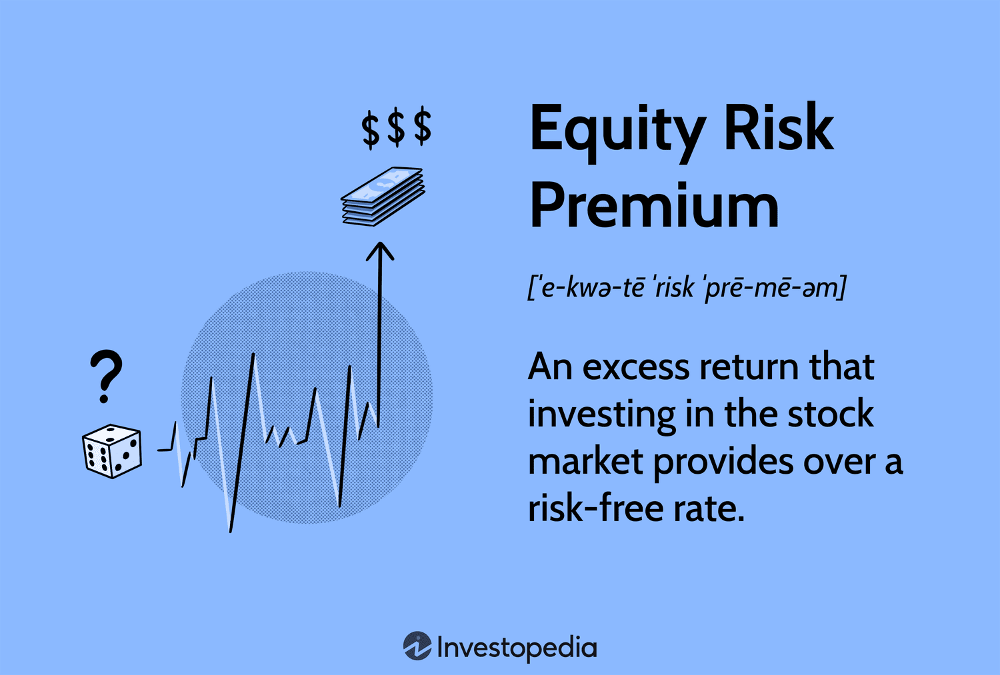

## Table of Contents

## What is market risk?

Market risk is the chance that the value of your investments might go down because of things happening in the overall market. This can include events like economic downturns, changes in interest rates, or big news that affects how people feel about investing. For example, if a country's economy is doing badly, stock prices might fall, and this would affect the value of your investments in those stocks.

There are different types of market risk, but they all have to do with factors that affect the whole market, not just one company or investment. One common type is interest rate risk, where changes in interest rates can make bonds and other investments worth less. Another type is currency risk, where changes in exchange rates can affect the value of investments in different countries. Understanding market risk can help you make better choices about where to put your money.

## What is the equity risk premium?

The equity risk premium is the extra return that investors expect to get from investing in stocks instead of safer investments like government bonds. It's like a reward for taking on more risk. If you put your money in stocks, you might earn more than if you put it in bonds, but there's also a bigger chance you could lose money. The equity risk premium is the difference between the return you expect from stocks and the return you expect from a safer investment.

This premium can change over time because it depends on how risky people think stocks are compared to other investments. If the economy is doing well and people feel confident, they might not need as much extra return to invest in stocks, so the equity risk premium could be lower. But if things are uncertain or the economy is struggling, people might want a bigger reward for taking the risk of investing in stocks, which would make the equity risk premium higher.

## How is market risk different from specific risk?

Market risk and specific risk are two types of risks that affect investments, but they come from different places. Market risk, also called systematic risk, is the risk that comes from things that affect the whole market. This can be things like a big economic downturn, changes in interest rates, or big news that makes everyone feel differently about investing. Because market risk affects everything, you can't get rid of it completely by spreading your investments around. It's like a storm that hits all ships in the ocean, no matter where they are.

On the other hand, specific risk, also known as unsystematic risk, is the risk that comes from things that affect just one company or a small group of companies. This can be things like a company doing badly, a CEO leaving, or a new law that affects just that industry. Specific risk can be reduced by spreading your investments across different companies and industries. It's like a small hole in one ship that doesn't affect the others. By having a diverse portfolio, you can lower the impact of specific risks on your overall investments.

## What factors contribute to market risk?

Market risk comes from things that affect the whole market, not just one company. One big [factor](/wiki/factor-investing) is economic changes. When the economy is doing well, people feel good about investing, and stock prices might go up. But if the economy starts to struggle, like during a recession, people might get worried and sell their stocks, making prices go down. Another factor is interest rates. When interest rates go up, borrowing money becomes more expensive, which can slow down the economy and affect stock prices. On the other hand, when interest rates go down, borrowing becomes cheaper, which can help the economy grow and push stock prices up.

Another important factor is how people feel about the market, which is called market sentiment. If people are feeling confident and think the market will do well, they're more likely to invest, which can drive up prices. But if people are worried or scared, they might pull their money out of the market, causing prices to fall. Political events and global happenings can also play a big role. For example, if there's a big election or a war in another country, it can create uncertainty and affect how people invest. All these factors together make up market risk, which is something every investor has to think about.

## How is the equity risk premium calculated?

The equity risk premium is figured out by looking at the difference between the expected return from stocks and the expected return from a safer investment, like government bonds. To find the expected return from stocks, people often look at past data to see how much stocks have grown over time. They might also think about what's going on in the economy right now and what they think will happen in the future. For the safer investment, like government bonds, they usually look at the current [interest rate](/wiki/interest-rate-trading-strategies) that these bonds are paying.

Once you have these two numbers, you just subtract the expected return from the safer investment from the expected return from stocks. This difference is the equity risk premium. It can change over time because it depends on how risky people think stocks are compared to other investments. If people feel more confident about the economy, they might not need as big a reward to invest in stocks, so the equity risk premium could be smaller. But if things are uncertain or the economy is doing badly, people might want a bigger reward for taking the risk of investing in stocks, making the equity risk premium larger.

## Why is the equity risk premium important for investors?

The equity risk premium is important for investors because it helps them decide if investing in stocks is worth the risk. It's like a reward that investors expect for putting their money in stocks instead of safer things like government bonds. If the equity risk premium is high, it means investors might get a bigger reward for taking the risk of investing in stocks. But if it's low, the extra reward might not be worth the risk, so investors might choose to put their money in safer places.

Understanding the equity risk premium also helps investors plan for the future. If they know what kind of reward they might get from stocks compared to safer investments, they can make better choices about where to put their money. For example, if they think the economy will do well and the equity risk premium will stay high, they might decide to invest more in stocks. But if they think things will get risky and the equity risk premium might drop, they might choose to move some of their money to safer investments. This way, they can balance the risk and reward to meet their financial goals.

## What historical data is used to estimate the equity risk premium?

To estimate the equity risk premium, people often look at past stock market data. They might look at how much the stock market has grown over many years, like 50 or 100 years. This long-term data helps them see what kind of returns investors have gotten from stocks in the past. They also look at the returns from safer investments like government bonds over the same time. By comparing these two, they can figure out what the equity risk premium has been historically.

Besides looking at long-term data, people also consider shorter periods, like the last 10 or 20 years. This helps them see if the equity risk premium has changed recently. They might also look at different countries to see if the equity risk premium is different in places like the U.S., Europe, or Asia. All this historical data helps investors guess what the equity risk premium might be in the future, but it's important to remember that past results don't guarantee what will happen next.

## How does market risk influence investment decisions?

Market risk is a big deal when people are deciding where to put their money. It's the chance that the whole market could go down because of things like a bad economy, changes in interest rates, or big news that makes everyone worried. When people think about market risk, they have to decide if they're okay with the chance that their investments might lose value because of these big events. If they're really worried about market risk, they might choose to put their money in safer places, like government bonds, even though these might not grow as much as stocks. But if they're willing to take on more risk for the chance of bigger rewards, they might decide to invest more in stocks.

Understanding market risk also helps people plan their investments better. They might decide to spread their money across different kinds of investments, like stocks, bonds, and real estate, to lower the impact of market risk. This way, if one part of the market goes down, their whole investment doesn't get hit as hard. People also look at the economy and what's happening in the world to guess how much market risk there might be in the future. If they think the risk is going to be high, they might change their investments to be safer. But if they think the risk is going to be low, they might go for more risky investments to try and get bigger rewards.

## What are the limitations of using historical data to estimate the equity risk premium?

Using past data to guess the equity risk premium has some problems. One big problem is that the past doesn't always tell us what will happen in the future. Just because stocks did well in the last 50 years doesn't mean they will do well in the next 50 years. Things like the economy, interest rates, and big world events can change a lot, and these changes can make the equity risk premium different from what it was before. So, if we only look at old data, we might not be ready for new things that could affect the market.

Another problem is that the data we use might not be perfect. Sometimes, the numbers we have from the past might not be right, or they might not include everything we need to know. Also, different people might use different ways to figure out the equity risk premium, and these ways can give us different answers. So, it's hard to be sure that the number we come up with is the best one to use. Because of these problems, it's good to use historical data as just one part of figuring out the equity risk premium, and not the only thing we look at.

## How do different models account for market risk and the equity risk premium?

Different models help investors understand market risk and the equity risk premium in their own ways. One common model is the Capital Asset Pricing Model (CAPM). CAPM says that the expected return of an investment depends on how much risk it has compared to the whole market. It uses something called beta to measure this risk. If an investment has a high beta, it's more sensitive to market changes, so it might have a higher expected return to make up for the extra risk. CAPM helps investors see how much extra return they might get from stocks compared to safer investments like government bonds, which is the equity risk premium.

Another model is the Arbitrage Pricing Theory (APT). APT looks at many different things that can affect the market, not just the overall market risk like CAPM does. These things can include changes in inflation, interest rates, or even how much oil costs. APT tries to figure out how these different factors affect the returns of investments. By understanding these factors, investors can get a better idea of the equity risk premium because they can see how different risks might change the expected returns of stocks. Both models help investors make smarter choices by showing them how market risk and the equity risk premium work together.

## What are the current trends in market risk and equity risk premium?

Right now, market risk is affected a lot by things like inflation, interest rates, and what's happening in the world. Inflation has been going up, which makes people worried about the economy. When inflation is high, the value of money goes down, and this can make stocks and other investments less valuable. Also, central banks around the world have been raising interest rates to try and control inflation. When interest rates go up, it can make borrowing more expensive, which can slow down the economy and affect stock prices. On top of that, big events like wars or political changes can make the market feel uncertain, which adds to market risk.

As for the equity risk premium, it's been changing because of these same reasons. When people are worried about the economy and market risk is high, they usually want a bigger reward for investing in stocks. This means the equity risk premium might be higher right now because investors want more to take on the risk of stocks when things are uncertain. But, if the economy starts to do better and people feel more confident, the equity risk premium might go down because they won't need as big a reward to invest in stocks. It's always changing, and investors need to keep an eye on these trends to make good choices about where to put their money.

## How can advanced statistical methods improve the estimation of the equity risk premium?

Advanced statistical methods can help us guess the equity risk premium better by looking at more things at the same time. Instead of just using old data, these methods can look at many different factors that affect the market, like inflation, interest rates, and even things happening around the world. By using something called regression analysis, these methods can figure out how each of these factors changes the expected return from stocks. This way, we get a more complete picture of what might happen in the future, not just what happened in the past. It's like using a bigger, better map to find your way instead of an old, simple one.

Another way advanced statistical methods help is by using something called time series analysis. This method looks at how the equity risk premium has changed over time and tries to find patterns. By understanding these patterns, we can make better guesses about what the equity risk premium might be in the future. These methods can also help us understand how much we can trust our guesses, which is important because it tells us how sure we can be about our investment choices. Overall, using these advanced methods gives investors a clearer and more reliable way to think about the risks and rewards of putting their money in stocks.

## What is the Concept of Equity Risk Premium?

The equity risk premium (ERP) refers to the additional return an investor expects to receive from holding a risky equity investment instead of a risk-free asset, such as government bonds. It reflects the compensation investors seek for the higher [volatility](/wiki/volatility-trading-strategies) and risk associated with equities compared to the relative stability of bonds.

Mathematically, the equity risk premium is expressed as:

$$
\text{Equity Risk Premium} = E(R_m) - R_f
$$

where $E(R_m)$ is the expected return on the market portfolio and $R_f$ is the risk-free rate. The choice of risk-free rate often involves short-term government bond yields, such as those from U.S. Treasury bills, considered default risk-free due to government backing.

Understanding ERP is vital, as it informs key models like the Capital Asset Pricing Model (CAPM). In CAPM, the expected return on an asset can be calculated using the formula:

$$
E(R_i) = R_f + \beta_i(E(R_m) - R_f)
$$

Here, $E(R_i)$ represents the expected return on asset $i$, and $\beta_i$ measures the asset's sensitivity to market movements. The ERP portion $(E(R_m) - R_f)$ is essential for calculating the risk-return trade-off, guiding investors on whether to include specific stocks within a diversified portfolio.

The equity risk premium also acts as a barometer for market sentiment. When ERP is high, it suggests that investors demand a higher return for taking on equity risk, indicating heightened uncertainty. Conversely, a lower ERP implies investor confidence in the stability of market conditions, prompting a reevaluation of risk levels and portfolio adjustments.

In practice, estimating ERP involves historical analysis and forward-looking projections. Analysts consider past market returns and use methodologies like the dividend discount model to forecast future returns. The resulting ERP estimate guides asset managers in setting realistic return expectations, considering macroeconomic conditions and investor behavior. Understanding and applying ERP is essential for crafting effective investment strategies and constructing robust financial models.

## How can the Equity Risk Premium be integrated into trading strategies?

Integrating the equity risk premium into trading strategies is crucial for aligning investment decisions with realistic return expectations. The equity risk premium (ERP) serves as a significant input for traders, helping to evaluate stock valuations and align these valuations with broader economic indicators. This premium represents the additional return that investors expect from equities over risk-free assets, compensating for the inherent risks of equity markets.

Algorithmic trading systems offer an advanced framework within which the ERP can be dynamically integrated. These systems can respond to changes in equity premiums and market conditions by adjusting trading strategies in real-time. For instance, if an increase in the ERP indicates heightened market risk, an algorithmic system might adopt a more conservative trading stance, focusing on undervalued stocks that may offer safer returns under volatile conditions.

The use of ERP in trading algorithms can be exemplified through quantitative models, such as the Capital Asset Pricing Model (CAPM), which assesses expected returns based on the ERP. The CAPM formula is:

$$
E(R_i) = R_f + \beta_i (E(R_m) - R_f)
$$

where $E(R_i)$ is the expected return on the investment, $R_f$ is the risk-free rate, $\beta_i$ is the beta of the investment, and $E(R_m) - R_f$ is the ERP. Integrating such models within algorithmic platforms optimizes trade execution and portfolio rebalancing, capitalizing on predicted returns based on calculated risk levels.

Incorporating the ERP in trade models not only aids in setting realistic return expectations but also enhances portfolio diversification strategies. By considering the ERP, traders can make informed decisions regarding asset allocation, selecting investments that align with current economic climates while mitigating associated risks. 

Furthermore, the integration of ERP into algorithmic strategies promotes a data-driven approach to risk management. Traders can utilize predictive analytics and scenario analysis to forecast changes in the ERP, enabling them to anticipate market shifts and adjust their strategies accordingly. This capability underscores the critical role of ERP in refining investment strategies, ultimately enhancing their efficacy in navigating fluctuating markets.

## References & Further Reading

[1]: Bodie, Z., Kane, A., & Marcus, A. J. (2013). ["Investments."](https://books.google.com/books/about/EBOOK_Investments_Global_edition.html?id=BMsvEAAAQBAJ) McGraw-Hill Education.

[2]: Damodaran, A. (2012). ["Equity Risk Premiums (ERP): Determinants, Estimation and Implications – The 2012 Edition."](https://pages.stern.nyu.edu/~adamodar/pdfiles/papers/ERP2012.pdf) 

[3]: Jorion, P. (2007). ["Value at Risk: The New Benchmark for Managing Financial Risk."](https://link.springer.com/article/10.1007/s11408-007-0057-3) McGraw-Hill Education.

[4]: Fabozzi, F. J., Gupta, F., & Markowitz, H. M. (2002). ["The Theory and Practice of Investment Management."](https://onlinelibrary.wiley.com/doi/book/10.1002/9781118267028) Wiley.

[5]: Kissell, R. (2013). ["The Science of Algorithmic Trading and Portfolio Management."](https://www.sciencedirect.com/book/9780124016897/the-science-of-algorithmic-trading-and-portfolio-management) Academic Press.

[6]: Ang, A. (2014). ["Asset Management: A Systematic Approach to Factor Investing."](https://archive.org/details/assetmanagements0000anga) Oxford University Press.