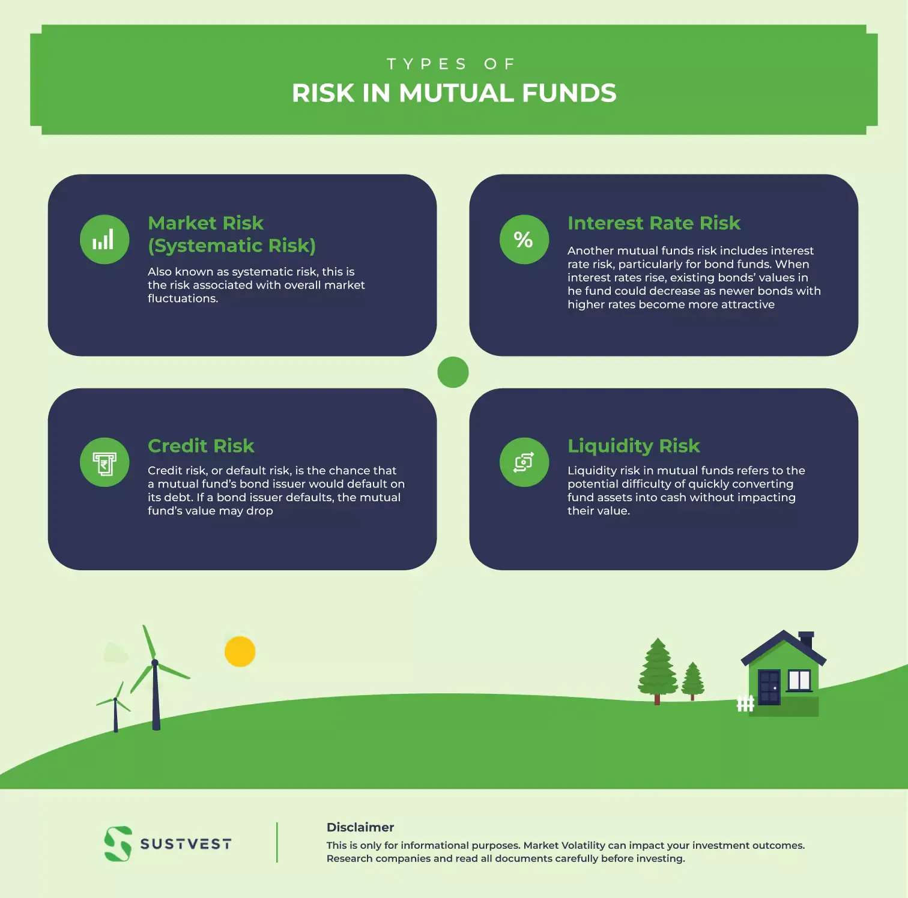

## Table of Contents

## What is market risk and how does it affect mutual funds?

Market risk is the chance that the value of investments can go up or down because of things happening in the overall market. This can be caused by events like economic changes, political events, or natural disasters. When the market goes down, it can affect all kinds of investments, including stocks, bonds, and mutual funds.

Mutual funds are collections of different investments, like stocks and bonds, managed by professionals. When market risk affects the market, it can also affect the value of the investments inside the mutual fund. If the market goes down, the value of the mutual fund can go down too. This means that investors in the mutual fund might see their money lose value. But, because mutual funds are diversified, they can sometimes handle market risk better than if someone invested in just one stock or bond.

## How can investors measure the market risk exposure of a mutual fund?

Investors can measure the market risk exposure of a mutual fund by looking at something called the beta. Beta is a number that shows how much a mutual fund's price moves compared to the overall market. If a mutual fund has a beta of 1, it moves the same as the market. If it's more than 1, it moves more than the market, which means it's riskier. If it's less than 1, it moves less than the market, which means it's less risky.

Another way to measure market risk is by looking at the standard deviation of the mutual fund's returns. Standard deviation tells you how much the fund's returns go up and down over time. A higher standard deviation means the fund's returns are more spread out, which means it's riskier. A lower standard deviation means the returns are more consistent, which means it's less risky. By understanding these measures, investors can get a better idea of how much market risk a mutual fund might have.

## What are the common types of market risks that mutual funds are exposed to?

Mutual funds can be affected by different types of market risks. One common type is [interest rate](/wiki/interest-rate-trading-strategies) risk. This happens when changes in interest rates affect the value of bonds in the mutual fund. If interest rates go up, the value of bonds usually goes down, which can lower the value of the mutual fund. Another type is equity risk, which is the risk that the stock market will go down. Since many mutual funds invest in stocks, a drop in the stock market can lower the value of the mutual fund.

Another type of market risk is currency risk. This happens when a mutual fund invests in foreign markets and the value of the foreign currency changes compared to the investor's home currency. If the foreign currency loses value, it can lower the value of the mutual fund's investments in that country. Lastly, there's [liquidity](/wiki/liquidity-risk-premium) risk, which is the risk that the mutual fund might not be able to sell its investments quickly enough without losing value. This can happen if there's not enough trading in the market for the fund's investments.

## How does diversification help in managing market risk in mutual funds?

Diversification helps manage market risk in mutual funds by spreading investments across different types of assets, industries, and geographic regions. Instead of putting all the money into one stock or bond, a mutual fund can invest in many different things. This way, if one investment goes down in value, the other investments might stay the same or even go up, which can help balance out the losses. It's like not putting all your eggs in one basket. If one egg breaks, you still have others that are safe.

By diversifying, mutual funds can reduce the impact of market risk on the overall portfolio. For example, if the stock market goes down, a mutual fund that also has bonds and real estate investments might not lose as much value. This is because different types of investments often don't move in the same direction at the same time. So, while diversification doesn't eliminate market risk completely, it can make the ups and downs of the market less severe for investors in mutual funds.

## What role does asset allocation play in the market risk exposure of mutual funds?

Asset allocation is all about deciding how to spread the money in a mutual fund across different types of investments, like stocks, bonds, and cash. This choice can really affect how much market risk the mutual fund has. If a mutual fund puts a lot of its money into stocks, it might be riskier because stocks can go up and down a lot. But if it puts more money into bonds or cash, it might be less risky because these usually don't change as much in value.

The right mix of assets can help manage the market risk of a mutual fund. For example, if the stock market is doing badly, having some money in bonds or cash can help keep the value of the mutual fund more stable. By changing the asset allocation, the people who manage the mutual fund can try to lower the risk or go for more growth, depending on what they think will happen in the market. So, asset allocation is a key part of how a mutual fund deals with market risk.

## Can you explain the impact of interest rate changes on mutual funds' market risk?

When interest rates change, it can affect mutual funds, especially if they have a lot of bonds. Bonds are like loans that people give to companies or governments. When interest rates go up, new bonds start paying more interest. This makes the old bonds, which pay less interest, worth less money. So, if a mutual fund has a lot of these older bonds, its value can go down when interest rates rise. This is called interest rate risk, and it's a big part of market risk for mutual funds that invest in bonds.

But it's not just bond funds that feel the impact. Interest rate changes can also affect the whole economy. When interest rates go up, it can slow down spending and growth, which might make stock prices go down too. This means that mutual funds with a lot of stocks can also lose value when interest rates rise. So, whether a mutual fund has mostly bonds or stocks, changes in interest rates can add to its market risk. By understanding this, investors can make better choices about which mutual funds to invest in.

## How do economic cycles influence the market risk exposure of mutual funds?

Economic cycles are like the ups and downs of the economy over time. They can change how much risk a mutual fund faces. During a good economic time, called an expansion, businesses do well and stock prices go up. This can make mutual funds that invest a lot in stocks do better too. But, when the economy starts to slow down, called a contraction or recession, businesses struggle and stock prices can fall. This can hurt mutual funds that have a lot of stocks, making them riskier.

The type of investments in a mutual fund also matters when it comes to economic cycles. Some mutual funds invest in things that do well during different parts of the economic cycle. For example, some funds might focus on industries that do well when the economy is growing, like technology or consumer goods. Others might invest in things that do better when the economy is slowing down, like utilities or healthcare. By understanding where we are in the economic cycle, the people who manage mutual funds can try to pick the right mix of investments to help lower the risk.

## What are the differences in market risk exposure between equity, bond, and hybrid mutual funds?

Equity mutual funds mostly invest in stocks, so they can be pretty risky. When the stock market goes up, these funds can make a lot of money. But if the stock market goes down, their value can drop a lot too. This means they have a high market risk because stocks can change a lot in value. If you look at the beta of an equity fund, it's often more than 1, which means it moves more than the overall market. So, if you're thinking about investing in an equity fund, you should be ready for some big ups and downs.

Bond mutual funds, on the other hand, invest in bonds, which are usually less risky than stocks. Bonds don't change in value as much as stocks do, so bond funds can be a safer choice. But they still have some market risk, especially from changes in interest rates. If interest rates go up, the value of the bonds in the fund can go down. This is called interest rate risk. So, while bond funds are generally less risky than equity funds, they still have their own kind of market risk to watch out for.

Hybrid mutual funds mix both stocks and bonds, trying to balance the risk and reward. They aim to give you some of the growth from stocks but also some of the safety from bonds. The market risk for a hybrid fund depends on how much it invests in stocks versus bonds. If it has more stocks, it will be riskier, like an equity fund. If it has more bonds, it will be less risky, like a bond fund. By mixing the two, hybrid funds try to manage market risk better, but they can still go up and down with the market.

## How can the use of derivatives in mutual funds affect their market risk exposure?

When mutual funds use derivatives like options, futures, and swaps, it can change how much market risk they have. Derivatives are like bets on how the market will move. If a mutual fund uses them well, it can help lower the risk by protecting against big drops in the market. For example, a fund might use options to set a limit on how much it could lose if the market goes down. But if the fund doesn't use them right, it can actually make the risk bigger. If the market moves in a way the fund didn't expect, the derivatives could lose a lot of money, making the fund riskier.

Derivatives can also make a mutual fund more complicated. They can be hard to understand and manage, which adds another layer of risk. If the people running the fund make a mistake with the derivatives, it could hurt the fund's value. So, while derivatives can be a tool to manage market risk, they need to be used carefully. If they're not, they could end up making the mutual fund more risky than it would be without them.

## What are some advanced statistical methods used to assess and manage market risk in mutual funds?

One advanced statistical method used to assess and manage market risk in mutual funds is Value at Risk (VaR). VaR helps figure out the most money a fund might lose over a certain time with a certain chance. For example, a mutual fund might have a VaR of $1 million at a 95% confidence level over a month. This means there's a 5% chance the fund could lose more than $1 million in a month. By knowing this, people who manage the fund can make better choices about how to spread out the investments to lower the risk.

Another method is stress testing. This involves seeing how a mutual fund would do if the market had a big change, like a crash or a sudden jump in interest rates. By running these tests, the people who manage the fund can see which investments might cause big losses and try to fix things before they happen. Stress testing helps them be ready for bad times and keep the fund safer.

A third method is Monte Carlo simulation. This is like playing out many different ways the market could go and seeing how the mutual fund would do in each case. By doing this many times, the people running the fund can get a good idea of all the different risks and how likely they are to happen. This helps them plan better and make the fund less risky for investors.

## How do global events and geopolitical risks impact the market risk exposure of international mutual funds?

Global events and geopolitical risks can really change how much risk international mutual funds have. When things happen around the world, like wars, trade fights, or big changes in governments, they can shake up the markets in different countries. If an international mutual fund has a lot of money in a country where something bad happens, the value of the fund can go down a lot. For example, if there's a war in a country where the fund is invested, the stock market in that country might drop, and the fund will lose money. So, these big events can make the fund riskier because they can cause big changes in the markets.

But it's not just about what happens in one country. Geopolitical risks can also affect the whole world. If big countries fight over trade or if there's a global problem like a health crisis, it can make markets everywhere go down. This means that even if a mutual fund is spread out across many countries, it can still lose value if the whole world is having a tough time. The people who manage the fund have to watch what's happening around the world and try to guess what might happen next. By doing this, they can try to move the fund's money around to places that might be safer.

## What strategies can fund managers employ to mitigate market risk exposure in mutual funds?

Fund managers can use different strategies to lower the market risk in mutual funds. One big way is by spreading out the investments, which is called diversification. Instead of putting all the money into one type of investment, they put it into many different things, like stocks, bonds, and even cash. This way, if one investment goes down, the others might stay the same or go up, which can help balance out the losses. Another strategy is to change how much money is in stocks versus bonds, which is called asset allocation. If the managers think the stock market might go down, they might put more money into bonds or cash to make the fund safer.

Another way to manage market risk is by using something called derivatives, like options and futures. These are like bets on how the market will move. If used right, derivatives can protect the fund from big drops in the market. For example, a fund manager might use options to set a limit on how much the fund could lose if the market goes down. But they have to be careful because if they guess wrong, derivatives can make the fund riskier. Lastly, fund managers can use advanced methods like stress testing and Monte Carlo simulations to see how the fund might do in different situations. By doing this, they can plan better and make the fund less risky for investors.

## References & Further Reading

1. **Bodie, Z., Kane, A., & Marcus, A. J. (2014)**. *Investments* (10th ed.). McGraw-Hill Education.
   - This book provides foundational knowledge on investments, including detailed discussions on market risks and mutual funds.

2. **Lo, A. W. (2008)**. *Hedge Funds: An Analytic Perspective*. Princeton University Press.
   - An academic perspective on various investment strategies, including algorithmic trading and its applications in fund management.

3. **Black, F., & Scholes, M. (1973)**. "The Pricing of Options and Corporate Liabilities." *Journal of Political Economy*, 81(3), 637-654.
   - A seminal paper introducing models that are critical in understanding market risks and derivatives, influencing modern finance and risk assessment.

4. **Narayanan, P., & Poterba, J. M. (1994)**. *Mutual Fund Investment Strategies and Performance*. NBER Working Paper No. 4899.
   - This working paper analyzes mutual fund strategies and their impact, incorporating considerations of various market risks.

5. **Chincarini, L. B., & Kim, D. (2006)**. *Quantitative Equity Portfolio Management: An Active Approach to Portfolio Construction and Management*. McGraw-Hill.
   - A comprehensive guide on quantitative approaches in finance, with insights on equity risk and integrating algorithmic strategies.

6. **Jorion, P. (2007)**. *Value at Risk: The New Benchmark for Managing Financial Risk* (3rd ed.). McGraw-Hill.
   - This book explores the value-at-risk model, offering quantitative evaluation methods for assessing financial market risks.

7. **Harris, L. (2003)**. *Trading and Exchanges: Market Microstructure for Practitioners*. Oxford University Press.
   - An examination of market microstructure, providing insights into high-frequency and algorithmic trading.

8. **Hasbrouck, J. (2007)**. *Empirical Market Microstructure: The Institutions, Economics, and Econometrics of Securities Trading*. Oxford University Press.
   - Provides an empirical perspective on market microstructure and the role of technology in trading environments.

9. **Barber, B. M., & Odean, T. (2011)**. "The Behavior of Individual Investors." *Handbook of the Economics of Finance*, 2, 1533-1570.
   - Discusses how individual investors interact with market risks and investment strategies, relevant for understanding mutual fund behavior.

10. **Agarwal, V., & Naik, N. Y. (2000)**. "Multi-Period Performance Persistence Analysis of Hedge Funds." *The Journal of Financial and Quantitative Analysis*, 35(3), 327-342.
    - Analyzes performance persistence in hedge funds, offering insights into algorithmic strategies over multiple periods.

These resources provide comprehensive information on mutual fund investments, [algorithmic trading](/wiki/algorithmic-trading), and the associated market risks, suitable for both academic and practical applications.

