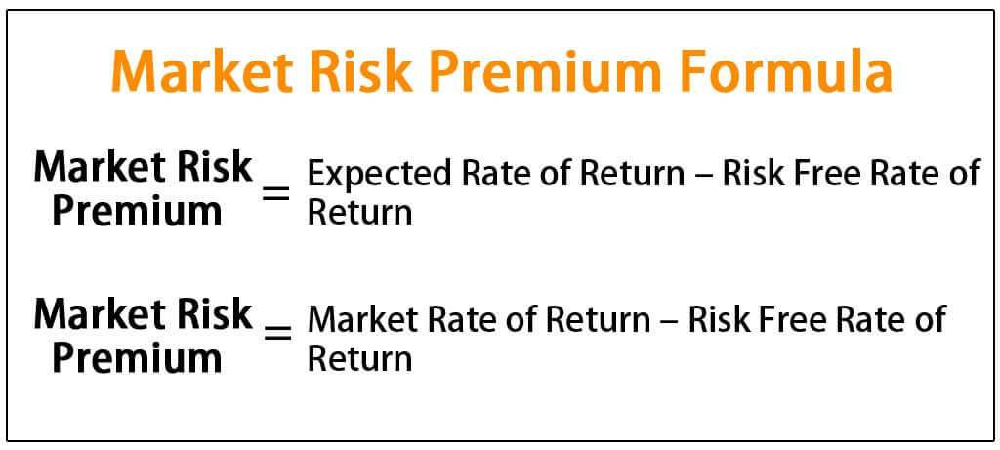

In the world of finance, understanding the expected market return and market risk premium is crucial, especially when engaging in algorithmic trading. These concepts are foundational for investors seeking to evaluate potential investment opportunities and manage risk effectively. The expected market return refers to the profit or loss an investor anticipates from an investment relative to a benchmark index, considering historical performance data. It acts as a guide to project future market behavior, although it remains speculative and subject to various market dynamics.

The market risk premium, on the other hand, represents the additional return that investors demand for choosing a riskier market investment over a risk-free asset. It is an essential component of the Capital Asset Pricing Model (CAPM), which investors use to assess whether the potential returns of an investment justify its associated risks. By understanding these key terms, investors can make more informed decisions, enhancing their strategies to achieve their financial objectives.



In algorithmic trading, these concepts are utilized to create strategies that optimize risk-adjusted returns. By integrating expected returns and market risk premium into algorithmic models, traders can automate decision-making processes, adapting dynamically to market changes. This not only helps in managing risk but also in maximizing potential gains by leveraging computational efficiency. Through this exploration, insights into risk and return metrics can guide investors and traders alike in navigating the complexities of financial markets.

## Table of Contents

## Understanding Expected Market Return

Expected market return refers to the anticipated profit or loss on an investment compared to a benchmark index. This measure is crucial as it helps investors set performance expectations and make informed investment decisions. It is typically derived from historical performance data of indices such as the S&P 500, Dow Jones Industrial Average (DJIA), or Nasdaq Composite. These indices serve as proxies for market performance and help investors gauge what returns could look like over time.

Understanding expected market return involves analyzing past market data to project future returns. Historical returns provide a basis to form expectations, yet these projections remain inherently speculative. Investors often calculate the expected market return using past averages, but these figures are not guaranteed indicators of future performance due to market volatility and unforeseen events.

To illustrate, the expected market return can be calculated as the historical average return over a specific period. Suppose the S&P 500 had annual returns of 10%, 8%, and 12% over three consecutive years. The expected market return could be calculated as follows:

$$
\text{Expected Market Return} = \frac{10\% + 8\% + 12\%}{3} = 10\%
$$

However, relying solely on these calculations in decision-making can pose risks. Factors such as market trends, economic conditions, and geopolitical events can significantly impact future returns, and the actual return could deviate from expected values. Thus, while expected market return is a valuable tool, it should be considered alongside other financial metrics and indicators to manage investment risk effectively.

## Defining Market Risk Premium

Market risk premium is a central concept in finance, defining the additional return that investors expect when opting for higher-risk investments in the market, in contrast to risk-free assets. This measurement is crucial as it quantifies the trade-off between risk and potential reward, guiding investors in their decision-making processes. 

The market risk premium is a fundamental component of the Capital Asset Pricing Model (CAPM), which provides a framework to ascertain the expected rate of return on an asset given its systematic risk relative to the market. The CAPM equation is expressed as:

$$

E(R_i) = R_f + \beta_i \times (E(R_m) - R_f) 
$$

where:
- $E(R_i)$ is the expected return on the investment,
- $R_f$ is the risk-free rate of return,
- $\beta_i$ is the beta coefficient of the investment, reflecting its sensitivity to market movements,
- $E(R_m)$ is the expected return on the market portfolio,
- $E(R_m) - R_f$ is the market risk premium.

Understanding the market risk premium allows investors to evaluate the attractiveness of potential investments by factoring in market [volatility](/wiki/volatility-trading-strategies). This calculation helps determine whether the potential return justifies the assumed risk. Essentially, it guides investors in managing portfolios by identifying investments that align with their risk tolerance and return expectations. By incorporating this premium, investors can better navigate financial markets, ensuring a balanced approach between potential gains and the risks involved. 

This risk-return evaluation becomes crucial in periods of economic uncertainty when volatility increases, making the market risk premium a pivotal indicator for investment decisions. The market risk premium, therefore, serves not just as a measure of expected additional return but also as a barometer of investor sentiment and market conditions at any given time.

## The Role of Market Indexes in Calculating Returns

Market indexes are fundamental tools in finance, serving as benchmarks to gauge the performance of various investments. By providing a comprehensive measure of market trends through aggregated data, these indexes enable investors to derive expected rates of return based on historical performance. Major indexes like the S&P 500, Dow Jones Industrial Average (DJIA), and Nasdaq represent different segments of the market and provide a spectrum of insights based on their unique compositions.

Historical data from market indexes, which encapsulate returns over various time periods, allow investors to make informed predictions about future market behavior. Although future returns are inherently uncertain, historical performance provides a foundational reference point. For instance, if an index has consistently returned an average annual rate of 8% over several decades, investors might use this information to forecast similar potential returns, though recognizing the speculative nature of such predictions.

Investors utilize these historical returns to develop and refine their portfolio strategies. By aligning their investment approaches with the average returns of established indexes, they aim to achieve desired outcomes while managing risk. These strategies often involve calculating metrics such as the expected market return, where historical index performance guides decision-making processes.

Python can be used to aid in these calculations. For example, investors can programmatically assess historical index data to calculate average returns:

```python
import yfinance as yf  # For more datasets, visit: https://paperswithbacktest.com/datasets
import numpy as np

# Download historical data for S&P 500
data = yf.download('^GSPC', start='2000-01-01', end='2023-01-01')

# Calculate daily returns
data['Daily Return'] = data['Adj Close'].pct_change()

# Mean annual return
average_annual_return = np.mean(data['Daily Return']) * 252  # 252 trading days in a year

print(f"Average Annual Return: {average_annual_return:.2%}")
```

This script downloads historical data for the S&P 500, computes daily returns, and calculates the average annual return. Such tools empower investors to analyze market trends quantitatively, tailoring investment activities to align with anticipated market trajectories. By grounding portfolio decisions in historical data, investors strive to optimize their strategies, balancing between potential risk and return.

## Algorithmic Trading and Its Use of Risk Metrics

Algorithmic trading utilizes sophisticated algorithms and computational power to automate the process of buying and selling securities based on predefined criteria. One critical aspect of these algorithms is their reliance on financial metrics like expected market returns and market risk premium to optimize risk-adjusted returns. This optimization is achieved by calculating the balance between potential returns and the accompanying risks, facilitating more informed decision-making.

Incorporating expected market return into an algorithm involves analyzing historical performance data to predict future behaviors of various assets. These predictions allow traders to set thresholds and triggers within their algorithms for executing trades that align with their risk tolerance and investment goals. Additionally, the market risk premium, which represents the additional return expected for taking on the extra risk of investing in the market over a risk-free asset, is another vital component. By accounting for this premium, [algorithmic trading](/wiki/algorithmic-trading) systems can adjust their strategies to target assets that potentially offer higher returns for their risk profile.

Furthermore, algorithmic strategies are designed to adapt to changing market conditions by integrating a wide array of financial data inputs. This can include real-time market data, economic indicators, geopolitical events, and other relevant variables that might influence asset prices. The dynamic nature of these data inputs allows algorithms to continually refine their decision-making processes, ensuring they remain effective even as market dynamics shift.

To operationalize these concepts in algorithmic trading, traders often employ statistical and [machine learning](/wiki/machine-learning) models within their algorithms. For example, using Python, a trader might develop a model to calculate the expected returns and market risk premium using statistical libraries like NumPy or Pandas. Here's a simple example of how this could be done:

```python
import numpy as np
import pandas as pd

# Assuming `returns_data` is a DataFrame with historical returns of the market and a risk-free rate column
returns_data = pd.DataFrame({
    "market_return": [0.07, 0.08, 0.06],  # Example market returns
    "risk_free_rate": [0.05, 0.05, 0.05]  # Example risk-free rate (e.g., from T-bills)
})

# Calculate the excess market return (market return over risk-free rate)
returns_data['excess_market_return'] = returns_data['market_return'] - returns_data['risk_free_rate']

# Calculate the mean market risk premium
market_risk_premium = returns_data['excess_market_return'].mean()

print(f"Estimated Market Risk Premium: {market_risk_premium:.2%}")
```

This example illustrates how traders might calculate the market risk premium, which is then used in algorithms to forecast potential performance and risk levels. In practice, more sophisticated models may incorporate various factors and employ advanced techniques such as machine learning for better prediction accuracy.

Overall, algorithmic trading employs expected market returns and market risk premium as fundamental inputs, ensuring the strategies are robust, data-driven, and capable of maximizing risk-adjusted returns amid the complexities of financial markets.

## Practical Example: Calculating Market Risk Premium

Consider a scenario where the annual return from the S&P 500 index is 7%, while the prevailing risk-free rate, often proxied by U.S. Treasury bills, stands at 5%. The market risk premium here is calculated by subtracting the risk-free rate from the expected market return. 

Mathematically, it is expressed as:

$$
\text{Market Risk Premium} = \text{Expected Market Return} - \text{Risk-Free Rate}
$$

Substituting the given values:

$$
\text{Market Risk Premium} = 7\% - 5\% = 2\%
$$

This 2% premium represents the additional compensation investors demand for taking on the extra risk associated with investing in the stock market as opposed to a risk-free asset. A thorough understanding of the market risk premium is vital for investment strategies, as it aids in assessing the risk landscape of individual stocks within the broader market context. For instance, a high market risk premium may indicate an expectation of higher returns for taking on additional risk, which could appeal to risk-tolerant investors. Conversely, a low or negative premium might signal caution, suggesting that the forecasted returns are insufficient for the accompanying risks.

When evaluating investment decisions, investors must consider the individual riskiness of stocks alongside market risk premiums. This risk-return assessment facilitates more informed decision-making, aligning investment choices with risk tolerance and return expectations. An illustrative example is evident in the Capital Asset Pricing Model (CAPM), where the market risk premium is a core component in determining the expected return on an asset given its systemic risk. 

By understanding and calculating the market risk premium accurately, investors enhance their ability to gauge potential profits relative to taking on higher levels of risk, thus optimizing their portfolios for their specific financial goals and risk appetites.

## Conclusion

Expected market return and market risk premium are fundamental components of financial analysis, providing a foundation for making informed investment decisions and developing sophisticated algorithmic trading strategies. These metrics enable investors to anticipate potential gains while considering the inherent risk of market volatility. By balancing historical return data with current market conditions, investors gain a nuanced understanding of expected outcomes. 

Algorithmic trading, which uses these principles, can enhance trading performance by optimizing for risk-adjusted returns. By integrating expected market return and market risk premium into their algorithms, traders can navigate the complex financial landscape with greater precision and agility. This involves continuously updating algorithms to reflect real-time data and market shifts, ensuring the strategies remain relevant and effective.

Incorporating these financial principles into trading algorithms allows traders to manage risks efficiently while maximizing potential gains. The ability to predict and adjust for market changes, while being rooted in historical data and statistical analysis, offers an edge in achieving desired investment outcomes. Therefore, understanding these concepts not only strengthens the strategic framework of investment but also significantly contributes to maximizing returns in the dynamic field of algorithmic trading.

## References & Further Reading

[1]: ["Damodaran on Valuation: Security Analysis for Investment and Corporate Finance"](https://www.amazon.com/Damodaran-Valuation-Security-Investment-Corporate/dp/0471751219) by Aswath Damodaran

[2]: ["The Capital Asset Pricing Model: Theory and Evidence"](https://pubs.aeaweb.org/doi/pdfplus/10.1257/0895330042162430) by Eugene F. Fama and Kenneth R. French

[3]: ["Risk and Asset Allocation"](https://link.springer.com/book/10.1007/978-3-540-27904-4) by Attilio Meucci

[4]: ["Algorithmic Trading: Winning Strategies and Their Rationale"](https://www.wiley.com/en-us/Algorithmic+Trading%3A+Winning+Strategies+and+Their+Rationale-p-9781118746912) by Ernie Chan

[5]: ["Investments"](https://www.nerdwallet.com/article/investing/the-best-investments-right-now) by Zvi Bodie, Alex Kane, and Alan Marcus