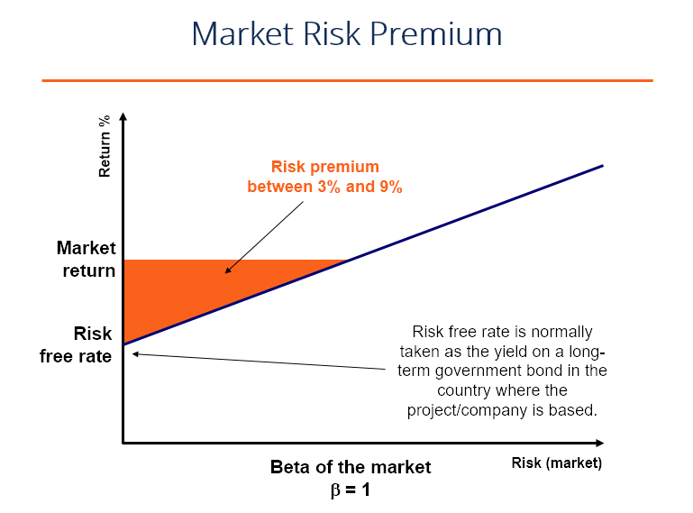

## Table of Contents

## What is market risk premium?

The market risk premium is the extra return that investors expect to earn from investing in the stock market compared to a risk-free investment, like government bonds. It represents the additional reward investors demand for taking on the higher risk of the stock market. This concept is important because it helps investors understand the balance between risk and reward when deciding where to put their money.

To calculate the market risk premium, you subtract the expected return of a risk-free asset from the expected return of the market. For example, if the expected return of the stock market is 8% and the risk-free rate is 3%, the market risk premium would be 5%. This number can change over time based on economic conditions, investor sentiment, and other factors, so it's important to keep an eye on it when making investment decisions.

## How is market risk premium calculated?

The market risk premium is calculated by taking the expected return of the stock market and subtracting the expected return of a risk-free investment, like government bonds. For example, if the stock market is expected to return 8% and a risk-free bond returns 3%, the market risk premium would be 5%. This number tells investors how much extra return they can expect for taking the risk of investing in stocks instead of safer options.

This calculation can change over time because the expected returns of the stock market and risk-free investments are not always the same. Economic conditions, how investors feel about the market, and other factors can make these numbers go up or down. So, when making investment choices, it's important to keep an eye on the current market risk premium to understand the potential reward for the risks you're taking.

## What is the expected market return?

The expected market return is what people think the stock market will earn in the future. It's like a guess based on looking at how the market has done in the past, what's happening in the economy right now, and what might happen next. Investors use this number to decide if they should put their money in the stock market or somewhere else.

This number can change a lot because the future is hard to predict. If the economy is doing well and people feel good about it, the expected market return might be higher. But if there's a lot of uncertainty or bad news, people might expect the market to do worse. So, it's important for investors to keep an eye on these things and update their expectations as the world changes.

## Why is the market risk premium important for investors?

The market risk premium is important for investors because it helps them understand how much extra money they might make by choosing to invest in the stock market instead of safer options like government bonds. It's like a reward for taking on more risk. If the market risk premium is high, it means investors can expect a bigger reward for putting their money in stocks, which might make them more willing to take that risk.

On the other hand, if the market risk premium is low, it might not seem worth it to take the risk of the stock market because the extra return isn't that big. This can help investors decide where to put their money based on how much risk they're comfortable with and how much reward they're looking for. By keeping an eye on the market risk premium, investors can make smarter choices about their investments.

## How does the market risk premium relate to the Capital Asset Pricing Model (CAPM)?

The market risk premium is a key part of the Capital Asset Pricing Model, or CAPM. CAPM is a way to figure out how much return an investment should give you based on how risky it is. It uses the market risk premium to do this. The formula for CAPM is: Expected Return = Risk-Free Rate + Beta * (Market Risk Premium). Here, the market risk premium is the difference between what you expect from the whole stock market and what you'd get from a safe investment like a government bond.

In simple terms, the market risk premium in CAPM tells you how much extra money you should expect for taking the risk of investing in the stock market. If the market risk premium is big, it means you might get a lot more money for putting your money in stocks instead of safe bonds. But if it's small, the extra money might not be worth the risk. So, the market risk premium helps investors decide if the stock market is a good place for their money based on how much risk they're willing to take.

## What factors influence the market risk premium?

The market risk premium can change because of many different things. One big thing is how the economy is doing. If the economy is growing and people feel good about it, they might think the stock market will do well too, so the market risk premium might be smaller because the risk seems lower. But if the economy is doing badly or there's a lot of uncertainty, people might want more money to take the risk of investing in stocks, so the market risk premium could go up.

Another thing that can affect the market risk premium is how investors feel about the stock market. If everyone is excited and thinks the market will go up, they might not need as much extra return to invest, so the market risk premium could be lower. But if people are worried or scared about what might happen, they'll want more money to take that risk, which can make the market risk premium bigger.

Also, things like interest rates and what's happening around the world can play a part. If interest rates go up, safe investments like bonds might give you more money, so the market risk premium might need to be bigger to make stocks look good. And if there's trouble in other countries or big events happening, that can make the market risk premium change too because it adds more uncertainty to the mix.

## How has the market risk premium varied historically?

Over time, the market risk premium has changed a lot because of different things happening in the world and the economy. If we look back at history, we can see that during good times when the economy was growing and people felt safe, the market risk premium was usually lower. This is because people didn't need as much extra money to want to invest in stocks. For example, in the late 1990s, during the tech boom, the market risk premium was pretty small because everyone was excited about the stock market.

But when bad things happened, like during the financial crisis in 2008, the market risk premium went up a lot. People were scared and unsure about what would happen next, so they wanted a bigger reward to take the risk of investing in stocks. This shows how the market risk premium can go up and down based on how people feel about the economy and what's going on in the world. By looking at these patterns, we can learn more about how investors think and make choices.

## Can market risk premium be negative, and what does that signify?

Yes, the market risk premium can be negative, but it's not very common. It happens when people expect to make more money from safe investments like government bonds than from the stock market. This might sound strange because usually, people want more money for taking bigger risks. But if everyone is really worried about the stock market and thinks it will do badly, they might be okay with less money from safe investments instead.

When the market risk premium is negative, it means that investors are really scared or unsure about the stock market. They think that even with the risk, the stock market might not give them a good return. So, they choose to put their money in safer places, even if those places don't give them as much money. This can happen during times of big economic trouble or when there's a lot of uncertainty in the world.

## How do different countries' market risk premiums compare?

Market risk premiums can be different in different countries because each country's economy and stock market are unique. In countries where the economy is strong and people feel safe about the future, the market risk premium might be lower. For example, in places like the United States or Germany, where the stock markets are big and stable, investors might not need as much extra money to invest in stocks. But in countries with smaller or less stable economies, like some developing countries, the market risk premium can be higher because investors want more money to take the bigger risk.

These differences can also change over time. For example, if a country goes through a big economic crisis, its market risk premium might go up a lot because people are more worried about investing there. On the other hand, if a country does really well and its economy grows fast, the market risk premium might go down because people feel safer about putting their money in that country's stock market. So, it's important for investors to look at what's happening in each country and understand how that affects the market risk premium when they're thinking about where to invest their money.

## What are the limitations of using market risk premium in investment decisions?

Using the market risk premium to make investment decisions has some problems. One big problem is that it's hard to know what the future will be like. The market risk premium is based on guesses about what the stock market and safe investments will do in the future. If these guesses are wrong, then the market risk premium might not be a good guide for making choices. Also, different people might have different guesses about the future, so the market risk premium can be different depending on who you ask.

Another problem is that the market risk premium can change a lot. It can go up and down because of things like the economy, what's happening around the world, and how people feel about the stock market. This makes it tricky to use the market risk premium to make long-term plans because it might not stay the same. If the market risk premium changes a lot, then the decisions you make based on it might not work out the way you hoped.

## How can an investor use market risk premium to assess the risk of a specific investment?

An investor can use the market risk premium to understand how much extra money they might get from investing in the stock market compared to safer investments like government bonds. By looking at the market risk premium, an investor can see if the extra reward for taking the risk of investing in stocks is big enough for them. If the market risk premium is high, it means the stock market might give a lot more money than safe investments, which could make the risk seem worth it. But if the market risk premium is low, the extra money might not be enough to make up for the risk, and the investor might decide to put their money in safer places instead.

To assess the risk of a specific investment, an investor can use the Capital Asset Pricing Model (CAPM), which includes the market risk premium. The CAPM helps figure out what return an investment should give based on how risky it is. The formula for CAPM uses the market risk premium along with the investment's beta, which shows how much the investment moves with the market. If an investment has a high beta, it means it's more sensitive to what's happening in the market, so the investor might want a bigger market risk premium to feel okay about taking that risk. By using the market risk premium in the CAPM, an investor can better understand if the potential reward of a specific investment is worth the risk they're taking.

## What advanced methodologies exist for estimating the market risk premium more accurately?

One way to estimate the market risk premium more accurately is by using the historical average method. This means looking at how much more money the stock market has made compared to safe investments like government bonds over a long time, like 50 or 100 years. By looking at this long history, people can get a good idea of what the market risk premium might be in the future. But this method has a problem: the past doesn't always tell us what will happen next. If something big changes in the economy or the world, the market risk premium might be different than what the history says.

Another way is to use surveys and expert opinions. This means asking a lot of people who know about the stock market, like financial analysts and economists, what they think the market risk premium will be. By putting all these different opinions together, you can get a good guess about what the market risk premium might be. But this method can also be tricky because people's guesses can be wrong, especially if something unexpected happens. So, even though it's a good way to get different views, it's not perfect.

## What is the understanding of expected market return?

Expected market return refers to the anticipated profit or loss on an investment compared to a benchmark index. This measure is crucial as it helps investors set performance expectations and make informed investment decisions. It is typically derived from historical performance data of indices such as the S&P 500, Dow Jones Industrial Average (DJIA), or Nasdaq Composite. These indices serve as proxies for market performance and help investors gauge what returns could look like over time.

Understanding expected market return involves analyzing past market data to project future returns. Historical returns provide a basis to form expectations, yet these projections remain inherently speculative. Investors often calculate the expected market return using past averages, but these figures are not guaranteed indicators of future performance due to market volatility and unforeseen events.

To illustrate, the expected market return can be calculated as the historical average return over a specific period. Suppose the S&P 500 had annual returns of 10%, 8%, and 12% over three consecutive years. The expected market return could be calculated as follows:

$$
\text{Expected Market Return} = \frac{10\% + 8\% + 12\%}{3} = 10\%
$$

However, relying solely on these calculations in decision-making can pose risks. Factors such as market trends, economic conditions, and geopolitical events can significantly impact future returns, and the actual return could deviate from expected values. Thus, while expected market return is a valuable tool, it should be considered alongside other financial metrics and indicators to manage investment risk effectively.

## What is the Definition of Market Risk Premium?

Market risk premium is a central concept in finance, defining the additional return that investors expect when opting for higher-risk investments in the market, in contrast to risk-free assets. This measurement is crucial as it quantifies the trade-off between risk and potential reward, guiding investors in their decision-making processes. 

The market risk premium is a fundamental component of the Capital Asset Pricing Model (CAPM), which provides a framework to ascertain the expected rate of return on an asset given its systematic risk relative to the market. The CAPM equation is expressed as:

$$

E(R_i) = R_f + \beta_i \times (E(R_m) - R_f) 
$$

where:
- $E(R_i)$ is the expected return on the investment,
- $R_f$ is the risk-free rate of return,
- $\beta_i$ is the beta coefficient of the investment, reflecting its sensitivity to market movements,
- $E(R_m)$ is the expected return on the market portfolio,
- $E(R_m) - R_f$ is the market risk premium.

Understanding the market risk premium allows investors to evaluate the attractiveness of potential investments by factoring in market [volatility](/wiki/volatility-trading-strategies). This calculation helps determine whether the potential return justifies the assumed risk. Essentially, it guides investors in managing portfolios by identifying investments that align with their risk tolerance and return expectations. By incorporating this premium, investors can better navigate financial markets, ensuring a balanced approach between potential gains and the risks involved. 

This risk-return evaluation becomes crucial in periods of economic uncertainty when volatility increases, making the market risk premium a pivotal indicator for investment decisions. The market risk premium, therefore, serves not just as a measure of expected additional return but also as a barometer of investor sentiment and market conditions at any given time.

## How can one calculate the market risk premium in a practical example?

Consider a scenario where the annual return from the S&P 500 index is 7%, while the prevailing risk-free rate, often proxied by U.S. Treasury bills, stands at 5%. The market risk premium here is calculated by subtracting the risk-free rate from the expected market return. 

Mathematically, it is expressed as:

$$
\text{Market Risk Premium} = \text{Expected Market Return} - \text{Risk-Free Rate}
$$

Substituting the given values:

$$
\text{Market Risk Premium} = 7\% - 5\% = 2\%
$$

This 2% premium represents the additional compensation investors demand for taking on the extra risk associated with investing in the stock market as opposed to a risk-free asset. A thorough understanding of the market risk premium is vital for investment strategies, as it aids in assessing the risk landscape of individual stocks within the broader market context. For instance, a high market risk premium may indicate an expectation of higher returns for taking on additional risk, which could appeal to risk-tolerant investors. Conversely, a low or negative premium might signal caution, suggesting that the forecasted returns are insufficient for the accompanying risks.

When evaluating investment decisions, investors must consider the individual riskiness of stocks alongside market risk premiums. This risk-return assessment facilitates more informed decision-making, aligning investment choices with risk tolerance and return expectations. An illustrative example is evident in the Capital Asset Pricing Model (CAPM), where the market risk premium is a core component in determining the expected return on an asset given its systemic risk. 

By understanding and calculating the market risk premium accurately, investors enhance their ability to gauge potential profits relative to taking on higher levels of risk, thus optimizing their portfolios for their specific financial goals and risk appetites.

## References & Further Reading

[1]: ["Damodaran on Valuation: Security Analysis for Investment and Corporate Finance"](https://www.amazon.com/Damodaran-Valuation-Security-Investment-Corporate/dp/0471751219) by Aswath Damodaran

[2]: ["The Capital Asset Pricing Model: Theory and Evidence"](https://pubs.aeaweb.org/doi/pdfplus/10.1257/0895330042162430) by Eugene F. Fama and Kenneth R. French

[3]: ["Risk and Asset Allocation"](https://link.springer.com/book/10.1007/978-3-540-27904-4) by Attilio Meucci

[4]: ["Algorithmic Trading: Winning Strategies and Their Rationale"](https://www.wiley.com/en-us/Algorithmic+Trading%3A+Winning+Strategies+and+Their+Rationale-p-9781118746912) by Ernie Chan

[5]: ["Investments"](https://www.nerdwallet.com/article/investing/the-best-investments-right-now) by Zvi Bodie, Alex Kane, and Alan Marcus