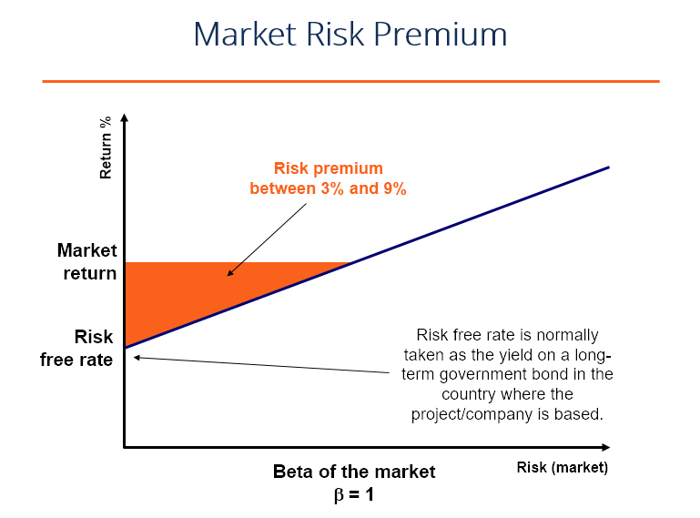

## Table of Contents

## What is the market risk premium?

The market risk premium is the extra return that investors expect to get from investing in the stock market instead of in something very safe, like government bonds. It's like a reward for taking the risk of investing in stocks, which can go up and down a lot more than safe investments. If you think of it as a bonus, it's what investors hope to earn for putting their money into the stock market, which is riskier than just keeping it in a safe place.

This premium can change over time because it depends on how risky people think the stock market is compared to safe investments. For example, if people start to think stocks are very risky, they will want a bigger reward for investing in them, so the market risk premium goes up. On the other hand, if they think the stock market is not so risky, the premium might go down. Economists and investors use this idea to help decide if stocks are a good investment compared to other options.

## Why is the market risk premium important for investors?

The market risk premium is important for investors because it helps them understand the extra money they might make by choosing to invest in the stock market instead of keeping their money in safe places like government bonds. It's like a guide that tells investors how much more they could earn for taking the risk of investing in stocks, which can be unpredictable and go up and down a lot.

Knowing the market risk premium can help investors make smarter choices about where to put their money. If the premium is high, it might mean that stocks are a good deal because investors can get a bigger reward for the risk they're taking. But if the premium is low, it might make more sense to stick with safer investments. This way, investors can balance the risk they're willing to take with the potential rewards they hope to get.

## How is the market risk premium calculated?

The market risk premium is figured out by taking the expected return from the stock market and then subtracting the return from a safe investment, like government bonds. For example, if you think the stock market will give you a 10% return and a government bond gives you a 3% return, the market risk premium would be 10% minus 3%, which equals 7%. This 7% is the extra return investors expect for putting their money in the riskier stock market instead of the safer bond.

To find these numbers, people often look at what's happened in the past. They might use the average return of the stock market over many years and compare it to the average return of government bonds over the same time. But because the future isn't the same as the past, they also think about what might happen next. Things like the economy, how risky people think the stock market is right now, and what's going on in the world can change what investors expect for the future. So, the market risk premium isn't just a simple math problem; it's more like a guess based on what we know now and what we think will happen.

## What is the difference between market risk premium and equity risk premium?

The market risk premium and the equity risk premium are similar ideas but can be a bit different depending on how people use them. The market risk premium is the extra return that investors expect to get from investing in the whole stock market compared to a safe investment like government bonds. It's like a reward for taking the risk of investing in stocks, which can go up and down a lot more than safe investments.

The equity risk premium, on the other hand, is specifically about the extra return expected from investing in stocks (or equities) compared to those same safe investments. Sometimes people use the terms interchangeably, but the equity risk premium can focus more narrowly on stocks. If someone is talking about the market risk premium, they might be thinking about the overall market, which could include other types of investments too, not just stocks. Both help investors understand the risk and reward of putting their money in the stock market.

## Can you explain the historical data on market risk premium?

Looking back at history, the market risk premium has changed a lot over time. In the United States, if you look at the long-term average from the early 1900s to now, the market risk premium has been around 5% to 6%. This means that, on average, stocks have given investors about 5% to 6% more return than safe government bonds over many years. But it's important to know that this number can be very different in shorter periods. For example, during times like the Great Depression or the 2008 financial crisis, the market risk premium was much higher because people thought stocks were very risky.

Even though the long-term average gives us a good idea, the market risk premium can go up and down a lot year by year. In the 1990s, when the economy was doing well and the stock market was booming, the market risk premium was lower because people felt safer about investing in stocks. But after big events like the dot-com bubble burst or the 2008 crisis, the premium went up because people were more worried about losing money in the stock market. So, when looking at historical data, it's helpful to remember that the market risk premium isn't a fixed number but changes with what's happening in the world and how people feel about risk.

## How does the market risk premium vary across different countries?

The market risk premium can be different in different countries because each country has its own economy, risks, and ways of doing things. For example, a country with a stable economy and strong government might have a lower market risk premium because people feel safer investing there. On the other hand, a country with a lot of ups and downs in its economy or political problems might have a higher market risk premium because people want more reward for the extra risk they're taking.

When you look at data from around the world, you can see these differences clearly. In places like the United States or Germany, where the markets are big and well-known, the market risk premium might be around 5% to 6% over many years. But in countries like Brazil or India, where things can change a lot more quickly, the market risk premium might be higher, sometimes even over 7% or 8%. This shows how the risk and reward of investing can change a lot depending on where you are in the world.

## What are the factors that influence changes in the market risk premium?

The market risk premium changes because of many things happening in the world. One big reason is how the economy is doing. When the economy is growing and people feel good about it, the market risk premium might go down because they think stocks are less risky. But if the economy is not doing well, or if there's a big problem like a financial crisis, the premium can go up because people want more reward for taking the risk of investing in stocks.

Another thing that changes the market risk premium is how people feel about risk. If everyone thinks the stock market is very risky, they will want a bigger reward for investing in it, so the premium goes up. But if people feel safer about the stock market, the premium might go down. Things like news, politics, and even big events around the world can change how people feel about risk and affect the market risk premium.

Also, interest rates play a role. When interest rates on safe investments like government bonds go up, the market risk premium might go down because the difference between what you can get from stocks and bonds gets smaller. But if interest rates on safe investments go down, the premium might go up because the reward for taking the risk of investing in stocks looks bigger compared to the smaller return from bonds.

## How can investors use the market risk premium in their investment decisions?

Investors can use the market risk premium to help decide where to put their money. It's like a tool that tells them how much extra money they might make by choosing stocks instead of safer investments like government bonds. If the market risk premium is high, it means investors could get a bigger reward for the risk they're taking. This might make stocks look like a good deal, and investors might decide to put more of their money into the stock market. But if the premium is low, it might be better to stick with safer investments because the extra reward for taking the risk of stocks isn't as big.

Understanding the market risk premium also helps investors balance risk and reward. They can look at the current premium and think about their own comfort with risk. If an investor doesn't mind taking a lot of risk, a high market risk premium might be a sign to go for stocks. But if they want to be safer, a lower premium might make them choose bonds or other safe investments instead. By keeping an eye on the market risk premium, investors can make smarter choices that fit their goals and how much risk they're willing to take.

## What are the limitations and criticisms of using the market risk premium?

One big problem with using the market risk premium is that it's really hard to guess what it will be in the future. People often look at what's happened in the past to make their guess, but the past doesn't always tell us what will happen next. Things like the economy, what's going on in the world, and how people feel about risk can change a lot, so the market risk premium can be different from what we expect. This makes it tricky for investors to use it to make decisions because they're trying to plan with numbers that might not be right.

Another issue is that different people might come up with different numbers for the market risk premium. If one person thinks the stock market is very risky and another thinks it's not so bad, they'll end up with different ideas about what the premium should be. This can lead to a lot of arguments and confusion. Plus, some people think that the whole idea of the market risk premium is too simple. They say it doesn't take into account all the different kinds of risks in the stock market, like the risk of one company doing badly or the whole market going down. So, while the market risk premium can be a helpful guide, it's not perfect and comes with a lot of challenges.

## How does the market risk premium relate to the Capital Asset Pricing Model (CAPM)?

The market risk premium is a big part of the Capital Asset Pricing Model, or CAPM for short. CAPM is a way to figure out how much money you might make from investing in something risky, like stocks. It says that the return you expect from an investment depends on how risky it is compared to the whole stock market. The market risk premium is the extra money you expect to make from the stock market compared to a safe investment like government bonds. In CAPM, this premium is used to help calculate the expected return of any investment by showing the reward for taking on the risk of the market.

In the CAPM formula, the market risk premium is multiplied by something called "beta," which shows how much an investment moves with the market. If an investment has a high beta, it means it's more sensitive to what the market does, so it's riskier. The market risk premium helps adjust the expected return based on this risk. For example, if the market risk premium is 5% and an investment's beta is 1.2, the extra return you expect from that investment because of market risk would be 5% times 1.2, which is 6%. This way, CAPM uses the market risk premium to connect the risk of the whole market to the risk and expected return of individual investments.

## What are some advanced methods to estimate the market risk premium more accurately?

One advanced way to estimate the market risk premium more accurately is by using surveys. Instead of just looking at past numbers, researchers can ask a lot of investors what they think the market risk premium will be in the future. This can give a good idea of what people expect because it takes into account how they feel about risk right now. Surveys like the one done by Duke University's CFO Survey or the Federal Reserve's Survey of Professional Forecasters can help make a better guess about the market risk premium.

Another method is to use what's called a "dividend discount model." This model looks at the money that companies pay out to their shareholders as dividends and tries to figure out how much those dividends will grow in the future. By comparing this to the return from safe investments like government bonds, you can get a more accurate estimate of the market risk premium. This way of doing things can be more detailed and take into account what companies are actually doing with their money, which can make the guess about the market risk premium more reliable.

There's also something called the "implied market risk premium," which uses current stock prices and expected future earnings to figure out what the market risk premium must be. This method looks at what the market is saying right now about future returns and risk, rather than just using old data. By using these more advanced methods, investors can get a better sense of what the market risk premium might be, helping them make smarter decisions about where to put their money.

## How has the perception and application of the market risk premium evolved over time in financial theory and practice?

Over the years, how people think about and use the market risk premium has changed a lot in financial theory and practice. At first, it was just a simple idea to help investors understand the extra money they might make by choosing stocks over safe investments like government bonds. But as time went on, financial experts started to see that the market risk premium isn't a fixed number. They realized it changes with things like the economy, how people feel about risk, and even big world events. So, they started using more detailed ways to guess what it might be in the future, like looking at surveys or using fancy math models.

Today, the market risk premium is a big part of many financial models, like the Capital Asset Pricing Model (CAPM), which helps investors figure out how much money they might make from different investments. People now use all kinds of advanced methods to estimate it, trying to make their guesses more accurate. But even with all these new ways of doing things, it's still hard to predict the market risk premium because the future is always uncertain. So, while it's become a more complex and important tool in financial planning, it's also clear that it's just one piece of the puzzle when making investment decisions.

## What is the Understanding of Market Risk Premium?

Market risk premium represents the additional return investors require to compensate for the higher risk of holding a market portfolio compared to risk-free assets. It is a fundamental concept in asset pricing and plays a critical role in the Capital Asset Pricing Model (CAPM), which estimates the expected return on an equity investment. In the context of CAPM, the expected return of an asset can be expressed as:

$$

E(R_i) = R_f + \beta_i(E(R_m) - R_f)
$$

where:
- $E(R_i)$ is the expected return of the investment,
- $R_f$ is the risk-free rate,
- $\beta_i$ is the beta of the investment, representing its sensitivity to movements in the market,
- $E(R_m)$ is the expected return of the market,
- $(E(R_m) - R_f)$ is the market risk premium.

The risk-free rate, often derived from a government bond yield like that of U.S. Treasury bonds, represents the return on an investment with no risk of financial loss. By contrast, the expected market return reflects the average return anticipated from holding a broad market index like the S&P 500. Thus, the market risk premium is effectively calculated as the difference between the expected market return and the risk-free rate:

$$

\text{Market Risk Premium} = E(R_m) - R_f
$$

This difference indicates the additional compensation investors seek for assuming the extra risk associated with the market as opposed to investing in risk-free assets. The market risk premium gives insight into the perceived risk level in the financial markets; a higher premium suggests higher perceived risk and vice versa.

Understanding the market risk premium is essential for investors as it aids in evaluating the risk-return trade-off of potential investments. It helps in the assessment of whether an investment provides sufficient returns to justify the inherent risks. An accurate estimation of the market risk premium, based on historical averages or forward-looking assessments, is crucial for effective portfolio management and strategic asset allocation.

## References & Further Reading

[1]: Fama, E. F., & French, K. R. (2004). ["The Capital Asset Pricing Model: Theory and Evidence."](https://www.aeaweb.org/articles?id=10.1257/0895330042162430) Journal of Economic Perspectives, 18(3), 25-46.

[2]: Malkiel, B. G. (2016). ["A Random Walk Down Wall Street."](https://www.amazon.com/Random-Walk-Down-Wall-Street/dp/0393358380) W. W. Norton & Company.

[3]: Hull, J. C. (2014). ["Options, Futures, and Other Derivatives."](https://www.amazon.com/Options-Futures-Other-Derivatives-9th/dp/0133456315) Pearson.

[4]: Sharpe, W. F. (1964). ["Capital Asset Prices: A Theory of Market Equilibrium Under Conditions of Risk."](https://onlinelibrary.wiley.com/doi/full/10.1111/j.1540-6261.1964.tb02865.x) The Journal of Finance, 19(3), 425-442.

[5]: ["Algorithmic Trading and DMA: An Introduction to Direct Access Trading Strategies"](https://www.amazon.com/Algorithmic-Trading-DMA-introduction-strategies/dp/0956399207) by Barry Johnson

[6]: Treynor, J. L. (1961). ["Toward a Theory of Market Value of Risky Assets."](http://www.empirical.net/wp-content/uploads/2014/12/Treynor-Toward-a-Theory-of-Market-Value-of-Risky-Assets.pdf) Unpublished manuscript.