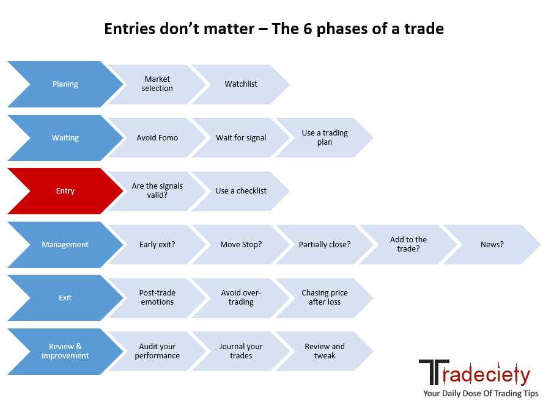

## Table of Contents

## What is market selection in trading?

Market selection in trading is when a trader chooses which markets they want to trade in. This could be stocks, forex, commodities, or cryptocurrencies. Traders pick markets based on things like how much money they can make, how much risk there is, and how easy it is to trade in that market.

Different traders have different reasons for choosing certain markets. Some might like the fast pace of forex trading, while others might prefer the stability of stocks. Knowing which market to trade in is important because it helps traders make better decisions and manage their money well. By picking the right market, traders can increase their chances of making money and reduce the risk of losing it.

## Why is market selection important for traders?

Market selection is important for traders because it helps them focus on markets that match their goals and skills. If a trader likes fast trades and can handle big risks, they might choose the forex market. But if they want steady growth and less risk, they might pick stocks. By choosing the right market, traders can use their strengths and feel more confident in their trading choices.

Also, market selection helps traders manage their money better. Different markets have different levels of risk and reward. By [picking](/wiki/asset-class-picking) a market that fits their risk level, traders can protect their money and increase their chances of making profits. This way, they can avoid big losses and make smarter decisions about where to put their money.

## How can beginners start selecting the right markets?

Beginners should start by learning about different markets like stocks, [forex](/wiki/forex-system), commodities, and cryptocurrencies. They need to understand how each market works and what makes them different. For example, stocks are shares in companies and can be less risky than forex, which involves trading currencies and can be very fast-paced. By reading [books](/wiki/algo-trading-books), watching videos, and using online resources, beginners can get a good idea of which markets might be right for them.

Next, beginners should think about their own goals and how much risk they are willing to take. If they want to grow their money slowly and safely, they might choose stocks. But if they are okay with more risk and want to make money quickly, they might look at forex or cryptocurrencies. It's important for beginners to start with a market that matches their comfort level and to practice with a demo account before using real money. This way, they can learn without losing money and feel more confident when they start trading for real.

## What are the key factors to consider when choosing a market?

When choosing a market, beginners should think about how much risk they are okay with. Some markets, like forex and cryptocurrencies, can be very risky because prices can change a lot in a short time. But other markets, like stocks, can be less risky because they usually change more slowly. Beginners should pick a market that matches how much risk they can handle. If they are new to trading, it's a good idea to start with a less risky market to learn the basics first.

Another important thing to consider is how much time and effort a person can put into trading. Some markets, like forex, need a lot of attention because they are open 24 hours a day. Other markets, like stocks, have set trading hours and might be easier to manage for people who have other jobs or responsibilities. Beginners should think about how much time they can spend on trading and choose a market that fits their schedule. By doing this, they can make better trading decisions without feeling too stressed or overwhelmed.

Lastly, beginners should look at how much money they can make in different markets. Each market has its own way of making profits. For example, stocks can give dividends and long-term growth, while forex can offer quick profits but also quick losses. Beginners should think about what kind of returns they want and how long they are willing to wait for them. By understanding the potential rewards and risks of each market, beginners can choose the one that best fits their financial goals and trading style.

## How does market volatility affect market selection?

Market [volatility](/wiki/volatility-trading-strategies) is how much the prices in a market go up and down. It's important for beginners to think about this when picking a market. If a market has a lot of volatility, like forex or cryptocurrencies, the prices can change a lot in a short time. This can be good because it means there's a chance to make quick money. But it can also be bad because there's a bigger chance of losing money. Beginners who don't like a lot of risk might want to stay away from very volatile markets until they get more experience.

On the other hand, markets with less volatility, like some stocks, might be better for beginners. These markets don't change as much, so there's less chance of big losses. This can be good for people who want to grow their money slowly and safely. By choosing a market with less volatility, beginners can feel more confident and learn the basics of trading without too much stress. In the end, understanding how volatile a market is can help beginners pick the right market for their comfort level and goals.

## What role does liquidity play in market selection?

Liquidity is how easy it is to buy and sell things in a market. If a market has high [liquidity](/wiki/liquidity-risk-premium), it means there are a lot of buyers and sellers, so you can trade quickly without affecting the price too much. This is good for beginners because it means they can get in and out of trades easily. For example, the forex market has high liquidity because there are always people trading currencies all over the world. This makes it easier for beginners to trade without worrying about not being able to sell when they need to.

On the other hand, if a market has low liquidity, it can be harder to trade. There might not be as many buyers and sellers, so it can take longer to make a trade. This can be risky because if you need to sell something quickly, you might not be able to. For example, some smaller stocks or certain commodities might have low liquidity. Beginners might want to avoid these markets until they have more experience because it can be harder to manage their trades. In the end, choosing a market with good liquidity can help beginners feel more confident and make trading easier.

## How can traders use market analysis to improve their selection?

Traders can use market analysis to pick the right market by looking at things like trends and patterns. They can use tools like charts and graphs to see how prices have changed in the past and guess where they might go next. By understanding these trends, traders can choose markets that are doing well or are likely to do well soon. For example, if they see that the stock market has been going up for a while, they might decide to trade stocks because it looks like a good time to make money.

Another way traders can use market analysis is by looking at how much people are buying and selling in different markets. This is called [volume](/wiki/volume-trading-strategy) analysis. If a market has a lot of trading going on, it means it's liquid and easy to trade in. Traders can use this information to pick markets where they can buy and sell quickly without big price changes. By combining this with other types of analysis, like looking at economic news or company reports, traders can make smarter choices about which markets to focus on.

## What are some common mistakes to avoid in market selection?

One common mistake beginners make is choosing a market just because it's popular. They might hear about people making a lot of money in forex or cryptocurrencies and decide to jump in without understanding the risks. But these markets can be very volatile and risky, especially for someone new to trading. It's better to pick a market that fits your own goals and how much risk you can handle, not just because it's trendy.

Another mistake is not doing enough research before picking a market. Beginners might not take the time to learn about how different markets work and what makes them different. This can lead to bad choices and losing money. It's important to study the markets you're interested in, understand their risks and rewards, and maybe even practice with a demo account before using real money. By doing this, beginners can make better decisions and feel more confident in their trading.

Lastly, some beginners might not think about how much time and effort they can put into trading. They might pick a market that needs a lot of attention, like forex, without realizing it. This can be stressful and hard to manage, especially if they have other responsibilities. It's better to choose a market that fits your schedule and how much time you can spend on trading. This way, you can make better trading decisions without feeling too overwhelmed.

## How do different trading strategies influence market choice?

Different trading strategies can really change which market a trader picks. If a trader likes to buy and hold onto things for a long time, they might pick the stock market. Stocks can grow slowly over time, and this fits well with a strategy that focuses on long-term growth. But if a trader wants to make quick trades and take advantage of small price changes, they might choose the forex market. Forex moves fast, and traders can use strategies like [scalping](/wiki/gamma-scalping) or [day trading](/wiki/day-trading-spy) to make money from these quick changes.

Another thing to think about is how much risk a trader is okay with. Some strategies, like swing trading, might work well in markets with a bit of ups and downs, like commodities. Swing traders look for price swings over a few days or weeks and try to make money from these moves. On the other hand, if a trader uses a strategy that needs a lot of trading and quick decisions, like high-frequency trading, they might pick a very liquid market like forex or major stock indices. By matching their strategy with the right market, traders can make better choices and increase their chances of making money.

## What advanced tools can experts use for market selection?

Experts can use advanced tools like [algorithmic trading](/wiki/algorithmic-trading) software to help them pick the right market. These tools use math and computer programs to find patterns and trends in market data. By using these programs, experts can make quick decisions and trade in markets that look like they will do well. For example, they might use algorithms to see if the forex market is going to move a lot soon, and then decide to trade there.

Another tool experts might use is sentiment analysis. This tool looks at what people are saying on social media, news sites, and other places to see if they feel good or bad about a market. If a lot of people are talking positively about stocks, experts might decide to trade in the stock market. By combining sentiment analysis with other data, experts can get a better idea of which market to choose and when to make their trades.

## How can traders adapt their market selection based on economic cycles?

Traders can change which markets they trade in by looking at where the economy is in its cycle. During a boom, when the economy is doing well, traders might want to focus on the stock market. Companies usually do better when the economy is growing, so their stock prices can go up. Traders might also look at sectors like technology or consumer goods, which often do well in good economic times. By picking markets that match the current economic cycle, traders can make better choices and maybe make more money.

On the other hand, during a downturn, when the economy is not doing so well, traders might want to switch to safer markets. They might look at things like government bonds or commodities like gold, which can be more stable when the economy is bad. By moving their money to these markets, traders can protect it from big losses. Understanding where the economy is in its cycle helps traders pick the right market at the right time, so they can make smart trading decisions and manage their money well.

## What are the emerging trends in market selection for experienced traders?

Experienced traders are starting to use more data and technology to pick their markets. They use things like [artificial intelligence](/wiki/ai-artificial-intelligence) and [machine learning](/wiki/machine-learning) to look at a lot of information and find patterns that they might not see otherwise. These tools can help them see what's happening in different markets and make better choices about where to trade. For example, they might use AI to look at news and social media to see how people feel about certain markets, and then decide to trade in a market that's getting a lot of positive attention.

Another trend is that experienced traders are looking at markets that are becoming more popular around the world. They might start trading in markets in places like Asia or Latin America because these areas are growing fast. By keeping an eye on global trends and new markets, traders can find new chances to make money. This means they need to stay up-to-date with what's happening in different parts of the world and be ready to change their trading plans as things change.

## References & Further Reading

[1]: Bergstra, J., Bardenet, R., Bengio, Y., & Kégl, B. (2011). ["Algorithms for Hyper-Parameter Optimization."](https://dl.acm.org/doi/10.5555/2986459.2986743) Advances in Neural Information Processing Systems 24.

[2]: Lopez de Prado, M. (2018). ["Advances in Financial Machine Learning."](https://www.amazon.com/Advances-Financial-Machine-Learning-Marcos/dp/1119482089) Wiley.

[3]: Aronson, D. (2006). ["Evidence-Based Technical Analysis: Applying the Scientific Method and Statistical Inference to Trading Signals."](https://www.amazon.com/Evidence-Based-Technical-Analysis-Scientific-Statistical/dp/0470008741) Wiley.

[4]: Jansen, S. (2020). ["Machine Learning for Algorithmic Trading."](https://github.com/stefan-jansen/machine-learning-for-trading) Packt Publishing.

[5]: Chan, E. P. (2009). ["Quantitative Trading: How to Build Your Own Algorithmic Trading Business."](https://github.com/ftvision/quant_trading_echan_book) Wiley.