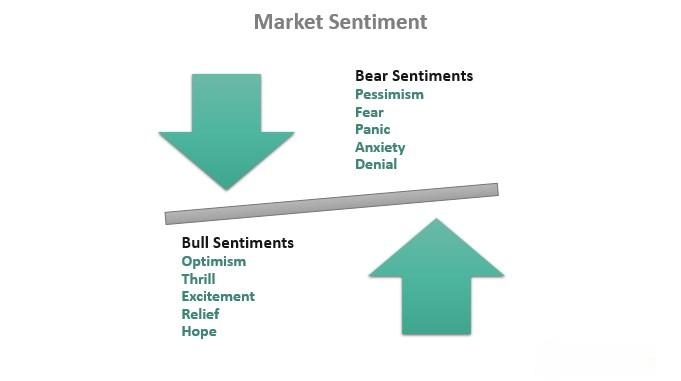

Algorithmic trading, often referred to as algo trading or automated trading, represents a significant transformation in the financial markets. It leverages computerized systems for executing trading instructions at lightning speed based on a predefined set of rules or algorithms. This technology has extended the capabilities of traders by enhancing precision, speed, and efficiency, ultimately altering how markets operate. Traditional trading methods relied heavily on human judgement and perception, which are susceptible to emotional bias and erroneous decisions. Algorithmic trading, however, minimizes human error by relying on logic-driven computational strategies.

In recent years, a novel development has unfolded within the field: the integration of human emotions and market psychology into these automated systems through sentiment analysis. Sentiment analysis, a subset of natural language processing (NLP), is employed to interpret and quantify the emotions, opinions, and attitudes that investors and influential market participants express. By analyzing textual data from diverse sources such as news articles, social media, and financial reports, sentiment analysis tools can discern whether market sentiments are bullish, bearish, or neutral.



This article highlights the complexities and pivotal role that sentiment indicators play in improving algorithmic trading strategies. Sentiment indicators, derived from extensive market sentiment analysis, serve as powerful tools that measure and quantify market participants' emotional responses to unfolding events. They provide a bridge between raw market data and the underlying emotions that drive market dynamics.

We begin by exploring the basic concept of sentiment indicators and their derivation from market sentiment analysis. These tools have become integral to interpreting market psychology, thereby enabling traders to make informed decisions by incorporating a qualitative dimension into their strategies. Subsequently, we investigate various types of sentiment indicators, detailing their functionalities and applications in enhancing algorithmic trading systems.

In summary, the assimilation of sentiment indicators into algorithmic trading represents a forward-looking approach that harmonizes quantitative analysis with qualitative insights. Understanding and utilizing these sentiment-driven insights can empower traders to optimize risk management, forecast market trends, and enhance overall trading performance.

## Table of Contents

## Understanding Market Sentiment

Market sentiment represents the collective attitude and emotional state of investors concerning financial markets or specific assets. This universal gauge of investor perception is pivotal because it directly influences trading behaviors and consequently impacts market prices and trends. Recognizing shifts in market sentiment is essential for traders and investors who aim to interpret and anticipate potential market movements.

Investors' sentiment is typically categorized into three primary types: bullish, bearish, and neutral. A bullish sentiment indicates an optimistic market outlook, where investors expect rising prices and thus are more likely to engage in purchasing activities. Conversely, a bearish sentiment signifies a pessimistic perspective, with expectations of declining prices, prompting selling actions. Neutral sentiment occurs when investors perceive the market as balanced without a clear direction, resulting in a wait-and-see approach.

Market sentiment is a significant driver of price dynamics and trends. It can contribute to the creation of asset bubbles or market crashes, depending on whether the prevailing sentiment is overly positive or negative, respectively. As such, accurately interpreting market sentiment can offer valuable insights into potential market turns and price movements.

Traders and investors frequently analyze market sentiment to develop a holistic understanding of market behavior. Rather than relying solely on technical and fundamental indicators, sentiment analysis provides a psychological overview of the market, which can be indispensable for crafting comprehensive investment strategies. By integrating sentiment insights, market participants can make informed decisions, anticipating shifts before they occur.

Various factors contribute to the formation of market sentiment. Economic indicators such as interest rates, employment data, or GDP growth can heavily influence investor optimism or pessimism. News sentiment, shaped by the tone and intensity of recent news articles, also plays a crucial role. Furthermore, social media trends have become increasingly influential, as platforms like Twitter and Reddit offer a repository of real-time, crowd-sourced sentiments. By analyzing the discourse from these platforms, traders can gauge public sentiment and its potential impact on market [volatility](/wiki/volatility-trading-strategies).

These elements collectively form a complex picture, underscoring the multifaceted nature of market sentiment. Understanding and interpreting these factors enable market participants to better navigate the uncertainties and opportunities inherent in financial markets.

## What are Sentiment Indicators?

Sentiment indicators are tools designed to gauge and interpret the prevailing moods and attitudes within financial markets. These tools transform qualitative sentiment data into quantitative metrics, allowing for an analytical approach to understanding market psychology. Sentiment indicators typically quantify investor sentiment, categorizing it as bullish (indicative of positive sentiment and rising prices), bearish (reflecting negative sentiment and falling prices), or neutral. 

Common sentiment indicators include the Put/Call Ratio, Volatility Index (VIX), and Commitment of Traders (COT) Report. The Put/Call Ratio measures market sentiment through the ratio of put options (bearish bets) to call options (bullish bets). A high ratio often signals bearish sentiment, whereas a low ratio suggests bullish sentiment. The formula for the Put/Call Ratio can be expressed as:

$$
\text{Put/Call Ratio} = \frac{\text{Volume of Put Options}}{\text{Volume of Call Options}}
$$

The Volatility Index (VIX), often referred to as the "fear index," provides a measure of expected market volatility derived from option prices. Higher VIX values indicate increased uncertainty and fear, while lower values suggest complacency. 

The Commitment of Traders (COT) Report offers insights into the positions held by different types of traders in the futures market, thus revealing potential market sentiment. 

These sentiment indicators capture the emotional responses and expectations of traders and investors, enabling predictive analysis. They allow market participants to gauge the sentiment backdrop against which trades are executed, thus refining trading strategies. By integrating sentiment insights, [algorithmic trading](/wiki/algorithmic-trading) strategies can incorporate market psychology, leading to more informed trading decisions and potentially improved outcomes.

## Role of Sentiment Indicators in Algo Trading

Sentiment indicators enhance algorithmic trading by offering insights into the emotional and psychological aspects of market participants, which traditional data alone might not capture. These tools are invaluable in assessing market mood and identifying emotional extremes. This understanding is crucial because heightened investor sentiment can oftentimes precede significant market movements. For instance, an overly bullish sentiment might indicate an impending market correction, while pervasive bearishness might signal a potential upswing.

Algorithmic traders harness sentiment indicators to forecast market movements and identify potential trend shifts. By integrating these indicators within their algorithms, they execute trades driven by sentiment-based insights. This approach provides an edge over strategies relying solely on historical price and [volume](/wiki/volume-trading-strategy) data, as it incorporates a real-time qualitative assessment of the market.

Sentiment indicators complement traditional quantitative models by introducing qualitative dimensions, thus creating a more comprehensive trading strategy. For example, while a quantitative model might signal a buy based on technical indicators, a sentiment indicator suggesting widespread pessimism could either reinforce or challenge this decision, depending on the trader's strategy. This synthesis of qualitative and quantitative insights leads to a more nuanced understanding of market dynamics.

In summary, sentiment indicators are pivotal in algorithmic trading by offering a lens through which traders can view market psychology. This perspective enables more informed, proactive trading decisions, providing a holistic approach to navigating complex market environments.

## Types of Sentiment Indicators

Sentiment indicators play a pivotal role in understanding and predicting market dynamics by capturing the emotional and psychological attitudes of investors. Here, we explore several commonly used sentiment indicators that have proven effective in gauging market sentiment.

**Put/Call Ratio:** The Put/Call Ratio is a popular metric for assessing market sentiment. It is calculated by dividing the volume of put options by the volume of call options over a specific period. This ratio provides insights into whether investors are predominantly bearish or bullish. A high Put/Call Ratio suggests a bearish sentiment, indicating that investors are purchasing more puts as a hedge against potential declines. Conversely, a low ratio may imply bullish sentiment, reflecting confidence in market gains. The formula for the Put/Call Ratio is:

$$
\text{Put/Call Ratio} = \frac{\text{Volume of Put Options}}{\text{Volume of Call Options}}
$$

**Volatility Index (VIX):** Known as the "fear index," the VIX quantifies market volatility expectations, reflecting levels of fear or complacency among investors. The VIX is derived from the implied volatilities of S&P 500 index options and is widely used to gauge the degree of market risk perceived by investors. A higher VIX value signifies greater expected volatility and fear, while a lower value suggests a calmer market environment. The VIX is calculated using a complex formula that incorporates the prices of various options, highlighting its dynamic nature in reflecting market sentiment. 

**Commitment of Traders (COT) Report:** The Commitment of Traders (COT) Report is a weekly publication by the Commodity Futures Trading Commission (CFTC) that details the positions held by different types of traders in the futures market. It categorizes traders into groups such as commercial traders, non-commercial traders, and retail traders. By analyzing the changes in these positions, market participants can gain insights into market sentiment and potential shifts in trends. For example, a significant shift in non-commercial positions can indicate changes in speculative sentiment and potential market movements.

**Social Media Sentiment Analysis:** As social media platforms become increasingly influential, analyzing sentiments expressed on these platforms offers a novel approach to understanding market perceptions. Traders use sentiment analysis techniques, often facilitated by natural language processing (NLP) tools, to evaluate the tone of discussions around specific stocks or markets. Platforms like Twitter are popular sources due to their real-time nature. Analysts develop sentiment scores from the data, which can serve as inputs for trading algorithms. This analysis helps capture the collective mood of the general public and can provide early signals of market trends.

**News Sentiment Analysis:** News sentiment analysis is another powerful tool for interpreting market sentiment by evaluating the tone and sentiment expressed in news articles and reports. By employing advanced machine learning techniques and NLP, traders can quantify the sentiment of news headlines and stories to predict market reactions. For instance, a period of overwhelmingly positive news sentiment about a particular company might lead to increased buying activity. Conversely, negative sentiment could trigger selling pressures. Traders integrate these sentiment scores into their models to enhance the accuracy of their trading strategies.

By leveraging these sentiment indicators, traders can obtain a comprehensive understanding of market psychology, which in turn aids in making informed trading decisions.

## Strategies Incorporating Sentiment Indicators

Crowdsourced sentiment strategy capitalizes on the collective intelligence of large groups to pinpoint trading opportunities. By harnessing data from a multitude of sources such as social media platforms, forums, and opinion polls, this strategy analyzes the aggregated sentiment to discern trends and market inclinations. The underlying theory is that the collective wisdom of diverse opinions can provide a more accurate insight into market dynamics compared to individual analysis. Traders implementing this strategy often use advanced data mining techniques and sentiment analysis algorithms to interpret large volumes of textual data.

The contrarian strategy operates on the premise of trading against prevailing sentiment. When sentiment reaches an extreme—either overly bullish or bearish—contrarian traders anticipate a reversal. This approach is grounded in the belief that market participants tend to overreact, leading to inefficiencies that can be exploited. For instance, if sentiment indicators show excessively bullish sentiment, a contrarian might short sell the asset, expecting a price correction. This strategy often requires a comprehensive understanding of market psychology and timing to successfully anticipate reversals.

Trend-following strategy involves aligning trading decisions with the prevailing market trends indicated by sentiment indicators. When these indicators confirm a strong directional sentiment, traders adopt a strategy that follows the established trend. For example, if sentiment analysis reveals a consistent bullish sentiment, a trend-following trader will likely enter a long position to benefit from the continued rise in asset prices. This strategy is generally more effective in stable markets with clear trends and requires continual assessment of sentiment data to adjust positions accordingly.

Event-driven strategy centers on identifying sentiment shifts surrounding specific market events, such as earnings releases or economic announcements. These events can significantly alter investor sentiment, and event-driven strategies aim to capitalize on the resultant short-term market movements. Traders monitor sentiment indicators closely to detect any changes in sentiment and adjust their positions to exploit potential price volatility. This strategy requires timely data and the ability to react swiftly to sentiment shifts to capture trading opportunities.

Sentiment [momentum](/wiki/momentum) strategy combines sentiment analysis with momentum indicators to harness sentiment-driven trends. This approach involves using sentiment indicators to capture the emotional intensity of market participants and aligning these insights with momentum strategies that track the strength and direction of price movements. The formula for a simple momentum indicator is:

$$
\text{Momentum} = \text{Current Price} - \text{Price n periods ago}
$$

By integrating sentiment scores with such momentum indicators, traders can formulate strategies designed to capture persistent sentiment-driven trends, thus maximizing potential returns.

Collectively, these strategies demonstrate the versatile applications of sentiment indicators in enhancing trading decisions and optimizing algorithmic trading models.

## Implementing Sentiment Indicators with Python

Python has emerged as the language of choice for implementing sentiment analysis in algorithmic trading due to its versatility and comprehensive ecosystem of libraries. Key libraries such as NLTK (Natural Language Toolkit), Tweepy, and VADER (Valence Aware Dictionary and sEntiment Reasoner) provide robust tools for the construction of sentiment analysis models.

**Data Collection and Preprocessing:**

Traders can harness APIs like the Twitter API through Tweepy for real-time data collection. Tweepy simplifies the process of accessing tweets and streaming data, which can be critical for analyzing current market sentiment. Here's an example of how to use Tweepy for collecting tweets:

```python
import tweepy

# Authenticate to Twitter
auth = tweepy.OAuthHandler("API_KEY", "API_SECRET")
auth.set_access_token("ACCESS_TOKEN", "ACCESS_TOKEN_SECRET")

# Create an API object
api = tweepy.API(auth)

# Collect tweets containing a specific keyword
tweets = api.search(q="stock market", lang="en", count=100)
for tweet in tweets:
    print(tweet.text)
```

Collected data often requires preprocessing to clean and prepare it for analysis. This may include removing punctuation, converting text to lowercase, or eliminating stopwords using NLTK:

```python
from nltk.tokenize import word_tokenize
from nltk.corpus import stopwords

stop_words = set(stopwords.words('english'))

# Preprocess tweet text
for tweet in tweets:
    words = word_tokenize(tweet.text)
    filtered_sentence = [w for w in words if w.lower() not in stop_words]
    print(filtered_sentence)
```

**Sentiment Analysis with VADER:**

VADER is specifically designed for sentiment analysis and provides a simple method to assess sentiment in social media text. It yields a sentiment score that can be used as a trading signal:

```python
from vaderSentiment.vaderSentiment import SentimentIntensityAnalyzer

analyzer = SentimentIntensityAnalyzer()
# Analyze sentiment
for tweet in tweets:
    sentiment_score = analyzer.polarity_scores(tweet.text)
    print(sentiment_score)
```

**Machine Learning Models:**

Machine learning models extend sentiment analysis capabilities by offering refined and context-aware sentiment classification. Traders can utilize models such as Naive Bayes or Support Vector Machines (SVM) within Python's scikit-learn library to categorize sentiment more accurately, followed by integration with trading algorithms.

**Example Integration:**

Sentiment scores can be utilized as a standalone signal or combined with other indicators. A simple decision rule might involve a threshold sentiment score above which buy orders are executed and below which sell orders take place.

```python
# Example of using sentiment score as a trading signal
for tweet in tweets:
    score = analyzer.polarity_scores(tweet.text)['compound']
    if score > 0.2:
        print("Buy signal")
    elif score < -0.2:
        print("Sell signal")
    else:
        print("Hold")
```

**Conclusion:**

Python's extensive library support empowers traders to develop complex sentiment analysis frameworks efficiently. By leveraging sentiment indicators within algorithmic systems, traders gain nuanced insights into market dynamics, which enhance decision-making processes and trading outcomes.

## The Future of Sentiment Analysis in Trading

Advancements in natural language processing (NLP) and [machine learning](/wiki/machine-learning) (ML) are reshaping the field of sentiment analysis, particularly in trading. These technologies are enhancing the accuracy and depth of sentiment analysis models, allowing for more nuanced interpretations of market sentiments. NLP techniques such as transformer-based models (e.g., BERT, GPT) are becoming pivotal in comprehending the intricacies of human language, enabling traders to decipher sentiments from large volumes of text with high precision.

Real-time sentiment analysis is becoming increasingly vital for traders who require swift, informed decision-making capabilities. The ability to assess sentiment almost instantaneously allows for immediate reactions to market shifts, thereby capitalizing on transient trading opportunities. This is facilitated by the burgeoning capabilities of streaming data analytics and real-time processing frameworks, such as Apache Kafka and Apache Flink, which can handle vast amounts of data efficiently.

The integration of diverse data sources, such as IoT (Internet of Things) devices and satellite imagery, can further augment sentiment analysis in trading. For instance, real-time data from IoT sensors can provide insights into economic activities, while satellite imagery can offer valuable information about physical market conditions, such as crop yields or shipping traffic. By assimilating these unconventional data sources, traders can obtain a more holistic view of market sentiments, enriching predictive models with non-traditional inputs.

In future trading systems, sentiment analysis could become seamlessly integrated, allowing for the automatic execution of sentiment-driven strategies. This integration will likely be supported by APIs and modular architectures that facilitate the incorporation of sentiment insights into existing trading algorithms. The modular approach allows for the customization of sentiment analysis tools according to specific trading needs or asset classes.

These advancements in sentiment analysis promise substantial benefits for trading outcomes. Improved models can enhance risk management by better predicting downturns or market corrections. Furthermore, the sophistication of these techniques offers a competitive edge by enabling traders to anticipate market movements more accurately. As the technology progresses, sentiment analysis is expected to become a cornerstone of algorithmic trading strategies, facilitating better-informed decisions and potentially leading to superior trading performance.

## Conclusion

Incorporating sentiment indicators into algorithmic trading provides valuable insights into market dynamics, allowing traders to capture the subtle nuances of market behavior. These indicators enable traders to balance quantitative data with market psychology, offering a more robust and comprehensive approach to trading strategies. As sentiment analysis techniques progress, their role in algorithmic trading is expected to expand significantly. This evolution will pave the way for new methodologies and tools, facilitating more precise and timely trading decisions.

By utilizing sentiment-based insights, traders can enhance risk management and better predict market shifts, leading to improved overall performance. For instance, integrating sentiment scores with traditional technical indicators can create powerful, hybrid models that respond dynamically to market changes. Such models enable traders to identify trends and reversals more accurately, offering a strategic advantage in the market.

The ongoing fusion of advanced sentiment analysis with conventional trading practices suggests a promising future for sentiment-driven algorithmic trading. As technology continues to advance, these tools will likely become more sophisticated and integrated, allowing traders to stay ahead in increasingly competitive financial markets. This convergence not only enhances forecasting capabilities but also strengthens the foundation for developing more resilient trading strategies, ultimately contributing to more consistent trading outcomes.

## References & Further Reading

[1]: Tetlock, P. C. (2007). ["Giving Content to Investor Sentiment: The Role of Media in the Stock Market."](https://onlinelibrary.wiley.com/doi/abs/10.1111/j.1540-6261.2007.01232.x) The Journal of Finance, 62(3), 1139-1168.

[2]: Li, F. (2010). ["The Information Content of Forward-Looking Statements in Corporate Filings—A Naïve Bayesian Machine Learning Algorithm Approach."](https://onlinelibrary.wiley.com/doi/10.1111/j.1475-679X.2010.00382.x) Journal of Accounting Research, 48(5), 1049-1102.

[3]: Cambria, E., & Liu, B. (2012). ["Sentiment Analysis: Mining Opinions, Sentiments, and Emotions."](https://assets.cambridge.org/97811070/17894/frontmatter/9781107017894_frontmatter.pdf) Computational Linguistics and Intelligent Text Processing, 7697, 507-519.

[4]: ["Python for Data Analysis: Data Wrangling with Pandas, NumPy, and IPython"](https://wesmckinney.com/book/) by Wes McKinney

[5]: ["Natural Language Processing with Python: Analyzing Text with the Natural Language Toolkit"](https://www.nltk.org/book/) by Steven Bird, Ewan Klein, and Edward Loper